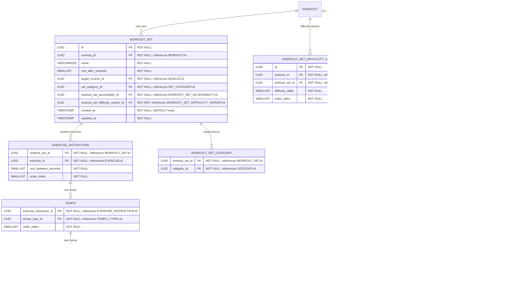

# MōtriForge

# User

## Core “User” and Identity


## User Roles & Permissions (Access Control)


## User Activity, Progress, and Ownership


---

# Exercise

## Core “Exercise” Definition & Classification


## Composition “Variants & Accessibility”


## Metadata & Extensions (Versioning, Media, Equipment, User Mapping)


---

# Workout

## Core “Workout” Definition & Classification


## Composition “Sets → Instructions → Tempo”



## Metadata & Extensions (Versions, Media, Duration)


---

# Program

## Core “Program” Definition & Classification


## Schedule & Workout Composition


## Versions, Media & Extensions


---

## Core “Institution” Definition & Basic Metadata


## Organizational Structure (Members, Departments, Customers)


## Access Control, Policies & Invites


## Enums

```mermaid
erDiagram
  %%========================
  %% 1) Core Lookup Tables
  %%========================

  TAG {
    UUID id PK
    ENUM name    "UNIQUE"
    ENUM type    "e.g. EXPRESS, SKILL, DYNAMIC, HARD"
  }

  CATEGORY {
    UUID id PK
    ENUM name    "UNIQUE"
    ENUM type    "e.g. EXERCISE, PROGRAM, EQUIPMENT"
  }

  STATUS {
    UUID id PK
    VARCHAR name "UNIQUE"
    VARCHAR type "PUBLISHING, SEVERITY, LOG_LEVEL, COMPLETION"
  }

  METRIC {
    UUID id PK
    ENUM name "UNIQUE"
    ENUM type    "UNIT, PROGRESSION, DIFFICULTY"
  }
  
  VISIBILITY {
	  UUID id PK
	  ENUM name "UNIQUE; Default: PRIVATE, SHARED, PUBLIC, INSTITUTION, INSTITUTION_DEPARTMENT, INSTITUTION_MEMBER, INSTITUTION_CUSTOMER, CUSTOMER_SHARED, GROUP_BASED, ROLE_BASED, INTERNAL, SYSTEM"
	  ENUM ressource "NOT NULL; UNIQUE; EXERCISE, WORKOUT, PROGRAM, INSTITUTION, etc."
    TEXT description "NULLABLE; what this level of visibility means"
  }
 
  %%====================================
  %% 2) STATUS‐Subclass: Log/Severity Pair
  %%====================================

  LOG_LEVEL_STATUS {
    UUID id PK
    UUID log_level_id FK  "NOT NULL; references STATUS.id"
    UUID severity_id FK   "NOT NULL; references STATUS.id"
  }

  %%================================================================
  %% 3) METRIC‐Subtypes (each “points back” to METRIC.id as a child)
  %%================================================================

  MEASUREMENT_UNIT {
    UUID id PK
    UUID metric_id FK     "NOT NULL; references METRIC.id"
  }

  PROGRESSION_METRIC {
    UUID id PK
    UUID metric_id FK     "NOT NULL; references METRIC.id"
  }

  DIFFICULTY_LEVEL {
    UUID id PK
    UUID metric_id FK     "NOT NULL; references METRIC.id"
  }

  %%============================
  %% 4) Relationships Declaration
  %%============================

  %%— METRIC → its subtypes
  METRIC ||--o{ MEASUREMENT_UNIT   : "has units"
  METRIC ||--o{ PROGRESSION_METRIC  : "tracks progression"
  METRIC ||--o{ DIFFICULTY_LEVEL    : "defines difficulty"

  %%— LOG_LEVEL_STATUS → STATUS (two roles)
  LOG_LEVEL_STATUS }|--|| STATUS    : "log_level"
  LOG_LEVEL_STATUS }|--|| STATUS    : "severity"

```



## Muscles


## Goals


## Media


## Equipment


## Permission

```mermaid
erDiagram

  %%========================================
  %% 1) CORE ENTITIES & HIERARCHIES
  %%========================================

  ROLE {
    UUID id PK                       "NOT NULL; UNIQUE"
    VARCHAR name                     "NOT NULL; UNIQUE"
    ENUM type                        "NOT NULL; values: ADMIN, GUEST, TRAINER, PHYSIOTHERAPIST, etc."
    UUID parent_role FK              "NULLABLE; self‐reference; DEFAULT NULL"
  }

  PERMISSION_GROUP {
    UUID id PK                       "NOT NULL; UNIQUE"
    VARCHAR name                     "NOT NULL; UNIQUE"
    TEXT description                 "NULLABLE"
  }

  PERMISSION {
    UUID id PK                       "NOT NULL; UNIQUE"
    VARCHAR name                     "NOT NULL; UNIQUE; e.g., USER.WORKOUT.CREATE"
    TEXT description                 "NULLABLE"
    UUID group_id FK                 "NULLABLE; references PERMISSION_GROUP.id"
    VARCHAR actor                    "NOT NULL; e.g., USER, GUEST"
    VARCHAR resource                 "NOT NULL; e.g., WORKOUT, PROGRAM, MEDIA, EXERCISE, EQUIPMENT"
    VARCHAR action                   "NOT NULL; e.g., CREATE, SEE_OWN, SEE_INSTITUTION, SEE_PUBLIC, UPDATE, DELETE, SHARE, ARCHIVE, etc."
    VARCHAR scope                    "NULLABLE; e.g., OWN, INSTITUTION, PUBLIC, RESOURCE_ID"
    BOOLEAN is_global                "DEFAULT FALSE; distinguishes platform‐wide vs scoped permission"
  }

  ROLE_PERMISSION {
    UUID role_id PK,FK               "NOT NULL; references ROLE.id"
    UUID permission_id PK,FK         "NOT NULL; references PERMISSION.id"
    TIMESTAMP assigned_at            "NOT NULL; DEFAULT now()"
  }

  POLICY {
    UUID id PK                       "NOT NULL; UNIQUE"
    VARCHAR name                     "NOT NULL; UNIQUE"
    TEXT description                 "NULLABLE"
  }

  POLICY_ASSIGNMENT {
    UUID id PK                       "NOT NULL; UNIQUE"
    UUID policy_id FK                "NOT NULL; references POLICY.id"
    UUID target_id                   "NOT NULL; references either ROLE.id or PERMISSION.id"
    ENUM target_type                 "NOT NULL; values: ROLE, PERMISSION"
    TIMESTAMP assigned_at            "NOT NULL; DEFAULT now()"
  }
  
%%========================================
%% 2) VISIBILITY SYSTEM
%%========================================

VISIBILITY {
  UUID id PK                          "NOT NULL; UNIQUE"
  ENUM name                           "NOT NULL; UNIQUE; PRIVATE, SHARED, PUBLIC, etc."
  ENUM resource                       "NOT NULL; e.g. WORKOUT, PROGRAM, EXERCISE"
  TEXT description                    "NULLABLE; explains the visibility level"
}

VISIBILITY_POLICY {
  UUID id PK                          "NOT NULL; UNIQUE"
  UUID visibility_id FK               "NOT NULL; references VISIBILITY.id"
  UUID permission_id FK               "NOT NULL; required permission to access this visibility"
  UUID institution_id FK              "NULLABLE; NULL = global"
  UUID role_id FK                     "NULLABLE; overrides visibility per role"
  BOOLEAN allow_guest                 "DEFAULT FALSE; true = guest allowed"
  BOOLEAN is_default                  "DEFAULT FALSE; marks default policy per resource"
  TEXT notes                          "NULLABLE"
}

  %%========================================
  %% 3) RELATIONSHIPS (Core Only)
  %%========================================

  %% Role ↔ Permission
  ROLE               ||--o{ ROLE_PERMISSION      : "has_permissions"
  PERMISSION         ||--o{ ROLE_PERMISSION      : "assigned_to_roles"

  %% Permission grouping
  PERMISSION_GROUP   ||--o{ PERMISSION           : "contains"

  %% Role hierarchy
  ROLE               ||--o{ ROLE                 : "parent_of"

  %% Global Policy assignments
  POLICY             ||--o{ POLICY_ASSIGNMENT    : "applies_to"

%% Relationship
VISIBILITY       ||--o{ VISIBILITY_POLICY           : "controlled_by_policy"
PERMISSION       ||--o{ VISIBILITY_POLICY           : "maps_to_permission"
INSTITUTION      ||--o{ VISIBILITY_POLICY           : "institution_scoped_policy"
ROLE             ||--o{ VISIBILITY_POLICY           : "role_override"

%% Resources → VISIBILITY
WORKOUT          }o--|| VISIBILITY                  : "has_visibility"
PROGRAM          }o--|| VISIBILITY                  : "has_visibility"
EXERCISE         }o--|| VISIBILITY                  : "has_visibility"
MEDIA            }o--|| VISIBILITY                  : "has_visibility"
EQUIPMENT        }o--|| VISIBILITY                  : "has_visibility"

```

---

# Activity

```
" Definition & Classification

```mermaid
erDiagram
  %%=== Layer 1: C
```

## Core "Activity" Definition & Classification

```mermaid
erDiagram
  %%=== Layer 1: Core Activity & Classification ===%%

  ACTIVITY {
    UUID id PK                         "NOT NULL; UNIQUE"
    UUID user_id FK                    "NOT NULL; references USER.id"
    UUID activity_type_id FK           "NOT NULL; references ACTIVITY_TYPE.id"
    VARCHAR(255) title                 "NOT NULL"
    TEXT description                   "NULLABLE"
    UUID resource_id                   "NULLABLE; polymorphic resource reference"
    ENUM resource_type                 "NULLABLE; WORKOUT, EXERCISE, PROGRAM, INSTITUTION, etc."
    JSONB metadata                     "NULLABLE; context-specific data"
    TIMESTAMP occurred_at              "NOT NULL; when the activity happened"
    TIMESTAMP created_at               "NOT NULL; DEFAULT now()"
    TIMESTAMP updated_at               "NOT NULL"
    BOOLEAN is_system_generated        "NOT NULL; DEFAULT false"
    UUID visibility_id FK              "NOT NULL; references VISIBILITY.id"
  }

  ACTIVITY_TYPE {
    UUID id PK                         "NOT NULL; UNIQUE"
    ENUM name                          "NOT NULL; UNIQUE; LOGIN, WORKOUT_COMPLETED, EXERCISE_ADDED, PROGRAM_STARTED, etc."
    VARCHAR(255) display_name          "NOT NULL"
    TEXT description                   "NULLABLE"
    BOOLEAN is_trackable               "NOT NULL; DEFAULT true"
    BOOLEAN requires_resource          "NOT NULL; DEFAULT false"
  }

  ACTIVITY_CATEGORY {
    UUID activity_id PK                "NOT NULL; references ACTIVITY.id"
    UUID category_id PK                "NOT NULL; references CATEGORY.id"
  }

  ACTIVITY_TAG {
    UUID activity_id PK                "NOT NULL; references ACTIVITY.id"
    UUID tag_id PK                     "NOT NULL; references TAG.id"
  }

  %%— Relationships in Layer 1 —
  ACTIVITY ||--|| ACTIVITY_TYPE       : "type lookup"
  ACTIVITY ||--o{ ACTIVITY_CATEGORY   : "categorized by"
  ACTIVITY ||--o{ ACTIVITY_TAG        : "tagged with"
  ACTIVITY_CATEGORY }|--|| CATEGORY   : "category lookup"
  ACTIVITY_TAG }|--|| TAG             : "tag lookup"

```

## Activity Context & Associations

```mermaid
erDiagram
  %%=== Layer 2: Activity Context & Associations ===%%

  ACTIVITY_PARTICIPANT {
    UUID id PK                         "NOT NULL; UNIQUE"
    UUID activity_id FK                "NOT NULL; references ACTIVITY.id"
    UUID user_id FK                    "NOT NULL; references USER.id"
    ENUM participation_type            "NOT NULL; ACTOR, OBSERVER, BENEFICIARY, ASSIGNEE"
    TIMESTAMP joined_at                "NOT NULL; DEFAULT now()"
    TEXT notes                         "NULLABLE"
  }

  ACTIVITY_INSTITUTION {
    UUID activity_id PK                "NOT NULL; references ACTIVITY.id"
    UUID institution_id PK             "NOT NULL; references INSTITUTION.id"
    ENUM involvement_type              "NOT NULL; CONTEXT, LOCATION, AUTHORITY"
  }

  ACTIVITY_METRIC {
    UUID id PK                         "NOT NULL; UNIQUE"
    UUID activity_id FK                "NOT NULL; references ACTIVITY.id"
    UUID metric_id FK                  "NOT NULL; references METRIC.id"
    FLOAT value                        "NOT NULL"
    FLOAT previous_value               "NULLABLE; for comparison"
    TIMESTAMP measured_at              "NOT NULL"
  }

  ACTIVITY_STREAK {
    UUID id PK                         "NOT NULL; UNIQUE"
    UUID user_id FK                    "NOT NULL; references USER.id"
    UUID activity_type_id FK           "NOT NULL; references ACTIVITY_TYPE.id"
    INT current_count                  "NOT NULL; DEFAULT 0"
    INT best_count                     "NOT NULL; DEFAULT 0"
    DATE last_activity_date            "NULLABLE"
    DATE streak_started_date           "NULLABLE"
    BOOLEAN is_active                  "NOT NULL; DEFAULT true"
  }

  %%— Relationships in Layer 2 —
  ACTIVITY ||--o{ ACTIVITY_PARTICIPANT : "has participants"
  ACTIVITY ||--o{ ACTIVITY_INSTITUTION : "occurs within"
  ACTIVITY ||--o{ ACTIVITY_METRIC      : "records metrics"
  ACTIVITY_PARTICIPANT }|--|| USER     : "user lookup"
  ACTIVITY_INSTITUTION }|--|| INSTITUTION : "institution lookup"
  ACTIVITY_METRIC }|--|| METRIC        : "metric lookup"
  USER ||--o{ ACTIVITY_STREAK          : "tracks streaks"
  ACTIVITY_TYPE ||--o{ ACTIVITY_STREAK : "streak type"

```

## Activity History & Analytics

```mermaid
erDiagram
  %%=== Layer 3: Activity History & Analytics ===%%

  ACTIVITY_SESSION {
    UUID id PK                         "NOT NULL; UNIQUE"
    UUID user_id FK                    "NOT NULL; references USER.id"
    TIMESTAMP session_start            "NOT NULL"
    TIMESTAMP session_end              "NULLABLE"
    INT activity_count                 "NOT NULL; DEFAULT 0"
    JSONB session_metadata             "NULLABLE; device, location, etc."
  }

  ACTIVITY_SESSION_ACTIVITY {
    UUID activity_session_id PK        "NOT NULL; references ACTIVITY_SESSION.id"
    UUID activity_id PK                "NOT NULL; references ACTIVITY.id"
    INT sequence_order                 "NOT NULL"
  }

  ACTIVITY_DIGEST {
    UUID id PK                         "NOT NULL; UNIQUE"
    UUID user_id FK                    "NOT NULL; references USER.id"
    DATE digest_date                   "NOT NULL"
    ENUM digest_period                 "NOT NULL; DAILY, WEEKLY, MONTHLY"
    INT total_activities               "NOT NULL; DEFAULT 0"
    JSONB activity_summary             "NOT NULL; counts by type"
    JSONB achievements                 "NULLABLE; badges, milestones"
    TIMESTAMP calculated_at            "NOT NULL; DEFAULT now()"
  }

  ACTIVITY_NOTIFICATION {
    UUID id PK                         "NOT NULL; UNIQUE"
    UUID activity_id FK                "NOT NULL; references ACTIVITY.id"
    UUID recipient_id FK               "NOT NULL; references USER.id"
    UUID notification_type_id FK       "NOT NULL; references NOTIFICATION_TYPE.id"
    TEXT message                       "NOT NULL"
    BOOLEAN is_read                    "NOT NULL; DEFAULT false"
    TIMESTAMP sent_at                  "NOT NULL; DEFAULT now()"
    TIMESTAMP read_at                  "NULLABLE"
  }

  %%— Relationships in Layer 3 —
  USER ||--o{ ACTIVITY_SESSION         : "has sessions"
  ACTIVITY_SESSION ||--o{ ACTIVITY_SESSION_ACTIVITY : "contains activities"
  ACTIVITY_SESSION_ACTIVITY }|--|| ACTIVITY : "activity lookup"
  USER ||--o{ ACTIVITY_DIGEST          : "receives digests"
  ACTIVITY ||--o{ ACTIVITY_NOTIFICATION : "triggers notifications"
  ACTIVITY_NOTIFICATION }|--|| USER    : "recipient lookup"

```

---

# Favorite

## Core "Favorite" Definition & Classification

```mermaid
erDiagram
  %%=== Layer 1: Core Favorite & Classification ===%%

  FAVORITE {
    UUID id PK                         "NOT NULL; UNIQUE"
    UUID user_id FK                    "NOT NULL; references USER.id"
    UUID resource_id                   "NOT NULL; polymorphic resource reference"
    ENUM resource_type                 "NOT NULL; WORKOUT, EXERCISE, PROGRAM, EQUIPMENT, MEDIA, INSTITUTION"
    TEXT notes                         "NULLABLE; personal notes about why it's favorited"
    TIMESTAMP favorited_at             "NOT NULL; DEFAULT now()"
    TIMESTAMP last_accessed_at         "NULLABLE; when last viewed/used"
    INT access_count                   "NOT NULL; DEFAULT 0"
    BOOLEAN is_active                  "NOT NULL; DEFAULT true"
    UUID visibility_id FK              "NOT NULL; references VISIBILITY.id"
  }

  FAVORITE_CATEGORY {
    UUID favorite_id PK                "NOT NULL; references FAVORITE.id"
    UUID category_id PK                "NOT NULL; references CATEGORY.id"
  }

  FAVORITE_TAG {
    UUID favorite_id PK                "NOT NULL; references FAVORITE.id"
    UUID tag_id PK                     "NOT NULL; references TAG.id"
  }

  %%— Relationships in Layer 1 —
  FAVORITE ||--o{ FAVORITE_CATEGORY   : "categorized by"
  FAVORITE ||--o{ FAVORITE_TAG        : "tagged with"
  FAVORITE_CATEGORY }|--|| CATEGORY   : "category lookup"
  FAVORITE_TAG }|--|| TAG             : "tag lookup"

```

## Favorite Collections & Sharing

```mermaid
erDiagram
  %%=== Layer 2: Favorite Collections & Sharing ===%%

  FAVORITE_COLLECTION {
    UUID id PK                         "NOT NULL; UNIQUE"
    UUID user_id FK                    "NOT NULL; references USER.id"
    VARCHAR(100) name                  "NOT NULL"
    TEXT description                   "NULLABLE"
    BOOLEAN is_public                  "NOT NULL; DEFAULT false"
    BOOLEAN is_system_generated        "NOT NULL; DEFAULT false; for auto-collections"
    INT sort_order                     "NOT NULL; DEFAULT 0"
    TIMESTAMP created_at               "NOT NULL; DEFAULT now()"
    TIMESTAMP updated_at               "NOT NULL"
    UUID visibility_id FK              "NOT NULL; references VISIBILITY.id"
  }

  FAVORITE_COLLECTION_ITEM {
    UUID id PK                         "NOT NULL; UNIQUE"
    UUID collection_id FK              "NOT NULL; references FAVORITE_COLLECTION.id"
    UUID favorite_id FK                "NOT NULL; references FAVORITE.id"
    INT item_order                     "NOT NULL; DEFAULT 0"
    TEXT collection_notes              "NULLABLE; notes specific to this collection"
    TIMESTAMP added_at                 "NOT NULL; DEFAULT now()"
  }

  FAVORITE_SHARE {
    UUID id PK                         "NOT NULL; UNIQUE"
    UUID favorite_id FK                "NULLABLE; references FAVORITE.id"
    UUID collection_id FK              "NULLABLE; references FAVORITE_COLLECTION.id"
    UUID shared_by FK                  "NOT NULL; references USER.id"
    UUID shared_with FK                "NULLABLE; references USER.id; NULL = public share"
    UUID institution_id FK             "NULLABLE; references INSTITUTION.id"
    TEXT share_message                 "NULLABLE"
    UUID share_token                   "NOT NULL; UNIQUE"
    TIMESTAMP shared_at                "NOT NULL; DEFAULT now()"
    TIMESTAMP expires_at               "NULLABLE"
    BOOLEAN is_active                  "NOT NULL; DEFAULT true"
  }

  FAVORITE_RECOMMENDATION {
    UUID id PK                         "NOT NULL; UNIQUE"
    UUID user_id FK                    "NOT NULL; references USER.id"
    UUID resource_id                   "NOT NULL; same as FAVORITE.resource_id"
    ENUM resource_type                 "NOT NULL; same as FAVORITE.resource_type"
    FLOAT recommendation_score         "NOT NULL; 0.0 to 1.0"
    TEXT recommendation_reason         "NULLABLE; why this is recommended"
    BOOLEAN is_dismissed               "NOT NULL; DEFAULT false"
    TIMESTAMP recommended_at           "NOT NULL; DEFAULT now()"
    TIMESTAMP dismissed_at             "NULLABLE"
  }

  %%— Relationships in Layer 2 —
  USER ||--o{ FAVORITE_COLLECTION     : "owns collections"
  FAVORITE_COLLECTION ||--o{ FAVORITE_COLLECTION_ITEM : "contains items"
  FAVORITE_COLLECTION_ITEM }|--|| FAVORITE : "favorite lookup"
  FAVORITE ||--o{ FAVORITE_SHARE      : "can be shared"
  FAVORITE_COLLECTION ||--o{ FAVORITE_SHARE : "collection can be shared"
  USER ||--o{ FAVORITE_SHARE          : "shares favorites"
  USER ||--o{ FAVORITE_RECOMMENDATION : "receives recommendations"

```

## Favorite Analytics & History

```mermaid
erDiagram
  %%=== Layer 3: Favorite Analytics & History ===%%

  FAVORITE_USAGE_LOG {
    UUID id PK                         "NOT NULL; UNIQUE"
    UUID favorite_id FK                "NOT NULL; references FAVORITE.id"
    UUID user_id FK                    "NOT NULL; references USER.id"
    ENUM action_type                   "NOT NULL; VIEWED, USED, SHARED, COPIED, MODIFIED"
    JSONB action_context               "NULLABLE; additional context data"
    TIMESTAMP action_at                "NOT NULL; DEFAULT now()"
    UUID session_id                    "NULLABLE; for session grouping"
  }

  FAVORITE_TREND {
    UUID id PK                         "NOT NULL; UNIQUE"
    UUID resource_id                   "NOT NULL"
    ENUM resource_type                 "NOT NULL"
    DATE trend_date                    "NOT NULL"
    INT favorite_count                 "NOT NULL; total favorites for this resource"
    INT daily_favorites_added          "NOT NULL; new favorites added today"
    INT daily_favorites_removed        "NOT NULL; favorites removed today"
    FLOAT trending_score               "NOT NULL; calculated trending score"
    TIMESTAMP calculated_at            "NOT NULL; DEFAULT now()"
  }

  FAVORITE_EXPORT {
    UUID id PK                         "NOT NULL; UNIQUE"
    UUID user_id FK                    "NOT NULL; references USER.id"
    UUID collection_id FK              "NULLABLE; references FAVORITE_COLLECTION.id"
    ENUM export_format                 "NOT NULL; JSON, CSV, PDF"
    ENUM export_scope                  "NOT NULL; ALL_FAVORITES, COLLECTION, FILTERED"
    JSONB export_filters               "NULLABLE; filtering criteria used"
    TEXT export_url                    "NULLABLE; download link"
    TIMESTAMP requested_at             "NOT NULL; DEFAULT now()"
    TIMESTAMP completed_at             "NULLABLE"
    TIMESTAMP expires_at               "NULLABLE; when download link expires"
    BOOLEAN is_completed               "NOT NULL; DEFAULT false"
  }

  %%— Relationships in Layer 3 —
  FAVORITE ||--o{ FAVORITE_USAGE_LOG  : "tracks usage"
  USER ||--o{ FAVORITE_USAGE_LOG      : "performs actions"
  USER ||--o{ FAVORITE_EXPORT         : "requests exports"
  FAVORITE_COLLECTION ||--o{ FAVORITE_EXPORT : "can be exported"
```

---

# Payment

## Core "Payment" Definition & Subscription Management

```mermaid
erDiagram
  %%=== Layer 1: Core Payment & Subscription ===%%

  BILLING_PLAN {
    UUID id PK                         "NOT NULL; UNIQUE"
    VARCHAR(100) name                  "NOT NULL; UNIQUE"
    TEXT description                   "NULLABLE"
    DECIMAL price                      "NOT NULL; base price"
    VARCHAR(3) currency                "NOT NULL; ISO currency code"
    ENUM billing_cycle                 "NOT NULL; MONTHLY, YEARLY, LIFETIME"
    INT trial_days                     "NOT NULL; DEFAULT 0"
    BOOLEAN is_active                  "NOT NULL; DEFAULT true"
    JSONB features                     "NOT NULL; what's included in this plan"
    TIMESTAMP created_at               "NOT NULL; DEFAULT now()"
    TIMESTAMP updated_at               "NOT NULL"
  }

  SUBSCRIPTION {
    UUID id PK                         "NOT NULL; UNIQUE"
    UUID user_id FK                    "NOT NULL; references USER.id"
    UUID billing_plan_id FK            "NOT NULL; references BILLING_PLAN.id"
    UUID subscription_status_id FK     "NOT NULL; references SUBSCRIPTION_STATUS.id"
    DATE started_at                    "NOT NULL"
    DATE current_period_start          "NOT NULL"
    DATE current_period_end            "NOT NULL"
    DATE trial_end                     "NULLABLE"
    DATE cancelled_at                  "NULLABLE"
    DATE ended_at                      "NULLABLE"
    TEXT cancellation_reason           "NULLABLE"
    TIMESTAMP created_at               "NOT NULL; DEFAULT now()"
    TIMESTAMP updated_at               "NOT NULL"
  }

  SUBSCRIPTION_STATUS {
    UUID id PK                         "NOT NULL; UNIQUE"
    ENUM name                          "NOT NULL; UNIQUE; TRIALING, ACTIVE, PAST_DUE, CANCELLED, UNPAID"
    TEXT description                   "NULLABLE"
  }

  PAYMENT {
    UUID id PK                         "NOT NULL; UNIQUE"
    UUID subscription_id FK            "NOT NULL; references SUBSCRIPTION.id"
    VARCHAR external_payment_id        "NOT NULL; UNIQUE; from payment processor"
    ENUM payment_provider              "NOT NULL; STRIPE, PAYPAL, etc."
    DECIMAL amount                     "NOT NULL"
    VARCHAR(3) currency                "NOT NULL"
    UUID payment_status_id FK          "NOT NULL; references PAYMENT_STATUS.id"
    TIMESTAMP processed_at             "NULLABLE"
    TIMESTAMP failed_at                "NULLABLE"
    TEXT failure_reason                "NULLABLE"
    JSONB provider_data                "NULLABLE; webhook/response data"
    TIMESTAMP created_at               "NOT NULL; DEFAULT now()"
  }

  PAYMENT_STATUS {
    UUID id PK                         "NOT NULL; UNIQUE"
    ENUM name                          "NOT NULL; UNIQUE; PENDING, SUCCEEDED, FAILED, REFUNDED"
    TEXT description                   "NULLABLE"
  }

  %%— Relationships in Layer 1 —
  SUBSCRIPTION ||--|| BILLING_PLAN        : "plan lookup"
  SUBSCRIPTION ||--|| SUBSCRIPTION_STATUS : "status lookup"
  SUBSCRIPTION ||--o{ PAYMENT             : "has payments"
  PAYMENT ||--|| PAYMENT_STATUS           : "status lookup"
  USER ||--o{ SUBSCRIPTION                : "has subscriptions"

```

## Payment Events & External Integration

```mermaid
erDiagram
  %%=== Layer 2: Payment Events & External Integration ===%%

  PAYMENT_WEBHOOK {
    UUID id PK                         "NOT NULL; UNIQUE"
    UUID payment_id FK                 "NULLABLE; references PAYMENT.id"
    VARCHAR external_event_id          "NOT NULL; UNIQUE; from payment processor"
    ENUM event_type                    "NOT NULL; PAYMENT_SUCCEEDED, PAYMENT_FAILED, SUBSCRIPTION_CANCELLED, etc."
    ENUM provider                      "NOT NULL; STRIPE, PAYPAL"
    JSONB raw_payload                  "NOT NULL; full webhook data"
    BOOLEAN processed                  "NOT NULL; DEFAULT false"
    TIMESTAMP processed_at             "NULLABLE"
    TEXT processing_error              "NULLABLE"
    TIMESTAMP received_at              "NOT NULL; DEFAULT now()"
  }

  PAYMENT_METHOD {
    UUID id PK                         "NOT NULL; UNIQUE"
    UUID user_id FK                    "NOT NULL; references USER.id"
    VARCHAR external_method_id         "NOT NULL; payment processor ID"
    ENUM provider                      "NOT NULL; STRIPE, PAYPAL"
    ENUM method_type                   "NOT NULL; CARD, PAYPAL_ACCOUNT, BANK_ACCOUNT"
    VARCHAR last_four                  "NULLABLE; last 4 digits for cards"
    VARCHAR brand                      "NULLABLE; VISA, MASTERCARD, etc."
    DATE expires_at                    "NULLABLE; for cards"
    BOOLEAN is_default                 "NOT NULL; DEFAULT false"
    BOOLEAN is_active                  "NOT NULL; DEFAULT true"
    TIMESTAMP created_at               "NOT NULL; DEFAULT now()"
    TIMESTAMP updated_at               "NOT NULL"
  }

  SUBSCRIPTION_CHANGE {
    UUID id PK                         "NOT NULL; UNIQUE"
    UUID subscription_id FK            "NOT NULL; references SUBSCRIPTION.id"
    UUID from_plan_id FK               "NULLABLE; references BILLING_PLAN.id"
    UUID to_plan_id FK                 "NOT NULL; references BILLING_PLAN.id"
    ENUM change_type                   "NOT NULL; UPGRADE, DOWNGRADE, PLAN_CHANGE"
    DATE effective_date                "NOT NULL"
    DECIMAL proration_amount           "NULLABLE"
    TEXT reason                        "NULLABLE"
    TIMESTAMP created_at               "NOT NULL; DEFAULT now()"
  }

  %%— Relationships in Layer 2 —
  PAYMENT ||--o{ PAYMENT_WEBHOOK      : "triggered webhooks"
  USER ||--o{ PAYMENT_METHOD          : "saved payment methods"
  SUBSCRIPTION ||--o{ SUBSCRIPTION_CHANGE : "plan changes"
  SUBSCRIPTION_CHANGE }|--|| BILLING_PLAN : "from plan"
  SUBSCRIPTION_CHANGE }|--|| BILLING_PLAN : "to plan"

```

## Payment Analytics & History

```mermaid
erDiagram
  %%=== Layer 3: Payment Analytics & History ===%%

  INVOICE {
    UUID id PK                         "NOT NULL; UNIQUE"
    UUID subscription_id FK            "NOT NULL; references SUBSCRIPTION.id"
    VARCHAR invoice_number             "NOT NULL; UNIQUE"
    VARCHAR external_invoice_id        "NULLABLE; from payment processor"
    DECIMAL subtotal                   "NOT NULL"
    DECIMAL tax_amount                 "NOT NULL; DEFAULT 0"
    DECIMAL total                      "NOT NULL"
    VARCHAR(3) currency                "NOT NULL"
    DATE due_date                      "NOT NULL"
    DATE paid_date                     "NULLABLE"
    UUID invoice_status_id FK          "NOT NULL; references INVOICE_STATUS.id"
    JSONB line_items                   "NOT NULL; invoice details"
    TIMESTAMP created_at               "NOT NULL; DEFAULT now()"
  }

  INVOICE_STATUS {
    UUID id PK                         "NOT NULL; UNIQUE"
    ENUM name                          "NOT NULL; UNIQUE; DRAFT, OPEN, PAID, VOID, UNCOLLECTIBLE"
    TEXT description                   "NULLABLE"
  }

  PAYMENT_REFUND {
    UUID id PK                         "NOT NULL; UNIQUE"
    UUID payment_id FK                 "NOT NULL; references PAYMENT.id"
    VARCHAR external_refund_id         "NOT NULL; UNIQUE"
    DECIMAL amount                     "NOT NULL"
    VARCHAR(3) currency                "NOT NULL"
    TEXT reason                        "NULLABLE"
    UUID refund_status_id FK           "NOT NULL; references REFUND_STATUS.id"
    TIMESTAMP processed_at             "NULLABLE"
    TIMESTAMP created_at               "NOT NULL; DEFAULT now()"
  }

  REFUND_STATUS {
    UUID id PK                         "NOT NULL; UNIQUE"
    ENUM name                          "NOT NULL; UNIQUE; PENDING, SUCCEEDED, FAILED, CANCELLED"
    TEXT description                   "NULLABLE"
  }

  %%— Relationships in Layer 3 —
  SUBSCRIPTION ||--o{ INVOICE         : "generates invoices"
  INVOICE ||--|| INVOICE_STATUS       : "status lookup"
  PAYMENT ||--o{ PAYMENT_REFUND       : "can be refunded"
  PAYMENT_REFUND ||--|| REFUND_STATUS : "status lookup"

```

---

# Rating

## Core "Rating" Definition & Classification

```mermaid
erDiagram
  %%=== Layer 1: Core Rating & Classification ===%%

  RATING {
    UUID id PK                         "NOT NULL; UNIQUE"
    UUID user_id FK                    "NOT NULL; references USER.id"
    UUID resource_id                   "NOT NULL; polymorphic resource reference"
    ENUM resource_type                 "NOT NULL; WORKOUT, EXERCISE, PROGRAM, EQUIPMENT"
    SMALLINT rating_value              "NOT NULL; 1-5 scale"
    TEXT review_text                   "NULLABLE; optional written review"
    BOOLEAN is_verified                "NOT NULL; DEFAULT false; user actually used the resource"
    BOOLEAN is_featured                "NOT NULL; DEFAULT false; highlighted by admins"
    UUID rating_status_id FK           "NOT NULL; references RATING_STATUS.id"
    TIMESTAMP created_at               "NOT NULL; DEFAULT now()"
    TIMESTAMP updated_at               "NOT NULL"
    UUID visibility_id FK              "NOT NULL; references VISIBILITY.id"
  }

  RATING_STATUS {
    UUID id PK                         "NOT NULL; UNIQUE"
    ENUM name                          "NOT NULL; UNIQUE; PENDING, APPROVED, REJECTED, FLAGGED"
    TEXT description                   "NULLABLE"
  }

  RATING_CATEGORY {
    UUID rating_id PK                  "NOT NULL; references RATING.id"
    UUID category_id PK                "NOT NULL; references CATEGORY.id"
  }

  RATING_TAG {
    UUID rating_id PK                  "NOT NULL; references RATING.id"
    UUID tag_id PK                     "NOT NULL; references TAG.id"
  }

  %%— Relationships in Layer 1 —
  RATING ||--|| RATING_STATUS         : "status lookup"
  RATING ||--o{ RATING_CATEGORY       : "categorized by"
  RATING ||--o{ RATING_TAG            : "tagged with"
  RATING_CATEGORY }|--|| CATEGORY     : "category lookup"
  RATING_TAG }|--|| TAG               : "tag lookup"
  USER ||--o{ RATING                  : "creates ratings"

```

## Rating Criteria & Interactions

```mermaid
erDiagram
  %%=== Layer 2: Rating Criteria & Interactions ===%%

  RATING_CRITERIA {
    UUID id PK                         "NOT NULL; UNIQUE"
    UUID rating_id FK                  "NOT NULL; references RATING.id"
    UUID criteria_type_id FK           "NOT NULL; references CRITERIA_TYPE.id"
    SMALLINT score                     "NOT NULL; 1-5 scale"
    TEXT notes                         "NULLABLE"
  }

  CRITERIA_TYPE {
    UUID id PK                         "NOT NULL; UNIQUE"
    ENUM name                          "NOT NULL; UNIQUE; DIFFICULTY, EFFECTIVENESS, CLARITY, ENJOYMENT, etc."
    TEXT description                   "NOT NULL"
    ENUM applicable_to                 "NOT NULL; WORKOUT, EXERCISE, PROGRAM, ALL"
    BOOLEAN is_active                  "NOT NULL; DEFAULT true"
  }

  RATING_HELPFUL {
    UUID id PK                         "NOT NULL; UNIQUE"
    UUID rating_id FK                  "NOT NULL; references RATING.id"
    UUID user_id FK                    "NOT NULL; references USER.id"
    BOOLEAN is_helpful                 "NOT NULL; true = helpful, false = not helpful"
    TIMESTAMP created_at               "NOT NULL; DEFAULT now()"
  }

  RATING_REPORT {
    UUID id PK                         "NOT NULL; UNIQUE"
    UUID rating_id FK                  "NOT NULL; references RATING.id"
    UUID reported_by FK                "NOT NULL; references USER.id"
    UUID report_reason_id FK           "NOT NULL; references REPORT_REASON.id"
    TEXT additional_details            "NULLABLE"
    UUID report_status_id FK           "NOT NULL; references REPORT_STATUS.id"
    TIMESTAMP reported_at              "NOT NULL; DEFAULT now()"
    TIMESTAMP resolved_at              "NULLABLE"
    UUID resolved_by FK                "NULLABLE; references USER.id"
  }

  REPORT_REASON {
    UUID id PK                         "NOT NULL; UNIQUE"
    ENUM name                          "NOT NULL; UNIQUE; SPAM, INAPPROPRIATE, FAKE, OFFENSIVE"
    TEXT description                   "NOT NULL"
  }

  REPORT_STATUS {
    UUID id PK                         "NOT NULL; UNIQUE"
    ENUM name                          "NOT NULL; UNIQUE; PENDING, REVIEWED, RESOLVED, DISMISSED"
    TEXT description                   "NULLABLE"
  }

  %%— Relationships in Layer 2 —
  RATING ||--o{ RATING_CRITERIA       : "detailed criteria scores"
  RATING_CRITERIA }|--|| CRITERIA_TYPE : "criteria lookup"
  RATING ||--o{ RATING_HELPFUL        : "helpfulness votes"
  RATING_HELPFUL }|--|| USER          : "voter lookup"
  RATING ||--o{ RATING_REPORT         : "can be reported"
  RATING_REPORT }|--|| REPORT_REASON  : "reason lookup"
  RATING_REPORT }|--|| REPORT_STATUS  : "status lookup"
  USER ||--o{ RATING_REPORT           : "reports ratings"

```

## Rating Analytics & Aggregation

```mermaid
erDiagram
  %%=== Layer 3: Rating Analytics & Aggregation ===%%

  RATING_SUMMARY {
    UUID resource_id PK                "NOT NULL; matches RATING.resource_id"
    ENUM resource_type PK              "NOT NULL; matches RATING.resource_type"
    FLOAT average_rating               "NOT NULL; calculated average"
    INT total_ratings                  "NOT NULL; count of all ratings"
    INT five_star_count                "NOT NULL"
    INT four_star_count                "NOT NULL"
    INT three_star_count               "NOT NULL"
    INT two_star_count                 "NOT NULL"
    INT one_star_count                 "NOT NULL"
    INT verified_ratings_count         "NOT NULL; count of verified ratings only"
    FLOAT verified_average             "NOT NULL; average of verified ratings only"
    TIMESTAMP last_updated             "NOT NULL; when summary was recalculated"
  }

  RATING_TREND {
    UUID id PK                         "NOT NULL; UNIQUE"
    UUID resource_id                   "NOT NULL"
    ENUM resource_type                 "NOT NULL"
    DATE trend_date                    "NOT NULL"
    FLOAT daily_average                "NOT NULL"
    INT daily_rating_count             "NOT NULL"
    FLOAT trend_direction              "NOT NULL; positive/negative trend"
    TIMESTAMP calculated_at            "NOT NULL; DEFAULT now()"
  }

  FEATURED_RATING {
    UUID id PK                         "NOT NULL; UNIQUE"
    UUID rating_id FK                  "NOT NULL; references RATING.id"
    UUID featured_by FK                "NOT NULL; references USER.id"
    TEXT feature_reason                "NULLABLE"
    INT display_order                  "NOT NULL; DEFAULT 0"
    TIMESTAMP featured_at              "NOT NULL; DEFAULT now()"
    TIMESTAMP expires_at               "NULLABLE"
    BOOLEAN is_active                  "NOT NULL; DEFAULT true"
  }

  %%— Relationships in Layer 3 —
  RATING ||--o{ FEATURED_RATING       : "can be featured"
  USER ||--o{ FEATURED_RATING         : "features ratings"

```

---

# Settings

## Core "Settings" Definition & Classification

```mermaid
erDiagram
  %%=== Layer 1: Core Settings & Classification ===%%

  SETTING {
    UUID id PK                         "NOT NULL; UNIQUE"
    VARCHAR(100) setting_key           "NOT NULL; UNIQUE; dot notation like user.notifications.email"
    VARCHAR(255) display_name          "NOT NULL"
    TEXT description                   "NULLABLE"
    ENUM setting_scope                 "NOT NULL; USER, INSTITUTION, SYSTEM"
    ENUM data_type                     "NOT NULL; STRING, INTEGER, BOOLEAN, JSON, FLOAT"
    JSONB default_value                "NOT NULL"
    JSONB validation_rules             "NULLABLE; min/max, regex, options"
    BOOLEAN is_required                "NOT NULL; DEFAULT false"
    BOOLEAN is_sensitive               "NOT NULL; DEFAULT false; for passwords, tokens"
    BOOLEAN is_user_configurable       "NOT NULL; DEFAULT true"
    TIMESTAMP created_at               "NOT NULL; DEFAULT now()"
    TIMESTAMP updated_at               "NOT NULL"
    BOOLEAN is_active                  "NOT NULL; DEFAULT true"
  }

  SETTING_CATEGORY {
    UUID setting_id PK                 "NOT NULL; references SETTING.id"
    UUID category_id PK                "NOT NULL; references CATEGORY.id"
  }

  SETTING_TAG {
    UUID setting_id PK                 "NOT NULL; references SETTING.id"
    UUID tag_id PK                     "NOT NULL; references TAG.id"
  }

  %%— Relationships in Layer 1 —
  SETTING ||--o{ SETTING_CATEGORY     : "categorized by"
  SETTING ||--o{ SETTING_TAG          : "tagged with"
  SETTING_CATEGORY }|--|| CATEGORY    : "category lookup"
  SETTING_TAG }|--|| TAG              : "tag lookup"

```

## Setting Values & Overrides

```mermaid
erDiagram
  %%=== Layer 2: Setting Values & Overrides ===%%

  USER_SETTING_VALUE {
    UUID id PK                         "NOT NULL; UNIQUE"
    UUID user_id FK                    "NOT NULL; references USER.id"
    UUID setting_id FK                 "NOT NULL; references SETTING.id"
    JSONB value                        "NOT NULL"
    BOOLEAN is_default                 "NOT NULL; DEFAULT false"
    TIMESTAMP set_at                   "NOT NULL; DEFAULT now()"
    TIMESTAMP updated_at               "NOT NULL"
  }

  INSTITUTION_SETTING_VALUE {
    UUID id PK                         "NOT NULL; UNIQUE"
    UUID institution_id FK             "NOT NULL; references INSTITUTION.id"
    UUID setting_id FK                 "NOT NULL; references SETTING.id"
    JSONB value                        "NOT NULL"
    BOOLEAN overrides_system           "NOT NULL; DEFAULT false"
    UUID set_by FK                     "NOT NULL; references USER.id"
    TIMESTAMP set_at                   "NOT NULL; DEFAULT now()"
    TIMESTAMP updated_at               "NOT NULL"
  }

  SYSTEM_SETTING_VALUE {
    UUID id PK                         "NOT NULL; UNIQUE"
    UUID setting_id FK                 "NOT NULL; references SETTING.id; UNIQUE"
    JSONB value                        "NOT NULL"
    UUID set_by FK                     "NOT NULL; references USER.id"
    TEXT change_reason                 "NULLABLE"
    TIMESTAMP set_at                   "NOT NULL; DEFAULT now()"
    TIMESTAMP updated_at               "NOT NULL"
  }

  SETTING_GROUP {
    UUID id PK                         "NOT NULL; UNIQUE"
    VARCHAR(100) group_name            "NOT NULL; UNIQUE"
    TEXT description                   "NULLABLE"
    INT display_order                  "NOT NULL; DEFAULT 0"
    BOOLEAN is_collapsible             "NOT NULL; DEFAULT true"
    BOOLEAN is_expanded_default        "NOT NULL; DEFAULT true"
  }

  SETTING_GROUP_MEMBER {
    UUID setting_group_id PK           "NOT NULL; references SETTING_GROUP.id"
    UUID setting_id PK                 "NOT NULL; references SETTING.id"
    INT display_order                  "NOT NULL; DEFAULT 0"
  }

  %%— Relationships in Layer 2 —
  USER ||--o{ USER_SETTING_VALUE      : "has user settings"
  INSTITUTION ||--o{ INSTITUTION_SETTING_VALUE : "has institution settings"
  SETTING ||--o{ USER_SETTING_VALUE   : "user values"
  SETTING ||--o{ INSTITUTION_SETTING_VALUE : "institution values"
  SETTING ||--|| SYSTEM_SETTING_VALUE : "system value"
  SETTING_GROUP ||--o{ SETTING_GROUP_MEMBER : "contains settings"
  SETTING_GROUP_MEMBER }|--|| SETTING : "setting lookup"
  USER ||--o{ SYSTEM_SETTING_VALUE    : "system changes"

```

## Setting History & Validation

```mermaid
erDiagram
  %%=== Layer 3: Setting History & Validation ===%%

  SETTING_CHANGE_LOG {
    UUID id PK                         "NOT NULL; UNIQUE"
    UUID setting_id FK                 "NOT NULL; references SETTING.id"
    UUID changed_by FK                 "NOT NULL; references USER.id"
    ENUM scope                         "NOT NULL; USER, INSTITUTION, SYSTEM"
    UUID scope_id                      "NULLABLE; user_id or institution_id"
    JSONB old_value                    "NULLABLE"
    JSONB new_value                    "NOT NULL"
    TEXT change_reason                 "NULLABLE"
    TIMESTAMP changed_at               "NOT NULL; DEFAULT now()"
  }

  SETTING_TEMPLATE {
    UUID id PK                         "NOT NULL; UNIQUE"
    VARCHAR(100) template_name         "NOT NULL; UNIQUE"
    TEXT description                   "NULLABLE"
    ENUM template_scope                "NOT NULL; USER, INSTITUTION"
    JSONB settings_data                "NOT NULL; key-value pairs"
    UUID created_by FK                 "NOT NULL; references USER.id"
    BOOLEAN is_system_template         "NOT NULL; DEFAULT false"
    TIMESTAMP created_at               "NOT NULL; DEFAULT now()"
    BOOLEAN is_active                  "NOT NULL; DEFAULT true"
  }

  SETTING_EXPORT {
    UUID id PK                         "NOT NULL; UNIQUE"
    UUID requested_by FK               "NOT NULL; references USER.id"
    ENUM export_scope                  "NOT NULL; USER, INSTITUTION, SYSTEM"
    UUID scope_id                      "NULLABLE; user_id or institution_id"
    JSONB exported_settings            "NOT NULL"
    VARCHAR export_format              "NOT NULL; JSON, CSV"
    TIMESTAMP exported_at              "NOT NULL; DEFAULT now()"
    TIMESTAMP expires_at               "NOT NULL; DEFAULT (now() + interval '24 hours')"
  }

  %%— Relationships in Layer 3 —
  SETTING ||--o{ SETTING_CHANGE_LOG   : "tracks changes"
  USER ||--o{ SETTING_CHANGE_LOG      : "makes changes"
  USER ||--o{ SETTING_TEMPLATE        : "creates templates"
  USER ||--o{ SETTING_EXPORT          : "exports settings"

```

---

# Notifications

## Core "Notification" Definition & Classification

```mermaid
erDiagram
  %%=== Layer 1: Core Notification & Classification ===%%

  NOTIFICATION_TYPE {
    UUID id PK                         "NOT NULL; UNIQUE"
    ENUM name                          "NOT NULL; UNIQUE; WORKOUT_REMINDER, PROGRAM_COMPLETE, etc."
    VARCHAR(255) display_name          "NOT NULL"
    TEXT description                   "NULLABLE"
    ENUM category                      "NOT NULL; SYSTEM, ACTIVITY, REMINDER, SOCIAL, BILLING"
    ENUM priority                      "NOT NULL; LOW, NORMAL, HIGH, URGENT"
    BOOLEAN is_user_configurable       "NOT NULL; DEFAULT true"
    BOOLEAN requires_action            "NOT NULL; DEFAULT false"
    TIMESTAMP created_at               "NOT NULL; DEFAULT now()"
    BOOLEAN is_active                  "NOT NULL; DEFAULT true"
  }

  NOTIFICATION_TEMPLATE {
    UUID id PK                         "NOT NULL; UNIQUE"
    UUID notification_type_id FK       "NOT NULL; references NOTIFICATION_TYPE.id"
    ENUM channel                       "NOT NULL; EMAIL, PUSH, IN_APP"
    VARCHAR(255) subject_template      "NULLABLE; for emails"
    TEXT body_template                 "NOT NULL; supports variables {{user.name}}"
    TEXT action_url_template           "NULLABLE; deep link template"
    VARCHAR(100) action_button_text    "NULLABLE"
    JSONB template_variables           "NULLABLE; available variables"
    TIMESTAMP created_at               "NOT NULL; DEFAULT now()"
    TIMESTAMP updated_at               "NOT NULL"
    BOOLEAN is_active                  "NOT NULL; DEFAULT true"
  }

  NOTIFICATION {
    UUID id PK                         "NOT NULL; UNIQUE"
    UUID user_id FK                    "NOT NULL; references USER.id"
    UUID notification_type_id FK       "NOT NULL; references NOTIFICATION_TYPE.id"
    VARCHAR(255) title                 "NOT NULL"
    TEXT message                       "NOT NULL"
    TEXT action_url                    "NULLABLE; deep link"
    VARCHAR(100) action_button_text    "NULLABLE"
    JSONB metadata                     "NULLABLE; related resource IDs, context"
    UUID notification_status_id FK     "NOT NULL; references NOTIFICATION_STATUS.id"
    TIMESTAMP scheduled_for            "NULLABLE; for delayed notifications"
    TIMESTAMP sent_at                  "NULLABLE"
    TIMESTAMP read_at                  "NULLABLE"
    TIMESTAMP clicked_at               "NULLABLE"
    TIMESTAMP created_at               "NOT NULL; DEFAULT now()"
  }

  NOTIFICATION_STATUS {
    UUID id PK                         "NOT NULL; UNIQUE"
    ENUM name                          "NOT NULL; UNIQUE; PENDING, SENT, DELIVERED, READ, CLICKED, FAILED"
    TEXT description                   "NULLABLE"
  }

  %%— Relationships in Layer 1 —
  NOTIFICATION_TYPE ||--o{ NOTIFICATION_TEMPLATE : "has templates"
  NOTIFICATION_TYPE ||--o{ NOTIFICATION : "instances"
  NOTIFICATION ||--|| NOTIFICATION_STATUS : "status lookup"
  USER ||--o{ NOTIFICATION            : "receives notifications"

```

## Notification Preferences & Delivery

```mermaid
erDiagram
  %%=== Layer 2: Notification Preferences & Delivery ===%%

  USER_NOTIFICATION_PREFERENCE {
    UUID id PK                         "NOT NULL; UNIQUE"
    UUID user_id FK                    "NOT NULL; references USER.id"
    UUID notification_type_id FK       "NOT NULL; references NOTIFICATION_TYPE.id"
    ENUM channel                       "NOT NULL; EMAIL, PUSH, IN_APP"
    BOOLEAN is_enabled                 "NOT NULL; DEFAULT true"
    JSONB channel_settings             "NULLABLE; channel-specific settings"
    TIMESTAMP updated_at               "NOT NULL; DEFAULT now()"
  }

  NOTIFICATION_DELIVERY {
    UUID id PK                         "NOT NULL; UNIQUE"
    UUID notification_id FK            "NOT NULL; references NOTIFICATION.id"
    ENUM channel                       "NOT NULL; EMAIL, PUSH, IN_APP"
    UUID delivery_status_id FK         "NOT NULL; references DELIVERY_STATUS.id"
    VARCHAR external_id                "NULLABLE; provider message ID"
    TEXT failure_reason                "NULLABLE"
    INT retry_count                    "NOT NULL; DEFAULT 0"
    TIMESTAMP sent_at                  "NULLABLE"
    TIMESTAMP delivered_at             "NULLABLE"
    TIMESTAMP failed_at                "NULLABLE"
    TIMESTAMP created_at               "NOT NULL; DEFAULT now()"
  }

  DELIVERY_STATUS {
    UUID id PK                         "NOT NULL; UNIQUE"
    ENUM name                          "NOT NULL; UNIQUE; QUEUED, SENT, DELIVERED, FAILED, BOUNCED"
    TEXT description                   "NULLABLE"
  }

  NOTIFICATION_SCHEDULE {
    UUID id PK                         "NOT NULL; UNIQUE"
    UUID user_id FK                    "NOT NULL; references USER.id"
    UUID notification_type_id FK       "NOT NULL; references NOTIFICATION_TYPE.id"
    ENUM frequency                     "NOT NULL; IMMEDIATE, DAILY, WEEKLY, MONTHLY"
    TIME preferred_time                "NULLABLE; for batched notifications"
    VARCHAR timezone                   "NOT NULL; DEFAULT 'UTC'"
    BOOLEAN is_active                  "NOT NULL; DEFAULT true"
    TIMESTAMP created_at               "NOT NULL; DEFAULT now()"
    TIMESTAMP updated_at               "NOT NULL"
  }

  NOTIFICATION_BATCH {
    UUID id PK                         "NOT NULL; UNIQUE"
    UUID user_id FK                    "NOT NULL; references USER.id"
    ENUM batch_type                    "NOT NULL; DAILY_DIGEST, WEEKLY_SUMMARY"
    INT notification_count             "NOT NULL"
    TIMESTAMP sent_at                  "NOT NULL"
    JSONB batch_metadata               "NULLABLE"
  }

  NOTIFICATION_BATCH_ITEM {
    UUID notification_batch_id PK      "NOT NULL; references NOTIFICATION_BATCH.id"
    UUID notification_id PK            "NOT NULL; references NOTIFICATION.id"
    INT display_order                  "NOT NULL; DEFAULT 0"
  }

  %%— Relationships in Layer 2 —
  USER ||--o{ USER_NOTIFICATION_PREFERENCE : "sets preferences"
  NOTIFICATION_TYPE ||--o{ USER_NOTIFICATION_PREFERENCE : "preference per type"
  NOTIFICATION ||--o{ NOTIFICATION_DELIVERY : "delivery attempts"
  NOTIFICATION_DELIVERY ||--|| DELIVERY_STATUS : "status lookup"
  USER ||--o{ NOTIFICATION_SCHEDULE   : "custom schedules"
  USER ||--o{ NOTIFICATION_BATCH      : "receives batches"
  NOTIFICATION_BATCH ||--o{ NOTIFICATION_BATCH_ITEM : "contains notifications"
  NOTIFICATION_BATCH_ITEM }|--|| NOTIFICATION : "notification lookup"

```

## Notification Analytics & History

```mermaid
erDiagram
  %%=== Layer 3: Notification Analytics & History ===%%

  NOTIFICATION_CAMPAIGN {
    UUID id PK                         "NOT NULL; UNIQUE"
    VARCHAR(255) campaign_name         "NOT NULL"
    TEXT description                   "NULLABLE"
    UUID notification_type_id FK       "NOT NULL; references NOTIFICATION_TYPE.id"
    JSONB target_criteria              "NOT NULL; user filtering criteria"
    UUID created_by FK                 "NOT NULL; references USER.id"
    TIMESTAMP scheduled_for            "NOT NULL"
    TIMESTAMP started_at               "NULLABLE"
    TIMESTAMP completed_at             "NULLABLE"
    INT target_user_count              "NOT NULL"
    INT sent_count                     "NOT NULL; DEFAULT 0"
    INT delivered_count                "NOT NULL; DEFAULT 0"
    INT opened_count                   "NOT NULL; DEFAULT 0"
    INT clicked_count                  "NOT NULL; DEFAULT 0"
    TIMESTAMP created_at               "NOT NULL; DEFAULT now()"
  }

  NOTIFICATION_ANALYTICS {
    UUID notification_type_id PK       "NOT NULL; references NOTIFICATION_TYPE.id"
    DATE analytics_date PK             "NOT NULL"
    INT sent_count                     "NOT NULL; DEFAULT 0"
    INT delivered_count                "NOT NULL; DEFAULT 0"
    INT opened_count                   "NOT NULL; DEFAULT 0"
    INT clicked_count                  "NOT NULL; DEFAULT 0"
    INT failed_count                   "NOT NULL; DEFAULT 0"
    FLOAT open_rate                    "NOT NULL; DEFAULT 0"
    FLOAT click_rate                   "NOT NULL; DEFAULT 0"
    FLOAT delivery_rate                "NOT NULL; DEFAULT 0"
    TIMESTAMP calculated_at            "NOT NULL; DEFAULT now()"
  }

  NOTIFICATION_SUPPRESSION {
    UUID id PK                         "NOT NULL; UNIQUE"
    UUID user_id FK                    "NOT NULL; references USER.id"
    UUID notification_type_id FK       "NULLABLE; references NOTIFICATION_TYPE.id; NULL = all"
    ENUM suppression_reason            "NOT NULL; USER_UNSUBSCRIBED, BOUNCED_EMAIL, SPAM_COMPLAINT"
    TEXT details                       "NULLABLE"
    TIMESTAMP suppressed_at            "NOT NULL; DEFAULT now()"
    TIMESTAMP expires_at               "NULLABLE"
    BOOLEAN is_permanent               "NOT NULL; DEFAULT false"
  }

  %%— Relationships in Layer 3 —
  USER ||--o{ NOTIFICATION_CAMPAIGN   : "creates campaigns"
  NOTIFICATION_TYPE ||--o{ NOTIFICATION_CAMPAIGN : "campaign type"
  NOTIFICATION_TYPE ||--o{ NOTIFICATION_ANALYTICS : "daily analytics"
  USER ||--o{ NOTIFICATION_SUPPRESSION : "suppression rules"
  NOTIFICATION_TYPE ||--o{ NOTIFICATION_SUPPRESSION : "type-specific suppression"

```

---

# Audit & Events

## Core "Audit" Definition & Event Tracking

```mermaid
erDiagram
  %%=== Layer 1: Core Audit & Event Tracking ===%%

  AUDIT_LOG {
    UUID id PK                         "NOT NULL; UNIQUE"
    UUID user_id FK                    "NULLABLE; references USER.id; NULL for system events"
    VARCHAR(100) entity_type           "NOT NULL; table/entity name"
    UUID entity_id                     "NOT NULL; record ID"
    ENUM action                        "NOT NULL; CREATE, UPDATE, DELETE, VIEW, EXPORT"
    JSONB old_values                   "NULLABLE; before state"
    JSONB new_values                   "NULLABLE; after state"
    JSONB changed_fields               "NULLABLE; list of changed field names"
    VARCHAR(45) ip_address             "NULLABLE"
    VARCHAR(500) user_agent            "NULLABLE"
    UUID session_id                    "NULLABLE; for session grouping"
    TEXT reason                        "NULLABLE; user-provided reason for change"
    TIMESTAMP occurred_at              "NOT NULL; DEFAULT now()"
  }

  SYSTEM_EVENT {
    UUID id PK                         "NOT NULL; UNIQUE"
    ENUM event_type                    "NOT NULL; LOGIN, LOGOUT, PASSWORD_RESET, SUBSCRIPTION_CHANGE, etc."
    UUID user_id FK                    "NULLABLE; references USER.id"
    UUID resource_id                   "NULLABLE; related resource"
    ENUM resource_type                 "NULLABLE; WORKOUT, PROGRAM, etc."
    JSONB event_data                   "NOT NULL; event-specific payload"
    ENUM severity                      "NOT NULL; INFO, WARNING, ERROR, CRITICAL"
    VARCHAR(45) ip_address             "NULLABLE"
    VARCHAR(500) user_agent            "NULLABLE"
    UUID trace_id                      "NULLABLE; for distributed tracing"
    TIMESTAMP occurred_at              "NOT NULL; DEFAULT now()"
  }

  EVENT_TYPE {
    UUID id PK                         "NOT NULL; UNIQUE"
    ENUM name                          "NOT NULL; UNIQUE"
    TEXT description                   "NOT NULL"
    ENUM category                      "NOT NULL; SECURITY, BUSINESS, SYSTEM, INTEGRATION"
    BOOLEAN requires_retention         "NOT NULL; DEFAULT true"
    INT retention_days                 "NOT NULL; DEFAULT 90"
    BOOLEAN is_sensitive               "NOT NULL; DEFAULT false"
  }

  %%— Relationships in Layer 1 —
  AUDIT_LOG }|--|| USER               : "performed by user"
  SYSTEM_EVENT }o--|| USER            : "relates to user"
  SYSTEM_EVENT }|--|| EVENT_TYPE      : "event type lookup"

```

## Event Bus & Integration Tracking

```mermaid
erDiagram
  %%=== Layer 2: Event Bus & Integration Tracking ===%%

  EVENT_QUEUE {
    UUID id PK                         "NOT NULL; UNIQUE"
    UUID event_id FK                   "NOT NULL; references SYSTEM_EVENT.id"
    VARCHAR(100) topic                 "NOT NULL; event bus topic"
    JSONB payload                      "NOT NULL; message payload"
    ENUM status                        "NOT NULL; PENDING, PROCESSING, COMPLETED, FAILED"
    INT retry_count                    "NOT NULL; DEFAULT 0"
    INT max_retries                    "NOT NULL; DEFAULT 3"
    TIMESTAMP next_retry_at            "NULLABLE"
    TEXT failure_reason                "NULLABLE"
    TIMESTAMP created_at               "NOT NULL; DEFAULT now()"
    TIMESTAMP processed_at             "NULLABLE"
  }

  EVENT_SUBSCRIPTION {
    UUID id PK                         "NOT NULL; UNIQUE"
    VARCHAR(100) subscriber_name       "NOT NULL"
    VARCHAR(100) topic_pattern         "NOT NULL; topic subscription pattern"
    VARCHAR(500) webhook_url           "NULLABLE; for webhook subscribers"
    VARCHAR(100) callback_method       "NULLABLE; internal method name"
    BOOLEAN is_active                  "NOT NULL; DEFAULT true"
    JSONB subscription_config          "NULLABLE; subscriber-specific config"
    TIMESTAMP created_at               "NOT NULL; DEFAULT now()"
    TIMESTAMP updated_at               "NOT NULL"
  }

  INTEGRATION_LOG {
    UUID id PK                         "NOT NULL; UNIQUE"
    VARCHAR(100) integration_name      "NOT NULL; STRIPE, PAYPAL, EMAIL_PROVIDER"
    ENUM operation                     "NOT NULL; WEBHOOK_RECEIVED, API_CALL_MADE, DATA_SYNC"
    VARCHAR external_id                "NULLABLE; external system ID"
    JSONB request_data                 "NULLABLE"
    JSONB response_data                "NULLABLE"
    INT http_status_code               "NULLABLE"
    BOOLEAN success                    "NOT NULL"
    TEXT error_message                 "NULLABLE"
    TIMESTAMP occurred_at              "NOT NULL; DEFAULT now()"
  }

  SECURITY_EVENT {
    UUID id PK                         "NOT NULL; UNIQUE"
    UUID user_id FK                    "NULLABLE; references USER.id"
    ENUM event_type                    "NOT NULL; FAILED_LOGIN, SUSPICIOUS_ACTIVITY, PERMISSION_DENIED"
    ENUM severity                      "NOT NULL; LOW, MEDIUM, HIGH, CRITICAL"
    VARCHAR(45) ip_address             "NOT NULL"
    VARCHAR(500) user_agent            "NULLABLE"
    JSONB event_details                "NOT NULL; specific security event data"
    BOOLEAN requires_review            "NOT NULL; DEFAULT false"
    UUID reviewed_by FK                "NULLABLE; references USER.id"
    TIMESTAMP reviewed_at              "NULLABLE"
    TIMESTAMP occurred_at              "NOT NULL; DEFAULT now()"
  }

  %%— Relationships in Layer 2 —
  SYSTEM_EVENT ||--o{ EVENT_QUEUE     : "queued for processing"
  EVENT_SUBSCRIPTION ||--o{ EVENT_QUEUE : "processes events"
  USER ||--o{ SECURITY_EVENT          : "security events"
  USER ||--o{ SECURITY_EVENT          : "reviews events"

```

## Audit Analytics & Retention

```mermaid
erDiagram
  %%=== Layer 3: Audit Analytics & Retention ===%%

  AUDIT_RETENTION_POLICY {
    UUID id PK                         "NOT NULL; UNIQUE"
    VARCHAR(100) entity_type           "NOT NULL"
    ENUM action                        "NOT NULL"
    INT retention_days                 "NOT NULL"
    BOOLEAN compress_after_days        "NOT NULL; DEFAULT false"
    INT compression_after_days         "NULLABLE"
    BOOLEAN is_active                  "NOT NULL; DEFAULT true"
    TIMESTAMP created_at               "NOT NULL; DEFAULT now()"
    TIMESTAMP updated_at               "NOT NULL"
  }

  AUDIT_EXPORT {
    UUID id PK                         "NOT NULL; UNIQUE"
    UUID requested_by FK               "NOT NULL; references USER.id"
    DATE export_start_date             "NOT NULL"
    DATE export_end_date               "NOT NULL"
    JSONB export_filters               "NULLABLE; filtering criteria"
    ENUM export_format                 "NOT NULL; CSV, JSON, PDF"
    ENUM export_scope                  "NOT NULL; USER_ACTIVITY, SYSTEM_EVENTS, SECURITY_EVENTS, ALL"
    VARCHAR export_url                 "NULLABLE; download link"
    ENUM export_status                 "NOT NULL; REQUESTED, PROCESSING, COMPLETED, FAILED"
    TIMESTAMP requested_at             "NOT NULL; DEFAULT now()"
    TIMESTAMP completed_at             "NULLABLE"
    TIMESTAMP expires_at               "NULLABLE; when download expires"
  }

  EVENT_ANALYTICS {
    DATE analytics_date PK             "NOT NULL"
    ENUM event_category PK             "NOT NULL; references EVENT_TYPE.category"
    INT total_events                   "NOT NULL; DEFAULT 0"
    INT unique_users                   "NOT NULL; DEFAULT 0"
    INT error_events                   "NOT NULL; DEFAULT 0"
    INT security_events                "NOT NULL; DEFAULT 0"
    FLOAT average_processing_time      "NOT NULL; DEFAULT 0"
    TIMESTAMP calculated_at            "NOT NULL; DEFAULT now()"
  }

  %%— Relationships in Layer 3 —
  USER ||--o{ AUDIT_EXPORT            : "requests exports"
  EVENT_TYPE ||--o{ EVENT_ANALYTICS   : "category analytics"

```

---

# Error

## Core "Error" Definition & Classification

```mermaid
erDiagram
  %%=== Layer 1: Core Error & Classification ===%%

  ERROR {
    UUID id PK                         "NOT NULL; UNIQUE"
    VARCHAR(100) error_code            "NOT NULL; APP_001, API_404, DB_CONNECTION, etc."
    VARCHAR(255) error_message         "NOT NULL"
    TEXT error_description             "NULLABLE; detailed description"
    UUID error_type_id FK              "NOT NULL; references ERROR_TYPE.id"
    UUID severity_level_id FK          "NOT NULL; references SEVERITY_LEVEL.id"
    UUID user_id FK                    "NULLABLE; references USER.id; user who experienced error"
    VARCHAR(100) source_component      "NOT NULL; API, DATABASE, PAYMENT, AUTH, etc."
    VARCHAR(100) source_method         "NULLABLE; specific method/endpoint"
    TEXT stack_trace                   "NULLABLE; technical stack trace"
    JSONB context_data                 "NULLABLE; request data, environment info"
    VARCHAR(45) ip_address             "NULLABLE"
    VARCHAR(500) user_agent            "NULLABLE"
    UUID session_id                    "NULLABLE"
    UUID error_status_id FK            "NOT NULL; references ERROR_STATUS.id"
    TIMESTAMP occurred_at              "NOT NULL; DEFAULT now()"
    TIMESTAMP updated_at               "NOT NULL"
    UUID visibility_id FK              "NOT NULL; references VISIBILITY.id"
  }

  ERROR_TYPE {
    UUID id PK                         "NOT NULL; UNIQUE"
    ENUM name                          "NOT NULL; UNIQUE; VALIDATION, DATABASE, API, AUTH, PAYMENT, SYSTEM"
    TEXT description                   "NOT NULL"
    BOOLEAN requires_immediate_attention "NOT NULL; DEFAULT false"
    BOOLEAN is_user_facing             "NOT NULL; DEFAULT false"
    INT default_retention_days         "NOT NULL; DEFAULT 90"
  }

  SEVERITY_LEVEL {
    UUID id PK                         "NOT NULL; UNIQUE"
    ENUM name                          "NOT NULL; UNIQUE; LOW, MEDIUM, HIGH, CRITICAL"
    TEXT description                   "NOT NULL"
    VARCHAR(7) color_code              "NOT NULL; hex color for UI"
    BOOLEAN requires_notification      "NOT NULL; DEFAULT false"
    BOOLEAN requires_escalation        "NOT NULL; DEFAULT false"
  }

  ERROR_STATUS {
    UUID id PK                         "NOT NULL; UNIQUE"
    ENUM name                          "NOT NULL; UNIQUE; NEW, INVESTIGATING, RESOLVED, IGNORED, ESCALATED"
    TEXT description                   "NULLABLE"
  }

  ERROR_CATEGORY {
    UUID error_id PK                   "NOT NULL; references ERROR.id"
    UUID category_id PK                "NOT NULL; references CATEGORY.id"
  }

  ERROR_TAG {
    UUID error_id PK                   "NOT NULL; references ERROR.id"
    UUID tag_id PK                     "NOT NULL; references TAG.id"
  }

  %%— Relationships in Layer 1 —
  ERROR ||--|| ERROR_TYPE             : "type lookup"
  ERROR ||--|| SEVERITY_LEVEL         : "severity lookup"
  ERROR ||--|| ERROR_STATUS           : "status lookup"
  ERROR ||--o{ ERROR_CATEGORY         : "categorized by"
  ERROR ||--o{ ERROR_TAG              : "tagged with"
  ERROR_CATEGORY }|--|| CATEGORY      : "category lookup"
  ERROR_TAG }|--|| TAG                : "tag lookup"
  USER ||--o{ ERROR                   : "experiences errors"

```

## Error Resolution & Tracking

```mermaid
erDiagram
  %%=== Layer 2: Error Resolution & Tracking ===%%

  ERROR_ASSIGNMENT {
    UUID id PK                         "NOT NULL; UNIQUE"
    UUID error_id FK                   "NOT NULL; references ERROR.id"
    UUID assigned_to FK                "NOT NULL; references USER.id"
    UUID assigned_by FK                "NOT NULL; references USER.id"
    TEXT assignment_notes              "NULLABLE"
    TIMESTAMP assigned_at              "NOT NULL; DEFAULT now()"
    TIMESTAMP due_date                 "NULLABLE"
    BOOLEAN is_active                  "NOT NULL; DEFAULT true"
  }

  ERROR_RESOLUTION {
    UUID id PK                         "NOT NULL; UNIQUE"
    UUID error_id FK                   "NOT NULL; references ERROR.id"
    UUID resolved_by FK                "NOT NULL; references USER.id"
    UUID resolution_type_id FK         "NOT NULL; references RESOLUTION_TYPE.id"
    TEXT resolution_description        "NOT NULL"
    TEXT steps_taken                   "NULLABLE"
    TEXT prevention_measures           "NULLABLE"
    BOOLEAN requires_code_change       "NOT NULL; DEFAULT false"
    BOOLEAN requires_documentation     "NOT NULL; DEFAULT false"
    TIMESTAMP resolved_at              "NOT NULL; DEFAULT now()"
  }

  RESOLUTION_TYPE {
    UUID id PK                         "NOT NULL; UNIQUE"
    ENUM name                          "NOT NULL; UNIQUE; FIXED, DUPLICATE, INVALID, WONT_FIX, CONFIGURATION"
    TEXT description                   "NOT NULL"
    BOOLEAN requires_testing           "NOT NULL; DEFAULT false"
  }

  ERROR_OCCURRENCE {
    UUID id PK                         "NOT NULL; UNIQUE"
    UUID error_id FK                   "NOT NULL; references ERROR.id"
    UUID user_id FK                    "NULLABLE; references USER.id"
    JSONB occurrence_context           "NULLABLE; specific context for this occurrence"
    VARCHAR(45) ip_address             "NULLABLE"
    UUID session_id                    "NULLABLE"
    TIMESTAMP occurred_at              "NOT NULL; DEFAULT now()"
  }

  ERROR_DUPLICATE {
    UUID primary_error_id PK           "NOT NULL; references ERROR.id"
    UUID duplicate_error_id PK         "NOT NULL; references ERROR.id"
    UUID marked_by FK                  "NOT NULL; references USER.id"
    TEXT similarity_reason             "NULLABLE"
    TIMESTAMP marked_at                "NOT NULL; DEFAULT now()"
  }

  ERROR_ESCALATION {
    UUID id PK                         "NOT NULL; UNIQUE"
    UUID error_id FK                   "NOT NULL; references ERROR.id"
    UUID escalated_by FK               "NOT NULL; references USER.id"
    UUID escalated_to FK               "NOT NULL; references USER.id"
    TEXT escalation_reason             "NOT NULL"
    ENUM escalation_level              "NOT NULL; TEAM_LEAD, MANAGER, DIRECTOR, URGENT"
    TIMESTAMP escalated_at             "NOT NULL; DEFAULT now()"
    TIMESTAMP acknowledged_at          "NULLABLE"
  }

  %%— Relationships in Layer 2 —
  ERROR ||--o{ ERROR_ASSIGNMENT       : "can be assigned"
  ERROR ||--o{ ERROR_RESOLUTION       : "can be resolved"
  ERROR ||--o{ ERROR_OCCURRENCE       : "multiple occurrences"
  ERROR ||--o{ ERROR_DUPLICATE        : "primary error"
  ERROR ||--o{ ERROR_DUPLICATE        : "duplicate error"
  ERROR ||--o{ ERROR_ESCALATION       : "can be escalated"
  ERROR_ASSIGNMENT }|--|| USER        : "assigned to"
  ERROR_ASSIGNMENT }|--|| USER        : "assigned by"
  ERROR_RESOLUTION }|--|| USER        : "resolved by"
  ERROR_RESOLUTION }|--|| RESOLUTION_TYPE : "resolution type"
  ERROR_OCCURRENCE }o--|| USER        : "user context"
  ERROR_DUPLICATE }|--|| USER         : "marked by"
  ERROR_ESCALATION }|--|| USER        : "escalated by"
  ERROR_ESCALATION }|--|| USER        : "escalated to"

```

## Error Analytics & Monitoring

```mermaid
erDiagram
  %%=== Layer 3: Error Analytics & Monitoring ===%%

  ERROR_FREQUENCY {
    UUID error_id PK                   "NOT NULL; references ERROR.id"
    DATE frequency_date PK             "NOT NULL"
    INT occurrence_count               "NOT NULL; DEFAULT 0"
    INT unique_users_affected          "NOT NULL; DEFAULT 0"
    INT unique_sessions_affected       "NOT NULL; DEFAULT 0"
    TIMESTAMP first_occurrence         "NOT NULL"
    TIMESTAMP last_occurrence          "NOT NULL"
    TIMESTAMP calculated_at            "NOT NULL; DEFAULT now()"
  }

  ERROR_TREND {
    UUID id PK                         "NOT NULL; UNIQUE"
    UUID error_type_id FK              "NOT NULL; references ERROR_TYPE.id"
    DATE trend_date                    "NOT NULL"
    INT total_errors                   "NOT NULL; DEFAULT 0"
    INT new_errors                     "NOT NULL; DEFAULT 0"
    INT resolved_errors                "NOT NULL; DEFAULT 0"
    FLOAT resolution_time_avg_hours    "NOT NULL; DEFAULT 0"
    FLOAT trend_direction              "NOT NULL; positive/negative trend"
    TIMESTAMP calculated_at            "NOT NULL; DEFAULT now()"
  }

  ERROR_ALERT {
    UUID id PK                         "NOT NULL; UNIQUE"
    VARCHAR(100) alert_name            "NOT NULL"
    TEXT alert_description             "NULLABLE"
    UUID error_type_id FK              "NULLABLE; references ERROR_TYPE.id; NULL = all types"
    UUID severity_level_id FK          "NULLABLE; references SEVERITY_LEVEL.id; NULL = all"
    INT threshold_count                "NOT NULL; error count threshold"
    INT threshold_time_minutes         "NOT NULL; time window for threshold"
    JSONB alert_recipients             "NOT NULL; user IDs or email addresses"
    BOOLEAN is_active                  "NOT NULL; DEFAULT true"
    TIMESTAMP last_triggered           "NULLABLE"
    TIMESTAMP created_at               "NOT NULL; DEFAULT now()"
  }

  ERROR_ALERT_TRIGGER {
    UUID id PK                         "NOT NULL; UNIQUE"
    UUID error_alert_id FK             "NOT NULL; references ERROR_ALERT.id"
    INT trigger_count                  "NOT NULL; errors that triggered alert"
    JSONB trigger_errors               "NOT NULL; array of error IDs"
    BOOLEAN alert_sent                 "NOT NULL; DEFAULT false"
    TIMESTAMP triggered_at             "NOT NULL; DEFAULT now()"
    TIMESTAMP alert_sent_at            "NULLABLE"
  }

  ERROR_EXPORT {
    UUID id PK                         "NOT NULL; UNIQUE"
    UUID requested_by FK               "NOT NULL; references USER.id"
    DATE export_start_date             "NOT NULL"
    DATE export_end_date               "NOT NULL"
    JSONB export_filters               "NULLABLE; filtering criteria"
    ENUM export_format                 "NOT NULL; CSV, JSON, PDF"
    ENUM export_scope                  "NOT NULL; ALL_ERRORS, BY_TYPE, BY_SEVERITY, UNRESOLVED"
    VARCHAR export_url                 "NULLABLE; download link"
    ENUM export_status                 "NOT NULL; REQUESTED, PROCESSING, COMPLETED, FAILED"
    TIMESTAMP requested_at             "NOT NULL; DEFAULT now()"
    TIMESTAMP completed_at             "NULLABLE"
    TIMESTAMP expires_at               "NULLABLE; when download expires"
  }

  %%— Relationships in Layer 3 —
  ERROR ||--o{ ERROR_FREQUENCY        : "frequency tracking"
  ERROR_TYPE ||--o{ ERROR_TREND       : "trend analysis"
  ERROR_TYPE ||--o{ ERROR_ALERT       : "monitored by alerts"
  SEVERITY_LEVEL ||--o{ ERROR_ALERT   : "severity-based alerts"
  ERROR_ALERT ||--o{ ERROR_ALERT_TRIGGER : "triggered instances"
  USER ||--o{ ERROR_EXPORT            : "requests exports"

```