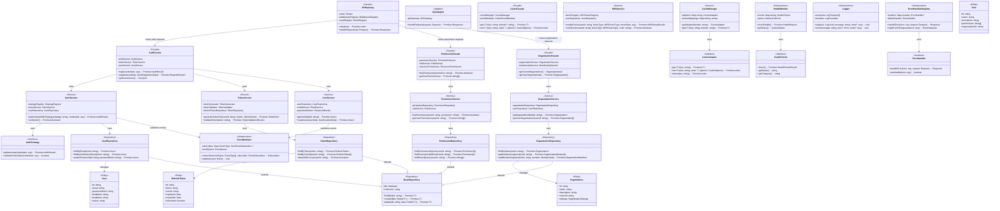

```mermaid
classDiagram
    %% High-Level System Architecture with Layers
    
    %% Layer: Client Interfaces
    class APIGateway {
        <<Service>>
        -router: Router
        -middlewareRegistry: MiddlewareRegistry
        -routeRegistry: RouteRegistry
        +initialize(): Promise~void~
        +handleRequest(req: Request): Promise~Response~
    }

    class ApiAdapter {
        <<Adapter>>
        -apiGateway: APIGateway
        +handleRequest(request: Request): Promise~Response~
    }

    %% Layer: Facades (Business Logic Interface)
    class AuthFacade {
        <<Facade>>
        -authService: AuthService
        -tokenService: TokenService
        -userService: UserService
        +login(credentials: any): Promise~AuthResult~
        +register(userData: UserRegistrationData): Promise~RegisterResult~
        +getCurrentUser(): User|null
    }

    class PermissionFacade {
        <<Facade>>
        -permissionService: PermissionService
        -roleService: RoleService
        -resourcePermissions: ResourcePermissions
        +hasPermission(permission: string): Promise~boolean~
        +getUserPermissions(): Promise~string[]~
    }

    class OrganizationFacade {
        <<Facade>>
        -organizationService: OrganizationService
        -membershipService: MembershipService
        +getCurrentOrganization(): Organization|null
        +getUserOrganizations(): Promise~Organization[]~
    }

    class CacheFacade {
        <<Facade>>
        -cacheManager: CacheManager
        -cacheMediator: CacheEventMediator
        +get~T~(key: string, domain?: string): Promise~T~
        +set~T~(key: string, value: T, options?: CacheOptions): Promise~void~
    }

    %% Layer: Services (Core Business Logic)
    class AuthService {
        <<Service>>
        -strategyRegistry: StrategyRegistry
        -tokenService: TokenService
        -userRepository: UserRepository
        +authenticateWithStrategy(strategy: string, credentials: any): Promise~AuthResult~
        +verifyAuth(): Promise~boolean~
    }

    class TokenService {
        <<Service>>
        -tokenGenerator: TokenGenerator
        -tokenValidator: TokenValidator
        -refreshTokenRepository: TokenRepository
        +generateTokenPair(userId: string, claims: TokenClaims): Promise~TokenPair~
        +validateToken(token: string): Promise~TokenValidationResult~
    }

    class PermissionService {
        <<Service>>
        -permissionRepository: PermissionRepository
        -roleService: RoleService
        +hasPermission(userId: string, permission: string): Promise~boolean~
        +getUserPermissions(userId: string): Promise~string[]~
    }

    class OrganizationService {
        <<Service>>
        -organizationRepository: OrganizationRepository
        -userRepository: UserRepository
        +getOrganizationById(id: string): Promise~Organization~
        +getUserOrganizations(userId: string): Promise~Organization[]~
    }

    class UserService {
        <<Service>>
        -userRepository: UserRepository
        -emailService: EmailService
        -passwordHasher: PasswordHasher
        +getUserById(id: string): Promise~User~
        +createUser(userData: UserCreationData): Promise~User~
    }

    class MFAService {
        <<Service>>
        -factorRegistry: MFAFactorRegistry
        -userRepository: UserRepository
        +enableFactor(userId: string, factorType: MFAFactorType, factorData: any): Promise~MFASetupResult~
        +verifyFactor(userId: string, factorType: MFAFactorType, code: string): Promise~boolean~
    }
    
    class CacheManager {
        <<Service>>
        -adapters: Map~string, CacheAdapter~
        -domainMappings: Map~string, string~
        +getAdapter(domain: string): CacheAdapter
        +get~T~(key: string, domain: string): Promise~T~
    }

    %% Layer: Infrastructure Services
    class EventMediator {
        <<Infrastructure>>
        -subscribers: Map~EventType, Set~EventSubscriber~~
        -eventQueue: EventQueue
        +subscribe(eventTypes: EventType[], subscriber: EventSubscriber): Subscription
        +publish(event: Event): void
    }

    class HealthMonitor {
        <<Infrastructure>>
        -checks: Map~string, HealthCheck~
        -metrics: MetricsCollector
        +checkHealth(): Promise~HealthReport~
        +getStatus(): SystemStatus
    }

    class Logger {
        <<Infrastructure>>
        -transports: LogTransport[]
        -formatter: LogFormatter
        +log(level: LogLevel, message: string, meta?: any): void
        +error(message: string, error?: Error, meta?: any): void
    }

    class ErrorHandlerRegistry {
        <<Infrastructure>>
        -handlers: Map~number, ErrorHandler~
        -defaultHandler: ErrorHandler
        +handleError(error: any, request: Request): Response
        +mapErrorToResponse(error: any): ErrorResponse
    }

    %% Layer: Data Access
    class BaseRepository {
        <<Repository>>
        #db: Database
        #collection: string
        +findById(id: string): Promise~T~
        +create(data: Partial~T~): Promise~T~
        +update(id: string, data: Partial~T~): Promise~T~
    }

    class UserRepository {
        <<Repository>>
        +findByEmail(email: string): Promise~User~
        +findByVerificationToken(token: string): Promise~User~
        +updatePassword(id: string, passwordHash: string): Promise~User~
    }

    class TokenRepository {
        <<Repository>>
        +findByToken(token: string): Promise~RefreshToken~
        +findByUserId(userId: string): Promise~RefreshToken[]~
        +deleteAllForUser(userId: string): Promise~boolean~
    }

    class OrganizationRepository {
        <<Repository>>
        +findByName(name: string): Promise~Organization~
        +getMembers(organizationId: string): Promise~OrganizationMember[]~
        +addMember(organizationId: string, member: MemberData): Promise~OrganizationMember~
    }

    class PermissionRepository {
        <<Repository>>
        +findPermissionsByUser(userId: string): Promise~Permission[]~
        +findPermissionsByRole(roleId: string): Promise~Permission[]~
        +findRolesByUser(userId: string): Promise~string[]~
    }

    %% Layer: Domain Models
    class User {
        <<Entity>>
        +id: string
        +email: string
        +passwordHash: string
        +firstName: string
        +lastName: string
        +status: string
    }

    class Organization {
        <<Entity>>
        +id: string
        +name: string
        +description: string
        +ownerId: string
        +settings: OrganizationSettings
    }

    class RefreshToken {
        <<Entity>>
        +id: string
        +token: string
        +userId: string
        +expiresAt: Date
        +createdAt: Date
        +isRevoked: boolean
    }

    class Role {
        <<Entity>>
        +id: string
        +name: string
        +description: string
        +permissions: string[]
        +organizationId?: string
    }

    %% Cross-cutting components
    class AuthStrategy {
        <<Interface>>
        +authenticate(credentials: any): Promise~AuthResult~
        +validateCredentials(credentials: any): boolean
    }

    class CacheAdapter {
        <<Interface>>
        +get~T~(key: string): Promise~T~
        +set~T~(key: string, value: T, options?: CacheOptions): Promise~void~
        +delete(key: string): Promise~void~
    }

    class HealthCheck {
        <<Interface>>
        +check(): Promise~HealthCheckResult~
        +getName(): string
        +getCategory(): string
    }

    class ErrorHandler {
        <<Interface>>
        +handleError(error: any, request: Request): Response
        +canHandle(error: any): boolean
    }

    %% Cross-layer relationships (simplified for clarity)
    APIGateway --> AuthFacade : routes auth requests
    APIGateway --> PermissionFacade : routes permission requests
    APIGateway --> OrganizationFacade : routes organization requests
    
    AuthFacade --> AuthService : uses
    AuthFacade --> TokenService : uses
    AuthFacade --> UserService : uses
    
    PermissionFacade --> PermissionService : uses
    OrganizationFacade --> OrganizationService : uses
    
    AuthService --> AuthStrategy : uses
    CacheManager --> CacheAdapter : uses
    
    AuthService --> UserRepository : uses
    TokenService --> TokenRepository : uses
    PermissionService --> PermissionRepository : uses
    OrganizationService --> OrganizationRepository : uses
    
    UserRepository --> User : manages
    OrganizationRepository --> Organization : manages
    TokenRepository --> RefreshToken : manages
    
    AuthService --> EventMediator : publishes events
    UserService --> EventMediator : publishes events
    HealthMonitor --> HealthCheck : uses
    ErrorHandlerRegistry --> ErrorHandler : uses

    %% Inheritance relationships
    UserRepository --|> BaseRepository : extends
    TokenRepository --|> BaseRepository : extends
    OrganizationRepository --|> BaseRepository : extends
    PermissionRepository --|> BaseRepository : extends
```
