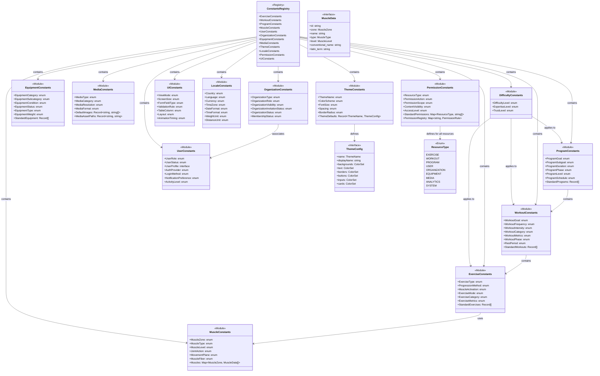

```mermaid
classDiagram
    %% Core Constants Organization System
    
    class ConstantsRegistry {
        <<Registry>>
        +ExerciseConstants
        +WorkoutConstants
        +ProgramConstants
        +MuscleConstants
        +UserConstants
        +OrganizationConstants
        +EquipmentConstants
        +MediaConstants
        +ThemeConstants
        +LocaleConstants
        +PermissionConstants
        +UIConstants
    }
    
    %% Exercise & Training Constants
    class ExerciseConstants {
        <<Module>>
        +ExerciseType: enum
        +ProgressionMethod: enum
        +MuscleActivation: enum
        +ExerciseMode: enum
        +ExerciseCategory: enum
        +ExerciseMetrics: enum
        +StandardExercises: Record[]
    }
    
    class WorkoutConstants {
        <<Module>>
        +WorkoutGoal: enum
        +WorkoutFrequency: enum
        +WorkoutIntensity: enum
        +WorkoutCategory: enum
        +WorkoutMetrics: enum
        +WorkoutPhase: enum
        +RestPeriod: enum
        +StandardWorkouts: Record[]
    }
    
    class ProgramConstants {
        <<Module>>
        +ProgramGoal: enum
        +ProgramSubgoal: enum
        +ProgramDuration: enum
        +ProgramPhase: enum
        +ProgramLevel: enum
        +ProgramSchedule: enum
        +StandardPrograms: Record[]
    }
    
    %% Physiological & Anatomical Constants
    class MuscleConstants {
        <<Module>>
        +MuscleZone: enum
        +MuscleType: enum
        +MuscleLevel: enum
        +JointAction: enum
        +MovementPlane: enum
        +MuscleFiber: enum
        +Muscles: Map~MuscleZone, MuscleData[]~
    }
    
    %% Organization Constants
    class OrganizationConstants {
        <<Module>>
        +OrganizationType: enum
        +OrganizationRole: enum
        +OrganizationVisibility: enum
        +OrganizationInvitationStatus: enum
        +OrganizationStatus: enum
        +MembershipStatus: enum
    }
    
    %% User Constants
    class UserConstants {
        <<Module>>
        +UserRole: enum
        +UserStatus: enum
        +UserProfile: interface
        +AuthProvider: enum
        +LoginMethod: enum
        +NotificationPreference: enum
        +ActivityLevel: enum
    }
    
    %% Equipment Constants
    class EquipmentConstants {
        <<Module>>
        +EquipmentCategory: enum
        +EquipmentSubcategory: enum
        +EquipmentCondition: enum
        +EquipmentStatus: enum
        +EquipmentType: enum
        +EquipmentWeight: enum
        +StandardEquipment: Record[]
    }
    
    %% Media Constants
    class MediaConstants {
        <<Module>>
        +MediaType: enum
        +MediaCategory: enum
        +MediaResolution: enum
        +MediaFormat: enum
        +DefaultImages: Record~string, string[]~
        +MediaAssetPaths: Record~string, string~
    }
    
    %% Theme & UI Constants
    class ThemeConstants {
        <<Module>>
        +ThemeName: enum
        +ColorScheme: enum
        +FontSize: enum
        +Spacing: enum
        +BorderRadius: enum
        +ThemeDefaults: Record~ThemeName, ThemeConfig~
    }
    
    %% UI Constants
    class UIConstants {
        <<Module>>
        +ViewMode: enum
        +ScreenSize: enum
        +FormFieldType: enum
        +ValidationRule: enum
        +TableColumn: enum
        +Layout: enum
        +AnimationTiming: enum
    }
    
    %% Locale Constants
    class LocaleConstants {
        <<Module>>
        +Country: enum
        +Language: enum
        +Currency: enum
        +TimeZone: enum
        +DateFormat: enum
        +TimeFormat: enum
        +WeightUnit: enum
        +DistanceUnit: enum
    }
    
    %% Permission Constants
    class PermissionConstants {
        <<Module>>
        +ResourceType: enum
        +PermissionAction: enum
        +PermissionScope: enum
        +ContentVisibility: enum
        +AccessLevel: enum
        +StandardPermissions: Map~ResourceType, string[]~
        +PermissionRegistry: Map~string, PermissionRule~
    }
    
    %% Utility Constants
    class DifficultyConstants {
        <<Module>>
        +DifficultyLevel: enum
        +ExpertiseLevel: enum
        +TrustLevel: enum
    }
    
    %% Relationships
    ThemeConstants --> ThemeConfig : defines
    DifficultyConstants --> ExerciseConstants : applies to
    DifficultyConstants --> WorkoutConstants : applies to
    DifficultyConstants --> ProgramConstants : applies to
    
    ConstantsRegistry --> ExerciseConstants : contains
    ConstantsRegistry --> WorkoutConstants : contains
    ConstantsRegistry --> ProgramConstants : contains
    ConstantsRegistry --> MuscleConstants : contains
    ConstantsRegistry --> OrganizationConstants : contains
    ConstantsRegistry --> UserConstants : contains
    ConstantsRegistry --> EquipmentConstants : contains
    ConstantsRegistry --> MediaConstants : contains
    ConstantsRegistry --> ThemeConstants : contains
    ConstantsRegistry --> LocaleConstants : contains
    ConstantsRegistry --> PermissionConstants : contains
    ConstantsRegistry --> UIConstants : contains
    ConstantsRegistry --> DifficultyConstants : contains
    
    %% Cross-module relationships
    ExerciseConstants --> MuscleConstants : uses
    WorkoutConstants --> ExerciseConstants : contains
    ProgramConstants --> WorkoutConstants : contains
    OrganizationConstants --> UserConstants : associates
    PermissionConstants --> ResourceType : defines for all resources
    
    %% Examples of specific constants
    class ResourceType {
        <<Enum>>
        EXERCISE
        WORKOUT
        PROGRAM
        USER
        ORGANIZATION
        EQUIPMENT
        MEDIA
        ANALYTICS
        SYSTEM
    }
    
    class ThemeConfig {
        <<Interface>>
        +name: ThemeName
        +displayName: string
        +backgrounds: ColorSet
        +text: ColorSet
        +borders: ColorSet
        +buttons: ColorSet
        +inputs: ColorSet
        +cards: ColorSet
    }
    
    class MuscleData {
        <<Interface>>
        +id: string
        +zone: MuscleZone
        +name: string
        +type: MuscleType
        +level: MuscleLevel
        +conventional_name: string
        +latin_term: string
    }
```
