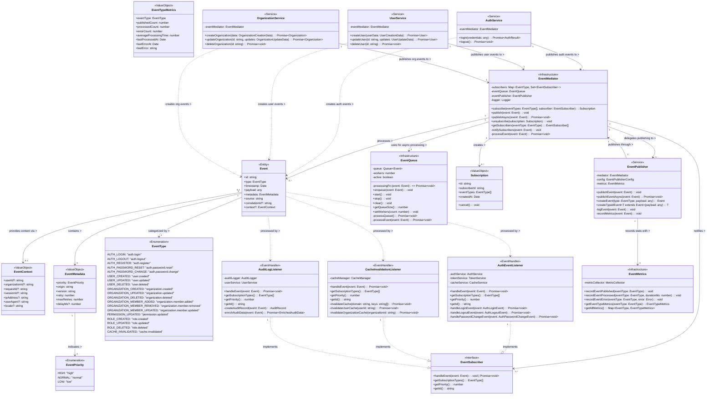

```mermaid
classDiagram
    %% Improved Event Mediator System Class Diagram
    %% Shows the Observer pattern implementation with event publishing/subscribing
    %% and the overall event flow in the system
    
    class EventMediator {
        <<Infrastructure>>
        -subscribers: Map~EventType, Set~EventSubscriber~~
        -eventQueue: EventQueue
        -eventPublisher: EventPublisher
        -logger: Logger
        +subscribe(eventTypes: EventType[], subscriber: EventSubscriber): Subscription
        +publish(event: Event): void
        +publishAsync(event: Event): Promise~void~
        +unsubscribe(subscription: Subscription): void
        +getSubscribers(eventType: EventType): EventSubscriber[]
        -notifySubscribers(event: Event): void
        -processEvent(event: Event): Promise~void~
    }
    
    class EventPublisher {
        <<Service>>
        -mediator: EventMediator
        -config: EventPublisherConfig
        -metrics: EventMetrics
        +publishEvent(event: Event): void
        +publishEventAsync(event: Event): Promise~void~
        +createEvent(type: EventType, payload: any): Event
        +createTypedEvent~T extends Event~(payload: any): T
        -logEvent(event: Event): void
        -recordMetrics(event: Event): void
    }
    
    class EventQueue {
        <<Infrastructure>>
        -queue: Queue~Event~
        -workers: number
        -processingFn: (event: Event) => Promise~void~
        -active: boolean
        +enqueue(event: Event): void
        +start(): void
        +stop(): void
        +clear(): void
        +getQueueSize(): number
        +setWorkers(count: number): void
        -processQueue(): Promise~void~
        -processEvent(event: Event): Promise~void~
    }
    
    class EventSubscriber {
        <<Interface>>
        +handleEvent(event: Event): void | Promise~void~
        +getSubscriptionTypes(): EventType[]
        +getPriority(): number
        +getId(): string
    }
    
    class Subscription {
        <<ValueObject>>
        +id: string
        +subscriberId: string
        +eventTypes: EventType[]
        +createdAt: Date
        +cancel(): void
    }
    
    class Event {
        <<Entity>>
        +id: string
        +type: EventType
        +timestamp: Date
        +payload: any
        +metadata: EventMetadata
        +source: string
        +correlationId?: string
        +context?: EventContext
    }
    
    class EventContext {
        <<ValueObject>>
        +userId?: string
        +organizationId?: string
        +requestId?: string
        +sessionId?: string
        +ipAddress?: string
        +userAgent?: string
        +locale?: string
    }
    
    class EventMetadata {
        <<ValueObject>>
        +priority: EventPriority
        +origin: string
        +version: string
        +retry: number
        +maxRetries: number
        +delayMs?: number
    }
    
    class EventType {
        <<Enumeration>>
        AUTH_LOGIN: "auth.login"
        AUTH_LOGOUT: "auth.logout"
        AUTH_REGISTER: "auth.register"
        AUTH_PASSWORD_RESET: "auth.password.reset"
        AUTH_PASSWORD_CHANGE: "auth.password.change"
        USER_CREATED: "user.created"
        USER_UPDATED: "user.updated"
        USER_DELETED: "user.deleted"
        ORGANIZATION_CREATED: "organization.created"
        ORGANIZATION_UPDATED: "organization.updated"
        ORGANIZATION_DELETED: "organization.deleted"
        ORGANIZATION_MEMBER_ADDED: "organization.member.added"
        ORGANIZATION_MEMBER_REMOVED: "organization.member.removed"
        ORGANIZATION_MEMBER_UPDATED: "organization.member.updated"
        PERMISSION_UPDATED: "permission.updated"
        ROLE_CREATED: "role.created"
        ROLE_UPDATED: "role.updated"
        ROLE_DELETED: "role.deleted"
        CACHE_INVALIDATED: "cache.invalidated"
    }
    
    class EventPriority {
        <<Enumeration>>
        HIGH: "high"
        NORMAL: "normal"
        LOW: "low"
    }
    
    class AuthEventListener {
        <<EventHandler>>
        -authService: AuthService
        -tokenService: TokenService
        -cacheService: CacheService
        +handleEvent(event: Event): Promise~void~
        +getSubscriptionTypes(): EventType[]
        +getPriority(): number
        +getId(): string
        -handleLoginEvent(event: AuthLoginEvent): Promise~void~
        -handleLogoutEvent(event: AuthLogoutEvent): Promise~void~
        -handlePasswordChangeEvent(event: AuthPasswordChangeEvent): Promise~void~
    }
    
    class CacheInvalidationListener {
        <<EventHandler>>
        -cacheManager: CacheManager
        +handleEvent(event: Event): Promise~void~
        +getSubscriptionTypes(): EventType[]
        +getPriority(): number
        +getId(): string
        -invalidateCache(domain: string, keys: string[]): Promise~void~
        -invalidateUserCache(userId: string): Promise~void~
        -invalidateOrganizationCache(organizationId: string): Promise~void~
    }
    
    class AuditLogListener {
        <<EventHandler>>
        -auditLogger: AuditLogger
        -userService: UserService
        +handleEvent(event: Event): Promise~void~
        +getSubscriptionTypes(): EventType[]
        +getPriority(): number
        +getId(): string
        -createAuditRecord(event: Event): AuditRecord
        -enrichAuditData(event: Event): Promise~EnrichedAuditData~
    }
    
    class EventMetrics {
        <<Infrastructure>>
        -metricCollector: MetricCollector
        +recordEventPublished(eventType: EventType): void
        +recordEventProcessed(eventType: EventType, durationMs: number): void
        +recordEventError(eventType: EventType, error: Error): void
        +getEventTypeMetrics(eventType: EventType): EventTypeMetrics
        +getAllMetrics(): Map~EventType, EventTypeMetrics~
    }
    
    class EventTypeMetrics {
        <<ValueObject>>
        +eventType: EventType
        +publishedCount: number
        +processedCount: number
        +errorCount: number
        +averageProcessingTime: number
        +lastProcessedAt: Date
        +lastErrorAt: Date
        +lastError: string
    }
    
    class AuthService {
        <<Service>>
        -eventMediator: EventMediator
        +login(credentials: any): Promise~AuthResult~
        +logout(): Promise~void~
    }
    
    class UserService {
        <<Service>>
        -eventMediator: EventMediator
        +createUser(userData: UserCreationData): Promise~User~
        +updateUser(id: string, updates: UserUpdateData): Promise~User~
        +deleteUser(id: string): Promise~void~
    }
    
    class OrganizationService {
        <<Service>>
        -eventMediator: EventMediator
        +createOrganization(data: OrganizationCreationData): Promise~Organization~
        +updateOrganization(id: string, updates: OrganizationUpdateData): Promise~Organization~
        +deleteOrganization(id: string): Promise~void~
    }
    
    %% Relationships with better descriptions and cardinality
    EventMediator "1" --> "0..*" EventSubscriber : notifies >
    EventMediator "1" --> "1" EventQueue : uses for async processing >
    EventMediator "1" --> "1" EventPublisher : delegates publishing to >
    
    EventMediator "1" --> "0..*" Subscription : creates >
    EventMediator "1" --> "0..*" Event : processes >
    
    EventPublisher "1" --> "1" EventMediator : publishes through >
    EventPublisher "1" --> "1" EventMetrics : records stats with >
    
    AuthEventListener "1" ..|> EventSubscriber : implements
    CacheInvalidationListener "1" ..|> EventSubscriber : implements
    AuditLogListener "1" ..|> EventSubscriber : implements
    
    Event "1" --> "1" EventType : categorized by >
    Event "1" --> "1" EventMetadata : contains >
    Event "0..1" --> "0..1" EventContext : provides context via >
    
    EventMetadata "1" --> "1" EventPriority : indicates >
    
    AuthService "1" --> "1" EventMediator : publishes auth events to >
    UserService "1" --> "1" EventMediator : publishes user events to >
    OrganizationService "1" --> "1" EventMediator : publishes org events to >
    
    %% Event Flow (additional graphical elements to show flow)
    AuthService ..> Event : creates auth events >
    UserService ..> Event : creates user events >
    OrganizationService ..> Event : creates org events >
    
    Event ..> AuthEventListener : processed by >
    Event ..> CacheInvalidationListener : processed by >
    Event ..> AuditLogListener : processed by >
```
