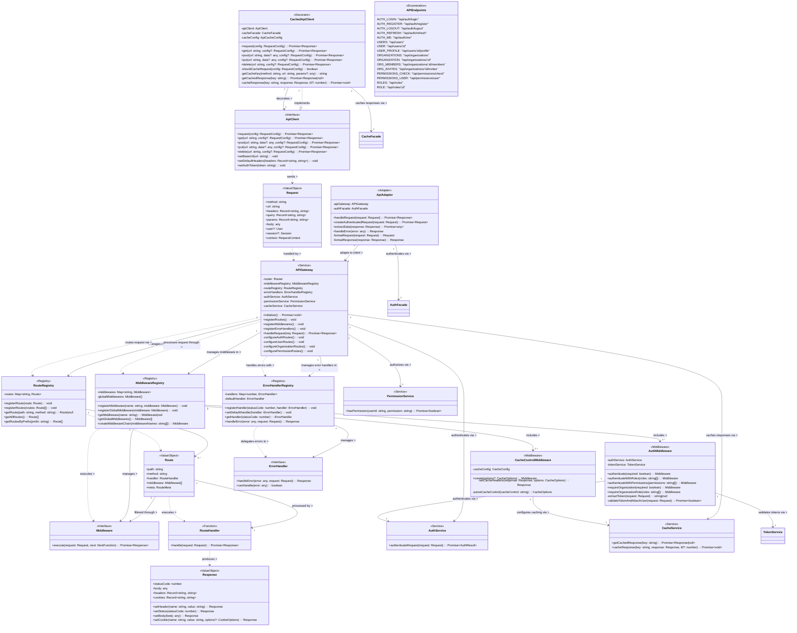

```mermaid
classDiagram
    %% Improved API Gateway Class Diagram
    %% Shows the API Gateway pattern implementation with middleware and routing
    %% Illustrates the request handling pipeline
    
    class APIGateway {
        <<Service>>
        -router: Router
        -middlewareRegistry: MiddlewareRegistry
        -routeRegistry: RouteRegistry
        -errorHandlers: ErrorHandlerRegistry
        -authService: AuthService
        -permissionService: PermissionService
        -cacheService: CacheService
        +initialize(): Promise~void~
        +registerRoutes(): void
        +registerMiddlewares(): void
        +registerErrorHandlers(): void
        +handleRequest(req: Request): Promise~Response~
        -configureAuthRoutes(): void
        -configureUserRoutes(): void
        -configureOrganizationRoutes(): void
        -configurePermissionRoutes(): void
    }
    
    class ApiClient {
        <<Interface>>
        +request(config: RequestConfig): Promise~Response~
        +get(url: string, config?: RequestConfig): Promise~Response~
        +post(url: string, data?: any, config?: RequestConfig): Promise~Response~
        +put(url: string, data?: any, config?: RequestConfig): Promise~Response~
        +delete(url: string, config?: RequestConfig): Promise~Response~
        +setBaseUrl(url: string): void
        +setDefaultHeaders(headers: Record~string, string~): void
        +setAuthToken(token: string): void
    }
    
    class CachedApiClient {
        <<Decorator>>
        -apiClient: ApiClient
        -cacheFacade: CacheFacade
        -cacheConfig: ApiCacheConfig
        +request(config: RequestConfig): Promise~Response~
        +get(url: string, config?: RequestConfig): Promise~Response~
        +post(url: string, data?: any, config?: RequestConfig): Promise~Response~
        +put(url: string, data?: any, config?: RequestConfig): Promise~Response~
        +delete(url: string, config?: RequestConfig): Promise~Response~
        -shouldCacheRequest(config: RequestConfig): boolean
        -getCacheKey(method: string, url: string, params?: any): string
        -getCachedResponse(key: string): Promise~Response|null~
        -cacheResponse(key: string, response: Response, ttl?: number): Promise~void~
    }
    
    class Middleware {
        <<Interface>>
        +execute(request: Request, next: NextFunction): Promise~Response~
    }
    
    class AuthMiddleware {
        <<Middleware>>
        -authService: AuthService
        -tokenService: TokenService
        +authenticate(required: boolean): Middleware
        +authenticateWithRoles(roles: string[]): Middleware
        +authenticateWithPermissions(permissions: string[]): Middleware
        +requireOrganization(required: boolean): Middleware
        +requireOrganizationRole(roles: string[]): Middleware
        -extractToken(request: Request): string|null
        -validateTokenAndAttachUser(request: Request): Promise~boolean~
    }
    
    class CacheControlMiddleware {
        <<Middleware>>
        -cacheConfig: CacheConfig
        +create(options?: CacheOptions): Middleware
        -setCacheHeaders(response: Response, options: CacheOptions): Response
        -parseCacheControl(cacheControl: string): CacheOptions
    }
    
    class ApiAdapter {
        <<Adapter>>
        -apiGateway: APIGateway
        -authFacade: AuthFacade
        +handleRequest(request: Request): Promise~Response~
        +createAuthenticatedRequest(request: Request): Promise~Request~
        +extractData(response: Response): Promise~any~
        +handleError(error: any): Response
        -formatRequest(request: Request): Request
        -formatResponse(response: Response): Response
    }
    
    class Route {
        <<ValueObject>>
        +path: string
        +method: string
        +handler: RouteHandler
        +middleware: Middleware[]
        +meta: RouteMeta
    }
    
    class RouteHandler {
        <<Function>>
        +handle(request: Request): Promise~Response~
    }
    
    class RouteRegistry {
        <<Registry>>
        -routes: Map~string, Route~
        +registerRoute(route: Route): void
        +registerRoutes(routes: Route[]): void
        +getRoute(path: string, method: string): Route|null
        +getAllRoutes(): Route[]
        +getRoutesByPrefix(prefix: string): Route[]
    }
    
    class MiddlewareRegistry {
        <<Registry>>
        -middlewares: Map~string, Middleware~
        -globalMiddlewares: Middleware[]
        +registerMiddleware(name: string, middleware: Middleware): void
        +registerGlobalMiddleware(middleware: Middleware): void
        +getMiddleware(name: string): Middleware|null
        +getGlobalMiddlewares(): Middleware[]
        +createMiddlewareChain(middlewareNames: string[]): Middleware
    }
    
    class ErrorHandlerRegistry {
        <<Registry>>
        -handlers: Map~number, ErrorHandler~
        -defaultHandler: ErrorHandler
        +registerHandler(statusCode: number, handler: ErrorHandler): void
        +setDefaultHandler(handler: ErrorHandler): void
        +getHandler(statusCode: number): ErrorHandler
        +handleError(error: any, request: Request): Response
    }
    
    class ErrorHandler {
        <<Interface>>
        +handleError(error: any, request: Request): Response
        +canHandle(error: any): boolean
    }
    
    class Request {
        <<ValueObject>>
        +method: string
        +url: string
        +headers: Record~string, string~
        +query: Record~string, string~
        +params: Record~string, string~
        +body: any
        +user?: User
        +session?: Session
        +context: RequestContext
    }
    
    class Response {
        <<ValueObject>>
        +statusCode: number
        +body: any
        +headers: Record~string, string~
        +cookies: Record~string, string~
        +setHeader(name: string, value: string): Response
        +setStatus(statusCode: number): Response
        +setBody(body: any): Response
        +setCookie(name: string, value: string, options?: CookieOptions): Response
    }
    
    class AuthService {
        <<Service>>
        +authenticateRequest(request: Request): Promise~AuthResult~
    }
    
    class PermissionService {
        <<Service>>
        +hasPermission(userId: string, permission: string): Promise~boolean~
    }
    
    class CacheService {
        <<Service>>
        +getCachedResponse(key: string): Promise~Response|null~
        +cacheResponse(key: string, response: Response, ttl?: number): Promise~void~
    }
    
    class APIEndpoints {
        <<Enumeration>>
        %% Auth endpoints
        AUTH_LOGIN: "/api/auth/login"
        AUTH_REGISTER: "/api/auth/register"
        AUTH_LOGOUT: "/api/auth/logout"
        AUTH_REFRESH: "/api/auth/refresh"
        AUTH_ME: "/api/auth/me"
        
        %% User endpoints
        USERS: "/api/users"
        USER: "/api/users/:id"
        USER_PROFILE: "/api/users/:id/profile"
        
        %% Organization endpoints
        ORGANIZATIONS: "/api/organizations"
        ORGANIZATION: "/api/organizations/:id"
        ORG_MEMBERS: "/api/organizations/:id/members"
        ORG_INVITES: "/api/organizations/:id/invites"
        
        %% Permission endpoints
        PERMISSIONS_CHECK: "/api/permissions/check"
        PERMISSIONS_USER: "/api/permissions/user"
        ROLES: "/api/roles"
        ROLE: "/api/roles/:id"
    }
    
    %% Relationships with better descriptions and cardinality
    APIGateway "1" --> "1" RouteRegistry : manages routes in >
    APIGateway "1" --> "1" MiddlewareRegistry : manages middleware in >
    APIGateway "1" --> "1" ErrorHandlerRegistry : manages error handlers in >
    APIGateway "1" --> "1" AuthService : authenticates via >
    APIGateway "1" --> "1" PermissionService : authorizes via >
    APIGateway "1" --> "1" CacheService : caches responses via >
    
    CachedApiClient "1" ..|> ApiClient : implements
    CachedApiClient "1" --> "1" ApiClient : decorates >
    CachedApiClient "1" --> "1" CacheFacade : caches responses via >
    
    ApiAdapter "1" --> "1" APIGateway : adapts to client >
    ApiAdapter "1" --> "1" AuthFacade : authenticates via >
    
    RouteRegistry "1" --> "0..*" Route : contains >
    Route "1" --> "1" RouteHandler : processed by >
    Route "1" --> "0..*" Middleware : filtered through >
    
    MiddlewareRegistry "1" --> "0..*" Middleware : manages >
    MiddlewareRegistry "1" --> "0..*" AuthMiddleware : includes >
    MiddlewareRegistry "1" --> "0..*" CacheControlMiddleware : includes >
    
    ErrorHandlerRegistry "1" --> "0..*" ErrorHandler : manages >
    
    AuthMiddleware "1" --> "1" AuthService : authenticates via >
    AuthMiddleware "1" --> "1" TokenService : validates tokens via >
    
    CacheControlMiddleware "1" --> "1" CacheService : configures caching via >
    
    %% Request Flow (additional graphical elements to show flow)
    ApiClient ..> Request : sends >
    Request ..> APIGateway : handled by >
    APIGateway ..> MiddlewareRegistry : processes request through >
    MiddlewareRegistry ..> Middleware : executes >
    APIGateway ..> RouteRegistry : routes request via >
    RouteRegistry ..> Route : resolves to >
    Route ..> RouteHandler : executes >
    RouteHandler ..> Response : produces >
    APIGateway ..> ErrorHandlerRegistry : handles errors with >
    ErrorHandlerRegistry ..> ErrorHandler : delegates errors to >
```
