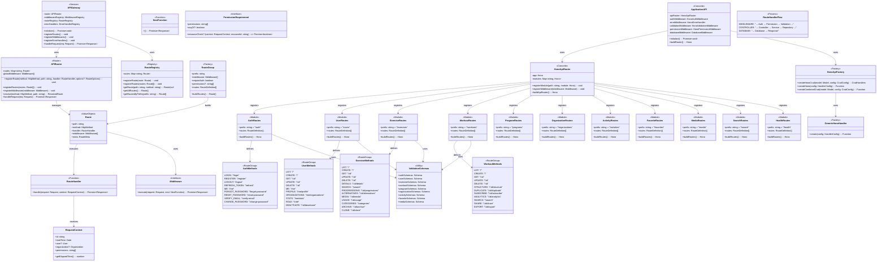

```mermaid
classDiagram
    %% Route/API Endpoint Structure
    
    class APIRouter {
        <<Router>>
        -routes: Map~string, Route~
        -globalMiddleware: Middleware[]
        +registerRoute(method: HttpMethod, path: string, handler: RouteHandler, options?: RouteOptions): void
        +registerRoutes(routes: Route[]): void
        +registerMiddleware(middleware: Middleware): void
        +resolve(method: HttpMethod, path: string): ResolvedRoute
        +handleRequest(req: Request): Promise~Response~
    }
    
    class Route {
        <<ValueObject>>
        +path: string
        +method: HttpMethod
        +handler: RouteHandler
        +middleware: Middleware[]
        +meta: RouteMeta
    }
    
    class RouteHandler {
        <<Function>>
        +handle(request: Request, context: RequestContext): Promise~Response~
    }
    
    class APIGateway {
        <<Service>>
        -router: APIRouter
        -middlewareRegistry: MiddlewareRegistry
        -routeRegistry: RouteRegistry
        -errorHandlers: ErrorHandlerRegistry
        +initialize(): Promise~void~
        +registerRoutes(): void
        +registerMiddlewares(): void
        +registerErrorHandlers(): void
        +handleRequest(req: Request): Promise~Response~
    }
    
    class RouteRegistry {
        <<Registry>>
        -routes: Map~string, Route~
        +registerRoute(route: Route): void
        +registerRoutes(routes: Route[]): void
        +getRoute(path: string, method: string): Route|null
        +getAllRoutes(): Route[]
        +getRoutesByPrefix(prefix: string): Route[]
    }
    
    class Middleware {
        <<Interface>>
        +execute(request: Request, next: NextFunction): Promise~Response~
    }
    
    class NextFunction {
        <<Function>>
        +(): Promise~Response~
    }
    
    class RequestContext {
        +id: string
        +startTime: Date
        +user?: User
        +organization?: Organization
        +permissions: string[]
        +getElapsedTime(): number
    }
    
    class PermissionRequirement {
        <<Interface>>
        +permissions: string[]
        +anyOf?: boolean
        +resourceCheck?: (context: RequestContext, resourceId: string) => Promise~boolean~
    }
    
    class RouteGroup {
        <<Factory>>
        +prefix: string
        +middleware: Middleware[]
        +requireAuth: boolean
        +permissions?: string[]
        +routes: RouteDefinition[]
        +buildRoutes(): Route[]
    }
    
    class HonoApiRouter {
        <<Concrete>>
        -app: Hono
        -modules: Map~string, Hono~
        +registerModule(path: string, module: Hono): void
        +registerMiddleware(middleware: Middleware): void
        +buildApiRouter(): Hono
    }
    
    %% API Endpoints Structure
    class AuthRoutes {
        <<Module>>
        +prefix: string = "/auth"
        +routes: RouteDefinition[]
        +buildRoutes(): Hono
    }
    
    class UserRoutes {
        <<Module>>
        +prefix: string = "/users"
        +routes: RouteDefinition[]
        +buildRoutes(): Hono
    }
    
    class ExerciseRoutes {
        <<Module>>
        +prefix: string = "/exercises"
        +routes: RouteDefinition[]
        +buildRoutes(): Hono
    }
    
    class WorkoutRoutes {
        <<Module>>
        +prefix: string = "/workouts"
        +routes: RouteDefinition[]
        +buildRoutes(): Hono
    }
    
    class ProgramRoutes {
        <<Module>>
        +prefix: string = "/programs"
        +routes: RouteDefinition[]
        +buildRoutes(): Hono
    }
    
    class OrganizationRoutes {
        <<Module>>
        +prefix: string = "/organizations"
        +routes: RouteDefinition[]
        +buildRoutes(): Hono
    }
    
    class ActivityRoutes {
        <<Module>>
        +prefix: string = "/activities"
        +routes: RouteDefinition[]
        +buildRoutes(): Hono
    }
    
    class FavoriteRoutes {
        <<Module>>
        +prefix: string = "/favorites"
        +routes: RouteDefinition[]
        +buildRoutes(): Hono
    }
    
    class MediaRoutes {
        <<Module>>
        +prefix: string = "/media"
        +routes: RouteDefinition[]
        +buildRoutes(): Hono
    }
    
    class SearchRoutes {
        <<Module>>
        +prefix: string = "/search"
        +routes: RouteDefinition[]
        +buildRoutes(): Hono
    }
    
    class HealthRoutes {
        <<Module>>
        +prefix: string = "/health"
        +routes: RouteDefinition[]
        +buildRoutes(): Hono
    }
    
    %% Auth Routes
    class AuthMethods {
        <<RouteGroup>>
        LOGIN: "/login"
        REGISTER: "/register"
        LOGOUT: "/logout"
        REFRESH_TOKEN: "/refresh"
        ME: "/me"
        FORGOT_PASSWORD: "/forgot-password"
        RESET_PASSWORD: "/reset-password"
        VERIFY_EMAIL: "/verify-email"
        CHANGE_PASSWORD: "/change-password"
    }
    
    %% Exercise Routes
    class ExerciseMethods {
        <<RouteGroup>>
        LIST: "/"
        CREATE: "/"
        GET: "/:id"
        UPDATE: "/:id"
        DELETE: "/:id"
        DETAILS: "/:id/details"
        SEARCH: "/search"
        PROGRESSIONS: "/:id/progressions"
        ALTERNATIVES: "/:id/alternatives"
        MEDIA: "/:id/media"
        USAGE: "/:id/usage"
        CATEGORIES: "/categories"
        ARCHIVE: "/:id/archive"
        CLONE: "/:id/clone"
    }
    
    %% Workout Routes
    class WorkoutMethods {
        <<RouteGroup>>
        LIST: "/"
        CREATE: "/"
        GET: "/:id"
        UPDATE: "/:id"
        DELETE: "/:id"
        STRUCTURE: "/:id/structure"
        DUPLICATE: "/:id/duplicate"
        SUBSCRIBE: "/:id/subscribe"
        ANALYTICS: "/:id/analytics"
        SEARCH: "/search"
        SHARE: "/:id/share"
        EXPORT: "/:id/export"
    }
    
    %% User Routes
    class UserMethods {
        <<RouteGroup>>
        LIST: "/"
        CREATE: "/"
        GET: "/:id"
        UPDATE: "/:id"
        DELETE: "/:id"
        ME: "/me"
        PROFILE: "/me/profile"
        ORGANIZATIONS: "/me/organizations"
        STATS: "/me/stats"
        ROLE: "/role"
        DEACTIVATE: "/:id/deactivate"
    }
    
    %% Validation Schemas
    class ValidationSchemas {
        <<Utility>>
        +authSchemas: Schema
        +userSchemas: Schema
        +exerciseSchemas: Schema
        +workoutSchemas: Schema
        +programSchemas: Schema
        +organizationSchemas: Schema
        +activitySchemas: Schema
        +favoriteSchemas: Schema
        +mediaSchemas: Schema
    }
    
    %% API Gateway Implementation
    class ApplicationAPI {
        <<Concrete>>
        -apiRouter: HonoApiRouter
        -authMiddleware: HonoAuthMiddleware
        -errorMiddleware: HonoErrorHandler
        -validationMiddleware: HonoValidationMiddleware
        -permissionMiddleware: HonoPermissionMiddleware
        -databaseMiddleware: DatabaseMiddleware
        +initialize(): Promise~void~
        +buildRouter(): Hono
    }
    
    %% Route Generation
    class HonoApiFactory {
        <<Factory>>
        +createHonoCrud(model: Model, config: CrudConfig): CrudHandlers
        +createHono(config: HandlerConfig): Function
        +createCombinedCrud(model: Model, config: CrudConfig): Function
    }
    
    class GenericHonoHandler {
        <<Factory>>
        +create(config: HandlerConfig): Function
    }
    
    %% Relationships
    APIGateway --> APIRouter : uses
    APIGateway --> RouteRegistry : uses
    APIRouter --> Route : manages
    Route --> RouteHandler : executes
    Route --> Middleware : uses
    
    RouteHandler --> RequestContext : receives
    
    RouteGroup --> Route : builds
    
    AuthRoutes --> AuthMethods : defines
    ExerciseRoutes --> ExerciseMethods : defines
    WorkoutRoutes --> WorkoutMethods : defines
    UserRoutes --> UserMethods : defines
    
    HonoApiRouter --> AuthRoutes : registers
    HonoApiRouter --> UserRoutes : registers
    HonoApiRouter --> ExerciseRoutes : registers
    HonoApiRouter --> WorkoutRoutes : registers
    HonoApiRouter --> ProgramRoutes : registers
    HonoApiRouter --> OrganizationRoutes : registers
    HonoApiRouter --> ActivityRoutes : registers
    HonoApiRouter --> FavoriteRoutes : registers
    HonoApiRouter --> MediaRoutes : registers
    HonoApiRouter --> SearchRoutes : registers
    HonoApiRouter --> HealthRoutes : registers
    
    ApplicationAPI --> HonoApiRouter : uses
    ApplicationAPI --> HonoApiFactory : uses
    
    HonoApiFactory --> GenericHonoHandler : uses
    
    AuthRoutes --> ValidationSchemas : uses
    UserRoutes --> ValidationSchemas : uses
    ExerciseRoutes --> ValidationSchemas : uses
    WorkoutRoutes --> ValidationSchemas : uses
    
    %% Route Handler Flows (simplified)
    class RouteHandlerFlow {
        <<Process>>
        MIDDLEWARE: "→ Auth → Permission → Validation →" 
        CONTROLLER: "→ Controller → Service → Repository →"
        DATABASE: "→ Database → Response"
    }
```
