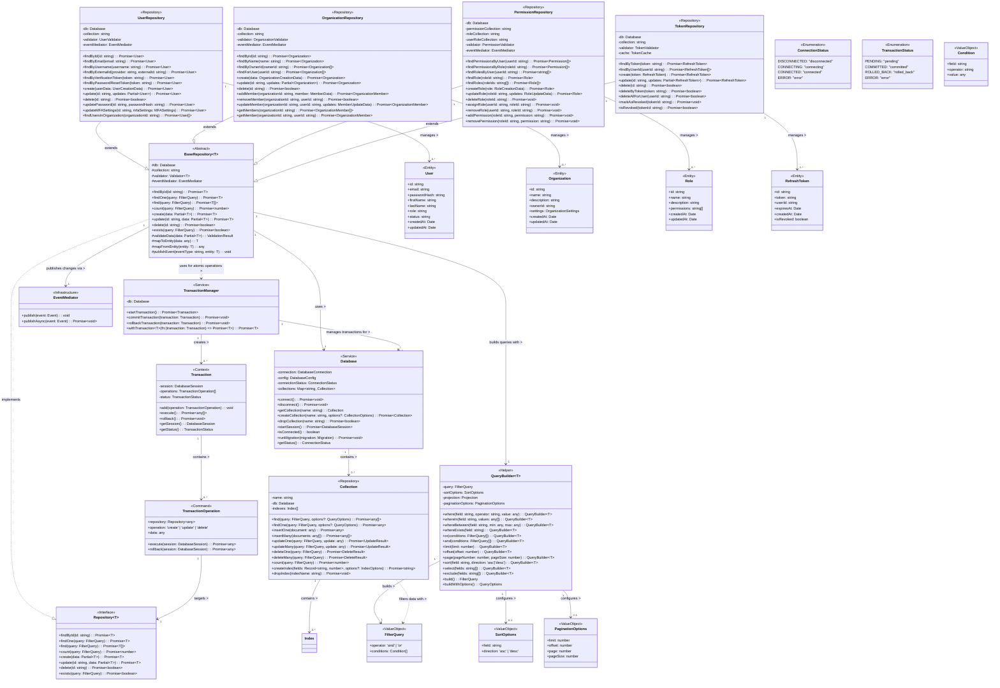

```mermaid
classDiagram
    %% Improved Repository Layer Class Diagram
    %% Shows the Repository pattern implementation with clear inheritance and relationships
    %% This illustrates the data access layer and transaction management
    
    class Repository~T~ {
        <<Interface>>
        +findById(id: string): Promise~T~
        +findOne(query: FilterQuery): Promise~T~
        +find(query: FilterQuery): Promise~T[]~
        +count(query: FilterQuery): Promise~number~
        +create(data: Partial~T~): Promise~T~
        +update(id: string, data: Partial~T~): Promise~T~
        +delete(id: string): Promise~boolean~
        +exists(query: FilterQuery): Promise~boolean~
    }
    
    class BaseRepository~T~ {
        <<Abstract>>
        #db: Database
        #collection: string
        #validator: Validator~T~
        #eventMediator: EventMediator
        +findById(id: string): Promise~T~
        +findOne(query: FilterQuery): Promise~T~
        +find(query: FilterQuery): Promise~T[]~
        +count(query: FilterQuery): Promise~number~
        +create(data: Partial~T~): Promise~T~
        +update(id: string, data: Partial~T~): Promise~T~
        +delete(id: string): Promise~boolean~
        +exists(query: FilterQuery): Promise~boolean~
        #validateData(data: Partial~T~): ValidationResult
        #mapToEntity(data: any): T
        #mapFromEntity(entity: T): any
        #publishEvent(eventType: string, entity: T): void
    }
    
    class UserRepository {
        <<Repository>>
        -db: Database
        -collection: string
        -validator: UserValidator
        -eventMediator: EventMediator
        +findById(id: string): Promise~User~
        +findByEmail(email: string): Promise~User~
        +findByUsername(username: string): Promise~User~
        +findByExternalId(provider: string, externalId: string): Promise~User~
        +findByVerificationToken(token: string): Promise~User~
        +findByPasswordResetToken(token: string): Promise~User~
        +create(userData: UserCreationData): Promise~User~
        +update(id: string, updates: Partial~User~): Promise~User~
        +delete(id: string): Promise~boolean~
        +updatePassword(id: string, passwordHash: string): Promise~User~
        +updateMFASettings(id: string, mfaSettings: MFASettings): Promise~User~
        +findUsersInOrganization(organizationId: string): Promise~User[]~
    }
    
    class OrganizationRepository {
        <<Repository>>
        -db: Database
        -collection: string
        -validator: OrganizationValidator
        -eventMediator: EventMediator
        +findById(id: string): Promise~Organization~
        +findByName(name: string): Promise~Organization~
        +findByOwnerId(ownerId: string): Promise~Organization[]~
        +findForUser(userId: string): Promise~Organization[]~
        +create(data: OrganizationCreationData): Promise~Organization~
        +update(id: string, updates: Partial~Organization~): Promise~Organization~
        +delete(id: string): Promise~boolean~
        +addMember(organizationId: string, member: MemberData): Promise~OrganizationMember~
        +removeMember(organizationId: string, userId: string): Promise~boolean~
        +updateMember(organizationId: string, userId: string, updates: MemberUpdateData): Promise~OrganizationMember~
        +getMembers(organizationId: string): Promise~OrganizationMember[]~
        +getMember(organizationId: string, userId: string): Promise~OrganizationMember~
    }
    
    class PermissionRepository {
        <<Repository>>
        -db: Database
        -permissionCollection: string
        -roleCollection: string
        -userRoleCollection: string
        -validator: PermissionValidator
        -eventMediator: EventMediator
        +findPermissionsByUser(userId: string): Promise~Permission[]~
        +findPermissionsByRole(roleId: string): Promise~Permission[]~
        +findRolesByUser(userId: string): Promise~string[]~
        +findRole(roleId: string): Promise~Role~
        +findRoles(roleIds: string[]): Promise~Role[]~
        +createRole(role: RoleCreationData): Promise~Role~
        +updateRole(roleId: string, updates: RoleUpdateData): Promise~Role~
        +deleteRole(roleId: string): Promise~void~
        +assignRole(userId: string, roleId: string): Promise~void~
        +removeRole(userId: string, roleId: string): Promise~void~
        +addPermission(roleId: string, permission: string): Promise~void~
        +removePermission(roleId: string, permission: string): Promise~void~
    }
    
    class TokenRepository {
        <<Repository>>
        -db: Database
        -collection: string
        -validator: TokenValidator
        -cache: TokenCache
        +findByToken(token: string): Promise~RefreshToken~
        +findByUserId(userId: string): Promise~RefreshToken[]~
        +create(token: RefreshToken): Promise~RefreshToken~
        +update(id: string, updates: Partial~RefreshToken~): Promise~RefreshToken~
        +delete(id: string): Promise~boolean~
        +deleteByToken(token: string): Promise~boolean~
        +deleteAllForUser(userId: string): Promise~boolean~
        +markAsRevoked(tokenId: string): Promise~void~
        +isRevoked(tokenId: string): Promise~boolean~
    }
    
    class QueryBuilder~T~ {
        <<Helper>>
        -query: FilterQuery
        -sortOptions: SortOptions
        -projection: Projection
        -paginationOptions: PaginationOptions
        +where(field: string, operator: string, value: any): QueryBuilder~T~
        +whereIn(field: string, values: any[]): QueryBuilder~T~
        +whereBetween(field: string, min: any, max: any): QueryBuilder~T~
        +whereExists(field: string): QueryBuilder~T~
        +or(conditions: FilterQuery[]): QueryBuilder~T~
        +and(conditions: FilterQuery[]): QueryBuilder~T~
        +limit(limit: number): QueryBuilder~T~
        +offset(offset: number): QueryBuilder~T~
        +page(pageNumber: number, pageSize: number): QueryBuilder~T~
        +sort(field: string, direction: 'asc'|'desc'): QueryBuilder~T~
        +select(fields: string[]): QueryBuilder~T~
        +exclude(fields: string[]): QueryBuilder~T~
        +build(): FilterQuery
        +buildWithOptions(): QueryOptions
    }
    
    class TransactionManager {
        <<Service>>
        -db: Database
        +startTransaction(): Promise~Transaction~
        +commitTransaction(transaction: Transaction): Promise~void~
        +rollbackTransaction(transaction: Transaction): Promise~void~
        +withTransaction~T~(fn: (transaction: Transaction) => Promise~T~): Promise~T~
    }
    
    class Transaction {
        <<Context>>
        -session: DatabaseSession
        -operations: TransactionOperation[]
        -status: TransactionStatus
        +add(operation: TransactionOperation): void
        +execute(): Promise~any[]~
        +rollback(): Promise~void~
        +getSession(): DatabaseSession
        +getStatus(): TransactionStatus
    }
    
    class TransactionOperation {
        <<Command>>
        +repository: Repository~any~
        +operation: 'create' | 'update' | 'delete'
        +data: any
        +execute(session: DatabaseSession): Promise~any~
        +rollback(session: DatabaseSession): Promise~any~
    }
    
    class Database {
        <<Service>>
        -connection: DatabaseConnection
        -config: DatabaseConfig
        -connectionStatus: ConnectionStatus
        -collections: Map~string, Collection~
        +connect(): Promise~void~
        +disconnect(): Promise~void~
        +getCollection(name: string): Collection
        +createCollection(name: string, options?: CollectionOptions): Promise~Collection~
        +dropCollection(name: string): Promise~boolean~
        +startSession(): Promise~DatabaseSession~
        +isConnected(): boolean
        +runMigration(migration: Migration): Promise~void~
        +getStatus(): ConnectionStatus
    }
    
    class Collection {
        <<Repository>>
        -name: string
        -db: Database
        -indexes: Index[]
        +find(query: FilterQuery, options?: QueryOptions): Promise~any[]~
        +findOne(query: FilterQuery, options?: QueryOptions): Promise~any~
        +insertOne(document: any): Promise~any~
        +insertMany(documents: any[]): Promise~any[]~
        +updateOne(query: FilterQuery, update: any): Promise~UpdateResult~
        +updateMany(query: FilterQuery, update: any): Promise~UpdateResult~
        +deleteOne(query: FilterQuery): Promise~DeleteResult~
        +deleteMany(query: FilterQuery): Promise~DeleteResult~
        +count(query: FilterQuery): Promise~number~
        +createIndex(fields: Record~string, number~, options?: IndexOptions): Promise~string~
        +dropIndex(indexName: string): Promise~void~
    }
    
    class ConnectionStatus {
        <<Enumeration>>
        DISCONNECTED: "disconnected"
        CONNECTING: "connecting"
        CONNECTED: "connected"
        ERROR: "error"
    }
    
    class TransactionStatus {
        <<Enumeration>>
        PENDING: "pending"
        COMMITTED: "committed"
        ROLLED_BACK: "rolled_back"
        ERROR: "error"
    }
    
    class FilterQuery {
        <<ValueObject>>
        +operator: 'and' | 'or'
        +conditions: Condition[]
    }
    
    class Condition {
        <<ValueObject>>
        +field: string
        +operator: string
        +value: any
    }
    
    class SortOptions {
        <<ValueObject>>
        +field: string
        +direction: 'asc' | 'desc'
    }
    
    class PaginationOptions {
        <<ValueObject>>
        +limit: number
        +offset: number
        +page: number
        +pageSize: number
    }
    
    class User {
        <<Entity>>
        +id: string
        +email: string
        +passwordHash: string
        +firstName: string
        +lastName: string
        +role: string
        +status: string
        +createdAt: Date
        +updatedAt: Date
    }
    
    class Organization {
        <<Entity>>
        +id: string
        +name: string
        +description: string
        +ownerId: string
        +settings: OrganizationSettings
        +createdAt: Date
        +updatedAt: Date
    }
    
    class Role {
        <<Entity>>
        +id: string
        +name: string
        +description: string
        +permissions: string[]
        +createdAt: Date
        +updatedAt: Date
    }
    
    class RefreshToken {
        <<Entity>>
        +id: string
        +token: string
        +userId: string
        +expiresAt: Date
        +createdAt: Date
        +isRevoked: boolean
    }
    
    class EventMediator {
        <<Infrastructure>>
        +publish(event: Event): void
        +publishAsync(event: Event): Promise~void~
    }
    
    %% Relationships with better descriptions and cardinality
    BaseRepository ..|> Repository : implements
    UserRepository --|> BaseRepository : extends
    OrganizationRepository --|> BaseRepository : extends
    PermissionRepository --|> BaseRepository : extends
    TokenRepository --|> BaseRepository : extends
    
    BaseRepository "1" --> "1" Database : uses >
    BaseRepository "1" --> "1" QueryBuilder : builds queries with >
    BaseRepository "1" --> "1" EventMediator : publishes changes via >
    
    TransactionManager "1" --> "1" Database : manages transactions for >
    TransactionManager "1" --> "0..*" Transaction : creates >
    
    Transaction "1" --> "0..*" TransactionOperation : contains >
    TransactionOperation "1" --> "1" Repository : targets >
    
    Database "1" --> "0..*" Collection : contains >
    Collection "1" --> "0..*" Index : contains >
    
    UserRepository "1" --> "0..*" User : manages >
    OrganizationRepository "1" --> "0..*" Organization : manages >
    PermissionRepository "1" --> "0..*" Role : manages >
    TokenRepository "1" --> "0..*" RefreshToken : manages >
    
    QueryBuilder "1" --> "1" FilterQuery : builds >
    QueryBuilder "1" --> "0..1" SortOptions : configures >
    QueryBuilder "1" --> "0..1" PaginationOptions : configures >
    
    %% Usage Flows
    BaseRepository ..> TransactionManager : uses for atomic operations >
    Collection ..> FilterQuery : filters data with >
```
