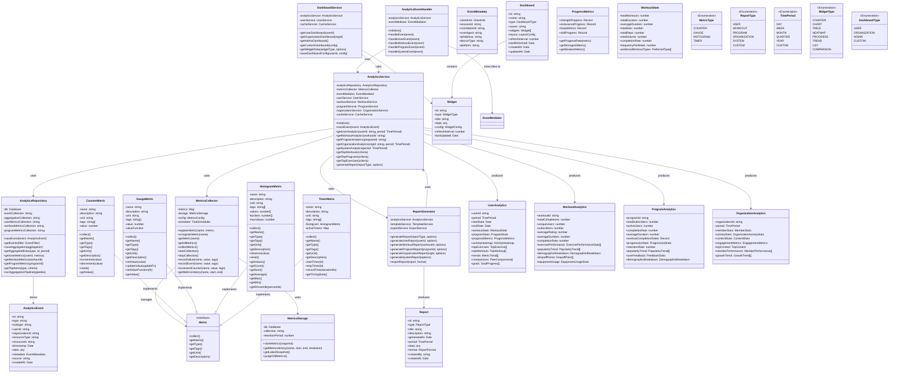

```mermaid
classDiagram
    %% Analytics System Architecture - Fixed Syntax
    
    class AnalyticsService {
        -analyticsRepository: AnalyticsRepository
        -metricsCollector: MetricsCollector
        -eventMediator: EventMediator
        -userService: UserService
        -workoutService: WorkoutService
        -programService: ProgramService
        -organizationService: OrganizationService
        -cacheService: CacheService
        +initialize()
        +trackEvent(event: AnalyticsEvent)
        +getUserAnalytics(userId: string, period: TimePeriod)
        +getWorkoutAnalytics(workoutId: string)
        +getProgramAnalytics(programId: string)
        +getOrganizationAnalytics(orgId: string, period: TimePeriod)
        +getSystemAnalytics(period: TimePeriod)
        +getTopWorkouts(criteria)
        +getTopPrograms(criteria)
        +getTopExercises(criteria)
        +generateReport(reportType, options)
    }
    
    class AnalyticsRepository {
        -db: Database
        -eventCollection: string
        -aggregationCollection: string
        -userMetricsCollection: string
        -workoutMetricsCollection: string
        -programMetricsCollection: string
        +saveEvent(event: AnalyticsEvent)
        +getEvents(filter: EventFilter)
        +saveAggregation(aggregation)
        +getAggregatedData(type, id, period)
        +getUserMetrics(userId, metrics)
        +getWorkoutMetrics(workoutId)
        +getProgramMetrics(programId)
        +getTopItems(type, criteria)
        +runAggregationPipeline(pipeline)
    }
    
    class MetricsCollector {
        -metrics: Map
        -storage: MetricsStorage
        -config: MetricsConfig
        -scheduler: TaskScheduler
        +registerMetric(name, metric)
        +unregisterMetric(name)
        +getMetric(name)
        +getAllMetrics()
        +collectMetrics()
        +startCollection()
        +stopCollection()
        +recordValue(name, value, tags)
        +recordEvent(name, value, tags)
        +incrementCounter(name, value, tags)
        +getMetricsHistory(name, start, end)
    }
    
    class Metric {
        <<Interface>>
        +collect()
        +getName()
        +getType()
        +getTags()
        +getUnit()
        +getDescription()
    }
    
    class CounterMetric {
        -name: string
        -description: string
        -unit: string
        -tags: string[]
        -value: number
        +collect()
        +getName()
        +getType()
        +getTags()
        +getUnit()
        +getDescription()
        +increment(value)
        +decrement(value)
        +reset()
        +getValue()
    }
    
    class GaugeMetric {
        -name: string
        -description: string
        -unit: string
        -tags: string[]
        -value: number
        -valueFunction
        +collect()
        +getName()
        +getType()
        +getTags()
        +getUnit()
        +getDescription()
        +setValue(value)
        +updateValue(updateFn)
        +setValueFunction(fn)
        +getValue()
    }
    
    class HistogramMetric {
        -name: string
        -description: string
        -unit: string
        -tags: string[]
        -values: number[]
        -buckets: number[]
        -maxValues: number
        +collect()
        +getName()
        +getType()
        +getTags()
        +getUnit()
        +getDescription()
        +observe(value)
        +reset()
        +getValues()
        +getCount()
        +getSum()
        +getAverage()
        +getMax()
        +getMin()
        +getPercentile(percentile)
    }
    
    class TimerMetric {
        -name: string
        -description: string
        -unit: string
        -tags: string[]
        -histogram: HistogramMetric
        -activeTimers: Map
        +collect()
        +getName()
        +getType()
        +getTags()
        +getUnit()
        +getDescription()
        +startTimer(id)
        +stopTimer(id)
        +recordTime(durationMs)
        +getTimingStats()
    }
    
    class AnalyticsEventHandler {
        -analyticsService: AnalyticsService
        -eventMediator: EventMediator
        +initialize()
        +handleEvent(event)
        +handleUserEvent(event)
        +handleWorkoutEvent(event)
        +handleProgramEvent(event)
        +handleSystemEvent(event)
    }
    
    class MetricsStorage {
        -db: Database
        -collection: string
        -retentionPeriod: number
        +storeMetrics(snapshot)
        +getMetricsHistory(name, start, end, resolution)
        +getLatestSnapshot()
        +purgeOldMetrics()
    }
    
    class ReportGenerator {
        -analyticsService: AnalyticsService
        -templateService: TemplateService
        -exportService: ExportService
        +generateReport(reportType, options)
        +generateUserReport(userId, options)
        +generateWorkoutReport(workoutId, options)
        +generateProgramReport(programId, options)
        +generateOrganizationReport(orgId, options)
        +generateSystemReport(options)
        +exportReport(report, format)
    }
    
    class DashboardService {
        -analyticsService: AnalyticsService
        -userService: UserService
        -cacheService: CacheService
        +getUserDashboard(userId)
        +getOrganizationDashboard(orgId)
        +getAdminDashboard()
        +getCustomDashboard(config)
        +getWidgetData(widgetType, options)
        +saveDashboardConfig(userId, config)
    }
    
    %% Domain Models
    class AnalyticsEvent {
        +id: string
        +type: string
        +subtype: string
        +userId: string
        +organizationId: string
        +resourceType: string
        +resourceId: string
        +timestamp: Date
        +data: any
        +metadata: EventMetadata
        +source: string
        +createdAt: Date
    }
    
    class EventMetadata {
        +clientInfo: ClientInfo
        +sessionId: string
        +correlationId: string
        +userAgent: string
        +ipAddress: string
        +deviceType: string
        +platform: string
    }
    
    class UserAnalytics {
        +userId: string
        +period: TimePeriod
        +startDate: Date
        +endDate: Date
        +workoutStats: WorkoutStats
        +programStats: ProgramStats
        +progressMetrics: ProgressMetrics
        +activityHeatmap: ActivityHeatmap
        +topExercises: TopExercise[]
        +topWorkouts: TopWorkout[]
        +trends: MetricTrend[]
        +comparisons: PeerComparison[]
        +goals: GoalProgress[]
    }
    
    class WorkoutAnalytics {
        +workoutId: string
        +totalCompletions: number
        +uniqueUsers: number
        +subscribers: number
        +averageRating: number
        +averageDuration: number
        +completionRate: number
        +exercisePerformance: ExercisePerformanceStats[]
        +popularityTrend: PopularityTrend[]
        +demographicBreakdown: DemographicBreakdown
        +dropoffPoints: DropoffPoint[]
        +equipmentUsage: EquipmentUsageStats
    }
    
    class ProgramAnalytics {
        +programId: string
        +totalSubscribers: number
        +activeUsers: number
        +completionRate: number
        +averageDuration: number
        +workoutCompletionRates: Record
        +progressionStats: ProgressionStats
        +retentionRate: number
        +popularityTrend: PopularityTrend[]
        +userFeedback: FeedbackStats
        +demographicBreakdown: DemographicBreakdown
    }
    
    class OrganizationAnalytics {
        +organizationId: string
        +period: TimePeriod
        +memberStats: MemberStats
        +activityStats: OrganizationActivityStats
        +contentStats: ContentStats
        +engagementMetrics: EngagementMetrics
        +topContent: TopContent
        +memberPerformance: MemberPerformance[]
        +growthTrend: GrowthTrend[]
    }
    
    class Report {
        +id: string
        +type: ReportType
        +title: string
        +description: string
        +generatedAt: Date
        +period: TimePeriod
        +data: any
        +format: ReportFormat
        +createdBy: string
        +createdAt: Date
    }
    
    class Widget {
        +id: string
        +type: WidgetType
        +title: string
        +data: any
        +config: WidgetConfig
        +refreshInterval: number
        +lastUpdated: Date
    }
    
    class Dashboard {
        +id: string
        +name: string
        +type: DashboardType
        +owner: string
        +widgets: Widget[]
        +layout: LayoutConfig
        +refreshInterval: number
        +lastRefreshed: Date
        +createdAt: Date
        +updatedAt: Date
    }
    
    %% Feature-Specific Models
    class ProgressMetrics {
        +strengthProgress: Record
        +enduranceProgress: Record
        +bodyMetrics: Record
        +skillProgress: Record
        +getProgressRate(metric)
        +getStrongestMetric()
        +getWeakestMetric()
    }
    
    class WorkoutStats {
        +totalWorkouts: number
        +totalDuration: number
        +averageDuration: number
        +totalSets: number
        +totalReps: number
        +totalVolume: number
        +completionRate: number
        +frequencyPerWeek: number
        +preferredWorkoutTypes: PreferredType[]
    }
    
    %% Enumerations
    class MetricType {
        <<Enumeration>>
        COUNTER
        GAUGE
        HISTOGRAM
        TIMER
    }
    
    class ReportType {
        <<Enumeration>>
        USER
        WORKOUT
        PROGRAM
        ORGANIZATION
        SYSTEM
        CUSTOM
    }
    
    class TimePeriod {
        <<Enumeration>>
        DAY
        WEEK
        MONTH
        QUARTER
        YEAR
        CUSTOM
    }
    
    class WidgetType {
        <<Enumeration>>
        COUNTER
        CHART
        TABLE
        HEATMAP
        PROGRESS
        TREND
        LIST
        COMPARISON
    }
    
    class DashboardType {
        <<Enumeration>>
        USER
        ORGANIZATION
        ADMIN
        CUSTOM
    }
    
    %% Relationships
    AnalyticsService --> AnalyticsRepository : uses
    AnalyticsService --> MetricsCollector : uses
    AnalyticsService --> ReportGenerator : uses
    
    MetricsCollector --> Metric : manages
    CounterMetric --|> Metric : implements
    GaugeMetric --|> Metric : implements
    HistogramMetric --|> Metric : implements
    TimerMetric --|> Metric : implements
    
    MetricsCollector --> MetricsStorage : uses
    
    AnalyticsEventHandler --> AnalyticsService : uses
    AnalyticsEventHandler --> EventMediator : subscribes to
    
    ReportGenerator --> AnalyticsService : uses
    
    DashboardService --> AnalyticsService : uses
    DashboardService --> Widget : creates
    
    AnalyticsRepository --> AnalyticsEvent : stores
    AnalyticsService --> UserAnalytics : produces
    AnalyticsService --> WorkoutAnalytics : produces
    AnalyticsService --> ProgramAnalytics : produces
    AnalyticsService --> OrganizationAnalytics : produces
    
    ReportGenerator --> Report : produces
    
    Dashboard --> Widget : contains
```
