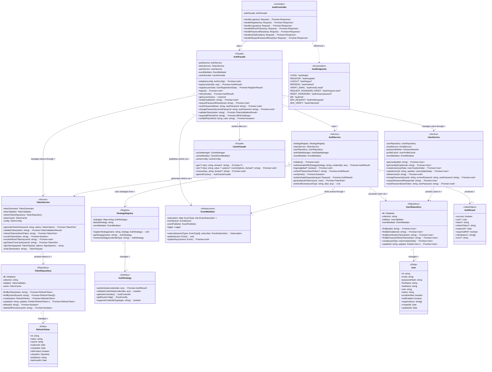

```mermaid
classDiagram
    %% Improved Auth Facade Class Diagram with Documentation
    %% This diagram shows the Authentication Facade pattern implementation
    %% with clearer relationships and stereotypes
    
    class AuthFacade {
        <<Facade>>
        -authService: AuthService
        -tokenService: TokenService
        -userService: UserService
        -eventMediator: EventMediator
        -cacheFacade: CacheFacade
        +initialize(config: AuthConfig): Promise~void~
        +login(credentials: any): Promise~AuthResult~
        +register(userData: UserRegistrationData): Promise~RegisterResult~
        +logout(): Promise~void~
        +refreshAuth(): Promise~AuthResult~
        +getCurrentUser(): User|null
        +verifyEmail(token: string): Promise~void~
        +requestPasswordReset(email: string): Promise~void~
        +resetPassword(token: string, newPassword: string): Promise~void~
        +changePassword(currentPassword: string, newPassword: string): Promise~void~
        +validateToken(token: string): Promise~TokenValidationResult~
        +requestMFA(method: string): Promise~MFAChallenge~
        +verifyMFA(method: string, code: string): Promise~boolean~
    }
    
    class AuthService {
        <<Service>>
        -strategyRegistry: StrategyRegistry
        -tokenService: TokenService
        -userRepository: UserRepository
        -authStateManager: AuthStateManager
        -eventMediator: EventMediator
        +initialize(): Promise~void~
        +authenticateWithStrategy(strategy: string, credentials: any): Promise~AuthResult~
        +logout(global?: boolean): Promise~void~
        +refreshToken(refreshToken?: string): Promise~AuthResult~
        +verifyAuth(): Promise~boolean~
        +authenticateRequest(request: Request): Promise~AuthResult~
        -generateAuthTokens(user: User): Promise~TokenPair~
        -emitAuthEvent(eventType: string, data: any): void
    }
    
    class TokenService {
        <<Service>>
        -tokenGenerator: TokenGenerator
        -tokenValidator: TokenValidator
        -refreshTokenRepository: TokenRepository
        -tokenCache: TokenCache
        -config: TokenConfig
        +generateTokenPair(userId: string, claims: TokenClaims): Promise~TokenPair~
        +validateToken(token: string): Promise~TokenValidationResult~
        +refreshToken(refreshToken: string): Promise~TokenPair~
        +revokeToken(token: string): Promise~boolean~
        +revokeAllUserTokens(userId: string): Promise~void~
        +getTokenFromCache(userId: string): Promise~TokenInfo~
        -signToken(payload: TokenPayload, options: SignOptions): string
        -verifyToken(token: string): TokenPayload
    }
    
    class UserService {
        <<Service>>
        -userRepository: UserRepository
        -emailService: EmailService
        -passwordHasher: PasswordHasher
        -profileCache: UserProfileCache
        -eventMediator: EventMediator
        +getUserById(id: string): Promise~User~
        +getUserByEmail(email: string): Promise~User~
        +createUser(userData: UserCreationData): Promise~User~
        +updateUser(id: string, updates: UserUpdateData): Promise~User~
        +deleteUser(id: string): Promise~void~
        +changePassword(userId: string, currentPassword: string, newPassword: string): Promise~void~
        +requestPasswordReset(email: string): Promise~void~
        +resetPassword(resetToken: string, newPassword: string): Promise~void~
    }
    
    class AuthController {
        <<Controller>>
        -authFacade: AuthFacade
        +handleLogin(req: Request): Promise~Response~
        +handleRegister(req: Request): Promise~Response~
        +handleLogout(req: Request): Promise~Response~
        +handleRefreshToken(req: Request): Promise~Response~
        +handlePasswordReset(req: Request): Promise~Response~
        +handleVerifyEmail(req: Request): Promise~Response~
        +handleRequestPasswordReset(req: Request): Promise~Response~
    }
    
    class TokenRepository {
        <<Repository>>
        -db: Database
        -collection: string
        -validator: TokenValidator
        -cache: TokenCache
        +findByToken(token: string): Promise~RefreshToken~
        +findByUserId(userId: string): Promise~RefreshToken[]~
        +create(token: RefreshToken): Promise~RefreshToken~
        +update(id: string, updates: Partial~RefreshToken~): Promise~RefreshToken~
        +delete(id: string): Promise~boolean~
        +deleteAllForUser(userId: string): Promise~boolean~
    }
    
    class UserRepository {
        <<Repository>>
        -db: Database
        -collection: string
        -validator: UserValidator
        -eventMediator: EventMediator
        +findById(id: string): Promise~User~
        +findByEmail(email: string): Promise~User~
        +findByVerificationToken(token: string): Promise~User~
        +findByPasswordResetToken(token: string): Promise~User~
        +create(userData: UserCreationData): Promise~User~
        +update(id: string, updates: Partial~User~): Promise~User~
    }
    
    class CacheFacade {
        <<Facade>>
        -cacheManager: CacheManager
        -cacheMediator: CacheEventMediator
        -cacheConfig: CacheConfig
        +get~T~(key: string, domain?: string): Promise~T~
        +set~T~(key: string, value: T, options?: CacheOptions, domain?: string): Promise~void~
        +remove(key: string, domain?: string): Promise~void~
        +getAuthCache(): AuthCacheFacade
    }
    
    class EventMediator {
        <<Infrastructure>>
        -subscribers: Map~EventType, Set~EventSubscriber~~
        -eventQueue: EventQueue
        -eventPublisher: EventPublisher
        -logger: Logger
        +subscribe(eventTypes: EventType[], subscriber: EventSubscriber): Subscription
        +publish(event: Event): void
        +publishAsync(event: Event): Promise~void~
    }
    
    class AuthStrategy {
        <<Interface>>
        +authenticate(credentials: any): Promise~AuthResult~
        +validateCredentials(credentials: any): boolean
        +getAuthController(): AuthController
        +getRouteConfig(): RouteConfig
        +supportsCredentialType(type: string): boolean
    }
    
    class StrategyRegistry {
        <<Registry>>
        -strategies: Map~string, AuthStrategy~
        -defaultStrategy: string
        -eventMediator: EventMediator
        +registerStrategy(name: string, strategy: AuthStrategy): void
        +getStrategy(name: string): AuthStrategy
        +resolveStrategy(credentialType: string): AuthStrategy
    }
    
    class User {
        <<Entity>>
        +id: string
        +email: string
        +passwordHash: string
        +firstName: string
        +lastName: string
        +role: string
        +status: string
        +emailVerified: boolean
        +mfaEnabled: boolean
        +organizations: string[]
        +createdAt: Date
        +updatedAt: Date
    }
    
    class RefreshToken {
        <<Entity>>
        +id: string
        +token: string
        +userId: string
        +expiresAt: Date
        +createdAt: Date
        +isRevoked: boolean
        +clientInfo: ClientInfo
        +ipAddress: string
        +lastUsedAt: Date
    }
    
    class AuthResult {
        <<ValueObject>>
        +success: boolean
        +user?: User
        +token?: string
        +refreshToken?: string
        +expiresAt?: Date
        +requiresMFA?: boolean
        +mfaOptions?: string[]
        +error?: string
    }
    
    class AuthEndpoints {
        <<Enumeration>>
        LOGIN: "/auth/login"
        REGISTER: "/auth/register"
        LOGOUT: "/auth/logout" 
        REFRESH: "/auth/refresh"
        VERIFY_EMAIL: "/auth/verify-email"
        REQUEST_PASSWORD_RESET: "/auth/request-reset"
        RESET_PASSWORD: "/auth/reset-password"
        ME: "/auth/me"
        MFA_REQUEST: "/auth/mfa/request"
        MFA_VERIFY: "/auth/mfa/verify"
    }
    
    %% Relationships with cardinality and better descriptions
    AuthFacade "1" --> "1" AuthService : uses >
    AuthFacade "1" --> "1" TokenService : manages tokens through >
    AuthFacade "1" --> "1" UserService : manages users through >
    AuthFacade "1" --> "1" EventMediator : publishes events via >
    AuthFacade "1" --> "1" CacheFacade : caches data via >
    
    AuthService "1" --> "1" StrategyRegistry : uses strategies from >
    AuthService "1" --> "1" TokenService : generates tokens via >
    AuthService "1" --> "1" UserRepository : accesses users via >
    AuthService "1" --> "1" EventMediator : emits events through >
    
    TokenService "1" --> "1" TokenRepository : persists tokens in >
    UserService "1" --> "1" UserRepository : persists users in >
    
    AuthController "1" --> "1" AuthFacade : uses >
    AuthController "1" ..> AuthEndpoints : references >
    
    StrategyRegistry "1" --> "0..*" AuthStrategy : manages >
    
    TokenRepository "1" --> "0..*" RefreshToken : manages >
    UserRepository "1" --> "0..*" User : manages >
    
    AuthService "1" --> "0..1" AuthResult : produces >
```
