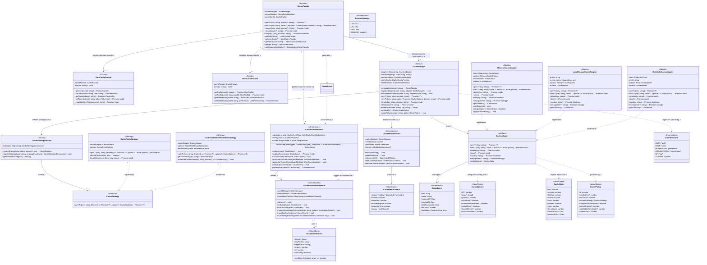

```mermaid
classDiagram
    %% Improved Cache System Class Diagram
    %% Combines Cache Facade and Storage mechanisms in a single comprehensive view
    
    %% Facade Layer
    class CacheFacade {
        <<Facade>>
        -cacheManager: CacheManager
        -cacheMediator: CacheEventMediator
        -cacheConfig: CacheConfig
        +get~T~(key: string, domain?: string): Promise~T~
        +set~T~(key: string, value: T, options?: CacheOptions, domain?: string): Promise~void~
        +remove(key: string, domain?: string): Promise~void~
        +clear(domain?: string): Promise~void~
        +has(key: string, domain?: string): Promise~boolean~
        +getAuthCache(): AuthCacheFacade
        +getUserCache(): UserCacheFacade
        +getPermissionCache(): PermissionCacheFacade
        +getApiCache(): ApiCacheFacade
        +getOrganizationCache(): OrganizationCacheFacade
    }
    
    %% Domain-Specific Cache Facades
    class AuthCacheFacade {
        <<Facade>>
        -cacheFacade: CacheFacade
        -domain: string = "auth"
        +getUser(userId: string): Promise~User~
        +setUser(userId: string, user: User): Promise~void~
        +getToken(tokenId: string): Promise~TokenInfo~
        +setToken(tokenId: string, token: TokenInfo): Promise~void~
        +invalidateUserTokens(userId: string): Promise~void~
    }
    
    class UserCacheFacade {
        <<Facade>>
        -cacheFacade: CacheFacade
        -domain: string = "user"
        +getProfile(userId: string): Promise~UserProfile~
        +setProfile(userId: string, profile: UserProfile): Promise~void~
        +getPreferences(userId: string): Promise~UserPreferences~
        +setPreferences(userId: string, preferences: UserPreferences): Promise~void~
    }
    
    %% Core Cache Management
    class CacheManager {
        <<Service>>
        -adapters: Map~string, CacheAdapter~
        -domainMappings: Map~string, string~
        -cacheMediator: CacheEventMediator
        -cacheConfig: CacheConfigProvider
        -healthMonitor: CacheHealthMonitor
        +getAdapter(domain: string): CacheAdapter
        +registerAdapter(name: string, adapter: CacheAdapter): void
        +setDomainAdapter(domain: string, adapterName: string): void
        +get~T~(key: string, domain: string): Promise~T~
        +set~T~(key: string, value: T, options: CacheOptions, domain: string): Promise~void~
        +delete(key: string, domain: string): Promise~void~
        +clear(domain?: string): Promise~void~
        +buildKey(domain: string, key: string): string
        +getHealth(): CacheHealthStatus
        +applyPolicy(domain: string, policy: CachePolicy): void
    }
    
    %% Cache Event Management
    class CacheEventMediator {
        <<Infrastructure>>
        -subscribers: Map~CacheEventType, Set~CacheEventSubscriber~~
        -eventQueue: CacheEventQueue
        -cacheConfigProvider: CacheConfigProvider
        +subscribe(eventTypes: CacheEventType[], subscriber: CacheEventSubscriber): Subscription
        +publish(event: CacheEvent): void
        +publishAsync(event: CacheEvent): Promise~void~
        +unsubscribe(subscription: Subscription): void
        +subscribeToAuthEvents(authMediator: AuthEventMediator): void
        +subscribeToUserEvents(userMediator: UserEventMediator): void
        -notifySubscribers(event: CacheEvent): void
        -processEvent(event: CacheEvent): Promise~void~
    }
    
    %% Cache Adapter Interface
    class CacheAdapter {
        <<Interface>>
        +get~T~(key: string): Promise~T~
        +set~T~(key: string, value: T, options?: CacheOptions): Promise~void~
        +delete(key: string): Promise~void~
        +clear(): Promise~void~
        +has(key: string): Promise~boolean~
        +keys(pattern?: string): Promise~string[]~
        +getStatistics(): CacheStats
    }
    
    %% Concrete Cache Adapters
    class MemoryCacheAdapter {
        <<Adapter>>
        -store: Map~string, CacheEntry~
        -options: MemoryCacheOptions
        -eventEmitter: EventEmitter
        -metrics: CacheMetrics
        +get~T~(key: string): Promise~T~
        +set~T~(key: string, value: T, options?: CacheOptions): Promise~void~
        +delete(key: string): Promise~void~
        +clear(): Promise~void~
        +has(key: string): Promise~boolean~
        +keys(pattern?: string): Promise~string[]~
        +getStatistics(): CacheStats
        -evictExpired(): void
        -isExpired(entry: CacheEntry): boolean
        -applyEvictionPolicy(): void
    }
    
    class LocalStorageCacheAdapter {
        <<Adapter>>
        -prefix: string
        -memoryMirror: Map~string, any~
        -options: StorageCacheOptions
        -metrics: CacheMetrics
        +get~T~(key: string): Promise~T~
        +set~T~(key: string, value: T, options?: CacheOptions): Promise~void~
        +delete(key: string): Promise~void~
        +clear(): Promise~void~
        +has(key: string): Promise~boolean~
        +keys(pattern?: string): Promise~string[]~
        +getStatistics(): CacheStats
    }
    
    class RedisLikeCacheAdapter {
        <<Adapter>>
        -client: RedisLikeClient
        -prefix: string
        -options: RedisCacheOptions
        -metrics: CacheMetrics
        +get~T~(key: string): Promise~T~
        +set~T~(key: string, value: T, options?: CacheOptions): Promise~void~
        +delete(key: string): Promise~void~
        +clear(): Promise~void~
        +has(key: string): Promise~boolean~
        +keys(pattern?: string): Promise~string[]~
        +getStatistics(): CacheStats
    }
    
    %% Cache Strategy Management
    class CacheStrategyFactory {
        <<Factory>>
        -strategies: Map~string, CacheStrategyConstructor~
        +createStrategy(type: string, options?: any): CacheStrategy
        +registerStrategy(type: string, strategyConstructor: CacheStrategyConstructor): void
        +getAvailableStrategies(): string[]
    }
    
    class CacheStrategy {
        <<Interface>>
        +get~T~(key: string, fetcher: () => Promise~T~, options?: CacheOptions): Promise~T~
    }
    
    class CacheFetchStrategy {
        <<Strategy>>
        -cacheAdapter: CacheAdapter
        -options: CacheFetchOptions
        +get~T~(key: string, fetcher: () => Promise~T~, options?: CacheOptions): Promise~T~
        -shouldCache(value: any): boolean
        -handleError(error: Error, key: string): Promise~void~
    }
    
    class CacheStaleWhileRevalidateStrategy {
        <<Strategy>>
        -cacheAdapter: CacheAdapter
        -options: StaleWhileRevalidateOptions
        -revalidationQueue: RevalidationQueue
        +get~T~(key: string, fetcher: () => Promise~T~, options?: CacheOptions): Promise~T~
        -getStaleValue(key: string): Promise~any~
        -scheduleRevalidation(key: string, fetcher: () => Promise~any~): void
    }
    
    %% Cache Invalidation
    class CacheInvalidationHandler {
        <<EventHandler>>
        -cacheManager: CacheManager
        -eventMediator: CacheEventMediator
        -invalidationPatterns: Map~string, InvalidationPattern[]~
        +initialize(): void
        +onEvent(event: CacheEvent): void
        +onAuthEvent(event: AuthEvent): void
        +registerInvalidationPattern(domain: string, pattern: InvalidationPattern): void
        -invalidateCaches(event: CacheEvent): void
        -invalidateByPattern(pattern: InvalidationPattern, metadata: any): void
    }
    
    class InvalidationPattern {
        <<ValueObject>>
        +domain: string
        +keyPattern: string
        +dependsOn: string[]
        +condition: (metadata: any) => boolean
        +priority: number
        +ttl: number
        +cascading: boolean
    }
    
    %% Cache Health Monitoring
    class CacheHealthMonitor {
        <<Infrastructure>>
        -cacheManager: CacheManager
        -checkInterval: number
        -thresholds: HealthThresholds
        -listeners: HealthStatusListener[]
        +startMonitoring(): void
        +stopMonitoring(): void
        +checkHealth(): CacheHealthStatus
        +addListener(listener: HealthStatusListener): void
        +removeListener(listener: HealthStatusListener): void
    }
    
    class CacheHealthStatus {
        <<ValueObject>>
        +status: 'healthy' | 'degraded' | 'unhealthy'
        +hitRate: number
        +errorRate: number
        +availableSpace: number
        +responseTime: number
        +issues: HealthIssue[]
    }
    
    %% Domain Models
    class CacheEntry {
        <<ValueObject>>
        +key: string
        +value: string
        +expiresAt?: Date
        +createdAt: Date
        +lastAccessedAt: Date
        +hitCount: number
        +metadata: Record~string, any~
    }
    
    class CacheOptions {
        <<ValueObject>>
        +ttl?: number
        +tags?: string[]
        +priority?: number
        +compress?: boolean
        +staleWhileRevalidate?: boolean
        +staleIfError?: boolean
        +forceRefresh?: boolean
        +waitForRefresh?: boolean
    }
    
    class CacheStats {
        <<ValueObject>>
        +hits: number
        +misses: number
        +hitRate: number
        +errors: number
        +sets: number
        +deletes: number
        +size: number
        +itemCount: number
        +oldestEntry?: Date
        +newestEntry?: Date
    }
    
    class CachePolicy {
        <<ValueObject>>
        +ttl: number
        +maxEntries?: number
        +maxSize?: number
        +evictionStrategy: EvictionStrategy
        +compressionThreshold?: number
        +refreshInterval?: number
        +staleWhileRevalidate?: number
        +staleIfError?: number
    }
    
    class CacheDomains {
        <<Enumeration>>
        AUTH: "auth"
        USER: "user"
        PERMISSION: "permission"
        ORGANIZATION: "organization"
        API: "api"
        SYSTEM: "system"
    }
    
    class EvictionStrategy {
        <<Enumeration>>
        LRU: "lru"
        LFU: "lfu"
        FIFO: "fifo"
        RANDOM: "random"
    }
    
    %% Relationships with better descriptions and cardinality
    CacheFacade "1" --> "1" CacheManager : delegates cache operations to >
    CacheFacade "1" --> "1" CacheEventMediator : publishes cache events via >
    CacheFacade "1" --> "1..*" AuthCacheFacade : provides domain-specific >
    CacheFacade "1" --> "1..*" UserCacheFacade : provides domain-specific >
    
    CacheManager "1" --> "1..*" CacheAdapter : uses >
    CacheManager "1" --> "1" CacheStrategyFactory : creates strategies via >
    CacheManager "1" --> "1" CacheHealthMonitor : monitors health via >
    
    MemoryCacheAdapter "1" ..|> CacheAdapter : implements
    LocalStorageCacheAdapter "1" ..|> CacheAdapter : implements
    RedisLikeCacheAdapter "1" ..|> CacheAdapter : implements
    
    CacheStrategyFactory "1" --> "0..*" CacheStrategy : creates >
    
    CacheFetchStrategy "1" ..|> CacheStrategy : implements
    CacheStaleWhileRevalidateStrategy "1" ..|> CacheStrategy : implements
    
    CacheAdapter "1" --> "0..*" CacheEntry : manages >
    
    CacheEventMediator "1" --> "0..*" CacheInvalidationHandler : notifies >
    CacheInvalidationHandler "1" --> "0..*" InvalidationPattern : uses >
    
    CacheHealthMonitor "1" --> "1" CacheHealthStatus : produces >
    
    %% Usage Patterns
    CacheManager ..> CacheDomains : organizes caches by >
    CacheAdapter ..> CacheOptions : configures caching with >
    CacheAdapter ..> CachePolicy : governed by >
    CacheAdapter ..> CacheStats : reports metrics via >
    
    %% Event Flows
    CacheFacade ..> CacheEvent : generates >
    CacheEvent ..> CacheEventMediator : processed by >
    CacheEventMediator ..> CacheInvalidationHandler : triggers invalidation via >
```
