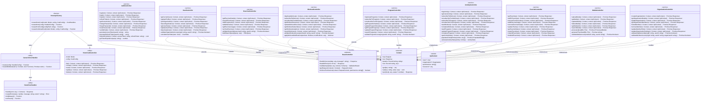

```mermaid
classDiagram
    %% Controller Layer Architecture
    
    class BaseController {
        <<abstract>>
        #handleSuccess(data: any, message?: string): Response
        #handleError(error: Error): Response
        #validateInput(data: any, schema: Schema): ValidationResult
        #getRequestContext(c: Context): RequestContext
        #enforcePermissions(context: RequestContext, permissions: string[]): boolean
    }
    
    class AuthController {
        <<service>>
        +register(c: Context, context: ApiContext): Promise~Response~
        +login(c: Context, context: ApiContext): Promise~Response~
        +logout(c: Context, context: ApiContext): Promise~Response~
        +refreshToken(c: Context, context: ApiContext): Promise~Response~
        +getCurrentUser(c: Context, context: ApiContext): Promise~Response~
        +changePassword(c: Context, context: ApiContext): Promise~Response~
        +forgotPassword(c: Context, context: ApiContext): Promise~Response~
        +resetPassword(c: Context, context: ApiContext): Promise~Response~
        +verifyEmail(c: Context, context: ApiContext): Promise~Response~
        -generateAccessToken(userId: string): string
        -generateRefreshToken(userId: string): string
        -setAuthCookies(c: Context, accessToken: string, refreshToken: string): void
        -getTokenExpiration(expiry: string): number
    }
    
    class UserController {
        <<service>>
        +getCurrentUser(c: Context, context: ApiContext): Promise~Response~
        +updateProfile(c: Context, context: ApiContext): Promise~Response~
        +joinOrganization(c: Context, context: ApiContext): Promise~Response~
        +leaveOrganization(c: Context, context: ApiContext): Promise~Response~
        +getUserStats(c: Context, context: ApiContext): Promise~Response~
        +updateUserRole(c: Context, context: ApiContext): Promise~Response~
        +deactivateUser(c: Context, context: ApiContext): Promise~Response~
        -validateOrganizationAccess(orgId: string, userId: string): Promise~boolean~
        -calculateUserStats(user: User): UserStats
    }
    
    class ExerciseController {
        <<service>>
        +getExerciseDetails(c: Context, context: ApiContext): Promise~Response~
        +searchExercises(c: Context, context: ApiContext): Promise~Response~
        +addProgression(c: Context, context: ApiContext): Promise~Response~
        +addAlternative(c: Context, context: ApiContext): Promise~Response~
        +getExerciseUsage(c: Context, context: ApiContext): Promise~Response~
        +archiveExercise(c: Context, context: ApiContext): Promise~Response~
        -validateOwnership(exerciseId: string, userId: string): Promise~boolean~
        -buildSearchQuery(query: any): FilterQuery
    }
    
    class WorkoutController {
        <<service>>
        +duplicateWorkout(c: Context, context: ApiContext): Promise~Response~
        +subscribeToWorkout(c: Context, context: ApiContext): Promise~Response~
        +unsubscribeFromWorkout(c: Context, context: ApiContext): Promise~Response~
        +getWorkoutStructure(c: Context, context: ApiContext): Promise~Response~
        +updateWorkoutStructure(c: Context, context: ApiContext): Promise~Response~
        +getWorkoutSubscribers(c: Context, context: ApiContext): Promise~Response~
        +getWorkoutAnalytics(c: Context, context: ApiContext): Promise~Response~
        +searchWorkouts(c: Context, context: ApiContext): Promise~Response~
        -validateWorkoutAccess(workoutId: string, userId: string): Promise~boolean~
        -applyWorkoutModifications(workout: Workout, modifications: any): Workout
    }
    
    class ProgramController {
        <<service>>
        +duplicateProgram(c: Context, context: ApiContext): Promise~Response~
        +subscribeToProgram(c: Context, context: ApiContext): Promise~Response~
        +unsubscribeFromProgram(c: Context, context: ApiContext): Promise~Response~
        +getProgramSchedule(c: Context, context: ApiContext): Promise~Response~
        +updateProgramSchedule(c: Context, context: ApiContext): Promise~Response~
        +getProgramProgress(c: Context, context: ApiContext): Promise~Response~
        +updateProgramProgress(c: Context, context: ApiContext): Promise~Response~
        +searchPrograms(c: Context, context: ApiContext): Promise~Response~
        -validateProgramAccess(programId: string, userId: string): Promise~boolean~
    }
    
    class ActivityController {
        <<service>>
        +logActivity(c: Context, context: ApiContext): Promise~Response~
        +getUserActivity(c: Context, context: ApiContext): Promise~Response~
        +subscribeToWorkout(c: Context, context: ApiContext): Promise~Response~
        +unsubscribeFromWorkout(c: Context, context: ApiContext): Promise~Response~
        +subscribeToProgram(c: Context, context: ApiContext): Promise~Response~
        +unsubscribeFromProgram(c: Context, context: ApiContext): Promise~Response~
        +startWorkout(c: Context, context: ApiContext): Promise~Response~
        +completeWorkout(c: Context, context: ApiContext): Promise~Response~
        +startProgram(c: Context, context: ApiContext): Promise~Response~
        +updateProgramProgress(c: Context, context: ApiContext): Promise~Response~
        +completeProgram(c: Context, context: ApiContext): Promise~Response~
        +getActivityStats(c: Context, context: ApiContext): Promise~Response~
        -populateActivityEntries(entries: any[]): Promise~PopulatedEntry[]~
        -calculateActivityStats(activity: Activity): ActivityStats
    }
    
    class FavoriteController {
        <<service>>
        +getFavorites(c: Context, context: ApiContext): Promise~Response~
        +addToFavorites(c: Context, context: ApiContext): Promise~Response~
        +removeFromFavorites(c: Context, context: ApiContext): Promise~Response~
        +addExerciseSwap(c: Context, context: ApiContext): Promise~Response~
        +removeExerciseSwap(c: Context, context: ApiContext): Promise~Response~
        +updateTheme(c: Context, context: ApiContext): Promise~Response~
        +getFavoriteStats(c: Context, context: ApiContext): Promise~Response~
        +exportFavorites(c: Context, context: ApiContext): Promise~Response~
        +clearAllFavorites(c: Context, context: ApiContext): Promise~Response~
        +bulkAddFavorites(c: Context, context: ApiContext): Promise~Response~
    }
    
    class MediaController {
        <<service>>
        +uploadMedia(c: Context, context: ApiContext): Promise~Response~
        +getMedia(c: Context, context: ApiContext): Promise~Response~
        +updateMedia(c: Context, context: ApiContext): Promise~Response~
        +deleteMedia(c: Context, context: ApiContext): Promise~Response~
        +getMediaUrl(c: Context, context: ApiContext): Promise~Response~
        +searchMedia(c: Context, context: ApiContext): Promise~Response~
        -processUpload(file: File): Promise~ProcessedMedia~
        -generateThumbnail(file: File): Promise~string~
        -validateMediaAccess(mediaId: string, userId: string): Promise~boolean~
    }
    
    class OrganizationController {
        <<service>>
        +createOrganization(c: Context, context: ApiContext): Promise~Response~
        +getOrganizationDetails(c: Context, context: ApiContext): Promise~Response~
        +updateOrganization(c: Context, context: ApiContext): Promise~Response~
        +getOrganizationMembers(c: Context, context: ApiContext): Promise~Response~
        +inviteMember(c: Context, context: ApiContext): Promise~Response~
        +removeMember(c: Context, context: ApiContext): Promise~Response~
        +updateMemberRole(c: Context, context: ApiContext): Promise~Response~
        +updateOrganizationSettings(c: Context, context: ApiContext): Promise~Response~
        -validateOrgOwnership(orgId: string, userId: string): Promise~boolean~
        -validateMemberAccess(orgId: string, userId: string, targetUserId: string): Promise~boolean~
    }
    
    class HonoCrudController {
        <<utility>>
        -model: Model
        -config: CrudConfig
        +list(c: Context, context: ApiContext): Promise~Response~
        +create(c: Context, context: ApiContext): Promise~Response~
        +read(c: Context, context: ApiContext): Promise~Response~
        +update(c: Context, context: ApiContext): Promise~Response~
        +delete(c: Context, context: ApiContext): Promise~Response~
    }
    
    class GenericHonoHandler {
        <<utility>>
        +create(config: HandlerConfig): Function
        +createMiddleware(fn: (c: Context, next: Function): Promise~void~): Function
    }
    
    class HonoApiFactory {
        <<factory>>
        +createHonoCrud(model: Model, config: CrudConfig): CrudHandlers
        +createHono(config: HandlerConfig): Function
        +createFromConfig(configPath: string): Function
        +createCombinedCrud(model: Model, config: CrudConfig): Function
    }
    
    %% Controller Dependencies
    class Context {
        <<external>>
        +req: Request
        +res: Response
        +params: Record~string, string~
        +env: Record~string, any~
        +get(key: string): any
        +set(key: string, value: any): void
        +json(body: any, status?: number): Response
    }
    
    class ApiContext {
        <<model>>
        +user?: User
        +organization?: Organization
        +permissions: string[]
        +resource?: any
    }
    
    class HonoErrorHandler {
        <<utility>>
        +handle(error: any, c: Context): Response
        +createError(status: number, message: string, name?: string): Error
        +middleware(): Function
        +notFound(): Function
    }
    
    %% Controller Relationships
    AuthController --|> BaseController : extends
    UserController --|> BaseController : extends
    ExerciseController --|> BaseController : extends
    WorkoutController --|> BaseController : extends
    ProgramController --|> BaseController : extends
    ActivityController --|> BaseController : extends
    FavoriteController --|> BaseController : extends
    MediaController --|> BaseController : extends
    OrganizationController --|> BaseController : extends
    
    GenericHonoHandler --> HonoErrorHandler : uses
    HonoApiFactory --> GenericHonoHandler : uses
    HonoApiFactory --> HonoCrudController : creates
    
    AuthController --> Context : handles
    UserController --> Context : handles
    ExerciseController --> Context : handles
    WorkoutController --> Context : handles
    ProgramController --> Context : handles
    ActivityController --> Context : handles
    FavoriteController --> Context : handles
    MediaController --> Context : handles
    OrganizationController --> Context : handles
    
    AuthController .. ApiContext : creates/uses
    UserController .. ApiContext : creates/uses
    ExerciseController .. ApiContext : creates/uses
    WorkoutController .. ApiContext : creates/uses
    ProgramController .. ApiContext : creates/uses
    ActivityController .. ApiContext : creates/uses
    FavoriteController .. ApiContext : creates/uses
    MediaController .. ApiContext : creates/uses
    OrganizationController .. ApiContext : creates/uses
```
