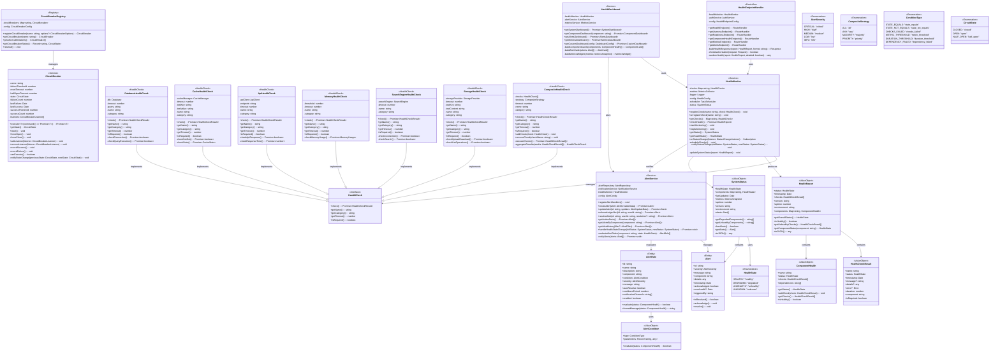

```mermaid
classDiagram
    %% Health Monitoring System
    
    class HealthMonitor {
        <<Service>>
        -checks: Map~string, HealthCheck~
        -metrics: MetricsCollector
        -logger: Logger
        -config: HealthConfig
        -scheduler: TaskScheduler
        -status: SystemStatus
        +registerCheck(name: string, check: HealthCheck): void
        +unregisterCheck(name: string): void
        +getChecks(): Map~string, HealthCheck~
        +checkHealth(): Promise~HealthReport~
        +startMonitoring(): void
        +stopMonitoring(): void
        +getStatus(): SystemStatus
        +getHealthState(): HealthState
        +onStatusChange(listener: StatusChangeListener): Subscription
        -scheduleChecks(): void
        -notifyStatusChange(oldStatus: SystemStatus, newStatus: SystemStatus): void
        -updateSystemStatus(report: HealthReport): void
    }
    
    class HealthCheck {
        <<Interface>>
        +check(): Promise~HealthCheckResult~
        +getName(): string
        +getCategory(): string
        +getTimeout(): number
        +isRequired(): boolean
    }
    
    class DatabaseHealthCheck {
        <<HealthCheck>>
        -db: Database
        -timeout: number
        -query: string
        -name: string
        -category: string
        +check(): Promise~HealthCheckResult~
        +getName(): string
        +getCategory(): string
        +getTimeout(): number
        +isRequired(): boolean
        -checkConnection(): Promise~boolean~
        -checkQueryExecution(): Promise~boolean~
    }
    
    class CacheHealthCheck {
        <<HealthCheck>>
        -cacheManager: CacheManager
        -timeout: number
        -testKey: string
        -testValue: string
        -name: string
        -category: string
        +check(): Promise~HealthCheckResult~
        +getName(): string
        +getCategory(): string
        +getTimeout(): number
        +isRequired(): boolean
        -checkSetGet(): Promise~boolean~
        -checkStats(): Promise~CacheStats~
    }
    
    class ApiHealthCheck {
        <<HealthCheck>>
        -apiClient: ApiClient
        -endpoint: string
        -timeout: number
        -name: string
        -category: string
        +check(): Promise~HealthCheckResult~
        +getName(): string
        +getCategory(): string
        +getTimeout(): number
        +isRequired(): boolean
        -checkApiResponse(): Promise~boolean~
        -checkResponseTime(): Promise~number~
    }
    
    class MemoryHealthCheck {
        <<HealthCheck>>
        -threshold: number
        -timeout: number
        -name: string
        -category: string
        +check(): Promise~HealthCheckResult~
        +getName(): string
        +getCategory(): string
        +getTimeout(): number
        +isRequired(): boolean
        -checkMemoryUsage(): Promise~MemoryUsage~
    }
    
    class SearchEngineHealthCheck {
        <<HealthCheck>>
        -searchEngine: SearchEngine
        -timeout: number
        -name: string
        -category: string
        +check(): Promise~HealthCheckResult~
        +getName(): string
        +getCategory(): string
        +getTimeout(): number
        +isRequired(): boolean
        -checkConnection(): Promise~boolean~
        -checkSearch(): Promise~boolean~
    }
    
    class StorageHealthCheck {
        <<HealthCheck>>
        -storageProvider: StorageProvider
        -timeout: number
        -testKey: string
        -testContent: string
        -name: string
        -category: string
        +check(): Promise~HealthCheckResult~
        +getName(): string
        +getCategory(): string
        +getTimeout(): number
        +isRequired(): boolean
        -checkUploadDownload(): Promise~boolean~
        -checkListOperations(): Promise~boolean~
    }
    
    class CompositeHealthCheck {
        <<HealthCheck>>
        -checks: HealthCheck[]
        -strategy: CompositeStrategy
        -timeout: number
        -name: string
        -category: string
        +check(): Promise~HealthCheckResult~
        +getName(): string
        +getCategory(): string
        +getTimeout(): number
        +isRequired(): boolean
        +addCheck(check: HealthCheck): void
        +removeCheck(checkName: string): void
        -executeChecks(): Promise~HealthCheckResult[]~
        -aggregateResults(results: HealthCheckResult[]): HealthCheckResult
    }
    
    class HealthReport {
        <<ValueObject>>
        +status: HealthState
        +timestamp: Date
        +checks: HealthCheckResult[]
        +version: string
        +uptime: number
        +environment: string
        +components: Map~string, ComponentHealth~
        +getOverallStatus(): HealthState
        +isHealthy(): boolean
        +getUnhealthyChecks(): HealthCheckResult[]
        +getComponentStatus(component: string): HealthState
        +toJSON(): any
    }
    
    class HealthCheckResult {
        <<ValueObject>>
        +name: string
        +status: HealthState
        +timestamp: Date
        +message?: string
        +details?: any
        +error?: Error
        +duration: number
        +component: string
        +isRequired: boolean
    }
    
    class ComponentHealth {
        <<ValueObject>>
        +name: string
        +status: HealthState
        +checks: HealthCheckResult[]
        +dependencies: string[]
        +getStatus(): HealthState
        +addCheck(check: HealthCheckResult): void
        +getChecks(): HealthCheckResult[]
        +isHealthy(): boolean
    }
    
    class SystemStatus {
        <<ValueObject>>
        +healthState: HealthState
        +components: Map~string, HealthState~
        +lastUpdated: Date
        +metrics: MetricsSnapshot
        +uptime: number
        +version: string
        +environment: string
        +alerts: Alert[]
        +getDegradedComponents(): string[]
        +getUnhealthyComponents(): string[]
        +hasAlerts(): boolean
        +getAlerts(): Alert[]
        +toJSON(): any
    }
    
    class Alert {
        <<Entity>>
        +id: string
        +severity: AlertSeverity
        +message: string
        +component: string
        +details: any
        +timestamp: Date
        +acknowledged: boolean
        +resolvedAt?: Date
        +triggeredBy: string
        +isResolved(): boolean
        +acknowledge(): void
        +resolve(): void
    }
    
    class AlertService {
        <<Service>>
        -alertRepository: AlertRepository
        -notificationService: NotificationService
        -healthMonitor: HealthMonitor
        -config: AlertConfig
        +registerAlertHandlers(): void
        +createAlert(alert: AlertCreationData): Promise~Alert~
        +updateAlert(id: string, updates: AlertUpdateData): Promise~Alert~
        +acknowledgeAlert(id: string, userId: string): Promise~Alert~
        +resolveAlert(id: string, userId: string, resolution?: string): Promise~Alert~
        +getActiveAlerts(): Promise~Alert[]~
        +getAlertsByComponent(component: string): Promise~Alert[]~
        +getAlertHistory(filter?: AlertFilter): Promise~Alert[]~
        +handleHealthStateChange(oldStatus: SystemStatus, newStatus: SystemStatus): Promise~void~
        -evaluateAlertRules(component: string, state: HealthState): AlertRule[]
        -notifyAlerts(alerts: Alert[]): Promise~void~
    }
    
    class AlertRule {
        <<Entity>>
        +id: string
        +name: string
        +description: string
        +component: string
        +condition: AlertCondition
        +severity: AlertSeverity
        +message: string
        +autoResolve: boolean
        +cooldownPeriod: number
        +notificationChannels: string[]
        +enabled: boolean
        +evaluate(status: ComponentHealth): boolean
        +formatMessage(status: ComponentHealth): string
    }
    
    class AlertCondition {
        <<ValueObject>>
        +type: ConditionType
        +parameters: Record~string, any~
        +evaluate(status: ComponentHealth): boolean
    }
    
    class HealthEndpointHandler {
        <<Controller>>
        -healthMonitor: HealthMonitor
        -authService: AuthService
        -config: HealthEndpointConfig
        +getHealthEndpoint(): RouteHandler
        +getLivenessEndpoint(): RouteHandler
        +getReadinessEndpoint(): RouteHandler
        +getComponentHealthEndpoint(): RouteHandler
        +getMetricsEndpoint(): RouteHandler
        +getAlertsEndpoint(): RouteHandler
        -buildHealthResponse(report: HealthReport, format: string): Response
        -checkAuthorization(request: Request): boolean
        -sanitizeHealth(report: HealthReport, detailed: boolean): any
    }
    
    class HealthDashboard {
        <<Service>>
        -healthMonitor: HealthMonitor
        -alertService: AlertService
        -metricsService: MetricsService
        +getSystemDashboard(): Promise~SystemDashboard~
        +getComponentDashboard(component: string): Promise~ComponentDashboard~
        +getAlertsDashboard(): Promise~AlertsDashboard~
        +getMetricsDashboard(): Promise~MetricsDashboard~
        +getCustomDashboard(config: DashboardConfig): Promise~CustomDashboard~
        -buildComponentCards(components: ComponentHealth[]): ComponentCard[]
        -buildAlertCards(alerts: Alert[]): AlertCard[]
        -buildMetricsWidgets(metrics: MetricsSnapshot): MetricsWidget[]
    }
    
    class CircuitBreaker {
        <<Service>>
        -name: string
        -failureThreshold: number
        -resetTimeout: number
        -halfOpenTimeout: number
        -state: CircuitState
        -failureCount: number
        -lastFailure: Date
        -lastSuccess: Date
        -successThreshold: number
        -successCount: number
        -listeners: CircuitBreakerListener[]
        +execute~T~(command: () => Promise~T~): Promise~T~
        +getState(): CircuitState
        +reset(): void
        +forceOpen(): void
        +forceClose(): void
        +addListener(listener: CircuitBreakerListener): void
        +removeListener(listener: CircuitBreakerListener): void
        -recordSuccess(): void
        -recordFailure(): void
        -canExecute(): boolean
        -notifyStateChange(previousState: CircuitState, newState: CircuitState): void
    }
    
    class CircuitBreakerRegistry {
        <<Registry>>
        -circuitBreakers: Map~string, CircuitBreaker~
        -config: CircuitBreakerConfig
        +registerCircuitBreaker(name: string, options?: CircuitBreakerOptions): CircuitBreaker
        +getCircuitBreaker(name: string): CircuitBreaker
        +getAllCircuitBreakers(): CircuitBreaker[]
        +getCircuitBreakerStates(): Record~string, CircuitState~
        +resetAll(): void
    }
    
    %% Enumerations
    class HealthState {
        <<Enumeration>>
        HEALTHY: "healthy"
        DEGRADED: "degraded"
        UNHEALTHY: "unhealthy"
        UNKNOWN: "unknown"
    }
    
    class AlertSeverity {
        <<Enumeration>>
        CRITICAL: "critical"
        HIGH: "high"
        MEDIUM: "medium"
        LOW: "low"
        INFO: "info"
    }
    
    class CompositeStrategy {
        <<Enumeration>>
        ALL: "all"
        ANY: "any"
        MAJORITY: "majority"
        PRIORITY: "priority"
    }
    
    class ConditionType {
        <<Enumeration>>
        STATE_EQUALS: "state_equals"
        STATE_NOT_EQUALS: "state_not_equals"
        CHECKS_FAILED: "checks_failed"
        METRIC_THRESHOLD: "metric_threshold"
        DURATION_THRESHOLD: "duration_threshold"
        DEPENDENCY_FAILED: "dependency_failed"
    }
    
    class CircuitState {
        <<Enumeration>>
        CLOSED: "closed"
        OPEN: "open"
        HALF_OPEN: "half_open"
    }
    
    %% Relationships
    HealthMonitor --> HealthCheck : manages
    HealthMonitor --> HealthReport : produces
    HealthMonitor --> SystemStatus : maintains
    
    DatabaseHealthCheck --|> HealthCheck : implements
    CacheHealthCheck --|> HealthCheck : implements
    ApiHealthCheck --|> HealthCheck : implements
    MemoryHealthCheck --|> HealthCheck : implements
    SearchEngineHealthCheck --|> HealthCheck : implements
    StorageHealthCheck --|> HealthCheck : implements
    CompositeHealthCheck --|> HealthCheck : implements
    
    HealthMonitor --> AlertService : notifies
    AlertService --> Alert : manages
    AlertService --> AlertRule : evaluates
    
    HealthEndpointHandler --> HealthMonitor : uses
    
    HealthDashboard --> HealthMonitor : uses
    HealthDashboard --> AlertService : uses
    
    CircuitBreakerRegistry --> CircuitBreaker : manages
    
    HealthReport --> HealthCheckResult : contains
    HealthReport --> ComponentHealth : contains
    
    SystemStatus --> HealthState : uses
    SystemStatus --> Alert : contains
    
    AlertRule --> AlertCondition : uses
```
