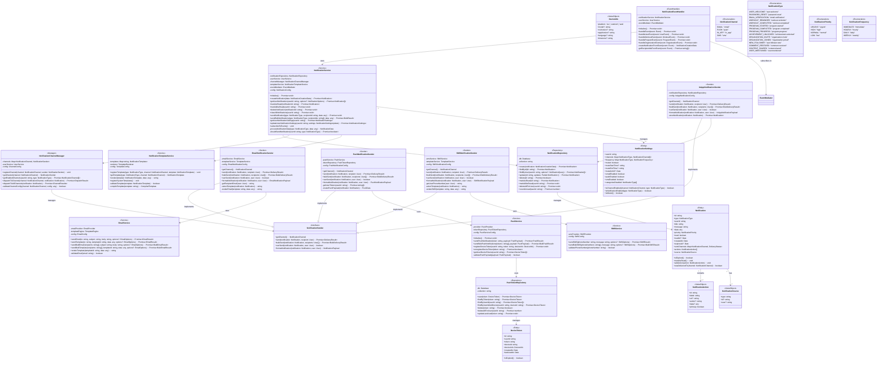

```mermaid
classDiagram
    %% Notification System Architecture
    
    class NotificationService {
        <<Service>>
        -notificationRepository: NotificationRepository
        -userService: UserService
        -channelManager: NotificationChannelManager
        -templateService: NotificationTemplateService
        -eventMediator: EventMediator
        -config: NotificationConfig
        +initialize(): Promise~void~
        +createNotification(data: NotificationCreationData): Promise~Notification~
        +getUserNotifications(userId: string, options?: NotificationOptions): Promise~Notification[]~
        +markAsRead(notificationId: string): Promise~Notification~
        +markAllAsRead(userId: string): Promise~void~
        +deleteNotification(notificationId: string): Promise~void~
        +clearAllNotifications(userId: string): Promise~void~
        +sendNotification(type: NotificationType, recipientId: string, data: any): Promise~void~
        +sendBulkNotifications(type: NotificationType, recipientIds: string[], data: any): Promise~BulkResult~
        +getUserNotificationSettings(userId: string): Promise~NotificationSettings~
        +updateUserNotificationSettings(userId: string, settings: NotificationSettingsUpdate): Promise~NotificationSettings~
        +subscribeToEvents(): void
        -processNotificationData(type: NotificationType, data: any): NotificationData
        -shouldSendNotification(userId: string, type: NotificationType): Promise~boolean~
    }
    
    class NotificationRepository {
        <<Repository>>
        -db: Database
        -collection: string
        +create(notification: NotificationCreationData): Promise~Notification~
        +findById(id: string): Promise~Notification~
        +findByUser(userId: string, options?: NotificationQuery): Promise~Notification[]~
        +update(id: string, updates: Partial~Notification~): Promise~Notification~
        +delete(id: string): Promise~boolean~
        +markAsRead(id: string): Promise~Notification~
        +markAllAsRead(userId: string): Promise~void~
        +deleteAllForUser(userId: string): Promise~void~
        +countUnread(userId: string): Promise~number~
    }
    
    class NotificationChannelManager {
        <<Manager>>
        -channels: Map~NotificationChannel, NotificationSender~
        -userService: UserService
        -config: ChannelConfig
        +registerChannel(channel: NotificationChannel, sender: NotificationSender): void
        +getChannel(channel: NotificationChannel): NotificationSender
        +getEnabledChannels(userId: string, type: NotificationType): Promise~NotificationChannel[]~
        +dispatchToChannel(channel: NotificationChannel, notification: Notification): Promise~DispatchResult~
        +dispatchToAllChannels(notification: Notification): Promise~ChannelResults~
        -validateChannelConfig(channel: NotificationChannel, config: any): boolean
    }
    
    class NotificationSender {
        <<Interface>>
        +getChannel(): NotificationChannel
        +send(notification: Notification, recipient: User): Promise~DeliveryResult~
        +bulkSend(notification: Notification, recipients: User[]): Promise~BulkDeliveryResult~
        +canSend(notification: Notification, user: User): boolean
        +formatNotification(notification: Notification, user: User): NotificationPayload
    }
    
    class EmailNotificationSender {
        <<Sender>>
        -emailService: EmailService
        -templateService: TemplateService
        -config: EmailNotificationConfig
        +getChannel(): NotificationChannel
        +send(notification: Notification, recipient: User): Promise~DeliveryResult~
        +bulkSend(notification: Notification, recipients: User[]): Promise~BulkDeliveryResult~
        +canSend(notification: Notification, user: User): boolean
        +formatNotification(notification: Notification, user: User): EmailNotificationPayload
        -getRecipientEmail(user: User): string
        -selectTemplate(notification: Notification): string
        -renderEmail(template: string, data: any): string
    }
    
    class PushNotificationSender {
        <<Sender>>
        -pushService: PushService
        -tokenRepository: PushTokenRepository
        -config: PushNotificationConfig
        +getChannel(): NotificationChannel
        +send(notification: Notification, recipient: User): Promise~DeliveryResult~
        +bulkSend(notification: Notification, recipients: User[]): Promise~BulkDeliveryResult~
        +canSend(notification: Notification, user: User): boolean
        +formatNotification(notification: Notification, user: User): PushNotificationPayload
        -getUserTokens(userId: string): Promise~string[]~
        -createPushPayload(notification: Notification): PushData
    }
    
    class InAppNotificationSender {
        <<Sender>>
        -notificationRepository: NotificationRepository
        -config: InAppNotificationConfig
        +getChannel(): NotificationChannel
        +send(notification: Notification, recipient: User): Promise~DeliveryResult~
        +bulkSend(notification: Notification, recipients: User[]): Promise~BulkDeliveryResult~
        +canSend(notification: Notification, user: User): boolean
        +formatNotification(notification: Notification, user: User): InAppNotificationPayload
        -storeNotification(notification: Notification): Promise~Notification~
    }
    
    class SMSNotificationSender {
        <<Sender>>
        -smsService: SMSService
        -templateService: TemplateService
        -config: SMSNotificationConfig
        +getChannel(): NotificationChannel
        +send(notification: Notification, recipient: User): Promise~DeliveryResult~
        +bulkSend(notification: Notification, recipients: User[]): Promise~BulkDeliveryResult~
        +canSend(notification: Notification, user: User): boolean
        +formatNotification(notification: Notification, user: User): SMSNotificationPayload
        -getUserPhoneNumber(user: User): string
        -selectTemplate(notification: Notification): string
        -renderSMS(template: string, data: any): string
    }
    
    class NotificationTemplateService {
        <<Service>>
        -templates: Map~string, NotificationTemplate~
        -renderer: TemplateRenderer
        -config: TemplateConfig
        +registerTemplate(type: NotificationType, channel: NotificationChannel, template: NotificationTemplate): void
        +getTemplate(type: NotificationType, channel: NotificationChannel): NotificationTemplate
        +render(template: NotificationTemplate, data: any): string
        +registerSystemTemplates(): void
        -validateTemplate(template: NotificationTemplate): boolean
        -compileTemplate(template: string): CompiledTemplate
    }
    
    class PushService {
        <<Service>>
        -provider: PushProvider
        -tokenRepository: PushTokenRepository
        -config: PushServiceConfig
        +initialize(): Promise~void~
        +sendPushNotification(token: string, payload: PushPayload): Promise~PushResult~
        +sendBulkPushNotifications(tokens: string[], payload: PushPayload): Promise~BulkPushResult~
        +registerDeviceToken(userId: string, token: string, deviceInfo: DeviceInfo): Promise~void~
        +unregisterDeviceToken(token: string): Promise~boolean~
        +getUserDeviceTokens(userId: string): Promise~DeviceToken[]~
        -validatePushPayload(payload: PushPayload): boolean
    }
    
    class EmailService {
        <<Service>>
        -emailProvider: EmailProvider
        -templateEngine: TemplateEngine
        -config: EmailConfig
        +sendEmail(to: string, subject: string, body: string, options?: EmailOptions): Promise~EmailResult~
        +sendTemplate(to: string, templateId: string, data: any, options?: EmailOptions): Promise~EmailResult~
        +sendBulkEmail(recipients: string[], subject: string, body: string, options?: EmailOptions): Promise~BulkEmailResult~
        +sendBulkTemplate(recipients: string[], templateId: string, data: any, options?: EmailOptions): Promise~BulkEmailResult~
        +renderTemplate(templateId: string, data: any): string
        -validateEmail(email: string): boolean
    }
    
    class SMSService {
        <<Service>>
        -smsProvider: SMSProvider
        -config: SMSConfig
        +sendSMS(phoneNumber: string, message: string, options?: SMSOptions): Promise~SMSResult~
        +sendBulkSMS(phoneNumbers: string[], message: string, options?: SMSOptions): Promise~BulkSMSResult~
        -validatePhoneNumber(phoneNumber: string): boolean
    }
    
    class Notification {
        <<Entity>>
        +id: string
        +type: NotificationType
        +userId: string
        +title: string
        +message: string
        +data: any
        +priority: NotificationPriority
        +read: boolean
        +readAt?: Date
        +createdAt: Date
        +expiresAt?: Date
        +sentChannels: Map~NotificationChannel, DeliveryStatus~
        +actions: NotificationAction[]
        +source: NotificationSource
        +isExpired(): boolean
        +markAsRead(): void
        +addAction(action: NotificationAction): void
        +wasDeliveredTo(channel: NotificationChannel): boolean
    }
    
    class NotificationAction {
        <<ValueObject>>
        +id: string
        +label: string
        +url?: string
        +action?: string
        +data?: any
        +primary: boolean
    }
    
    class NotificationSource {
        <<ValueObject>>
        +type: string
        +id?: string
        +user?: string
    }
    
    class NotificationSettings {
        <<Entity>>
        +userId: string
        +channels: Map~NotificationType, NotificationChannel[]~
        +frequency: Map~NotificationType, NotificationFrequency~
        +muted: boolean
        +muteStartTime?: string
        +muteEndTime?: string
        +mutedUntil?: Date
        +emailEnabled: boolean
        +pushEnabled: boolean
        +smsEnabled: boolean
        +categoriesDisabled: NotificationType[]
        +isChannelEnabled(channel: NotificationChannel, type: NotificationType): boolean
        +isNotificationEnabled(type: NotificationType): boolean
        +isMuted(): boolean
    }
    
    class PushTokenRepository {
        <<Repository>>
        -db: Database
        -collection: string
        +save(token: DeviceToken): Promise~DeviceToken~
        +findByToken(token: string): Promise~DeviceToken~
        +findByUserId(userId: string): Promise~DeviceToken[]~
        +findByUserIdAndDevice(userId: string, deviceId: string): Promise~DeviceToken~
        +delete(token: string): Promise~boolean~
        +deleteAllForUser(userId: string): Promise~number~
        +updateLastUsed(token: string): Promise~void~
    }
    
    class DeviceToken {
        <<Entity>>
        +id: string
        +userId: string
        +token: string
        +deviceId: string
        +deviceInfo: DeviceInfo
        +createdAt: Date
        +lastUsedAt: Date
        +isExpired(): boolean
    }
    
    class DeviceInfo {
        <<ValueObject>>
        +platform: 'ios' | 'android' | 'web'
        +model?: string
        +osVersion?: string
        +appVersion?: string
        +language?: string
        +timezone?: string
    }
    
    class NotificationEventHandler {
        <<EventHandler>>
        -notificationService: NotificationService
        -userService: UserService
        -eventMediator: EventMediator
        +initialize(): Promise~void~
        +handleEvent(event: Event): Promise~void~
        +handleUserEvent(event: UserEvent): Promise~void~
        +handleWorkoutEvent(event: WorkoutEvent): Promise~void~
        +handleProgramEvent(event: ProgramEvent): Promise~void~
        +handleOrganizationEvent(event: OrganizationEvent): Promise~void~
        -createNotificationFromEvent(event: Event): NotificationCreationData
        -getRecipientIdsFromEvent(event: Event): Promise~string[]~
    }
    
    %% Enums and Types
    class NotificationChannel {
        <<Enumeration>>
        EMAIL: "email"
        PUSH: "push"
        IN_APP: "in_app"
        SMS: "sms"
    }
    
    class NotificationType {
        <<Enumeration>>
        USER_WELCOME: "user.welcome"
        PASSWORD_RESET: "password.reset"
        EMAIL_VERIFICATION: "email.verification"
        WORKOUT_REMINDER: "workout.reminder"
        WORKOUT_COMPLETED: "workout.completed"
        PROGRAM_STARTED: "program.started"
        PROGRAM_COMPLETED: "program.completed"
        PROGRAM_PROGRESS: "program.progress"
        ACHIEVEMENT_UNLOCKED: "achievement.unlocked"
        ORGANIZATION_INVITE: "organization.invite"
        ORGANIZATION_JOINED: "organization.joined"
        NEW_FOLLOWER: "user.follower.new"
        COMMENT_RECEIVED: "comment.received"
        CONTENT_SHARED: "content.shared"
        USER_MENTIONED: "user.mentioned"
    }
    
    class NotificationPriority {
        <<Enumeration>>
        URGENT: "urgent"
        HIGH: "high"
        NORMAL: "normal"
        LOW: "low"
    }
    
    class NotificationFrequency {
        <<Enumeration>>
        IMMEDIATE: "immediate"
        HOURLY: "hourly"
        DAILY: "daily"
        WEEKLY: "weekly"
    }
    
    %% Relationships
    NotificationService --> NotificationRepository : uses
    NotificationService --> NotificationChannelManager : uses
    NotificationService --> NotificationTemplateService : uses
    
    NotificationChannelManager --> NotificationSender : manages
    
    EmailNotificationSender --|> NotificationSender : implements
    PushNotificationSender --|> NotificationSender : implements
    InAppNotificationSender --|> NotificationSender : implements
    SMSNotificationSender --|> NotificationSender : implements
    
    EmailNotificationSender --> EmailService : uses
    PushNotificationSender --> PushService : uses
    InAppNotificationSender --> NotificationRepository : uses
    SMSNotificationSender --> SMSService : uses
    
    PushService --> PushTokenRepository : uses
    PushTokenRepository --> DeviceToken : manages
    
    NotificationEventHandler --> NotificationService : uses
    NotificationEventHandler --> EventMediator : subscribes to
    
    NotificationRepository --> Notification : manages
    Notification "1" --> "0..*" NotificationAction : contains
    Notification "1" --> "1" NotificationSource : has
    
    NotificationService "1" --> "0..*" NotificationSettings : manages
```
