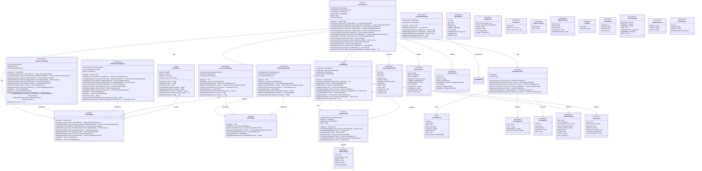

```mermaid
classDiagram
    %% Search System Architecture
    
    class SearchService {
        <<Service>>
        -searchEngine: SearchEngine
        -searchRepository: SearchRepository
        -indexManager: IndexManager
        -eventMediator: EventMediator
        -logger: Logger
        -config: SearchConfig
        +initialize(): Promise~void~
        +search(query: string, options: SearchOptions): Promise~SearchResults~
        +searchByType(type: SearchableType, query: string, filters: FilterOptions): Promise~TypedSearchResults~
        +searchExercises(query: string, filters: ExerciseFilters): Promise~ExerciseSearchResult~
        +searchWorkouts(query: string, filters: WorkoutFilters): Promise~WorkoutSearchResult~
        +searchPrograms(query: string, filters: ProgramFilters): Promise~ProgramSearchResult~
        +searchUsers(query: string, filters: UserFilters): Promise~UserSearchResult~
        +searchOrganizations(query: string, filters: OrganizationFilters): Promise~OrganizationSearchResult~
        +suggest(query: string, type?: SearchableType): Promise~SuggestionResult~
        +autocomplete(query: string, field: string): Promise~string[]~
        +saveSearch(userId: string, query: string, resultCount: number): Promise~void~
        +getUserRecentSearches(userId: string): Promise~RecentSearch[]~
        +getTrendingSearches(): Promise~TrendingSearch[]~
        -applyFilters(results: SearchResult[], filters: FilterOptions): SearchResult[]
        -formatResults(results: any[], type: SearchableType): SearchResult[]
        -logSearch(userId: string, query: string, filters: FilterOptions, resultCount: number): void
    }
    
    class SearchEngine {
        <<Interface>>
        +initialize(): Promise~void~
        +search(query: string, options: SearchOptions): Promise~SearchEngineResult~
        +searchByType(type: string, query: string, options: TypedSearchOptions): Promise~TypedSearchEngineResult~
        +suggest(query: string, options?: SuggestionOptions): Promise~SuggestionResult~
        +autocomplete(query: string, field: string, options?: AutocompleteOptions): Promise~string[]~
        +indexDocument(document: SearchableDocument): Promise~IndexResult~
        +bulkIndex(documents: SearchableDocument[]): Promise~BulkIndexResult~
        +deleteDocument(type: string, id: string): Promise~DeleteResult~
        +deleteByQuery(type: string, query: FilterQuery): Promise~DeleteByQueryResult~
        +getHealth(): Promise~HealthStatus~
        +getStats(): Promise~SearchEngineStats~
    }
    
    class ElasticsearchEngine {
        <<SearchEngine>>
        -client: ElasticsearchClient
        -indexPrefix: string
        -config: ElasticsearchConfig
        +initialize(): Promise~void~
        +search(query: string, options: SearchOptions): Promise~SearchEngineResult~
        +searchByType(type: string, query: string, options: TypedSearchOptions): Promise~TypedSearchEngineResult~
        +suggest(query: string, options?: SuggestionOptions): Promise~SuggestionResult~
        +autocomplete(query: string, field: string, options?: AutocompleteOptions): Promise~string[]~
        +indexDocument(document: SearchableDocument): Promise~IndexResult~
        +bulkIndex(documents: SearchableDocument[]): Promise~BulkIndexResult~
        +deleteDocument(type: string, id: string): Promise~DeleteResult~
        +deleteByQuery(type: string, query: FilterQuery): Promise~DeleteByQueryResult~
        +getHealth(): Promise~HealthStatus~
        +getStats(): Promise~SearchEngineStats~
        -buildSearchQuery(query: string, options: SearchOptions): ESSearchQuery
        -buildTypeQuery(type: string, query: string, options: TypedSearchOptions): ESSearchQuery
        -mapResultsFromES(results: ESSearchResponse): SearchEngineResult
        -handleError(error: Error): void
    }
    
    class InMemorySearchEngine {
        <<SearchEngine>>
        -indices: Map~string, InMemoryIndex~
        -config: InMemorySearchConfig
        -analyzer: TextAnalyzer
        +initialize(): Promise~void~
        +search(query: string, options: SearchOptions): Promise~SearchEngineResult~
        +searchByType(type: string, query: string, options: TypedSearchOptions): Promise~TypedSearchEngineResult~
        +suggest(query: string, options?: SuggestionOptions): Promise~SuggestionResult~
        +autocomplete(query: string, field: string, options?: AutocompleteOptions): Promise~string[]~
        +indexDocument(document: SearchableDocument): Promise~IndexResult~
        +bulkIndex(documents: SearchableDocument[]): Promise~BulkIndexResult~
        +deleteDocument(type: string, id: string): Promise~DeleteResult~
        +deleteByQuery(type: string, query: FilterQuery): Promise~DeleteByQueryResult~
        +getHealth(): Promise~HealthStatus~
        +getStats(): Promise~SearchEngineStats~
        -tokenize(text: string): string[]
        -score(document: InMemoryDocument, queryTokens: string[]): number
        -filterDocuments(documents: InMemoryDocument[], filter: FilterQuery): InMemoryDocument[]
    }
    
    class IndexManager {
        <<Service>>
        -searchEngine: SearchEngine
        -indexBuilders: Map~string, IndexBuilder~
        -eventMediator: EventMediator
        -indexScheduler: IndexScheduler
        -logger: Logger
        +initialize(): Promise~void~
        +registerIndexBuilder(type: string, builder: IndexBuilder): void
        +buildIndex(type: string): Promise~IndexBuildResult~
        +buildAllIndices(): Promise~IndexBuildResult[]~
        +rebuildIndex(type: string): Promise~IndexBuildResult~
        +updateDocument(type: string, id: string): Promise~IndexResult~
        +handleEntityChange(type: string, id: string, operation: ChangeOperation): Promise~void~
        +getIndexStatus(type: string): Promise~IndexStatus~
        +getAllIndexStatus(): Promise~Record~string, IndexStatus~~
        +scheduleIndexing(type: string, schedule: IndexSchedule): Promise~void~
        -handleError(error: Error, type: string): void
    }
    
    class IndexBuilder {
        <<Interface>>
        +getType(): string
        +buildIndex(): Promise~IndexBuildResult~
        +getDocumentById(id: string): Promise~SearchableDocument~
        +getAllDocuments(batchSize?: number): AsyncIterable~SearchableDocument[]~
        +transformToSearchable(entity: any): SearchableDocument
        +getIndexDefinition(): IndexDefinition
        +validateDocument(document: SearchableDocument): boolean
    }
    
    class ExerciseIndexBuilder {
        <<IndexBuilder>>
        -exerciseRepository: ExerciseRepository
        -mediaService: MediaService
        -config: ExerciseIndexConfig
        +getType(): string
        +buildIndex(): Promise~IndexBuildResult~
        +getDocumentById(id: string): Promise~SearchableDocument~
        +getAllDocuments(batchSize?: number): AsyncIterable~SearchableDocument[]~
        +transformToSearchable(exercise: Exercise): SearchableDocument
        +getIndexDefinition(): IndexDefinition
        +validateDocument(document: SearchableDocument): boolean
        -extractKeywords(exercise: Exercise): string[]
        -buildSearchableText(exercise: Exercise): string
    }
    
    class WorkoutIndexBuilder {
        <<IndexBuilder>>
        -workoutRepository: WorkoutRepository
        -exerciseService: ExerciseService
        -config: WorkoutIndexConfig
        +getType(): string
        +buildIndex(): Promise~IndexBuildResult~
        +getDocumentById(id: string): Promise~SearchableDocument~
        +getAllDocuments(batchSize?: number): AsyncIterable~SearchableDocument[]~
        +transformToSearchable(workout: Workout): SearchableDocument
        +getIndexDefinition(): IndexDefinition
        +validateDocument(document: SearchableDocument): boolean
        -buildExerciseMetadata(workout: Workout): ExerciseMetadata[]
        -extractTargetMuscleGroups(workout: Workout): string[]
    }
    
    class SearchRepository {
        <<Repository>>
        -db: Database
        -collection: string
        +saveSearch(search: SearchRecord): Promise~SearchRecord~
        +getRecentSearches(userId: string, limit?: number): Promise~SearchRecord[]~
        +getTrendingSearches(timeframe?: string, limit?: number): Promise~TrendingSearch[]~
        +getSearchHistory(userId: string, filters?: SearchHistoryFilters): Promise~SearchRecord[]~
        +deleteSearchHistory(userId: string): Promise~DeleteResult~
        +getSearchAnalytics(options?: AnalyticsOptions): Promise~SearchAnalytics~
        -aggregateTrendingSearches(timeframe: string, limit: number): Promise~TrendingSearch[]~
    }
    
    class SearchEventHandler {
        <<EventHandler>>
        -indexManager: IndexManager
        -eventMediator: EventMediator
        +initialize(): Promise~void~
        +handleEvent(event: Event): Promise~void~
        +handleEntityCreated(event: EntityEvent): Promise~void~
        +handleEntityUpdated(event: EntityEvent): Promise~void~
        +handleEntityDeleted(event: EntityEvent): Promise~void~
        -mapEventToSearchType(event: Event): string
        -shouldProcessEvent(event: Event): boolean
    }
    
    class TextAnalyzer {
        <<Utility>>
        -tokenizer: Tokenizer
        -stemmer: Stemmer
        -stopWords: Set~string~
        -synonyms: Map~string, string[]~
        +analyze(text: string): string[]
        +tokenize(text: string): string[]
        +stem(token: string): string
        +removeStopWords(tokens: string[]): string[]
        +expandSynonyms(tokens: string[]): string[]
        +buildNgrams(tokens: string[], n: number): string[]
        +addSynonyms(word: string, synonyms: string[]): void
        +addStopWords(words: string[]): void
    }
    
    class IndexScheduler {
        <<Service>>
        -schedules: Map~string, IndexSchedule~
        -taskRunner: TaskRunner
        -indexManager: IndexManager
        -logger: Logger
        +initialize(): Promise~void~
        +scheduleIndexing(type: string, schedule: IndexSchedule): Promise~void~
        +unscheduleIndexing(type: string): Promise~void~
        +getSchedule(type: string): IndexSchedule
        +getAllSchedules(): Record~string, IndexSchedule~
        +runScheduledIndex(type: string): Promise~IndexBuildResult~
        +runAllScheduledIndices(): Promise~Record~string, IndexBuildResult~~
        -parseSchedule(schedule: string): CronExpression
    }
    
    %% Domain Models
    class SearchableDocument {
        <<ValueObject>>
        +id: string
        +type: string
        +title: string
        +content: string
        +keywords: string[]
        +metadata: Record~string, any~
        +tags: string[]
        +visibility: string
        +owner: string
        +organization?: string
        +createdAt: Date
        +updatedAt: Date
    }
    
    class SearchOptions {
        <<ValueObject>>
        +types?: string[]
        +filters?: FilterOptions
        +sort?: SortOptions
        +pagination?: PaginationOptions
        +highlight?: HighlightOptions
        +includeMetadata?: boolean
        +fuzzy?: boolean
        +fuzzyDistance?: number
        +visibilityFilter?: string[]
        +organizationFilter?: string
        +scope?: SearchScope
    }
    
    class SearchResults {
        <<ValueObject>>
        +query: string
        +totalHits: number
        +results: SearchResult[]
        +aggregations: Record~string, AggregationResult~
        +took: number
        +pagination: PaginationResult
        +suggestions?: SuggestionResult[]
    }
    
    class SearchResult {
        <<ValueObject>>
        +id: string
        +type: string
        +title: string
        +snippet: string
        +highlights: Highlight[]
        +score: number
        +metadata: Record~string, any~
        +createdAt: Date
        +updatedAt: Date
    }
    
    class FilterOptions {
        <<ValueObject>>
        +terms?: Record~string, any~
        +range?: Record~string, RangeFilter~
        +exists?: string[]
        +missing?: string[]
        +bool?: BooleanFilter
        +nested?: NestedFilter[]
    }
    
    class SortOptions {
        <<ValueObject>>
        +field: string
        +direction: 'asc' | 'desc'
        +mode?: 'min' | 'max' | 'avg'
    }
    
    class PaginationOptions {
        <<ValueObject>>
        +page: number
        +size: number
    }
    
    class HighlightOptions {
        <<ValueObject>>
        +fields: string[]
        +preTag: string
        +postTag: string
        +fragmentSize: number
        +numberOfFragments: number
    }
    
    class Highlight {
        <<ValueObject>>
        +field: string
        +fragments: string[]
    }
    
    class SearchRecord {
        <<Entity>>
        +id: string
        +userId: string
        +query: string
        +filters: FilterOptions
        +resultCount: number
        +timestamp: Date
        +type?: string
        +clickedResults?: ClickedResult[]
    }
    
    class ClickedResult {
        <<ValueObject>>
        +resultId: string
        +resultType: string
        +position: number
        +timestamp: Date
    }
    
    class TrendingSearch {
        <<ValueObject>>
        +query: string
        +count: number
        +avgResultCount: number
        +types: Record~string, number~
    }
    
    class RecentSearch {
        <<ValueObject>>
        +id: string
        +query: string
        +timestamp: Date
        +resultCount: number
        +type?: string
    }
    
    class IndexBuildResult {
        <<ValueObject>>
        +type: string
        +success: boolean
        +documentsProcessed: number
        +documentsIndexed: number
        +documentsFailed: number
        +startTime: Date
        +endTime: Date
        +duration: number
        +errors: IndexError[]
    }
    
    class IndexStatus {
        <<ValueObject>>
        +type: string
        +documentCount: number
        +lastIndexed: Date
        +indexSize: number
        +health: 'green' | 'yellow' | 'red'
        +schedule?: IndexSchedule
        +averageIndexTime: number
    }
    
    class IndexSchedule {
        <<ValueObject>>
        +type: string
        +cronExpression: string
        +lastRun?: Date
        +nextRun?: Date
        +enabled: boolean
        +incremental: boolean
    }
    
    %% Enumerations
    class SearchableType {
        <<Enumeration>>
        EXERCISE: "exercise"
        WORKOUT: "workout"
        PROGRAM: "program"
        USER: "user"
        ORGANIZATION: "organization"
        EQUIPMENT: "equipment"
        MEDIA: "media"
    }
    
    class ChangeOperation {
        <<Enumeration>>
        CREATE: "create"
        UPDATE: "update"
        DELETE: "delete"
    }
    
    class SearchScope {
        <<Enumeration>>
        ALL: "all"
        PUBLIC: "public"
        PRIVATE: "private"
        ORGANIZATION: "organization"
    }
    
    %% Relationships
    SearchService --> SearchEngine : uses
    SearchService --> SearchRepository : uses
    SearchService --> IndexManager : uses
    
    ElasticsearchEngine --|> SearchEngine : implements
    InMemorySearchEngine --|> SearchEngine : implements
    
    IndexManager --> SearchEngine : uses
    IndexManager --> IndexBuilder : manages
    IndexManager --> IndexScheduler : uses
    
    ExerciseIndexBuilder --|> IndexBuilder : implements
    WorkoutIndexBuilder --|> IndexBuilder : implements
    
    SearchEventHandler --> IndexManager : uses
    SearchEventHandler --> EventMediator : subscribes to
    
    IndexScheduler --> IndexManager : schedules
    
    TextAnalyzer --> SearchEngine : used by
    
    %% Service Dependencies
    SearchService --> SearchableDocument : processes
    SearchService --> SearchOptions : accepts
    SearchService --> SearchResults : produces
    
    SearchRepository --> SearchRecord : stores
    SearchRepository --> TrendingSearch : produces
    SearchRepository --> RecentSearch : produces
    
    IndexManager --> IndexBuildResult : produces
    IndexManager --> IndexStatus : produces
    
    IndexScheduler --> IndexSchedule : manages
```
