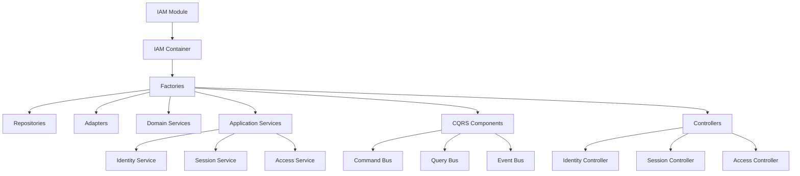

# IAM Usage Guide

## 🚀 Quick Start

```typescript
import { IAMModule } from '@/infrastructure/iam/module/IAMModule';

// Initialize IAM module
const iamModule = new IAMModule({
  jwtAccessTokenSecret: 'your-access-secret',
  jwtRefreshTokenSecret: 'your-refresh-secret', 
  jwtIssuer: 'your-app',
  bcryptSaltRounds: 12
});

await iamModule.initialize();
```

## 📋 Service Types & Usage

### 1. **Identity Management**
```typescript
const identityService = container.getApplicationServices().identityApplicationService;

// Create identity
const identity = await identityService.createIdentity({
  correlationId: 'req-123',
  username: 'john_doe',
  email: 'john@example.com',
  password: 'securePassword123'
});

// Update identity
await identityService.updateIdentity({
  correlationId: 'req-124',
  identityId: identity.id,
  status: IdentityStatus.ACTIVE
});
```

### 2. **Session Management**
```typescript
const sessionService = container.getApplicationServices().sessionApplicationService;

// Create session (login)
const sessionResult = await sessionService.createSession({
  correlationId: 'req-125',
  identityId: identity.id,
  deviceFingerprint: 'device-123',
  ipAddress: '192.168.1.1',
  userAgent: 'Mozilla/5.0...',
  authenticationMethod: AuthenticationMethod.PASSWORD
});

// Access tokens
const { accessToken, refreshToken } = sessionResult;
```

### 3. **Access Control**
```typescript
const accessService = container.getApplicationServices().accessApplicationService;

// Assign role
await accessService.assignRole({
  correlationId: 'req-126',
  identityId: identity.id,
  roleId: adminRoleId,
  effectiveFrom: new Date()
});

// Check permissions
const hasAccess = await accessService.checkAccess({
  subject: identity.id,
  resource: 'users',
  action: 'read'
});
```

### 4. **Policy Engine**
```typescript
const policyEngine = container.getPolicyEngineService();

// Authorize access
const authorization = await policyEngine.authorize(
  identity.id,
  'sensitive-data',
  'write'
);

if (authorization.authorized) {
  // Proceed with operation
  console.log('Access granted');
} else {
  console.log(`Access denied: ${authorization.reason}`);
}
```

## 🏗️ Architecture Overview



## 🎯 Common Patterns

### Authentication Flow
```typescript
export class AuthController {
  constructor(private readonly iamContainer: IAMContainer) {}

  async login(credentials: LoginCredentials) {
    // 1. Validate credentials (via domain service)
    const identity = await this.validateCredentials(credentials);
    
    // 2. Create session
    const sessionResult = await this.iamContainer
      .getApplicationServices()
      .sessionApplicationService
      .createSession({
        correlationId: randomUUID(),
        identityId: identity.id,
        deviceFingerprint: this.extractDeviceFingerprint(),
        ipAddress: this.getClientIP(),
        userAgent: this.getUserAgent(),
        authenticationMethod: AuthenticationMethod.PASSWORD
      });

    return {
      accessToken: sessionResult.accessToken,
      refreshToken: sessionResult.refreshToken,
      user: this.mapToUserProfile(identity)
    };
  }
}
```

### Authorization Middleware
```typescript
export class AuthorizationMiddleware {
  constructor(private readonly iamContainer: IAMContainer) {}

  requirePermission(resource: string, action: string) {
    return async (c: Context, next: Next) => {
      const userContext = c.get('userContext');
      
      const hasAccess = await this.iamContainer
        .getApplicationServices()
        .accessApplicationService
        .checkAccess({
          subject: userContext.identityId,
          resource,
          action
        });

      if (!hasAccess) {
        return c.json({ error: 'Insufficient permissions' }, 403);
      }

      await next();
    };
  }
}
```

### CQRS Pattern Usage
```typescript
export class UserManagementService {
  constructor(private readonly iamContainer: IAMContainer) {}

  async createUser(userData: CreateUserData) {
    // Use Command Bus
    const identity = await this.iamContainer
      .getCommandBus()
      .createIdentity({
        correlationId: randomUUID(),
        ...userData
      });

    // Use Query Bus  
    const profile = await this.iamContainer
      .getQueryBus()
      .getIdentity({
        identityId: identity.id
      });

    return profile;
  }
}
```

### Event-Driven Integration
```typescript
export class UserNotificationHandler implements IEventHandler<DomainEvent> {
  async handle(event: DomainEvent) {
    if (event.type === EventType.IDENTITY_CREATED) {
      await this.sendWelcomeEmail(event.eventData.email);
    }
    
    if (event.type === EventType.SESSION_CREATED) {
      await this.logSecurityEvent(event);
    }
  }
}

// Register handler
const eventBus = container.getEventBus();
eventBus.registerHandler(
  EventType.IDENTITY_CREATED,
  new UserNotificationHandler()
);
```

## 🔧 Configuration

### Development
```typescript
const iamModule = new IAMModule({
  jwtAccessTokenSecret: 'dev-access-secret',
  jwtRefreshTokenSecret: 'dev-refresh-secret',
  jwtIssuer: 'dev-app',
  bcryptSaltRounds: 10 // Lower for faster dev cycles
});
```

### Production
```typescript
const iamModule = new IAMModule({
  jwtAccessTokenSecret: process.env.JWT_ACCESS_SECRET,
  jwtRefreshTokenSecret: process.env.JWT_REFRESH_SECRET,
  jwtIssuer: process.env.APP_NAME,
  bcryptSaltRounds: 12 // Higher security
});
```

### Route Integration
```typescript
import { Hono } from 'hono';

const app = new Hono();

// Initialize IAM
const iamModule = new IAMModule(config);
await iamModule.initialize();

// Add IAM routes
const iamRoutes = iamModule.createRoutes();
app.route('/api/iam', iamRoutes);

// Add authentication to protected routes
app.use('/api/protected/*', (c, next) => 
  iamModule.getContainer()
    .getAuthenticationMiddleware()
    .authenticate(c, next)
);
```

## 🎭 Advanced Usage

### Custom Policy Creation
```typescript
const policyEngine = container.getPolicyEngine();

await policyEngine.policyAdministrationPoint.createPolicy({
  name: 'AdminOnlyPolicy',
  description: 'Only admins can access admin resources',
  target: {
    resources: ['admin/*'],
    actions: ['*']
  },
  rules: [{
    id: 'admin-rule',
    effect: 'permit',
    condition: {
      operator: 'equals',
      operands: [
        { category: 'subject', attribute: 'role' },
        { value: 'admin' }
      ]
    }
  }],
  isActive: true,
  priority: 100
});
```

### Health Monitoring
```typescript
export class IAMHealthService {
  constructor(private readonly iamModule: IAMModule) {}

  async checkHealth() {
    return await this.iamModule.healthCheck();
  }

  async getMetrics() {
    const container = this.iamModule.getContainer();
    const eventBus = container.getEventBus();
    
    return {
      totalEvents: eventBus.getEventHistory().length,
      activeHandlers: eventBus.getActiveHandlers(),
      systemHealth: await this.checkHealth()
    };
  }
}
```

### Testing Patterns
```typescript
describe('IAM Integration Tests', () => {
  let iamModule: IAMModule;

  beforeEach(async () => {
    iamModule = new IAMModule(testConfig);
    await iamModule.initialize();
  });

  afterEach(async () => {
    await iamModule.dispose();
  });

  it('should create and authenticate user', async () => {
    const identityService = iamModule.getContainer()
      .getApplicationServices()
      .identityApplicationService;
    
    const identity = await identityService.createIdentity({
      correlationId: 'test-123',
      username: 'testuser',
      email: 'test@example.com',
      password: 'password123'
    });

    expect(identity.username.value).toBe('testuser');
  });
});
```

## ⚡ Key Benefits

- **Type-safe** IAM operations with full TypeScript support
- **Modular architecture** with clear separation of concerns
- **CQRS pattern** for scalable command/query separation
- **Event-driven** architecture for loose coupling
- **Policy-based** authorization with flexible rule engine
- **Comprehensive auditing** with detailed security logs
- **Production-ready** with proper error handling and monitoring
- **Testable** with dependency injection and factory patterns

## 🔒 Security Features

- **JWT-based** authentication with refresh token rotation
- **Bcrypt password** hashing with configurable rounds  
- **Device fingerprinting** for session security
- **Risk assessment** for suspicious activity detection
- **Policy engine** for fine-grained authorization
- **Audit logging** for compliance and security monitoring
- **Session management** with automatic cleanup and validation