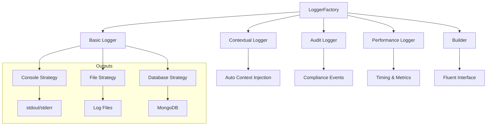

# Logger Usage Guide

## 🚀 Quick Start

```typescript
import { LoggerFactory } from '@/shared-kernel/infrastructure/logging/LoggerFactory';

// Initialize once in your application
LoggerFactory.initialize({
  level: LogLevel.INFO,
  enableConsole: true,
  enableFile: true
});
```

## 📋 Logger Types & Usage

### 1. **Basic Logger**
```typescript
const logger = LoggerFactory.getLogger('UserService');

logger.info('User created successfully', { userId: user.id });
logger.error('Failed to create user', error, { email: user.email });
logger.debug('Processing user data', { step: 'validation' });
```

### 2. **Contextual Logger** (Recommended)
```typescript
const logger = LoggerFactory.getContextualLogger('UserService')
  .withCorrelationId(request.correlationId)
  .withUserId(user.id)
  .withOrganizationId(user.organizationId);

logger.info('User operation completed'); // Context auto-included
```

### 3. **Audit Logger** (Compliance)
```typescript
const auditLogger = LoggerFactory.getAuditLogger();

await auditLogger.auditSuccess('user_login', user.id);
await auditLogger.auditDataChange('user', user.id, { email: newEmail });
await auditLogger.auditSecurityEvent('failed_login', 'medium', { ip, attempts });
```

### 4. **Performance Logger**
```typescript
const perfLogger = LoggerFactory.getPerformanceLogger();

// Method 1: Manual timing
const timer = perfLogger.startTimer('database_query');
// ... do work
await timer.stop({ recordCount: 150 });

// Method 2: Automatic timing
const result = await perfLogger.measureAsync('api_call', async () => {
  return await apiService.getData();
});
```

### 5. **Builder Pattern** (Complex Logs)
```typescript
const builder = LoggerFactory.getInstance().createBuilder('PaymentService');

await builder
  .info('Payment processed')
  .withUserId(userId)
  .withData({ amount, currency, gateway })
  .withTags({ feature: 'checkout', version: 'v2' })
  .withHttpStatus(200)
  .withDuration(responseTime)
  .log();
```

## 🏗️ Architecture Overview



## 🎯 Common Patterns

### Application Service Pattern
```typescript
export class UserApplicationService {
  private readonly logger = LoggerFactory.getContextualLogger('UserApplicationService');
  private readonly auditLogger = LoggerFactory.getAuditLogger();
  
  async createUser(command: CreateUserCommand): Promise<User> {
    const contextLogger = this.logger
      .withCorrelationId(command.correlationId)
      .withOrganizationId(command.organizationId);
    
    try {
      contextLogger.info('Creating user', { email: command.email });
      
      const user = await this.userRepository.create(command);
      
      await this.auditLogger.auditSuccess('user_created', user.id);
      contextLogger.info('User created successfully', { userId: user.id });
      
      return user;
    } catch (error) {
      await this.auditLogger.auditFailure('user_created', error);
      contextLogger.error('Failed to create user', error);
      throw error;
    }
  }
}
```

### HTTP Handler Pattern
```typescript
export class UserController {
  private readonly logger = LoggerFactory.getContextualLogger('UserController');
  
  async createUser(c: Context): Promise<Response> {
    const correlationId = c.req.header('x-correlation-id') ?? randomUUID();
    const requestLogger = this.logger
      .withCorrelationId(correlationId)
      .withRequestId(c.req.header('x-request-id'))
      .withIpAddress(c.req.header('x-forwarded-for'));
    
    requestLogger.info('User creation request received');
    
    // ... handle request
    
    return c.json({ success: true });
  }
}
```

## 🔧 Configuration

### Development
```typescript
LoggerFactory.initialize({
  level: LogLevel.DEBUG,
  enableConsole: true,
  enableFile: true,
  enableMetrics: true
});
```

### Production
```typescript
LoggerFactory.initialize({
  level: LogLevel.INFO,
  enableConsole: false,
  enableFile: true,
  enableRemote: true,
  enableAudit: true,
  samplingRate: 0.1
});
```

## ⚡ Key Benefits

- **Type-safe** logging with TypeScript
- **Structured** JSON output for parsing
- **Context preservation** across async calls
- **Compliance** ready with audit trails
- **Performance** monitoring built-in
- **Multiple outputs** (console, file, database, remote)
- **Filtering & sampling** for production