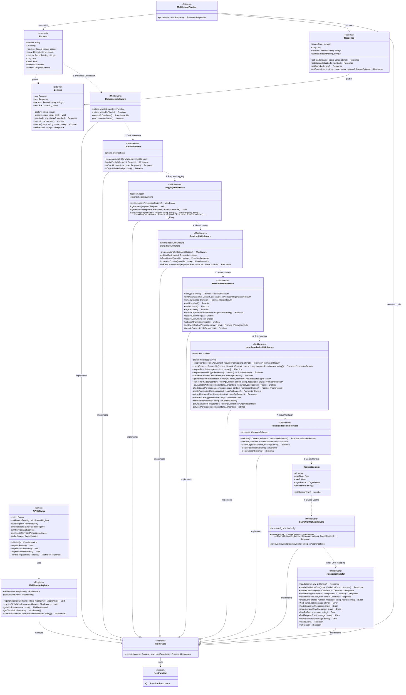

```mermaid
classDiagram
    %% Middleware Pipeline Architecture
    
    class Request {
        <<external>>
        +method: string
        +url: string
        +headers: Record~string, string~
        +query: Record~string, string~
        +params: Record~string, string~
        +body: any
        +user?: User
        +session?: Session
        +context: RequestContext
    }
    
    class Response {
        <<external>>
        +statusCode: number
        +body: any
        +headers: Record~string, string~
        +cookies: Record~string, string~
        +setHeader(name: string, value: string): Response
        +setStatus(statusCode: number): Response
        +setBody(body: any): Response
        +setCookie(name: string, value: string, options?: CookieOptions): Response
    }
    
    class Context {
        <<external>>
        +req: Request
        +res: Response
        +params: Record~string, string~
        +env: Record~string, any~
        +get(key: string): any
        +set(key: string, value: any): void
        +json(body: any, status?: number): Response
        +status(code: number): Context
        +header(name: string, value: string): Context
        +redirect(url: string): Response
    }
    
    class Middleware {
        <<interface>>
        +execute(request: Request, next: NextFunction): Promise~Response~
    }
    
    class NextFunction {
        <<function>>
        +(): Promise~Response~
    }
    
    class MiddlewareRegistry {
        <<Registry>>
        -middlewares: Map~string, Middleware~
        -globalMiddlewares: Middleware[]
        +registerMiddleware(name: string, middleware: Middleware): void
        +registerGlobalMiddleware(middleware: Middleware): void
        +getMiddleware(name: string): Middleware|null
        +getGlobalMiddlewares(): Middleware[]
        +createMiddlewareChain(middlewareNames: string[]): Middleware
    }
    
    class APIGateway {
        <<Service>>
        -router: Router
        -middlewareRegistry: MiddlewareRegistry
        -routeRegistry: RouteRegistry
        -errorHandlers: ErrorHandlerRegistry
        -authService: AuthService
        -permissionService: PermissionService
        -cacheService: CacheService
        +initialize(): Promise~void~
        +registerRoutes(): void
        +registerMiddlewares(): void
        +registerErrorHandlers(): void
        +handleRequest(req: Request): Promise~Response~
    }
    
    class DatabaseMiddleware {
        <<Middleware>>
        +databaseMiddleware(): Function
        +databaseHealthCheck(): Function
        -connectToDatabase(): Promise~void~
        -getConnectionStatus(): boolean
    }
    
    class HonoAuthMiddleware {
        <<Middleware>>
        +verify(c: Context): Promise~HonoAuthResult~
        +getOrganization(c: Context, user: any): Promise~OrganizationResult~
        +refreshToken(c: Context): Promise~TokenResult~
        +authRequired(): Function
        +authOptional(): Function
        +orgRequired(): Function
        +requireOrgRole(requiredRoles: OrganizationRole[]): Function
        +requireOrgOwner(): Function
        +requireOrgAdmin(): Function
        +validateOrgMembership(): Function
        +getUserEffectivePermissions(user: any): Promise~PermissionSet~
        +includePermissionsInResponse(): Function
    }
    
    class HonoErrorHandler {
        <<Middleware>>
        +handle(error: any, c: Context): Response
        +handleValidationError(error: ValidationError, c: Context): Response
        +handleCastError(error: CastError, c: Context): Response
        +handleMongoError(error: MongoError, c: Context): Response
        +handleInternalError(error: any, c: Context): Response
        +createError(status: number, message: string, name?: string): Error
        +NotFoundError(message: string): Error
        +ForbiddenError(message: string): Error
        +UnauthorizedError(message: string): Error
        +ConflictError(message: string): Error
        +BadRequestError(message: string): Error
        +ValidationError(message: string): Error
        +middleware(): Function
        +notFound(): Function
    }
    
    class HonoPermissionMiddleware {
        <<Middleware>>
        -initialized: boolean
        -ensureInitialized(): void
        +check(context: HonoApiContext, requiredPermissions: string[]): Promise~PermissionResult~
        +checkResourceOwnership(context: HonoApiContext, resource: any, requiredPermissions: string[]): Promise~PermissionResult~
        +requirePermissions(permissions: string[]): Function
        +requireOwnership(getResource: (c: Context) => Promise~any~): Function
        +createPermissionChecker(context: HonoApiContext): Function
        +getPermissionFilter(context: HonoApiContext, resourceType: ResourceType): any
        +canPerformAction(context: HonoApiContext, action: string, resource?: any): Promise~boolean~
        +getAvailableActions(context: HonoApiContext, resourceType: ResourceType): Function
        -checkSinglePermission(permission: string, context: PermissionContext): Promise~PermResult~
        -createPermissionContext(context: HonoApiContext): PermissionContext
        -extractResourceFromContext(context: HonoApiContext): Resource
        -inferResourceType(resource: any): ResourceType
        -mapVisibility(visibility: string): ContentVisibility
        -getOrganizationRole(context: HonoApiContext): OrganizationRole
        -getUserPermissions(context: HonoApiContext): string[]
    }
    
    class HonoValidationMiddleware {
        <<Middleware>>
        +validate(c: Context, schemas: ValidationSchemas): Promise~ValidationResult~
        +schemas: CommonSchemas
        +validate(schemas: ValidationSchemas): Function
        +createObjectIdSchema(message: string): Schema
        +createPaginationSchema(): Schema
        +createSearchSchema(): Schema
    }
    
    class CacheControlMiddleware {
        <<Middleware>>
        -cacheConfig: CacheConfig
        +create(options?: CacheOptions): Middleware
        -setCacheHeaders(response: Response, options: CacheOptions): Response
        -parseCacheControl(cacheControl: string): CacheOptions
    }
    
    class RateLimitMiddleware {
        <<Middleware>>
        -options: RateLimitOptions
        -store: RateLimitStore
        +create(options?: RateLimitOptions): Middleware
        -getIdentifier(request: Request): string
        -isRateLimited(identifier: string): Promise~boolean~
        -incrementCounter(identifier: string): Promise~void~
        -setRateLimitHeaders(response: Response, info: RateLimitInfo): Response
    }
    
    class LoggingMiddleware {
        <<Middleware>>
        -logger: Logger
        -options: LoggingOptions
        +create(options?: LoggingOptions): Middleware
        -logRequest(request: Request): void
        -logResponse(response: Response, duration: number): void
        -sanitizeHeaders(headers: Record~string, string~): Record~string, string~
        -formatLogEntry(request: Request, response: Response, duration: number): LogEntry
    }
    
    class CorsMiddleware {
        <<Middleware>>
        -options: CorsOptions
        +create(options?: CorsOptions): Middleware
        -handlePreflight(request: Request): Response
        -setCorsHeaders(response: Response): Response
        -isOriginAllowed(origin: string): boolean
    }
    
    class RequestContext {
        +id: string
        +startTime: Date
        +user?: User
        +organization?: Organization
        +permissions: string[]
        +getElapsedTime(): number
    }
    
    %% Middleware Pipeline Flow
    class MiddlewarePipeline {
        <<Process>>
        +process(request: Request): Promise~Response~
    }
    
    %% Middleware Relationships and Flow
    Request --> Context : part of
    Response --> Context : part of
    
    APIGateway --> MiddlewareRegistry : uses
    MiddlewareRegistry --> Middleware : manages
    
    DatabaseMiddleware --|> Middleware : implements
    HonoAuthMiddleware --|> Middleware : implements
    HonoErrorHandler --|> Middleware : implements
    HonoPermissionMiddleware --|> Middleware : implements
    HonoValidationMiddleware --|> Middleware : implements
    CacheControlMiddleware --|> Middleware : implements
    RateLimitMiddleware --|> Middleware : implements
    LoggingMiddleware --|> Middleware : implements
    CorsMiddleware --|> Middleware : implements
    
    Middleware --> NextFunction : calls
    
    MiddlewarePipeline --> Request : processes
    MiddlewarePipeline --> Response : produces
    MiddlewarePipeline --> Middleware : executes chain
    
    %% Request Processing Flow
    Request ..> DatabaseMiddleware : 1. Database Connection
    DatabaseMiddleware ..> CorsMiddleware : 2. CORS Headers
    CorsMiddleware ..> LoggingMiddleware : 3. Request Logging
    LoggingMiddleware ..> RateLimitMiddleware : 4. Rate Limiting
    RateLimitMiddleware ..> HonoAuthMiddleware : 5. Authentication
    HonoAuthMiddleware ..> HonoPermissionMiddleware : 6. Authorization
    HonoPermissionMiddleware ..> HonoValidationMiddleware : 7. Input Validation
    HonoValidationMiddleware ..> RequestContext : 8. Builds Context
    RequestContext ..> CacheControlMiddleware : 9. Cache Control
    CacheControlMiddleware ..> HonoErrorHandler : Final. Error Handling
```
