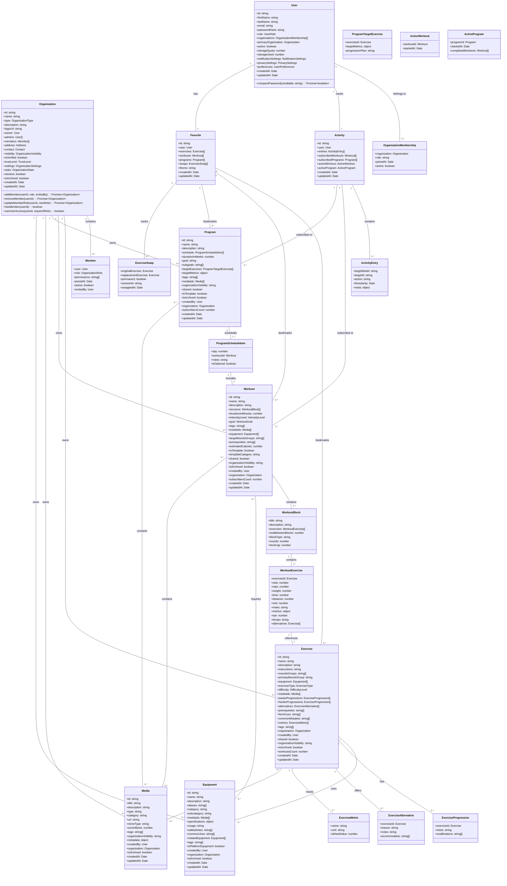

```mermaid
classDiagram
    %% Core Domain Entities and Their Relationships
    
    class User {
        +id: string
        +firstName: string
        +lastName: string
        +email: string
        +passwordHash: string
        +role: UserRole
        +organizations: OrganizationMembership[]
        +primaryOrganization: Organization
        +active: boolean
        +storageQuota: number
        +storageUsed: number
        +notificationSettings: NotificationSettings
        +privacySettings: PrivacySettings
        +preferences: UserPreferences
        +createdAt: Date
        +updatedAt: Date
        +comparePassword(candidate: string): Promise~boolean~
    }
    
    class Exercise {
        +id: string
        +name: string
        +description: string
        +instructions: string
        +muscleGroups: string[]
        +primaryMuscleGroup: string
        +equipment: Equipment[]
        +exerciseType: ExerciseType
        +difficulty: DifficultyLevel
        +mediaIds: Media[]
        +easierProgressions: ExerciseProgression[]
        +harderProgressions: ExerciseProgression[]
        +alternatives: ExerciseAlternative[]
        +prerequisites: string[]
        +formCues: string[]
        +commonMistakes: string[]
        +metrics: ExerciseMetric[]
        +tags: string[]
        +organization: Organization
        +createdBy: User
        +shared: boolean
        +organizationVisibility: string
        +isArchived: boolean
        +workoutsCount: number
        +createdAt: Date
        +updatedAt: Date
    }
    
    class Workout {
        +id: string
        +name: string
        +description: string
        +structure: WorkoutBlock[]
        +durationInMinutes: number
        +intensityLevel: IntensityLevel
        +goal: WorkoutGoal
        +tags: string[]
        +mediaIds: Media[]
        +equipment: Equipment[]
        +targetMuscleGroups: string[]
        +prerequisites: string[]
        +estimatedCalories: number
        +isTemplate: boolean
        +templateCategory: string
        +shared: boolean
        +organizationVisibility: string
        +isArchived: boolean
        +createdBy: User
        +organization: Organization
        +subscribersCount: number
        +createdAt: Date
        +updatedAt: Date
    }
    
    class Program {
        +id: string
        +name: string
        +description: string
        +schedule: ProgramScheduleItem[]
        +durationInWeeks: number
        +goal: string
        +subgoals: string[]
        +targetExercises: ProgramTargetExercise[]
        +targetMetrics: object
        +tags: string[]
        +mediaIds: Media[]
        +organizationVisibility: string
        +shared: boolean
        +isTemplate: boolean
        +isArchived: boolean
        +createdBy: User
        +organization: Organization
        +subscribersCount: number
        +createdAt: Date
        +updatedAt: Date
    }
    
    class Organization {
        +id: string
        +name: string
        +type: OrganizationType
        +description: string
        +logoUrl: string
        +owner: User
        +admins: User[]
        +members: Member[]
        +address: Address
        +contact: Contact
        +visibility: OrganizationVisibility
        +isVerified: boolean
        +trustLevel: TrustLevel
        +settings: OrganizationSettings
        +stats: OrganizationStats
        +isActive: boolean
        +isArchived: boolean
        +createdAt: Date
        +updatedAt: Date
        +addMember(userId, role, invitedBy): Promise~Organization~
        +removeMember(userId): Promise~Organization~
        +updateMemberRole(userId, newRole): Promise~Organization~
        +hasMember(userId): boolean
        +canUserAccess(userId, requiredRole): boolean
    }
    
    class Activity {
        +id: string
        +user: User
        +entries: ActivityEntry[]
        +subscribedWorkouts: Workout[]
        +subscribedPrograms: Program[]
        +activeWorkout: ActiveWorkout
        +activeProgram: ActiveProgram
        +createdAt: Date
        +updatedAt: Date
    }
    
    class Favorite {
        +id: string
        +user: User
        +exercises: Exercise[]
        +workouts: Workout[]
        +programs: Program[]
        +swaps: ExerciseSwap[]
        +theme: string
        +createdAt: Date
        +updatedAt: Date
    }
    
    class Media {
        +id: string
        +title: string
        +description: string
        +type: string
        +category: string
        +url: string
        +mimeType: string
        +sizeInBytes: number
        +tags: string[]
        +organizationVisibility: string
        +metadata: object
        +createdBy: User
        +organization: Organization
        +isArchived: boolean
        +createdAt: Date
        +updatedAt: Date
    }
    
    class Equipment {
        +id: string
        +name: string
        +description: string
        +aliases: string[]
        +category: string
        +subcategory: string
        +mediaIds: Media[]
        +specifications: object
        +usage: string
        +safetyNotes: string[]
        +commonUses: string[]
        +relatedEquipment: Equipment[]
        +tags: string[]
        +isPlatformEquipment: boolean
        +createdBy: User
        +organization: Organization
        +isArchived: boolean
        +createdAt: Date
        +updatedAt: Date
    }
    
    %% Associations and Complex Properties
    class WorkoutBlock {
        +title: string
        +description: string
        +exercises: WorkoutExercise[]
        +restBetweenBlocks: number
        +blockType: string
        +rounds: number
        +timeCap: number
    }
    
    class WorkoutExercise {
        +exerciseId: Exercise
        +sets: number
        +reps: number
        +weight: number
        +time: number
        +distance: number
        +rest: number
        +notes: string
        +metrics: object
        +rpe: number
        +tempo: string
        +alternatives: Exercise[]
    }
    
    class ProgramScheduleItem {
        +day: number
        +workoutId: Workout
        +notes: string
        +isOptional: boolean
    }
    
    class ProgramTargetExercise {
        +exerciseId: Exercise
        +targetMetrics: object
        +progressionPlan: string
    }
    
    class ActivityEntry {
        +targetModel: string
        +targetId: string
        +action: string
        +timestamp: Date
        +meta: object
    }
    
    class ExerciseSwap {
        +originalExercise: Exercise
        +replacementExercise: Exercise
        +permanent: boolean
        +sessionId: string
        +swappedAt: Date
    }
    
    class ExerciseProgression {
        +exerciseId: Exercise
        +notes: string
        +modifications: string[]
    }
    
    class ExerciseAlternative {
        +exerciseId: Exercise
        +reason: string
        +notes: string
        +accommodates: string[]
    }
    
    class ExerciseMetric {
        +name: string
        +unit: string
        +defaultValue: number
    }
    
    class ActiveWorkout {
        +workoutId: Workout
        +startedAt: Date
    }
    
    class ActiveProgram {
        +programId: Program
        +startedAt: Date
        +completedWorkouts: Workout[]
    }
    
    class OrganizationMembership {
        +organization: Organization
        +role: string
        +joinedAt: Date
        +active: boolean
    }
    
    class Member {
        +user: User
        +role: OrganizationRole
        +permissions: string[]
        +joinedAt: Date
        +active: boolean
        +invitedBy: User
    }
    
    %% Relationships with Proper Cardinality
    User "1" -- "0..*" OrganizationMembership : belongs to
    User "1" -- "1" Activity : tracks
    User "1" -- "1" Favorite : has
    
    Organization "1" -- "0..*" Member : contains
    Organization "1" -- "0..*" Exercise : owns
    Organization "1" -- "0..*" Workout : owns
    Organization "1" -- "0..*" Program : owns
    Organization "1" -- "0..*" Media : owns
    Organization "1" -- "0..*" Equipment : owns
    
    Exercise "0..*" -- "0..*" Equipment : uses
    Workout "0..*" -- "1..*" WorkoutBlock : contains
    Workout "0..*" -- "0..*" Equipment : requires
    
    Activity "1" -- "0..*" ActivityEntry : contains
    Activity "1" -- "0..*" Workout : subscribes to
    Activity "1" -- "0..*" Program : subscribes to
    
    Favorite "1" -- "0..*" Exercise : bookmarks
    Favorite "1" -- "0..*" Workout : bookmarks
    Favorite "1" -- "0..*" Program : bookmarks
    Favorite "1" -- "0..*" ExerciseSwap : tracks
    
    WorkoutBlock "1" -- "1..*" WorkoutExercise : contains
    WorkoutExercise "1" -- "1" Exercise : references
    
    Program "1" -- "1..*" ProgramScheduleItem : schedules
    ProgramScheduleItem "1" -- "1" Workout : includes
    
    Exercise "1" -- "0..*" ExerciseProgression : has
    Exercise "1" -- "0..*" ExerciseAlternative : offers
    Exercise "1" -- "0..*" ExerciseMetric : tracks
    
    Exercise "0..*" -- "0..*" Media : contains
    Workout "0..*" -- "0..*" Media : contains
    Program "0..*" -- "0..*" Media : contains
```
