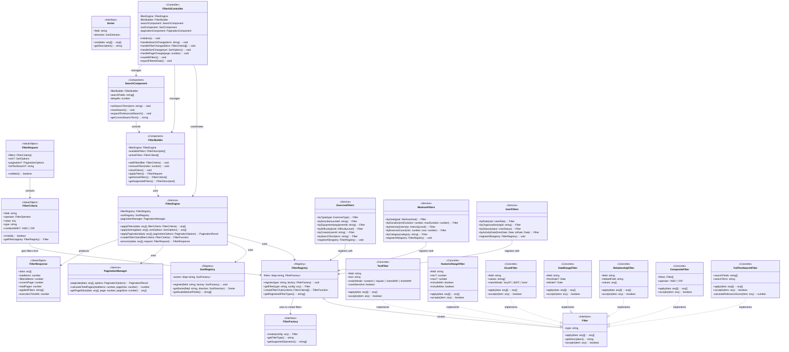

```mermaid
classDiagram
    %% Filtering Architecture for Application Data
    
    class FilterEngine {
        <<Service>>
        -filterRegistry: FilterRegistry
        -sortRegistry: SortRegistry
        -paginationManager: PaginationManager
        +applyFilters(data: any[], filterCriteria: FilterCriteria): any[]
        +applySorting(data: any[], sortOptions: SortOptions): any[]
        +applyPagination(data: any[], paginationOptions: PaginationOptions): PaginationResult
        +createFilterChain(filterCriteria: FilterCriteria): FilterFunction
        +process(data: any[], request: FilterRequest): FilterResponse
    }
    
    class FilterRegistry {
        <<Registry>>
        -filters: Map~string, FilterFactory~
        +register(type: string, factory: FilterFactory): void
        +getFilter(type: string, config: any): Filter
        +createFilterChain(criteria: FilterCriteria[]): FilterFunction
        +getRegisteredFilterTypes(): string[]
    }
    
    class Filter {
        <<Interface>>
        +type: string
        +apply(data: any[]): any[]
        +getDescription(): string
        +accepts(item: any): boolean
    }
    
    class FilterFactory {
        <<Interface>>
        +create(config: any): Filter
        +getFilterType(): string
        +getSupportedOperators(): string[]
    }
    
    class FilterCriteria {
        <<ValueObject>>
        +field: string
        +operator: FilterOperator
        +value: any
        +type: string
        +combineWith?: 'AND' | 'OR'
        +isValid(): boolean
        +getFilter(registry: FilterRegistry): Filter
    }
    
    class SortRegistry {
        <<Registry>>
        -sorters: Map~string, SortFactory~
        +register(field: string, factory: SortFactory): void
        +getSorter(field: string, direction: SortDirection): Sorter
        +getAvailableSortFields(): string[]
    }
    
    class Sorter {
        <<Interface>>
        +field: string
        +direction: SortDirection
        +sort(data: any[]): any[]
        +getDescription(): string
    }
    
    class PaginationManager {
        <<Service>>
        +paginate(data: any[], options: PaginationOptions): PaginationResult
        +calculateTotalPages(totalItems: number, pageSize: number): number
        +getPageSlice(data: any[], page: number, pageSize: number): any[]
    }
    
    class FilterRequest {
        <<ValueObject>>
        +filters: FilterCriteria[]
        +sort?: SortOptions
        +pagination?: PaginationOptions
        +fullTextSearch?: string
        +validate(): boolean
    }
    
    class FilterResponse {
        <<ValueObject>>
        +data: any[]
        +totalItems: number
        +filteredItems: number
        +currentPage: number
        +totalPages: number
        +appliedFilters: string[]
        +executionTimeMs: number
    }
    
    %% Domain-Specific Filters
    
    class ExerciseFilters {
        <<Service>>
        +byType(type: ExerciseType): Filter
        +byMuscle(muscleId: string): Filter
        +byEquipment(equipmentId: string): Filter
        +byDifficulty(level: DifficultyLevel): Filter
        +byCreator(userId: string): Filter
        +bySearchTerm(term: string): Filter
        +registerAll(registry: FilterRegistry): void
    }
    
    class WorkoutFilters {
        <<Service>>
        +byGoal(goal: WorkoutGoal): Filter
        +byDuration(minDuration: number, maxDuration: number): Filter
        +byIntensity(intensity: IntensityLevel): Filter
        +byExerciseCount(min: number, max: number): Filter
        +byCategory(category: string): Filter
        +registerAll(registry: FilterRegistry): void
    }
    
    class UserFilters {
        <<Service>>
        +byRole(role: UserRole): Filter
        +byOrganization(orgId: string): Filter
        +byStatus(status: UserStatus): Filter
        +byActivityDate(fromDate: Date, toDate: Date): Filter
        +registerAll(registry: FilterRegistry): void
    }
    
    %% Filter Implementations
    
    class TextFilter {
        <<Concrete>>
        +field: string
        +text: string
        +matchMode: 'contains' | 'equals' | 'startsWith' | 'endsWith'
        +caseSensitive: boolean
        +apply(data: any[]): any[]
        +accepts(item: any): boolean
    }
    
    class NumericRangeFilter {
        <<Concrete>>
        +field: string
        +min?: number
        +max?: number
        +includeMin: boolean
        +includeMax: boolean
        +apply(data: any[]): any[]
        +accepts(item: any): boolean
    }
    
    class EnumFilter {
        <<Concrete>>
        +field: string
        +values: string[]
        +matchMode: 'anyOf' | 'allOf' | 'none'
        +apply(data: any[]): any[]
        +accepts(item: any): boolean
    }
    
    class DateRangeFilter {
        <<Concrete>>
        +field: string
        +fromDate?: Date
        +toDate?: Date
        +apply(data: any[]): any[]
        +accepts(item: any): boolean
    }
    
    class RelationshipFilter {
        <<Concrete>>
        +field: string
        +relatedField: string
        +values: any[]
        +apply(data: any[]): any[]
        +accepts(item: any): boolean
    }
    
    class CompositeFilter {
        <<Concrete>>
        +filters: Filter[]
        +operator: 'AND' | 'OR'
        +apply(data: any[]): any[]
        +accepts(item: any): boolean
    }
    
    class FullTextSearchFilter {
        <<Concrete>>
        +searchFields: string[]
        +searchTerm: string
        +apply(data: any[]): any[]
        +accepts(item: any): boolean
        -calculateRelevanceScore(item: any): number
    }
    
    %% UI Components
    
    class FilterBuilder {
        <<Component>>
        -filterEngine: FilterEngine
        -availableFilters: FilterDescriptor[]
        -activeFilters: FilterCriteria[]
        +addFilter(filter: FilterCriteria): void
        +removeFilter(index: number): void
        +clearFilters(): void
        +applyFilters(): FilterRequest
        +getActiveFilters(): FilterCriteria[]
        +getSupportedFilters(): FilterDescriptor[]
    }
    
    class SearchComponent {
        <<Component>>
        -filterBuilder: FilterBuilder
        -searchFields: string[]
        -delayMs: number
        +setSearchTerm(term: string): void
        +clearSearch(): void
        +expandToAdvancedSearch(): void
        +getCurrentSearchTerm(): string
    }
    
    class FilterUIController {
        <<Controller>>
        -filterEngine: FilterEngine
        -filterBuilder: FilterBuilder
        -searchComponent: SearchComponent
        -sortComponent: SortComponent
        -paginationComponent: PaginationComponent
        +initialize(): void
        +handleSearchChange(term: string): void
        +handleFilterChange(filters: FilterCriteria[]): void
        +handleSortChange(sort: SortOptions): void
        +handlePageChange(page: number): void
        +resetAllFilters(): void
        +exportFilteredData(): void
    }
    
    %% Relationships
    FilterEngine --> FilterRegistry : uses
    FilterEngine --> SortRegistry : uses
    FilterEngine --> PaginationManager : uses
    
    FilterRegistry o-- Filter : creates
    FilterRegistry --> FilterFactory : uses to create filters
    
    FilterCriteria --> FilterRegistry : gets filters from
    
    ExerciseFilters --> FilterRegistry : registers with
    WorkoutFilters --> FilterRegistry : registers with
    UserFilters --> FilterRegistry : registers with
    
    TextFilter ..|> Filter : implements
    NumericRangeFilter ..|> Filter : implements
    EnumFilter ..|> Filter : implements
    DateRangeFilter ..|> Filter : implements
    RelationshipFilter ..|> Filter : implements
    CompositeFilter ..|> Filter : implements
    FullTextSearchFilter ..|> Filter : implements
    
    FilterBuilder --> FilterEngine : uses
    SearchComponent --> FilterBuilder : controls
    
    FilterUIController --> FilterEngine : coordinates
    FilterUIController --> FilterBuilder : manages
    FilterUIController --> SearchComponent : manages
    
    FilterRequest --> FilterCriteria : contains
    FilterEngine --> FilterResponse : produces
```
