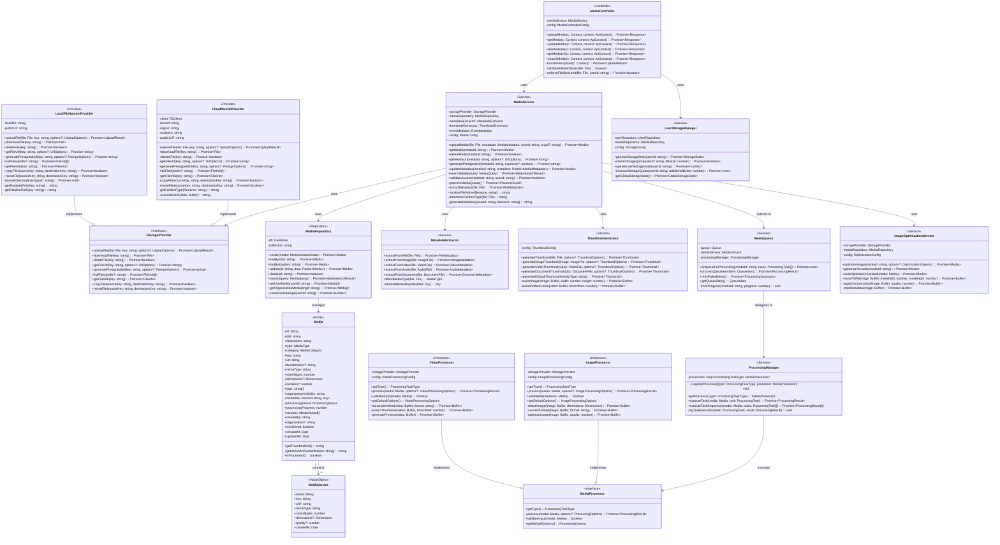

```mermaid
classDiagram
    %% File & Media Handling System
    
    class MediaService {
        <<Service>>
        -storageProvider: StorageProvider
        -mediaRepository: MediaRepository
        -metadataExtractor: MetadataExtractor
        -thumbnailGenerator: ThumbnailGenerator
        -eventMediator: EventMediator
        -config: MediaConfig
        +uploadMedia(file: File, metadata: MediaMetadata, userId: string, orgId?: string): Promise~Media~
        +getMedia(mediaId: string): Promise~Media~
        +deleteMedia(mediaId: string): Promise~boolean~
        +getMediaUrl(mediaId: string, options?: UrlOptions): Promise~string~
        +generatePresignedUrl(mediaId: string, expiresIn?: number): Promise~string~
        +updateMetadata(mediaId: string, metadata: Partial~MediaMetadata~): Promise~Media~
        +searchMedia(query: MediaQuery): Promise~MediaSearchResult~
        +validateAccess(mediaId: string, userId: string): Promise~boolean~
        +processMediaQueue(): Promise~ProcessResult~
        -extractMetadata(file: File): Promise~FileMetadata~
        -sanitizeFileName(filename: string): string
        -determineContentType(file: File): string
        -generateMediaKey(userId: string, filename: string): string
    }
    
    class StorageProvider {
        <<Interface>>
        +uploadFile(file: File, key: string, options?: UploadOptions): Promise~UploadResult~
        +downloadFile(key: string): Promise~File~
        +deleteFile(key: string): Promise~boolean~
        +getFileUrl(key: string, options?: UrlOptions): Promise~string~
        +generatePresignedUrl(key: string, options?: PresignOptions): Promise~string~
        +listFiles(prefix?: string): Promise~FileInfo[]~
        +getFileInfo(key: string): Promise~FileInfo~
        +copyFile(sourceKey: string, destinationKey: string): Promise~boolean~
        +moveFile(sourceKey: string, destinationKey: string): Promise~boolean~
    }
    
    class CloudflareR2Provider {
        <<Provider>>
        -client: R2Client
        -bucket: string
        -region: string
        -endpoint: string
        -publicUrl?: string
        +uploadFile(file: File, key: string, options?: UploadOptions): Promise~UploadResult~
        +downloadFile(key: string): Promise~File~
        +deleteFile(key: string): Promise~boolean~
        +getFileUrl(key: string, options?: UrlOptions): Promise~string~
        +generatePresignedUrl(key: string, options?: PresignOptions): Promise~string~
        +listFiles(prefix?: string): Promise~FileInfo[]~
        +getFileInfo(key: string): Promise~FileInfo~
        +copyFile(sourceKey: string, destinationKey: string): Promise~boolean~
        +moveFile(sourceKey: string, destinationKey: string): Promise~boolean~
        -getContentType(filename: string): string
        -calculateMD5(data: Buffer): string
    }
    
    class LocalFileSystemProvider {
        <<Provider>>
        -baseDir: string
        -publicUrl: string
        +uploadFile(file: File, key: string, options?: UploadOptions): Promise~UploadResult~
        +downloadFile(key: string): Promise~File~
        +deleteFile(key: string): Promise~boolean~
        +getFileUrl(key: string, options?: UrlOptions): Promise~string~
        +generatePresignedUrl(key: string, options?: PresignOptions): Promise~string~
        +listFiles(prefix?: string): Promise~FileInfo[]~
        +getFileInfo(key: string): Promise~FileInfo~
        +copyFile(sourceKey: string, destinationKey: string): Promise~boolean~
        +moveFile(sourceKey: string, destinationKey: string): Promise~boolean~
        -ensureDirectoryExists(path: string): Promise~void~
        -getAbsolutePath(key: string): string
        -getRelativePath(key: string): string
    }
    
    class MediaRepository {
        <<Repository>>
        -db: Database
        -collection: string
        +create(media: MediaCreationData): Promise~Media~
        +findById(id: string): Promise~Media~
        +findByKey(key: string): Promise~Media~
        +update(id: string, data: Partial~Media~): Promise~Media~
        +delete(id: string): Promise~boolean~
        +search(query: MediaQuery): Promise~MediaSearchResult~
        +getUserMedia(userId: string): Promise~Media[]~
        +getOrganizationMedia(orgId: string): Promise~Media[]~
        +countUserStorage(userId: string): Promise~number~
    }
    
    class MetadataExtractor {
        <<Service>>
        +extractFromFile(file: File): Promise~FileMetadata~
        +extractFromImage(file: ImageFile): Promise~ImageMetadata~
        +extractFromVideo(file: VideoFile): Promise~VideoMetadata~
        +extractFromAudio(file: AudioFile): Promise~AudioMetadata~
        +extractFromDocument(file: DocumentFile): Promise~DocumentMetadata~
        -detectMediaType(file: File): MediaType
        -sanitizeMetadata(metadata: any): any
    }
    
    class ThumbnailGenerator {
        <<Service>>
        -config: ThumbnailConfig
        +generateThumbnail(file: File, options?: ThumbnailOptions): Promise~Thumbnail~
        +generateImageThumbnail(image: ImageFile, options?: ThumbnailOptions): Promise~Thumbnail~
        +generateVideoThumbnail(video: VideoFile, options?: ThumbnailOptions): Promise~Thumbnail~
        +generateDocumentThumbnail(doc: DocumentFile, options?: ThumbnailOptions): Promise~Thumbnail~
        +generateDefaultThumbnail(mediaType: string): Promise~Thumbnail~
        -resizeImage(image: Buffer, width: number, height: number): Promise~Buffer~
        -extractVideoFrame(video: Buffer, timeOffset: number): Promise~Buffer~
    }
    
    class MediaQueue {
        <<Service>>
        -queue: Queue
        -mediaService: MediaService
        -processingManager: ProcessingManager
        +enqueueForProcessing(mediaId: string, tasks: ProcessingTask[]): Promise~void~
        +processQueueItem(item: QueueItem): Promise~ProcessingResult~
        +retryFailedItems(): Promise~ProcessingSummary~
        +getQueueStats(): QueueStats
        -trackProgress(mediaId: string, progress: number): void
    }
    
    class ProcessingManager {
        <<Service>>
        -processors: Map~ProcessingTaskType, MediaProcessor~
        +registerProcessor(type: ProcessingTaskType, processor: MediaProcessor): void
        +getProcessor(type: ProcessingTaskType): MediaProcessor
        +executeTask(media: Media, task: ProcessingTask): Promise~ProcessingResult~
        +executeTaskSequence(media: Media, tasks: ProcessingTask[]): Promise~ProcessingResult[]~
        -logTaskExecution(task: ProcessingTask, result: ProcessingResult): void
    }
    
    class MediaProcessor {
        <<Interface>>
        +getType(): ProcessingTaskType
        +process(media: Media, options?: ProcessingOptions): Promise~ProcessingResult~
        +validateInput(media: Media): boolean
        +getDefaultOptions(): ProcessingOptions
    }
    
    class ImageProcessor {
        <<Processor>>
        -storageProvider: StorageProvider
        -config: ImageProcessingConfig
        +getType(): ProcessingTaskType
        +process(media: Media, options?: ImageProcessingOptions): Promise~ProcessingResult~
        +validateInput(media: Media): boolean
        +getDefaultOptions(): ImageProcessingOptions
        -resizeImage(image: Buffer, dimensions: Dimensions): Promise~Buffer~
        -convertFormat(image: Buffer, format: string): Promise~Buffer~
        -optimizeImage(image: Buffer, quality: number): Promise~Buffer~
    }
    
    class VideoProcessor {
        <<Processor>>
        -storageProvider: StorageProvider
        -config: VideoProcessingConfig
        +getType(): ProcessingTaskType
        +process(media: Media, options?: VideoProcessingOptions): Promise~ProcessingResult~
        +validateInput(media: Media): boolean
        +getDefaultOptions(): VideoProcessingOptions
        -transcodeVideo(video: Buffer, format: string): Promise~Buffer~
        -extractThumbnail(video: Buffer, timeOffset: number): Promise~Buffer~
        -generatePreview(video: Buffer): Promise~Buffer~
    }
    
    class Media {
        <<Entity>>
        +id: string
        +title: string
        +description: string
        +type: MediaType
        +category: MediaCategory
        +key: string
        +url: string
        +thumbnailUrl?: string
        +mimeType: string
        +sizeInBytes: number
        +dimensions?: Dimensions
        +duration?: number
        +tags: string[]
        +organizationVisibility: string
        +metadata: Record~string, any~
        +processingStatus: ProcessingStatus
        +processingProgress: number
        +variants: MediaVariant[]
        +createdBy: string
        +organization?: string
        +isArchived: boolean
        +createdAt: Date
        +updatedAt: Date
        +getThumbnailUrl(): string
        +getVariantUrl(variantName: string): string
        +isProcessed(): boolean
    }
    
    class MediaVariant {
        <<ValueObject>>
        +name: string
        +key: string
        +url?: string
        +mimeType: string
        +sizeInBytes: number
        +dimensions?: Dimensions
        +quality?: number
        +createdAt: Date
    }
    
    class MediaController {
        <<Controller>>
        -mediaService: MediaService
        -config: MediaControllerConfig
        +uploadMedia(c: Context, context: ApiContext): Promise~Response~
        +getMedia(c: Context, context: ApiContext): Promise~Response~
        +updateMedia(c: Context, context: ApiContext): Promise~Response~
        +deleteMedia(c: Context, context: ApiContext): Promise~Response~
        +getMediaUrl(c: Context, context: ApiContext): Promise~Response~
        +searchMedia(c: Context, context: ApiContext): Promise~Response~
        -handleFileUpload(c: Context): Promise~UploadResult~
        -validateAllowedTypes(file: File): boolean
        -enforceFileSizeLimit(file: File, userId: string): Promise~boolean~
    }
    
    class UserStorageManager {
        <<Service>>
        -userRepository: UserRepository
        -mediaRepository: MediaRepository
        -config: StorageConfig
        +getUserStorageStats(userId: string): Promise~StorageStats~
        +checkStorageQuota(userId: string, fileSize: number): Promise~boolean~
        +updateUserStorageUsed(userId: string): Promise~number~
        +increaseStorageQuota(userId: string, additionalBytes: number): Promise~User~
        +getGlobalStorageStats(): Promise~GlobalStorageStats~
    }
    
    class ImageOptimizationService {
        <<Service>>
        -storageProvider: StorageProvider
        -mediaRepository: MediaRepository
        -config: OptimizationConfig
        +optimizeImage(mediaId: string, options?: OptimizationOptions): Promise~Media~
        +generateVariants(mediaId: string): Promise~Media~
        +autoOptimizeOnUpload(media: Media): Promise~Media~
        -resizeToFit(image: Buffer, maxWidth: number, maxHeight: number): Promise~Buffer~
        -applyCompression(image: Buffer, quality: number): Promise~Buffer~
        -stripMetadata(image: Buffer): Promise~Buffer~
    }
    
    %% Relationships
    MediaService --> StorageProvider : uses
    MediaService --> MediaRepository : uses
    MediaService --> MetadataExtractor : uses
    MediaService --> ThumbnailGenerator : uses
    
    CloudflareR2Provider --|> StorageProvider : implements
    LocalFileSystemProvider --|> StorageProvider : implements
    
    MediaService --> MediaQueue : submits to
    MediaQueue --> ProcessingManager : delegates to
    ProcessingManager --> MediaProcessor : executes
    
    ImageProcessor --|> MediaProcessor : implements
    VideoProcessor --|> MediaProcessor : implements
    
    MediaController --> MediaService : uses
    MediaController --> UserStorageManager : uses
    
    MediaRepository --> Media : manages
    Media "1" --> "0..*" MediaVariant : contains
    
    MediaService --> ImageOptimizationService : uses
```
