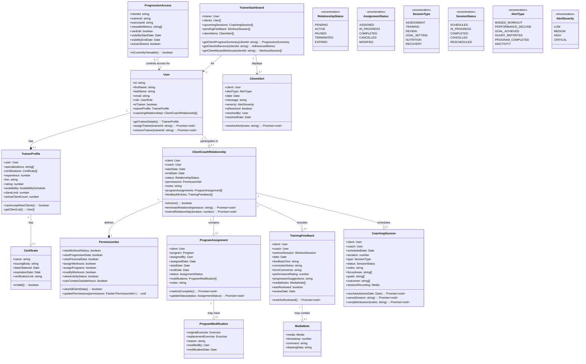

```mermaid
classDiagram
    %% Trainer-Client Relationship System

    class User {
        +id: string
        +firstName: string
        +lastName: string
        +email: string
        +role: UserRole
        +isTrainer: boolean
        +trainerProfile: TrainerProfile
        +coachingRelationships: ClientCoachRelationship[]
        +getTrainerDetails(): TrainerProfile
        +assignTrainer(trainerId: string): Promise~void~
        +removeTrainer(trainerId: string): Promise~void~
    }

    class TrainerProfile {
        +user: User
        +specializations: string[]
        +certifications: Certificate[]
        +experience: number
        +bio: string
        +rating: number
        +availability: AvailabilitySchedule
        +clientLimit: number
        +activeClientCount: number
        +canAcceptNewClients(): boolean
        +getClientList(): User[]
    }
    
    class Certificate {
        +name: string
        +issuingBody: string
        +dateObtained: Date
        +expirationDate: Date
        +verificationLink: string
        +isValid(): boolean
    }

    class ClientCoachRelationship {
        +client: User
        +coach: User
        +startDate: Date
        +endDate: Date
        +status: RelationshipStatus
        +permissions: PermissionSet
        +notes: string
        +programAssignments: ProgramAssignment[]
        +feedbackEntries: TrainingFeedback[]
        +isActive(): boolean
        +terminateRelationship(reason: string): Promise~void~
        +extendRelationship(duration: number): Promise~void~
    }

    class PermissionSet {
        +viewWorkoutHistory: boolean
        +viewProgressionData: boolean
        +viewPersonalData: boolean
        +assignWorkouts: boolean
        +assignPrograms: boolean
        +modifyWorkouts: boolean
        +viewActivityStatus: boolean
        +canContactOutsideHours: boolean
        +viewAllClientData(): boolean
        +updatePermissions(permissions: Partial~PermissionSet~): void
    }

    class ProgramAssignment {
        +client: User
        +program: Program
        +assignedBy: User
        +assignedDate: Date
        +startDate: Date
        +endDate: Date
        +status: AssignmentStatus
        +modifications: ProgramModification[]
        +notes: string
        +markAsComplete(): Promise~void~
        +updateStatus(status: AssignmentStatus): Promise~void~
    }

    class ProgramModification {
        +originalExercise: Exercise
        +replacementExercise: Exercise
        +reason: string
        +modifiedBy: User
        +modificationDate: Date
    }

    class TrainingFeedback {
        +client: User
        +coach: User
        +workoutSession: WorkoutSession
        +date: Date
        +feedbackText: string
        +correctionNotes: string
        +formComments: string
        +performanceRating: number
        +progressionSuggestions: string
        +mediaNotes: MediaNote[]
        +wasReviewed: boolean
        +reviewDate: Date
        +markAsReviewed(): Promise~void~
    }

    class MediaNote {
        +media: Media
        +timestamp: number
        +comment: string
        +drawingData: string
    }

    class CoachingSession {
        +client: User
        +coach: User
        +scheduledDate: Date
        +duration: number
        +type: SessionType
        +status: SessionStatus
        +notes: string
        +focusAreas: string[]
        +goals: string[]
        +outcomes: string[]
        +sessionRecording: Media
        +reschedule(newDate: Date): Promise~void~
        +cancel(reason: string): Promise~void~
        +completeSession(notes: string): Promise~void~
    }

    class ProgressionAccess {
        +clientId: string
        +trainerId: string
        +exerciseId: string
        +viewableMetrics: string[]
        +canEdit: boolean
        +visibilityStartDate: Date
        +visibilityEndDate: Date
        +isAutoShared: boolean
        +isCurrentlyViewable(): boolean
    }

    class TrainerDashboard {
        +trainer: User
        +clients: User[]
        +upcomingSessions: CoachingSession[]
        +pendingFeedback: WorkoutSession[]
        +clientAlerts: ClientAlert[]
        +getClientProgressSummary(clientId: string): ProgressionSummary
        +getClientAdherence(clientId: string): AdherenceMetrics
        +getClientMissedWorkouts(clientId: string): WorkoutSession[]
    }

    class ClientAlert {
        +client: User
        +alertType: AlertType
        +date: Date
        +message: string
        +severity: AlertSeverity
        +isResolved: boolean
        +resolvedBy: User
        +resolvedDate: Date
        +resolveAlert(notes: string): Promise~void~
    }

    %% Enumerations
    class RelationshipStatus {
        <<enumeration>>
        PENDING
        ACTIVE
        PAUSED
        TERMINATED
        EXPIRED
    }

    class AssignmentStatus {
        <<enumeration>>
        ASSIGNED
        IN_PROGRESS
        COMPLETED
        CANCELLED
        MODIFIED
    }

    class SessionType {
        <<enumeration>>
        ASSESSMENT
        TRAINING
        REVIEW
        GOAL_SETTING
        NUTRITION
        RECOVERY
    }

    class SessionStatus {
        <<enumeration>>
        SCHEDULED
        IN_PROGRESS
        COMPLETED
        CANCELLED
        RESCHEDULED
    }

    class AlertType {
        <<enumeration>>
        MISSED_WORKOUT
        PERFORMANCE_DECLINE
        GOAL_ACHIEVED
        INJURY_REPORTED
        PROGRAM_COMPLETED
        INACTIVITY
    }

    class AlertSeverity {
        <<enumeration>>
        LOW
        MEDIUM
        HIGH
        CRITICAL
    }

    %% Relationships
    User "1" --* "0..1" TrainerProfile : has
    User "1" --o "0..*" ClientCoachRelationship : participates in
    TrainerProfile "1" --o "0..*" Certificate : has
    
    ClientCoachRelationship "1" --* "1" PermissionSet : defines
    ClientCoachRelationship "1" --o "0..*" ProgramAssignment : contains
    ClientCoachRelationship "1" --o "0..*" TrainingFeedback : includes
    ClientCoachRelationship "1" --o "0..*" CoachingSession : schedules
    
    ProgramAssignment "1" --o "0..*" ProgramModification : may have
    TrainingFeedback "1" --o "0..*" MediaNote : may contain
    
    TrainerDashboard "1" --> "1" User : for
    TrainerDashboard "1" --> "0..*" ClientAlert : displays
    
    ProgressionAccess "0..*" --> "1" User : controls access for
```
