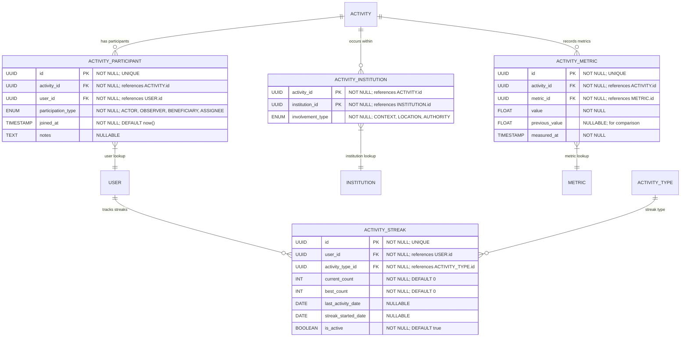

# Activity Context & Associations

**Section:** Activity
**Subsection:** Activity Context & Associations

## Diagram

## Notes

This diagram represents the activity context & associations structure and relationships within the activity domain.

---
*Generated from diagram extraction script*
