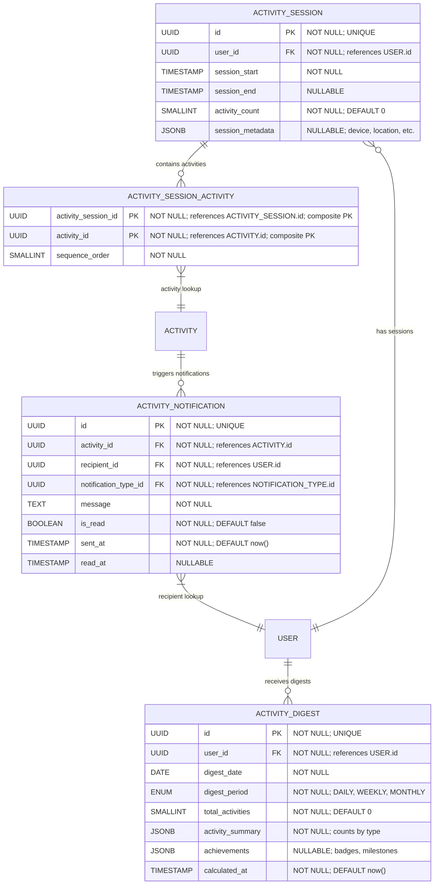

# Activity History & Analytics

**Section:** Activity
**Subsection:** Activity History & Analytics

## Diagram

## Notes

This diagram represents the activity history & analytics structure and relationships within the activity domain.

---
*Generated from diagram extraction script*
