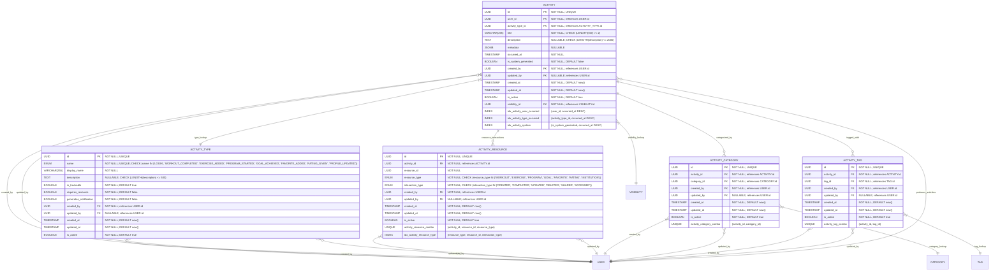

# Activity Tracking System
**Domain:** Activity
**Layer:** Core

```mermaid
erDiagram
  ACTIVITY {
    UUID id PK                        "NOT NULL; UNIQUE"
    UUID user_id FK                   "NOT NULL; references USER.id"
    UUID activity_type_id FK          "NOT NULL; references ACTIVITY_TYPE.id"
    VARCHAR(255) title                "NOT NULL; CHECK (LENGTH(title) >= 2)"
    TEXT description                  "NULLABLE; CHECK (LENGTH(description) <= 2000)"
    JSONB metadata                    "NULLABLE"
    TIMESTAMP occurred_at             "NOT NULL"
    BOOLEAN is_system_generated       "NOT NULL; DEFAULT false"
    UUID created_by FK                "NOT NULL; references USER.id"
    UUID updated_by FK                "NULLABLE; references USER.id"
    TIMESTAMP created_at              "NOT NULL; DEFAULT now()"
    TIMESTAMP updated_at              "NOT NULL; DEFAULT now()"
    BOOLEAN is_active                 "NOT NULL; DEFAULT true"
    UUID visibility_id FK             "NOT NULL; references VISIBILITY.id"
    INDEX idx_activity_user_occurred  "(user_id, occurred_at DESC)"
    INDEX idx_activity_type_occurred  "(activity_type_id, occurred_at DESC)"
    INDEX idx_activity_system         "(is_system_generated, occurred_at DESC)"
  }
  
  ACTIVITY_TYPE {
    UUID id PK                        "NOT NULL; UNIQUE"
    ENUM name                         "NOT NULL; UNIQUE; CHECK (name IN ('LOGIN', 'WORKOUT_COMPLETED', 'EXERCISE_ADDED', 'PROGRAM_STARTED', 'GOAL_ACHIEVED', 'FAVORITE_ADDED', 'RATING_GIVEN', 'PROFILE_UPDATED'))"
    VARCHAR(255) display_name         "NOT NULL"
    TEXT description                  "NULLABLE; CHECK (LENGTH(description) <= 500)"
    BOOLEAN is_trackable              "NOT NULL; DEFAULT true"
    BOOLEAN requires_resource         "NOT NULL; DEFAULT false"
    BOOLEAN generates_notification    "NOT NULL; DEFAULT false"
    UUID created_by FK                "NOT NULL; references USER.id"
    UUID updated_by FK                "NULLABLE; references USER.id"
    TIMESTAMP created_at              "NOT NULL; DEFAULT now()"
    TIMESTAMP updated_at              "NOT NULL; DEFAULT now()"
    BOOLEAN is_active                 "NOT NULL; DEFAULT true"
  }
  
  ACTIVITY_RESOURCE {
    UUID id PK                        "NOT NULL; UNIQUE"
    UUID activity_id FK               "NOT NULL; references ACTIVITY.id"
    UUID resource_id                  "NOT NULL"
    ENUM resource_type                "NOT NULL; CHECK (resource_type IN ('WORKOUT', 'EXERCISE', 'PROGRAM', 'GOAL', 'FAVORITE', 'RATING', 'INSTITUTION'))"
    ENUM interaction_type             "NOT NULL; CHECK (interaction_type IN ('CREATED', 'COMPLETED', 'UPDATED', 'DELETED', 'SHARED', 'ACCESSED'))"
    UUID created_by FK                "NOT NULL; references USER.id"
    UUID updated_by FK                "NULLABLE; references USER.id"
    TIMESTAMP created_at              "NOT NULL; DEFAULT now()"
    TIMESTAMP updated_at              "NOT NULL; DEFAULT now()"
    BOOLEAN is_active                 "NOT NULL; DEFAULT true"
    UNIQUE activity_resource_combo    "(activity_id, resource_id, resource_type)"
    INDEX idx_activity_resource_type  "(resource_type, resource_id, interaction_type)"
  }
  
  ACTIVITY_CATEGORY {
    UUID id PK                        "NOT NULL; UNIQUE"
    UUID activity_id FK               "NOT NULL; references ACTIVITY.id"
    UUID category_id FK               "NOT NULL; references CATEGORY.id"
    UUID created_by FK                "NOT NULL; references USER.id"
    UUID updated_by FK                "NULLABLE; references USER.id"
    TIMESTAMP created_at              "NOT NULL; DEFAULT now()"
    TIMESTAMP updated_at              "NOT NULL; DEFAULT now()"
    BOOLEAN is_active                 "NOT NULL; DEFAULT true"
    UNIQUE activity_category_combo    "(activity_id, category_id)"
  }
  
  ACTIVITY_TAG {
    UUID id PK                        "NOT NULL; UNIQUE"
    UUID activity_id FK               "NOT NULL; references ACTIVITY.id"
    UUID tag_id FK                    "NOT NULL; references TAG.id"
    UUID created_by FK                "NOT NULL; references USER.id"
    UUID updated_by FK                "NULLABLE; references USER.id"
    TIMESTAMP created_at              "NOT NULL; DEFAULT now()"
    TIMESTAMP updated_at              "NOT NULL; DEFAULT now()"
    BOOLEAN is_active                 "NOT NULL; DEFAULT true"
    UNIQUE activity_tag_combo         "(activity_id, tag_id)"
  }

  USER ||--o{ ACTIVITY : "performs_activities"
  ACTIVITY }|--|| ACTIVITY_TYPE : "type_lookup"
  ACTIVITY }|--|| VISIBILITY : "visibility_lookup"
  ACTIVITY ||--o{ ACTIVITY_RESOURCE : "resource_interactions"
  ACTIVITY ||--o{ ACTIVITY_CATEGORY : "categorized_by"
  ACTIVITY ||--o{ ACTIVITY_TAG : "tagged_with"
  ACTIVITY_CATEGORY }|--|| CATEGORY : "category_lookup"
  ACTIVITY_TAG }|--|| TAG : "tag_lookup"
  ACTIVITY }|--|| USER : "created_by"
  ACTIVITY }o--|| USER : "updated_by"
  ACTIVITY_TYPE }|--|| USER : "created_by"
  ACTIVITY_TYPE }o--|| USER : "updated_by"
  ACTIVITY_RESOURCE }|--|| USER : "created_by"
  ACTIVITY_RESOURCE }o--|| USER : "updated_by"
  ACTIVITY_CATEGORY }|--|| USER : "created_by"
  ACTIVITY_CATEGORY }o--|| USER : "updated_by"
  ACTIVITY_TAG }|--|| USER : "created_by"
  ACTIVITY_TAG }o--|| USER : "updated_by"
```

