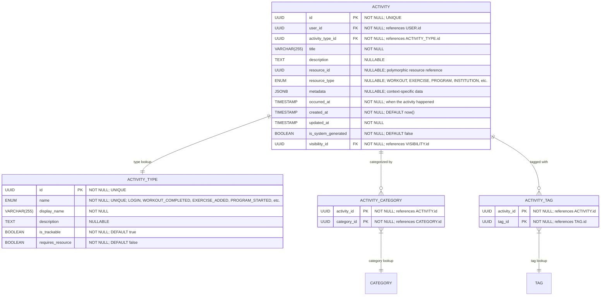

# Core "Activity" Definition & Classification

**Section:** Activity
**Subsection:** Core "Activity" Definition & Classification

## Diagram

## Notes

This diagram represents the core "activity" definition & classification structure and relationships within the activity domain.

---
*Generated from diagram extraction script*
