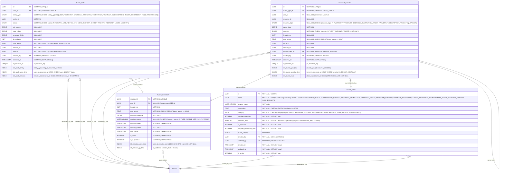

# Audit & Event Tracking
**Domain:** Audit
**Layer:** Core

```mermaid
erDiagram
  AUDIT_LOG {
    UUID id PK                        "NOT NULL; UNIQUE"
    UUID user_id FK                   "NULLABLE; references USER.id"
    ENUM entity_type                  "NOT NULL; CHECK (entity_type IN ('USER', 'WORKOUT', 'EXERCISE', 'PROGRAM', 'INSTITUTION', 'PAYMENT', 'SUBSCRIPTION', 'MEDIA', 'EQUIPMENT', 'ROLE', 'PERMISSION'))"
    UUID entity_id                    "NOT NULL"
    ENUM action                       "NOT NULL; CHECK (action IN ('CREATE', 'UPDATE', 'DELETE', 'VIEW', 'EXPORT', 'SHARE', 'ARCHIVE', 'RESTORE', 'LOGIN', 'LOGOUT'))"
    JSONB old_values                  "NULLABLE"
    JSONB new_values                  "NULLABLE"
    JSONB changed_fields              "NULLABLE"
    INET ip_address                   "NULLABLE"
    TEXT user_agent                   "NULLABLE; CHECK (LENGTH(user_agent) <= 1000)"
    UUID session_id                   "NULLABLE"
    TEXT reason                       "NULLABLE; CHECK (LENGTH(reason) <= 500)"
    UUID created_by FK                "NOT NULL; references USER.id"
    TIMESTAMP occurred_at             "NOT NULL; DEFAULT now()"
    UNIQUE id_occurred_at             "(id, occurred_at)"
    INDEX idx_audit_entity            "(entity_type, entity_id, occurred_at DESC)"
    INDEX idx_audit_user_time         "(user_id, occurred_at DESC) WHERE user_id IS NOT NULL"
    INDEX idx_audit_session           "(session_id, occurred_at DESC) WHERE session_id IS NOT NULL"
  }
  
  SYSTEM_EVENT {
    UUID id PK                        "NOT NULL; UNIQUE"
    UUID event_type_id FK             "NOT NULL; references EVENT_TYPE.id"
    UUID user_id FK                   "NULLABLE; references USER.id"
    UUID resource_id                  "NULLABLE"
    ENUM resource_type                "NULLABLE; CHECK (resource_type IN ('WORKOUT', 'PROGRAM', 'EXERCISE', 'INSTITUTION', 'USER', 'PAYMENT', 'SUBSCRIPTION', 'MEDIA', 'EQUIPMENT'))"
    JSONB event_data                  "NOT NULL"
    ENUM severity                     "NOT NULL; CHECK (severity IN ('INFO', 'WARNING', 'ERROR', 'CRITICAL'))"
    INET ip_address                   "NULLABLE"
    TEXT user_agent                   "NULLABLE; CHECK (LENGTH(user_agent) <= 1000)"
    UUID trace_id                     "NULLABLE"
    UUID session_id                   "NULLABLE"
    UUID parent_event_id FK           "NULLABLE; references SYSTEM_EVENT.id"
    UUID created_by FK                "NOT NULL; references USER.id"
    TIMESTAMP occurred_at             "NOT NULL; DEFAULT now()"
    UNIQUE id_occurred_at             "(id, occurred_at)"
    INDEX idx_event_type_time         "(event_type_id, occurred_at DESC)"
    INDEX idx_event_severity_time     "(severity, occurred_at DESC) WHERE severity IN ('ERROR', 'CRITICAL')"
    INDEX idx_event_trace             "(trace_id, occurred_at DESC) WHERE trace_id IS NOT NULL"
  }
  
  EVENT_TYPE {
    UUID id PK                        "NOT NULL; UNIQUE"
    ENUM name                         "NOT NULL; UNIQUE; CHECK (name IN ('LOGIN', 'LOGOUT', 'PASSWORD_RESET', 'SUBSCRIPTION_CHANGE', 'WORKOUT_COMPLETED', 'EXERCISE_ADDED', 'PROGRAM_STARTED', 'PAYMENT_PROCESSED', 'ERROR_OCCURRED', 'PERFORMANCE_ALERT', 'SECURITY_BREACH', 'DATA_EXPORT'))"
    VARCHAR(255) display_name         "NOT NULL"
    TEXT description                  "NOT NULL; CHECK (LENGTH(description) <= 1000)"
    ENUM category                     "NOT NULL; CHECK (category IN ('SECURITY', 'BUSINESS', 'SYSTEM', 'INTEGRATION', 'PERFORMANCE', 'USER_ACTION', 'COMPLIANCE'))"
    BOOLEAN requires_retention        "NOT NULL; DEFAULT true"
    SMALLINT retention_days           "NOT NULL; DEFAULT 90; CHECK (retention_days > 0 AND retention_days <= 2555)"
    BOOLEAN is_sensitive              "NOT NULL; DEFAULT false"
    BOOLEAN requires_immediate_alert  "NOT NULL; DEFAULT false"
    JSONB event_schema                "NULLABLE"
    UUID created_by FK                "NOT NULL; references USER.id"
    UUID updated_by FK                "NULLABLE; references USER.id"
    TIMESTAMP created_at              "NOT NULL; DEFAULT now()"
    TIMESTAMP updated_at              "NOT NULL; DEFAULT now()"
    BOOLEAN is_active                 "NOT NULL; DEFAULT true"
  }
  
  AUDIT_SESSION {
    UUID session_id PK                "NOT NULL; UNIQUE"
    UUID user_id FK                   "NULLABLE; references USER.id"
    INET ip_address                   "NOT NULL"
    TEXT user_agent                   "NOT NULL; CHECK (LENGTH(user_agent) <= 1000)"
    JSONB session_metadata            "NULLABLE"
    VARCHAR(100) session_source       "NULLABLE; CHECK (session_source IN ('WEB', 'MOBILE_APP', 'API', 'SYSTEM'))"
    TIMESTAMP session_started         "NOT NULL; DEFAULT now()"
    TIMESTAMP session_ended           "NULLABLE"
    TIMESTAMP last_activity           "NOT NULL; DEFAULT now()"
    BOOLEAN is_active                 "NOT NULL; DEFAULT true"
    BOOLEAN is_suspicious             "NOT NULL; DEFAULT false"
    INDEX idx_session_user_time       "(user_id, session_started DESC) WHERE user_id IS NOT NULL"
    INDEX idx_session_ip_time         "(ip_address, session_started DESC)"
  }

  AUDIT_LOG }o--|| USER : "performed_by_user"
  AUDIT_LOG }|--|| USER : "created_by_user"
  AUDIT_LOG }o--|| AUDIT_SESSION : "session_context"
  SYSTEM_EVENT }o--|| USER : "relates_to_user"
  SYSTEM_EVENT }|--|| EVENT_TYPE : "event_type_lookup"
  SYSTEM_EVENT }|--|| USER : "created_by_user"
  SYSTEM_EVENT }o--|| AUDIT_SESSION : "session_context"
  SYSTEM_EVENT }o--|| SYSTEM_EVENT : "parent_event"
  AUDIT_SESSION }o--|| USER : "user_session"
  EVENT_TYPE }|--|| USER : "created_by_user"
  EVENT_TYPE }o--|| USER : "updated_by_user"
```