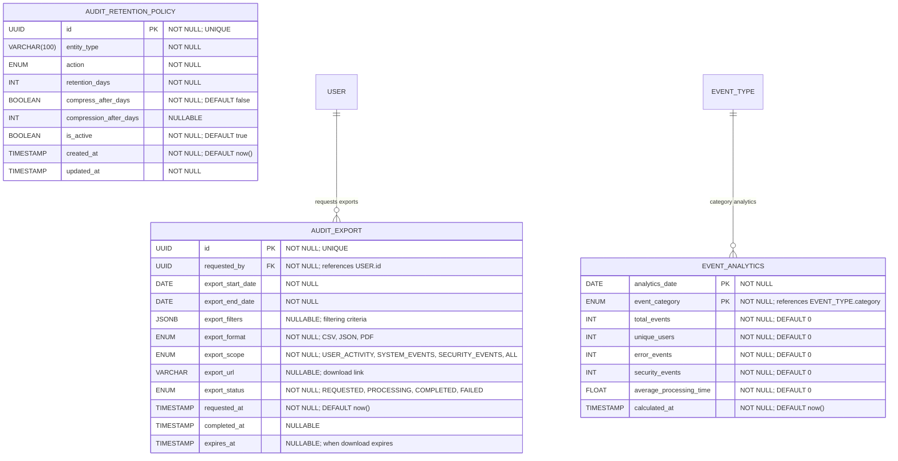

# Audit Analytics & Retention

**Section:** Audit & Events
**Subsection:** Audit Analytics & Retention

## Diagram

## Notes

This diagram represents the audit analytics & retention structure and relationships within the audit & events domain.

---
*Generated from diagram extraction script*
