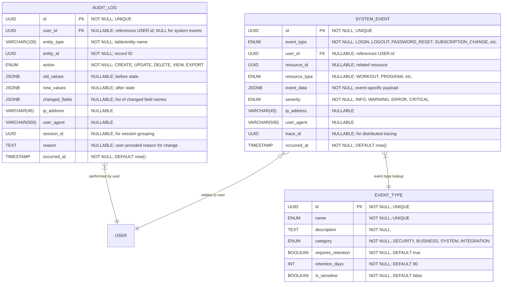

# Core "Audit" Definition & Event Tracking

**Section:** Audit & Events
**Subsection:** Core "Audit" Definition & Event Tracking

## Diagram

## Notes

This diagram represents the core "audit" definition & event tracking structure and relationships within the audit & events domain.

---
*Generated from diagram extraction script*
