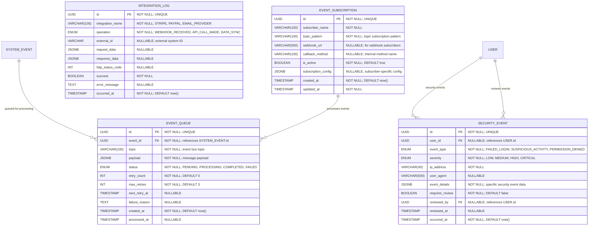

# Event Bus & Integration Tracking

**Section:** Audit & Events
**Subsection:** Event Bus & Integration Tracking

## Diagram

## Notes

This diagram represents the event bus & integration tracking structure and relationships within the audit & events domain.

---
*Generated from diagram extraction script*
