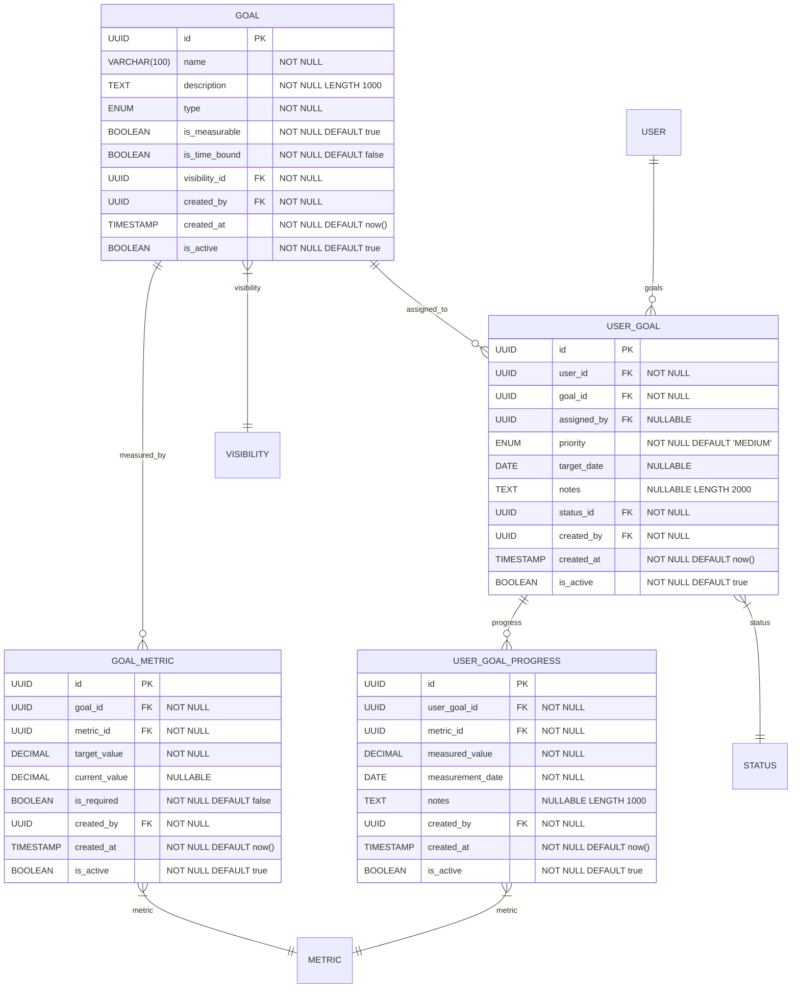

# Goals Management

```mermaid
erDiagram
    GOAL {
        UUID id PK
        VARCHAR(100) name "NOT NULL"
        TEXT description "NOT NULL LENGTH 1000"
        ENUM type "NOT NULL"
        BOOLEAN is_measurable "NOT NULL DEFAULT true"
        BOOLEAN is_time_bound "NOT NULL DEFAULT false"
        UUID visibility_id FK "NOT NULL"
        UUID created_by FK "NOT NULL"
        TIMESTAMP created_at "NOT NULL DEFAULT now()"
        BOOLEAN is_active "NOT NULL DEFAULT true"
    }
    USER_GOAL {
        UUID id PK
        UUID user_id FK "NOT NULL"
        UUID goal_id FK "NOT NULL"
        UUID assigned_by FK "NULLABLE"
        ENUM priority "NOT NULL DEFAULT 'MEDIUM'"
        DATE target_date "NULLABLE"
        TEXT notes "NULLABLE LENGTH 2000"
        UUID status_id FK "NOT NULL"
        UUID created_by FK "NOT NULL"
        TIMESTAMP created_at "NOT NULL DEFAULT now()"
        BOOLEAN is_active "NOT NULL DEFAULT true"
    }
    GOAL_METRIC {
        UUID id PK
        UUID goal_id FK "NOT NULL"
        UUID metric_id FK "NOT NULL"
        DECIMAL target_value "NOT NULL"
        DECIMAL current_value "NULLABLE"
        BOOLEAN is_required "NOT NULL DEFAULT false"
        UUID created_by FK "NOT NULL"
        TIMESTAMP created_at "NOT NULL DEFAULT now()"
        BOOLEAN is_active "NOT NULL DEFAULT true"
    }
    USER_GOAL_PROGRESS {
        UUID id PK
        UUID user_goal_id FK "NOT NULL"
        UUID metric_id FK "NOT NULL"
        DECIMAL measured_value "NOT NULL"
        DATE measurement_date "NOT NULL"
        TEXT notes "NULLABLE LENGTH 1000"
        UUID created_by FK "NOT NULL"
        TIMESTAMP created_at "NOT NULL DEFAULT now()"
        BOOLEAN is_active "NOT NULL DEFAULT true"
    }
    GOAL ||--o{ USER_GOAL : "assigned_to"
    GOAL ||--o{ GOAL_METRIC : "measured_by"
    USER_GOAL ||--o{ USER_GOAL_PROGRESS : "progress"
    USER ||--o{ USER_GOAL : "goals"
    USER_GOAL }|--|| STATUS : "status"
    GOAL_METRIC }|--|| METRIC : "metric"
    USER_GOAL_PROGRESS }|--|| METRIC : "metric"
    GOAL }|--|| VISIBILITY : "visibility"
```

