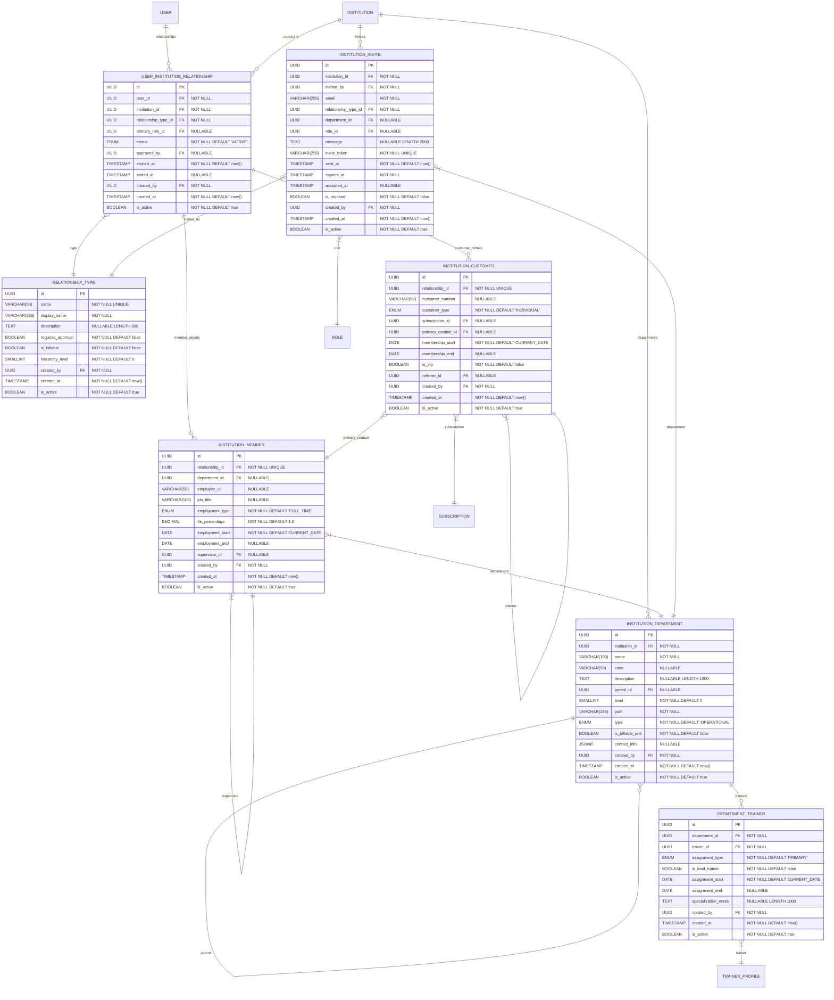

# Institution Organization & Relationships

```mermaid
erDiagram
    RELATIONSHIP_TYPE {
        UUID id PK
        VARCHAR(50) name "NOT NULL UNIQUE"
        VARCHAR(255) display_name "NOT NULL"
        TEXT description "NULLABLE LENGTH 500"
        BOOLEAN requires_approval "NOT NULL DEFAULT false"
        BOOLEAN is_billable "NOT NULL DEFAULT false"
        SMALLINT hierarchy_level "NOT NULL DEFAULT 0"
        UUID created_by FK "NOT NULL"
        TIMESTAMP created_at "NOT NULL DEFAULT now()"
        BOOLEAN is_active "NOT NULL DEFAULT true"
    }
    USER_INSTITUTION_RELATIONSHIP {
        UUID id PK
        UUID user_id FK "NOT NULL"
        UUID institution_id FK "NOT NULL"
        UUID relationship_type_id FK "NOT NULL"
        UUID primary_role_id FK "NULLABLE"
        ENUM status "NOT NULL DEFAULT 'ACTIVE'"
        UUID approved_by FK "NULLABLE"
        TIMESTAMP started_at "NOT NULL DEFAULT now()"
        TIMESTAMP ended_at "NULLABLE"
        UUID created_by FK "NOT NULL"
        TIMESTAMP created_at "NOT NULL DEFAULT now()"
        BOOLEAN is_active "NOT NULL DEFAULT true"
    }
    INSTITUTION_DEPARTMENT {
        UUID id PK
        UUID institution_id FK "NOT NULL"
        VARCHAR(100) name "NOT NULL"
        VARCHAR(50) code "NULLABLE"
        TEXT description "NULLABLE LENGTH 1000"
        UUID parent_id FK "NULLABLE"
        SMALLINT level "NOT NULL DEFAULT 0"
        VARCHAR(255) path "NOT NULL"
        ENUM type "NOT NULL DEFAULT 'OPERATIONAL'"
        BOOLEAN is_billable_unit "NOT NULL DEFAULT false"
        JSONB contact_info "NULLABLE"
        UUID created_by FK "NOT NULL"
        TIMESTAMP created_at "NOT NULL DEFAULT now()"
        BOOLEAN is_active "NOT NULL DEFAULT true"
    }
    INSTITUTION_MEMBER {
        UUID id PK
        UUID relationship_id FK "NOT NULL UNIQUE"
        UUID department_id FK "NULLABLE"
        VARCHAR(50) employee_id "NULLABLE"
        VARCHAR(100) job_title "NULLABLE"
        ENUM employment_type "NOT NULL DEFAULT 'FULL_TIME'"
        DECIMAL fte_percentage "NOT NULL DEFAULT 1.0"
        DATE employment_start "NOT NULL DEFAULT CURRENT_DATE"
        DATE employment_end "NULLABLE"
        UUID supervisor_id FK "NULLABLE"
        UUID created_by FK "NOT NULL"
        TIMESTAMP created_at "NOT NULL DEFAULT now()"
        BOOLEAN is_active "NOT NULL DEFAULT true"
    }
    INSTITUTION_CUSTOMER {
        UUID id PK
        UUID relationship_id FK "NOT NULL UNIQUE"
        VARCHAR(50) customer_number "NULLABLE"
        ENUM customer_type "NOT NULL DEFAULT 'INDIVIDUAL'"
        UUID subscription_id FK "NULLABLE"
        UUID primary_contact_id FK "NULLABLE"
        DATE membership_start "NOT NULL DEFAULT CURRENT_DATE"
        DATE membership_end "NULLABLE"
        BOOLEAN is_vip "NOT NULL DEFAULT false"
        UUID referrer_id FK "NULLABLE"
        UUID created_by FK "NOT NULL"
        TIMESTAMP created_at "NOT NULL DEFAULT now()"
        BOOLEAN is_active "NOT NULL DEFAULT true"
    }
    INSTITUTION_INVITE {
        UUID id PK
        UUID institution_id FK "NOT NULL"
        UUID invited_by FK "NOT NULL"
        VARCHAR(255) email "NOT NULL"
        UUID relationship_type_id FK "NOT NULL"
        UUID department_id FK "NULLABLE"
        UUID role_id FK "NULLABLE"
        TEXT message "NULLABLE LENGTH 2000"
        VARCHAR(255) invite_token "NOT NULL UNIQUE"
        TIMESTAMP sent_at "NOT NULL DEFAULT now()"
        TIMESTAMP expires_at "NOT NULL"
        TIMESTAMP accepted_at "NULLABLE"
        BOOLEAN is_revoked "NOT NULL DEFAULT false"
        UUID created_by FK "NOT NULL"
        TIMESTAMP created_at "NOT NULL DEFAULT now()"
        BOOLEAN is_active "NOT NULL DEFAULT true"
    }
    DEPARTMENT_TRAINER {
        UUID id PK
        UUID department_id FK "NOT NULL"
        UUID trainer_id FK "NOT NULL"
        ENUM assignment_type "NOT NULL DEFAULT 'PRIMARY'"
        BOOLEAN is_lead_trainer "NOT NULL DEFAULT false"
        DATE assignment_start "NOT NULL DEFAULT CURRENT_DATE"
        DATE assignment_end "NULLABLE"
        TEXT specialization_notes "NULLABLE LENGTH 1000"
        UUID created_by FK "NOT NULL"
        TIMESTAMP created_at "NOT NULL DEFAULT now()"
        BOOLEAN is_active "NOT NULL DEFAULT true"
    }
    USER ||--o{ USER_INSTITUTION_RELATIONSHIP : "relationships"
    INSTITUTION ||--o{ USER_INSTITUTION_RELATIONSHIP : "members"
    INSTITUTION ||--o{ INSTITUTION_DEPARTMENT : "departments"
    INSTITUTION ||--o{ INSTITUTION_INVITE : "invites"
    USER_INSTITUTION_RELATIONSHIP }|--|| RELATIONSHIP_TYPE : "type"
    USER_INSTITUTION_RELATIONSHIP ||--o{ INSTITUTION_MEMBER : "member_details"
    USER_INSTITUTION_RELATIONSHIP ||--o{ INSTITUTION_CUSTOMER : "customer_details"
    INSTITUTION_MEMBER }|--|| INSTITUTION_DEPARTMENT : "department"
    INSTITUTION_MEMBER }|--|| INSTITUTION_MEMBER : "supervisor"
    INSTITUTION_CUSTOMER }|--|| SUBSCRIPTION : "subscription"
    INSTITUTION_CUSTOMER }|--|| INSTITUTION_MEMBER : "primary_contact"
    INSTITUTION_CUSTOMER }|--|| INSTITUTION_CUSTOMER : "referrer"
    INSTITUTION_DEPARTMENT ||--o{ INSTITUTION_DEPARTMENT : "parent"
    INSTITUTION_DEPARTMENT ||--o{ DEPARTMENT_TRAINER : "trainers"
    INSTITUTION_INVITE }|--|| RELATIONSHIP_TYPE : "invited_as"
    INSTITUTION_INVITE }|--|| INSTITUTION_DEPARTMENT : "department"
    INSTITUTION_INVITE }|--|| ROLE : "role"
    DEPARTMENT_TRAINER }|--|| TRAINER_PROFILE : "trainer"
```

