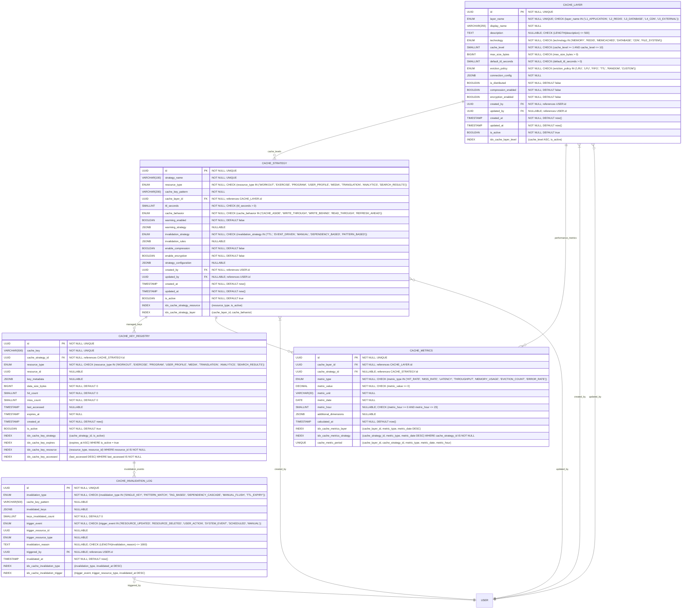

# Cache Management System
**Domain:** Cache
**Layer:** Core

```mermaid
erDiagram
  CACHE_LAYER {
    UUID id PK                        "NOT NULL; UNIQUE"
    ENUM layer_name                   "NOT NULL; UNIQUE; CHECK (layer_name IN ('L1_APPLICATION', 'L2_REDIS', 'L3_DATABASE', 'L4_CDN', 'L5_EXTERNAL'))"
    VARCHAR(255) display_name         "NOT NULL"
    TEXT description                  "NULLABLE; CHECK (LENGTH(description) <= 500)"
    ENUM technology                   "NOT NULL; CHECK (technology IN ('MEMORY', 'REDIS', 'MEMCACHED', 'DATABASE', 'CDN', 'FILE_SYSTEM'))"
    SMALLINT cache_level              "NOT NULL; CHECK (cache_level >= 1 AND cache_level <= 10)"
    BIGINT max_size_bytes             "NOT NULL; CHECK (max_size_bytes > 0)"
    SMALLINT default_ttl_seconds      "NOT NULL; CHECK (default_ttl_seconds > 0)"
    ENUM eviction_policy              "NOT NULL; CHECK (eviction_policy IN ('LRU', 'LFU', 'FIFO', 'TTL', 'RANDOM', 'CUSTOM'))"
    JSONB connection_config           "NOT NULL"
    BOOLEAN is_distributed            "NOT NULL; DEFAULT false"
    BOOLEAN compression_enabled       "NOT NULL; DEFAULT false"
    BOOLEAN encryption_enabled        "NOT NULL; DEFAULT false"
    UUID created_by FK                "NOT NULL; references USER.id"
    UUID updated_by FK                "NULLABLE; references USER.id"
    TIMESTAMP created_at              "NOT NULL; DEFAULT now()"
    TIMESTAMP updated_at              "NOT NULL; DEFAULT now()"
    BOOLEAN is_active                 "NOT NULL; DEFAULT true"
    INDEX idx_cache_layer_level       "(cache_level ASC, is_active)"
  }
  
  CACHE_STRATEGY {
    UUID id PK                        "NOT NULL; UNIQUE"
    VARCHAR(100) strategy_name        "NOT NULL; UNIQUE"
    ENUM resource_type                "NOT NULL; CHECK (resource_type IN ('WORKOUT', 'EXERCISE', 'PROGRAM', 'USER_PROFILE', 'MEDIA', 'TRANSLATION', 'ANALYTICS', 'SEARCH_RESULTS'))"
    VARCHAR(200) cache_key_pattern    "NOT NULL"
    UUID cache_layer_id FK            "NOT NULL; references CACHE_LAYER.id"
    SMALLINT ttl_seconds              "NOT NULL; CHECK (ttl_seconds > 0)"
    ENUM cache_behavior               "NOT NULL; CHECK (cache_behavior IN ('CACHE_ASIDE', 'WRITE_THROUGH', 'WRITE_BEHIND', 'READ_THROUGH', 'REFRESH_AHEAD'))"
    BOOLEAN warming_enabled           "NOT NULL; DEFAULT false"
    JSONB warming_strategy            "NULLABLE"
    ENUM invalidation_strategy        "NOT NULL; CHECK (invalidation_strategy IN ('TTL', 'EVENT_DRIVEN', 'MANUAL', 'DEPENDENCY_BASED', 'PATTERN_BASED'))"
    JSONB invalidation_rules          "NULLABLE"
    BOOLEAN enable_compression        "NOT NULL; DEFAULT false"
    BOOLEAN enable_encryption         "NOT NULL; DEFAULT false"
    JSONB strategy_configuration      "NULLABLE"
    UUID created_by FK                "NOT NULL; references USER.id"
    UUID updated_by FK                "NULLABLE; references USER.id"
    TIMESTAMP created_at              "NOT NULL; DEFAULT now()"
    TIMESTAMP updated_at              "NOT NULL; DEFAULT now()"
    BOOLEAN is_active                 "NOT NULL; DEFAULT true"
    INDEX idx_cache_strategy_resource "(resource_type, is_active)"
    INDEX idx_cache_strategy_layer    "(cache_layer_id, cache_behavior)"
  }
  
  CACHE_KEY_REGISTRY {
    UUID id PK                        "NOT NULL; UNIQUE"
    VARCHAR(500) cache_key            "NOT NULL; UNIQUE"
    UUID cache_strategy_id FK         "NOT NULL; references CACHE_STRATEGY.id"
    ENUM resource_type                "NOT NULL; CHECK (resource_type IN ('WORKOUT', 'EXERCISE', 'PROGRAM', 'USER_PROFILE', 'MEDIA', 'TRANSLATION', 'ANALYTICS', 'SEARCH_RESULTS'))"
    UUID resource_id                  "NULLABLE"
    JSONB key_metadata                "NULLABLE"
    BIGINT data_size_bytes            "NOT NULL; DEFAULT 0"
    SMALLINT hit_count                "NOT NULL; DEFAULT 0"
    SMALLINT miss_count               "NOT NULL; DEFAULT 0"
    TIMESTAMP last_accessed           "NULLABLE"
    TIMESTAMP expires_at              "NOT NULL"
    TIMESTAMP created_at              "NOT NULL; DEFAULT now()"
    BOOLEAN is_active                 "NOT NULL; DEFAULT true"
    INDEX idx_cache_key_strategy      "(cache_strategy_id, is_active)"
    INDEX idx_cache_key_expires       "(expires_at ASC) WHERE is_active = true"
    INDEX idx_cache_key_resource      "(resource_type, resource_id) WHERE resource_id IS NOT NULL"
    INDEX idx_cache_key_accessed      "(last_accessed DESC) WHERE last_accessed IS NOT NULL"
  }
  
  CACHE_METRICS {
    UUID id PK                        "NOT NULL; UNIQUE"
    UUID cache_layer_id FK            "NOT NULL; references CACHE_LAYER.id"
    UUID cache_strategy_id FK         "NULLABLE; references CACHE_STRATEGY.id"
    ENUM metric_type                  "NOT NULL; CHECK (metric_type IN ('HIT_RATE', 'MISS_RATE', 'LATENCY', 'THROUGHPUT', 'MEMORY_USAGE', 'EVICTION_COUNT', 'ERROR_RATE'))"
    DECIMAL metric_value              "NOT NULL; CHECK (metric_value >= 0)"
    VARCHAR(20) metric_unit           "NOT NULL"
    DATE metric_date                  "NOT NULL"
    SMALLINT metric_hour              "NULLABLE; CHECK (metric_hour >= 0 AND metric_hour <= 23)"
    JSONB additional_dimensions       "NULLABLE"
    TIMESTAMP calculated_at           "NOT NULL; DEFAULT now()"
    INDEX idx_cache_metrics_layer     "(cache_layer_id, metric_type, metric_date DESC)"
    INDEX idx_cache_metrics_strategy  "(cache_strategy_id, metric_type, metric_date DESC) WHERE cache_strategy_id IS NOT NULL"
    UNIQUE cache_metric_period        "(cache_layer_id, cache_strategy_id, metric_type, metric_date, metric_hour)"
  }
  
  CACHE_INVALIDATION_LOG {
    UUID id PK                        "NOT NULL; UNIQUE"
    ENUM invalidation_type            "NOT NULL; CHECK (invalidation_type IN ('SINGLE_KEY', 'PATTERN_MATCH', 'TAG_BASED', 'DEPENDENCY_CASCADE', 'MANUAL_FLUSH', 'TTL_EXPIRY'))"
    VARCHAR(500) cache_key_pattern    "NULLABLE"
    JSONB invalidated_keys            "NULLABLE"
    SMALLINT keys_invalidated_count   "NOT NULL; DEFAULT 0"
    ENUM trigger_event                "NOT NULL; CHECK (trigger_event IN ('RESOURCE_UPDATED', 'RESOURCE_DELETED', 'USER_ACTION', 'SYSTEM_EVENT', 'SCHEDULED', 'MANUAL'))"
    UUID trigger_resource_id          "NULLABLE"
    ENUM trigger_resource_type        "NULLABLE"
    TEXT invalidation_reason          "NULLABLE; CHECK (LENGTH(invalidation_reason) <= 1000)"
    UUID triggered_by FK              "NULLABLE; references USER.id"
    TIMESTAMP invalidated_at          "NOT NULL; DEFAULT now()"
    INDEX idx_cache_invalidation_type "(invalidation_type, invalidated_at DESC)"
    INDEX idx_cache_invalidation_trigger "(trigger_event, trigger_resource_type, invalidated_at DESC)"
  }

  CACHE_LAYER ||--o{ CACHE_STRATEGY : "cache_levels"
  CACHE_STRATEGY ||--o{ CACHE_KEY_REGISTRY : "managed_keys"
  CACHE_LAYER ||--o{ CACHE_METRICS : "performance_metrics"
  CACHE_STRATEGY ||--o{ CACHE_METRICS : "strategy_metrics"
  CACHE_KEY_REGISTRY ||--o{ CACHE_INVALIDATION_LOG : "invalidation_events"
  CACHE_INVALIDATION_LOG }o--|| USER : "triggered_by"
  CACHE_LAYER }|--|| USER : "created_by"
  CACHE_LAYER }o--|| USER : "updated_by"
  CACHE_STRATEGY }|--|| USER : "created_by"
  CACHE_STRATEGY }o--|| USER : "updated_by"
```

