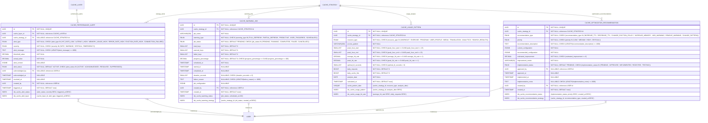

# Cache Monitoring & Analytics
**Domain:** Cache
**Layer:** Analytics

```mermaid
erDiagram
  CACHE_PERFORMANCE_ALERT {
    UUID id PK                        "NOT NULL; UNIQUE"
    UUID cache_layer_id FK            "NOT NULL; references CACHE_LAYER.id"
    UUID cache_strategy_id FK         "NULLABLE; references CACHE_STRATEGY.id"
    ENUM alert_type                   "NOT NULL; CHECK (alert_type IN ('HIT_RATE_LOW', 'LATENCY_HIGH', 'MEMORY_USAGE_HIGH', 'ERROR_RATE_HIGH', 'EVICTION_RATE_HIGH', 'CONNECTION_FAILURE'))"
    ENUM severity                     "NOT NULL; CHECK (severity IN ('INFO', 'WARNING', 'CRITICAL', 'EMERGENCY'))"
    TEXT alert_message                "NOT NULL; CHECK (LENGTH(alert_message) <= 1000)"
    DECIMAL threshold_value           "NOT NULL"
    DECIMAL actual_value              "NOT NULL"
    JSONB alert_context               "NULLABLE"
    ENUM alert_status                 "NOT NULL; DEFAULT 'ACTIVE'; CHECK (alert_status IN ('ACTIVE', 'ACKNOWLEDGED', 'RESOLVED', 'SUPPRESSED'))"
    UUID acknowledged_by FK           "NULLABLE; references USER.id"
    TIMESTAMP acknowledged_at         "NULLABLE"
    TIMESTAMP resolved_at             "NULLABLE"
    UUID created_by FK                "NOT NULL; references USER.id"
    TIMESTAMP triggered_at            "NOT NULL; DEFAULT now()"
    INDEX idx_cache_alert_status      "(alert_status, severity DESC, triggered_at DESC)"
    INDEX idx_cache_alert_layer       "(cache_layer_id, alert_type, triggered_at DESC)"
  }
  
  CACHE_WARMING_JOB {
    UUID id PK                        "NOT NULL; UNIQUE"
    UUID cache_strategy_id FK         "NOT NULL; references CACHE_STRATEGY.id"
    VARCHAR(200) job_name             "NOT NULL"
    ENUM warming_type                 "NOT NULL; CHECK (warming_type IN ('FULL_REFRESH', 'PARTIAL_REFRESH', 'PREDICTIVE', 'USER_TRIGGERED', 'SCHEDULED'))"
    ENUM job_status                   "NOT NULL; DEFAULT 'PENDING'; CHECK (job_status IN ('PENDING', 'RUNNING', 'COMPLETED', 'FAILED', 'CANCELLED'))"
    SMALLINT total_keys               "NOT NULL; DEFAULT 0"
    SMALLINT warmed_keys              "NOT NULL; DEFAULT 0"
    SMALLINT failed_keys              "NOT NULL; DEFAULT 0"
    DECIMAL progress_percentage       "NOT NULL; DEFAULT 0; CHECK (progress_percentage >= 0 AND progress_percentage <= 100)"
    TIMESTAMP scheduled_at            "NOT NULL"
    TIMESTAMP started_at              "NULLABLE"
    TIMESTAMP completed_at            "NULLABLE"
    SMALLINT duration_seconds         "NULLABLE; CHECK (duration_seconds >= 0)"
    TEXT failure_reason               "NULLABLE; CHECK (LENGTH(failure_reason) <= 1000)"
    JSONB job_configuration           "NULLABLE"
    UUID created_by FK                "NOT NULL; references USER.id"
    TIMESTAMP created_at              "NOT NULL; DEFAULT now()"
    INDEX idx_cache_warming_status    "(job_status, scheduled_at ASC)"
    INDEX idx_cache_warming_strategy  "(cache_strategy_id, job_status, created_at DESC)"
  }
  
  CACHE_USAGE_PATTERN {
    UUID id PK                        "NOT NULL; UNIQUE"
    UUID cache_strategy_id FK         "NOT NULL; references CACHE_STRATEGY.id"
    ENUM resource_type                "NOT NULL; CHECK (resource_type IN ('WORKOUT', 'EXERCISE', 'PROGRAM', 'USER_PROFILE', 'MEDIA', 'TRANSLATION', 'ANALYTICS', 'SEARCH_RESULTS'))"
    VARCHAR(200) access_pattern       "NOT NULL"
    SMALLINT peak_hour_start          "NOT NULL; CHECK (peak_hour_start >= 0 AND peak_hour_start <= 23)"
    SMALLINT peak_hour_end            "NOT NULL; CHECK (peak_hour_end >= 0 AND peak_hour_end <= 23)"
    DECIMAL average_hit_rate          "NOT NULL; CHECK (average_hit_rate >= 0 AND average_hit_rate <= 1)"
    DECIMAL peak_hit_rate             "NOT NULL; CHECK (peak_hit_rate >= 0 AND peak_hit_rate <= 1)"
    SMALLINT optimal_ttl_seconds      "NOT NULL; CHECK (optimal_ttl_seconds > 0)"
    BIGINT daily_requests             "NOT NULL; DEFAULT 0"
    BIGINT daily_cache_hits           "NOT NULL; DEFAULT 0"
    DATE analysis_date                "NOT NULL"
    TIMESTAMP calculated_at           "NOT NULL; DEFAULT now()"
    UNIQUE cache_pattern_date         "(cache_strategy_id, resource_type, analysis_date)"
    INDEX idx_cache_usage_pattern     "(cache_strategy_id, analysis_date DESC)"
    INDEX idx_cache_usage_hit_rate    "(average_hit_rate DESC, daily_requests DESC)"
  }
  
  CACHE_OPTIMIZATION_RECOMMENDATION {
    UUID id PK                        "NOT NULL; UNIQUE"
    UUID cache_strategy_id FK         "NOT NULL; references CACHE_STRATEGY.id"
    ENUM recommendation_type          "NOT NULL; CHECK (recommendation_type IN ('INCREASE_TTL', 'DECREASE_TTL', 'CHANGE_EVICTION_POLICY', 'INCREASE_MEMORY', 'ADD_WARMING', 'REMOVE_WARMING', 'CHANGE_PATTERN'))"
    ENUM priority                     "NOT NULL; CHECK (priority IN ('LOW', 'MEDIUM', 'HIGH', 'CRITICAL'))"
    TEXT recommendation_description   "NOT NULL; CHECK (LENGTH(recommendation_description) <= 1000)"
    JSONB current_configuration       "NOT NULL"
    JSONB recommended_configuration   "NOT NULL"
    DECIMAL estimated_improvement     "NOT NULL; CHECK (estimated_improvement >= 0)"
    VARCHAR(50) improvement_metric    "NOT NULL"
    ENUM implementation_status        "NOT NULL; DEFAULT 'PENDING'; CHECK (implementation_status IN ('PENDING', 'APPROVED', 'IMPLEMENTED', 'REJECTED', 'TESTING'))"
    UUID approved_by FK               "NULLABLE; references USER.id"
    TIMESTAMP approved_at             "NULLABLE"
    TIMESTAMP implemented_at          "NULLABLE"
    TEXT implementation_notes         "NULLABLE; CHECK (LENGTH(implementation_notes) <= 2000)"
    UUID created_by FK                "NOT NULL; references USER.id"
    TIMESTAMP created_at              "NOT NULL; DEFAULT now()"
    INDEX idx_cache_recommendation_status "(implementation_status, priority DESC, created_at DESC)"
    INDEX idx_cache_recommendation_strategy "(cache_strategy_id, recommendation_type, created_at DESC)"
  }

  CACHE_LAYER ||--o{ CACHE_PERFORMANCE_ALERT : "performance_alerts"
  CACHE_STRATEGY ||--o{ CACHE_PERFORMANCE_ALERT : "strategy_alerts"
  CACHE_STRATEGY ||--o{ CACHE_WARMING_JOB : "warming_jobs"
  CACHE_STRATEGY ||--o{ CACHE_USAGE_PATTERN : "usage_analysis"
  CACHE_STRATEGY ||--o{ CACHE_OPTIMIZATION_RECOMMENDATION : "optimization_recommendations"
  CACHE_PERFORMANCE_ALERT }o--|| USER : "acknowledged_by"
  CACHE_WARMING_JOB }|--|| USER : "created_by"
  CACHE_OPTIMIZATION_RECOMMENDATION }o--|| USER : "approved_by"
  CACHE_PERFORMANCE_ALERT }|--|| USER : "created_by"
  CACHE_OPTIMIZATION_RECOMMENDATION }|--|| USER : "created_by"
```