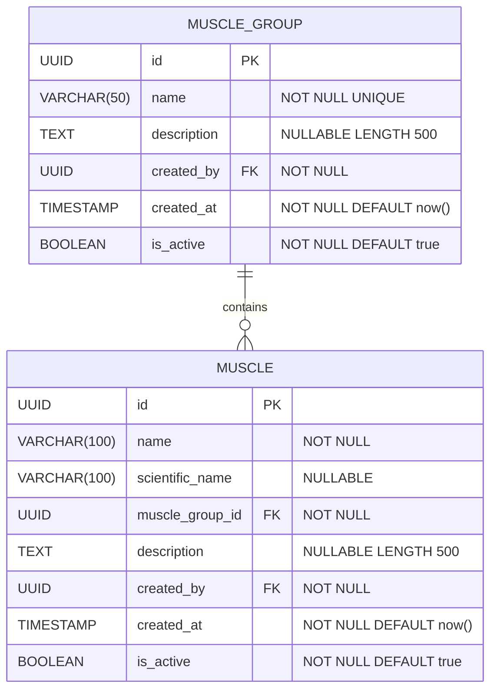

# Muscles & Anatomy

```mermaid
erDiagram
    MUSCLE_GROUP {
        UUID id PK
        VARCHAR(50) name "NOT NULL UNIQUE"
        TEXT description "NULLABLE LENGTH 500"
        UUID created_by FK "NOT NULL"
        TIMESTAMP created_at "NOT NULL DEFAULT now()"
        BOOLEAN is_active "NOT NULL DEFAULT true"
    }
    MUSCLE {
        UUID id PK
        VARCHAR(100) name "NOT NULL"
        VARCHAR(100) scientific_name "NULLABLE"
        UUID muscle_group_id FK "NOT NULL"
        TEXT description "NULLABLE LENGTH 500"
        UUID created_by FK "NOT NULL"
        TIMESTAMP created_at "NOT NULL DEFAULT now()"
        BOOLEAN is_active "NOT NULL DEFAULT true"
    }
    MUSCLE_GROUP ||--o{ MUSCLE : "contains"
```

