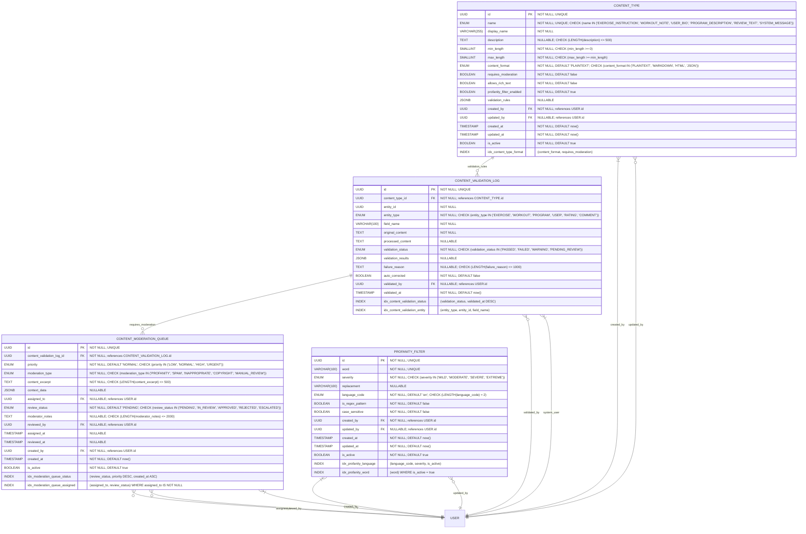

# Content Management & Text Constraints
**Domain:** Core
**Layer:** Content

```mermaid
erDiagram
  CONTENT_TYPE {
    UUID id PK                        "NOT NULL; UNIQUE"
    ENUM name                         "NOT NULL; UNIQUE; CHECK (name IN ('EXERCISE_INSTRUCTION', 'WORKOUT_NOTE', 'USER_BIO', 'PROGRAM_DESCRIPTION', 'REVIEW_TEXT', 'SYSTEM_MESSAGE'))"
    VARCHAR(255) display_name         "NOT NULL"
    TEXT description                  "NULLABLE; CHECK (LENGTH(description) <= 500)"
    SMALLINT min_length               "NOT NULL; CHECK (min_length >= 0)"
    SMALLINT max_length               "NOT NULL; CHECK (max_length >= min_length)"
    ENUM content_format               "NOT NULL; DEFAULT 'PLAINTEXT'; CHECK (content_format IN ('PLAINTEXT', 'MARKDOWN', 'HTML', 'JSON'))"
    BOOLEAN requires_moderation       "NOT NULL; DEFAULT false"
    BOOLEAN allows_rich_text          "NOT NULL; DEFAULT false"
    BOOLEAN profanity_filter_enabled  "NOT NULL; DEFAULT true"
    JSONB validation_rules            "NULLABLE"
    UUID created_by FK                "NOT NULL; references USER.id"
    UUID updated_by FK                "NULLABLE; references USER.id"
    TIMESTAMP created_at              "NOT NULL; DEFAULT now()"
    TIMESTAMP updated_at              "NOT NULL; DEFAULT now()"
    BOOLEAN is_active                 "NOT NULL; DEFAULT true"
    INDEX idx_content_type_format     "(content_format, requires_moderation)"
  }
  
  CONTENT_VALIDATION_LOG {
    UUID id PK                        "NOT NULL; UNIQUE"
    UUID content_type_id FK           "NOT NULL; references CONTENT_TYPE.id"
    UUID entity_id                    "NOT NULL"
    ENUM entity_type                  "NOT NULL; CHECK (entity_type IN ('EXERCISE', 'WORKOUT', 'PROGRAM', 'USER', 'RATING', 'COMMENT'))"
    VARCHAR(100) field_name           "NOT NULL"
    TEXT original_content             "NOT NULL"
    TEXT processed_content            "NULLABLE"
    ENUM validation_status            "NOT NULL; CHECK (validation_status IN ('PASSED', 'FAILED', 'WARNING', 'PENDING_REVIEW'))"
    JSONB validation_results          "NULLABLE"
    TEXT failure_reason               "NULLABLE; CHECK (LENGTH(failure_reason) <= 1000)"
    BOOLEAN auto_corrected            "NOT NULL; DEFAULT false"
    UUID validated_by FK              "NULLABLE; references USER.id"
    TIMESTAMP validated_at            "NOT NULL; DEFAULT now()"
    INDEX idx_content_validation_status "(validation_status, validated_at DESC)"
    INDEX idx_content_validation_entity "(entity_type, entity_id, field_name)"
  }
  
  CONTENT_MODERATION_QUEUE {
    UUID id PK                        "NOT NULL; UNIQUE"
    UUID content_validation_log_id FK "NOT NULL; references CONTENT_VALIDATION_LOG.id"
    ENUM priority                     "NOT NULL; DEFAULT 'NORMAL'; CHECK (priority IN ('LOW', 'NORMAL', 'HIGH', 'URGENT'))"
    ENUM moderation_type              "NOT NULL; CHECK (moderation_type IN ('PROFANITY', 'SPAM', 'INAPPROPRIATE', 'COPYRIGHT', 'MANUAL_REVIEW'))"
    TEXT content_excerpt              "NOT NULL; CHECK (LENGTH(content_excerpt) <= 500)"
    JSONB context_data                "NULLABLE"
    UUID assigned_to FK               "NULLABLE; references USER.id"
    ENUM review_status                "NOT NULL; DEFAULT 'PENDING'; CHECK (review_status IN ('PENDING', 'IN_REVIEW', 'APPROVED', 'REJECTED', 'ESCALATED'))"
    TEXT moderator_notes              "NULLABLE; CHECK (LENGTH(moderator_notes) <= 2000)"
    UUID reviewed_by FK               "NULLABLE; references USER.id"
    TIMESTAMP assigned_at             "NULLABLE"
    TIMESTAMP reviewed_at             "NULLABLE"
    UUID created_by FK                "NOT NULL; references USER.id"
    TIMESTAMP created_at              "NOT NULL; DEFAULT now()"
    BOOLEAN is_active                 "NOT NULL; DEFAULT true"
    INDEX idx_moderation_queue_status "(review_status, priority DESC, created_at ASC)"
    INDEX idx_moderation_queue_assigned "(assigned_to, review_status) WHERE assigned_to IS NOT NULL"
  }
  
  PROFANITY_FILTER {
    UUID id PK                        "NOT NULL; UNIQUE"
    VARCHAR(100) word                 "NOT NULL; UNIQUE"
    ENUM severity                     "NOT NULL; CHECK (severity IN ('MILD', 'MODERATE', 'SEVERE', 'EXTREME'))"
    VARCHAR(100) replacement          "NULLABLE"
    ENUM language_code                "NOT NULL; DEFAULT 'en'; CHECK (LENGTH(language_code) = 2)"
    BOOLEAN is_regex_pattern          "NOT NULL; DEFAULT false"
    BOOLEAN case_sensitive            "NOT NULL; DEFAULT false"
    UUID created_by FK                "NOT NULL; references USER.id"
    UUID updated_by FK                "NULLABLE; references USER.id"
    TIMESTAMP created_at              "NOT NULL; DEFAULT now()"
    TIMESTAMP updated_at              "NOT NULL; DEFAULT now()"
    BOOLEAN is_active                 "NOT NULL; DEFAULT true"
    INDEX idx_profanity_language      "(language_code, severity, is_active)"
    INDEX idx_profanity_word          "(word) WHERE is_active = true"
  }

  CONTENT_TYPE ||--o{ CONTENT_VALIDATION_LOG : "validation_rules"
  CONTENT_VALIDATION_LOG ||--o{ CONTENT_MODERATION_QUEUE : "requires_moderation"
  CONTENT_MODERATION_QUEUE }o--|| USER : "assigned_to"
  CONTENT_MODERATION_QUEUE }o--|| USER : "reviewed_by"
  CONTENT_VALIDATION_LOG }o--|| USER : "validated_by"
  CONTENT_TYPE }|--|| USER : "created_by"
  CONTENT_TYPE }o--|| USER : "updated_by"
  CONTENT_VALIDATION_LOG }|--|| USER : "system_user"
  CONTENT_MODERATION_QUEUE }|--|| USER : "created_by"
  PROFANITY_FILTER }|--|| USER : "created_by"
  PROFANITY_FILTER }o--|| USER : "updated_by"
```

