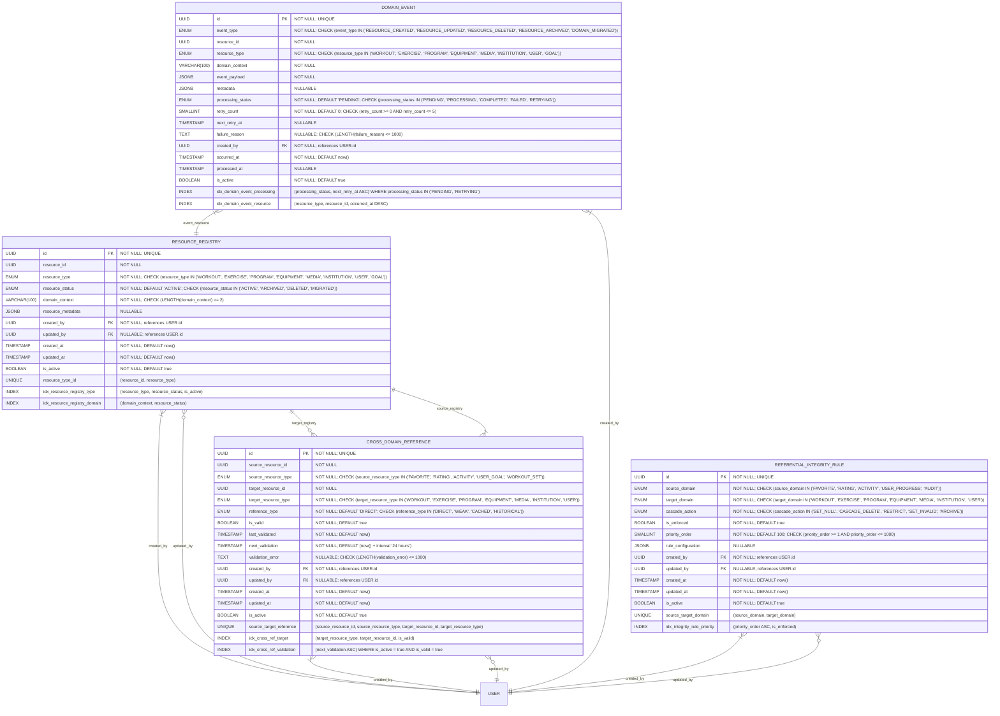

# Cross-Domain Relationship Management
**Domain:** Core
**Layer:** Integration

```mermaid
erDiagram
  RESOURCE_REGISTRY {
    UUID id PK                        "NOT NULL; UNIQUE"
    UUID resource_id                  "NOT NULL"
    ENUM resource_type                "NOT NULL; CHECK (resource_type IN ('WORKOUT', 'EXERCISE', 'PROGRAM', 'EQUIPMENT', 'MEDIA', 'INSTITUTION', 'USER', 'GOAL'))"
    ENUM resource_status              "NOT NULL; DEFAULT 'ACTIVE'; CHECK (resource_status IN ('ACTIVE', 'ARCHIVED', 'DELETED', 'MIGRATED'))"
    VARCHAR(100) domain_context       "NOT NULL; CHECK (LENGTH(domain_context) >= 2)"
    JSONB resource_metadata           "NULLABLE"
    UUID created_by FK                "NOT NULL; references USER.id"
    UUID updated_by FK                "NULLABLE; references USER.id"
    TIMESTAMP created_at              "NOT NULL; DEFAULT now()"
    TIMESTAMP updated_at              "NOT NULL; DEFAULT now()"
    BOOLEAN is_active                 "NOT NULL; DEFAULT true"
    UNIQUE resource_type_id           "(resource_id, resource_type)"
    INDEX idx_resource_registry_type  "(resource_type, resource_status, is_active)"
    INDEX idx_resource_registry_domain "(domain_context, resource_status)"
  }
  
  CROSS_DOMAIN_REFERENCE {
    UUID id PK                        "NOT NULL; UNIQUE"
    UUID source_resource_id           "NOT NULL"
    ENUM source_resource_type         "NOT NULL; CHECK (source_resource_type IN ('FAVORITE', 'RATING', 'ACTIVITY', 'USER_GOAL', 'WORKOUT_SET'))"
    UUID target_resource_id           "NOT NULL"
    ENUM target_resource_type         "NOT NULL; CHECK (target_resource_type IN ('WORKOUT', 'EXERCISE', 'PROGRAM', 'EQUIPMENT', 'MEDIA', 'INSTITUTION', 'USER'))"
    ENUM reference_type               "NOT NULL; DEFAULT 'DIRECT'; CHECK (reference_type IN ('DIRECT', 'WEAK', 'CACHED', 'HISTORICAL'))"
    BOOLEAN is_valid                  "NOT NULL; DEFAULT true"
    TIMESTAMP last_validated          "NOT NULL; DEFAULT now()"
    TIMESTAMP next_validation         "NOT NULL; DEFAULT (now() + interval '24 hours')"
    TEXT validation_error             "NULLABLE; CHECK (LENGTH(validation_error) <= 1000)"
    UUID created_by FK                "NOT NULL; references USER.id"
    UUID updated_by FK                "NULLABLE; references USER.id"
    TIMESTAMP created_at              "NOT NULL; DEFAULT now()"
    TIMESTAMP updated_at              "NOT NULL; DEFAULT now()"
    BOOLEAN is_active                 "NOT NULL; DEFAULT true"
    UNIQUE source_target_reference    "(source_resource_id, source_resource_type, target_resource_id, target_resource_type)"
    INDEX idx_cross_ref_target        "(target_resource_type, target_resource_id, is_valid)"
    INDEX idx_cross_ref_validation    "(next_validation ASC) WHERE is_active = true AND is_valid = true"
  }
  
  DOMAIN_EVENT {
    UUID id PK                        "NOT NULL; UNIQUE"
    ENUM event_type                   "NOT NULL; CHECK (event_type IN ('RESOURCE_CREATED', 'RESOURCE_UPDATED', 'RESOURCE_DELETED', 'RESOURCE_ARCHIVED', 'DOMAIN_MIGRATED'))"
    UUID resource_id                  "NOT NULL"
    ENUM resource_type                "NOT NULL; CHECK (resource_type IN ('WORKOUT', 'EXERCISE', 'PROGRAM', 'EQUIPMENT', 'MEDIA', 'INSTITUTION', 'USER', 'GOAL'))"
    VARCHAR(100) domain_context       "NOT NULL"
    JSONB event_payload               "NOT NULL"
    JSONB metadata                    "NULLABLE"
    ENUM processing_status            "NOT NULL; DEFAULT 'PENDING'; CHECK (processing_status IN ('PENDING', 'PROCESSING', 'COMPLETED', 'FAILED', 'RETRYING'))"
    SMALLINT retry_count              "NOT NULL; DEFAULT 0; CHECK (retry_count >= 0 AND retry_count <= 5)"
    TIMESTAMP next_retry_at           "NULLABLE"
    TEXT failure_reason               "NULLABLE; CHECK (LENGTH(failure_reason) <= 1000)"
    UUID created_by FK                "NOT NULL; references USER.id"
    TIMESTAMP occurred_at             "NOT NULL; DEFAULT now()"
    TIMESTAMP processed_at            "NULLABLE"
    BOOLEAN is_active                 "NOT NULL; DEFAULT true"
    INDEX idx_domain_event_processing "(processing_status, next_retry_at ASC) WHERE processing_status IN ('PENDING', 'RETRYING')"
    INDEX idx_domain_event_resource   "(resource_type, resource_id, occurred_at DESC)"
  }
  
  REFERENTIAL_INTEGRITY_RULE {
    UUID id PK                        "NOT NULL; UNIQUE"
    ENUM source_domain                "NOT NULL; CHECK (source_domain IN ('FAVORITE', 'RATING', 'ACTIVITY', 'USER_PROGRESS', 'AUDIT'))"
    ENUM target_domain                "NOT NULL; CHECK (target_domain IN ('WORKOUT', 'EXERCISE', 'PROGRAM', 'EQUIPMENT', 'MEDIA', 'INSTITUTION', 'USER'))"
    ENUM cascade_action               "NOT NULL; CHECK (cascade_action IN ('SET_NULL', 'CASCADE_DELETE', 'RESTRICT', 'SET_INVALID', 'ARCHIVE'))"
    BOOLEAN is_enforced               "NOT NULL; DEFAULT true"
    SMALLINT priority_order           "NOT NULL; DEFAULT 100; CHECK (priority_order >= 1 AND priority_order <= 1000)"
    JSONB rule_configuration          "NULLABLE"
    UUID created_by FK                "NOT NULL; references USER.id"
    UUID updated_by FK                "NULLABLE; references USER.id"
    TIMESTAMP created_at              "NOT NULL; DEFAULT now()"
    TIMESTAMP updated_at              "NOT NULL; DEFAULT now()"
    BOOLEAN is_active                 "NOT NULL; DEFAULT true"
    UNIQUE source_target_domain       "(source_domain, target_domain)"
    INDEX idx_integrity_rule_priority "(priority_order ASC, is_enforced)"
  }

  RESOURCE_REGISTRY ||--o{ CROSS_DOMAIN_REFERENCE : "target_registry"
  CROSS_DOMAIN_REFERENCE }|--|| RESOURCE_REGISTRY : "source_registry"
  DOMAIN_EVENT }|--|| RESOURCE_REGISTRY : "event_resource"
  RESOURCE_REGISTRY }|--|| USER : "created_by"
  RESOURCE_REGISTRY }o--|| USER : "updated_by"
  CROSS_DOMAIN_REFERENCE }|--|| USER : "created_by"
  CROSS_DOMAIN_REFERENCE }o--|| USER : "updated_by"
  DOMAIN_EVENT }|--|| USER : "created_by"
  REFERENTIAL_INTEGRITY_RULE }|--|| USER : "created_by"
  REFERENTIAL_INTEGRITY_RULE }o--|| USER : "updated_by"
```

