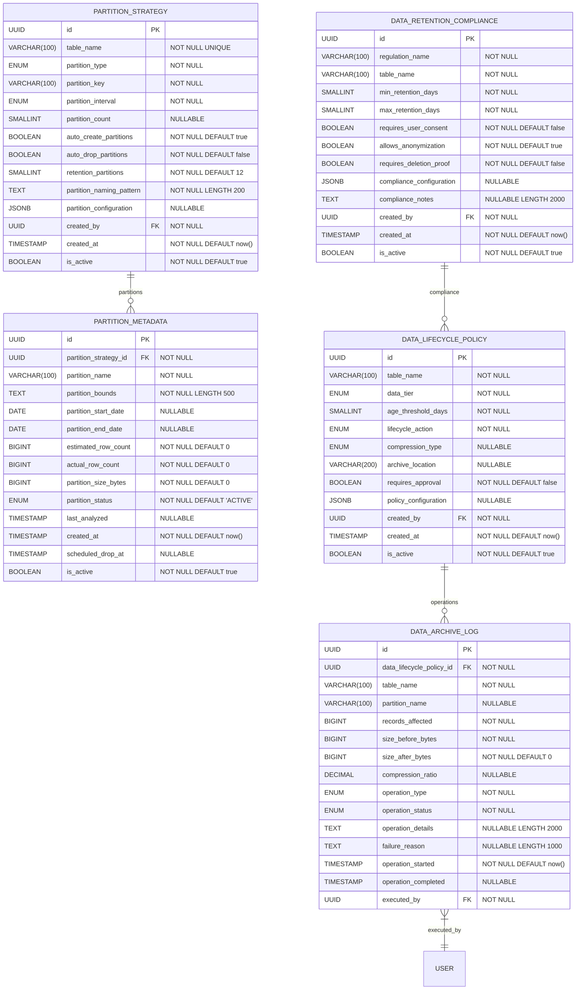

# Data Lifecycle & Partitioning Management

```mermaid
erDiagram
    PARTITION_STRATEGY {
        UUID id PK
        VARCHAR(100) table_name "NOT NULL UNIQUE"
        ENUM partition_type "NOT NULL"
        VARCHAR(100) partition_key "NOT NULL"
        ENUM partition_interval "NOT NULL"
        SMALLINT partition_count "NULLABLE"
        BOOLEAN auto_create_partitions "NOT NULL DEFAULT true"
        BOOLEAN auto_drop_partitions "NOT NULL DEFAULT false"
        SMALLINT retention_partitions "NOT NULL DEFAULT 12"
        TEXT partition_naming_pattern "NOT NULL LENGTH 200"
        JSONB partition_configuration "NULLABLE"
        UUID created_by FK "NOT NULL"
        TIMESTAMP created_at "NOT NULL DEFAULT now()"
        BOOLEAN is_active "NOT NULL DEFAULT true"
    }
    PARTITION_METADATA {
        UUID id PK
        UUID partition_strategy_id FK "NOT NULL"
        VARCHAR(100) partition_name "NOT NULL"
        TEXT partition_bounds "NOT NULL LENGTH 500"
        DATE partition_start_date "NULLABLE"
        DATE partition_end_date "NULLABLE"
        BIGINT estimated_row_count "NOT NULL DEFAULT 0"
        BIGINT actual_row_count "NOT NULL DEFAULT 0"
        BIGINT partition_size_bytes "NOT NULL DEFAULT 0"
        ENUM partition_status "NOT NULL DEFAULT 'ACTIVE'"
        TIMESTAMP last_analyzed "NULLABLE"
        TIMESTAMP created_at "NOT NULL DEFAULT now()"
        TIMESTAMP scheduled_drop_at "NULLABLE"
        BOOLEAN is_active "NOT NULL DEFAULT true"
    }
    DATA_LIFECYCLE_POLICY {
        UUID id PK
        VARCHAR(100) table_name "NOT NULL"
        ENUM data_tier "NOT NULL"
        SMALLINT age_threshold_days "NOT NULL"
        ENUM lifecycle_action "NOT NULL"
        ENUM compression_type "NULLABLE"
        VARCHAR(200) archive_location "NULLABLE"
        BOOLEAN requires_approval "NOT NULL DEFAULT false"
        JSONB policy_configuration "NULLABLE"
        UUID created_by FK "NOT NULL"
        TIMESTAMP created_at "NOT NULL DEFAULT now()"
        BOOLEAN is_active "NOT NULL DEFAULT true"
    }
    DATA_ARCHIVE_LOG {
        UUID id PK
        UUID data_lifecycle_policy_id FK "NOT NULL"
        VARCHAR(100) table_name "NOT NULL"
        VARCHAR(100) partition_name "NULLABLE"
        BIGINT records_affected "NOT NULL"
        BIGINT size_before_bytes "NOT NULL"
        BIGINT size_after_bytes "NOT NULL DEFAULT 0"
        DECIMAL compression_ratio "NULLABLE"
        ENUM operation_type "NOT NULL"
        ENUM operation_status "NOT NULL"
        TEXT operation_details "NULLABLE LENGTH 2000"
        TEXT failure_reason "NULLABLE LENGTH 1000"
        TIMESTAMP operation_started "NOT NULL DEFAULT now()"
        TIMESTAMP operation_completed "NULLABLE"
        UUID executed_by FK "NOT NULL"
    }
    DATA_RETENTION_COMPLIANCE {
        UUID id PK
        VARCHAR(100) regulation_name "NOT NULL"
        VARCHAR(100) table_name "NOT NULL"
        SMALLINT min_retention_days "NOT NULL"
        SMALLINT max_retention_days "NOT NULL"
        BOOLEAN requires_user_consent "NOT NULL DEFAULT false"
        BOOLEAN allows_anonymization "NOT NULL DEFAULT true"
        BOOLEAN requires_deletion_proof "NOT NULL DEFAULT false"
        JSONB compliance_configuration "NULLABLE"
        TEXT compliance_notes "NULLABLE LENGTH 2000"
        UUID created_by FK "NOT NULL"
        TIMESTAMP created_at "NOT NULL DEFAULT now()"
        BOOLEAN is_active "NOT NULL DEFAULT true"
    }
    PARTITION_STRATEGY ||--o{ PARTITION_METADATA : "partitions"
    DATA_LIFECYCLE_POLICY ||--o{ DATA_ARCHIVE_LOG : "operations"
    DATA_RETENTION_COMPLIANCE ||--o{ DATA_LIFECYCLE_POLICY : "compliance"
    DATA_ARCHIVE_LOG }|--|| USER : "executed_by"
```

