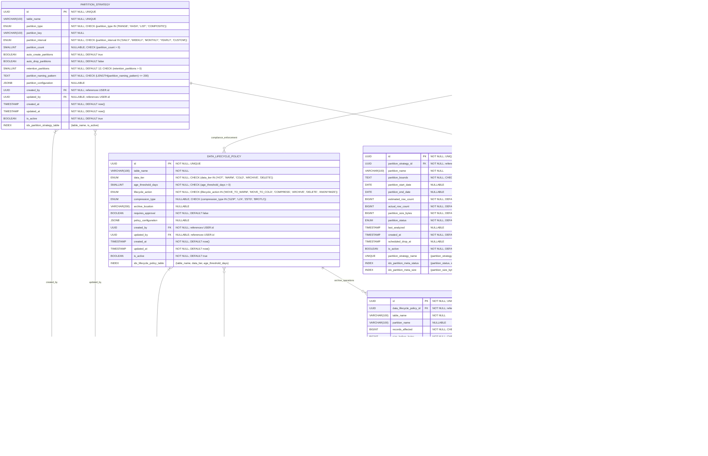

# Data Lifecycle & Partitioning Management
**Domain:** Core
**Layer:** Scalability

```mermaid
erDiagram
  PARTITION_STRATEGY {
    UUID id PK                        "NOT NULL; UNIQUE"
    VARCHAR(100) table_name           "NOT NULL; UNIQUE"
    ENUM partition_type               "NOT NULL; CHECK (partition_type IN ('RANGE', 'HASH', 'LIST', 'COMPOSITE'))"
    VARCHAR(100) partition_key        "NOT NULL"
    ENUM partition_interval           "NOT NULL; CHECK (partition_interval IN ('DAILY', 'WEEKLY', 'MONTHLY', 'YEARLY', 'CUSTOM'))"
    SMALLINT partition_count          "NULLABLE; CHECK (partition_count > 0)"
    BOOLEAN auto_create_partitions    "NOT NULL; DEFAULT true"
    BOOLEAN auto_drop_partitions      "NOT NULL; DEFAULT false"
    SMALLINT retention_partitions     "NOT NULL; DEFAULT 12; CHECK (retention_partitions > 0)"
    TEXT partition_naming_pattern     "NOT NULL; CHECK (LENGTH(partition_naming_pattern) <= 200)"
    JSONB partition_configuration     "NULLABLE"
    UUID created_by FK                "NOT NULL; references USER.id"
    UUID updated_by FK                "NULLABLE; references USER.id"
    TIMESTAMP created_at              "NOT NULL; DEFAULT now()"
    TIMESTAMP updated_at              "NOT NULL; DEFAULT now()"
    BOOLEAN is_active                 "NOT NULL; DEFAULT true"
    INDEX idx_partition_strategy_table "(table_name, is_active)"
  }
  
  PARTITION_METADATA {
    UUID id PK                        "NOT NULL; UNIQUE"
    UUID partition_strategy_id FK     "NOT NULL; references PARTITION_STRATEGY.id"
    VARCHAR(100) partition_name       "NOT NULL"
    TEXT partition_bounds             "NOT NULL; CHECK (LENGTH(partition_bounds) <= 500)"
    DATE partition_start_date         "NULLABLE"
    DATE partition_end_date           "NULLABLE"
    BIGINT estimated_row_count        "NOT NULL; DEFAULT 0"
    BIGINT actual_row_count           "NOT NULL; DEFAULT 0"
    BIGINT partition_size_bytes       "NOT NULL; DEFAULT 0"
    ENUM partition_status             "NOT NULL; DEFAULT 'ACTIVE'; CHECK (partition_status IN ('ACTIVE', 'ARCHIVED', 'COMPRESSED', 'SCHEDULED_DROP', 'DROPPED'))"
    TIMESTAMP last_analyzed           "NULLABLE"
    TIMESTAMP created_at              "NOT NULL; DEFAULT now()"
    TIMESTAMP scheduled_drop_at       "NULLABLE"
    BOOLEAN is_active                 "NOT NULL; DEFAULT true"
    UNIQUE partition_strategy_name    "(partition_strategy_id, partition_name)"
    INDEX idx_partition_meta_status   "(partition_status, scheduled_drop_at)"
    INDEX idx_partition_meta_size     "(partition_size_bytes DESC, actual_row_count DESC)"
  }
  
  DATA_LIFECYCLE_POLICY {
    UUID id PK                        "NOT NULL; UNIQUE"
    VARCHAR(100) table_name           "NOT NULL"
    ENUM data_tier                    "NOT NULL; CHECK (data_tier IN ('HOT', 'WARM', 'COLD', 'ARCHIVE', 'DELETE'))"
    SMALLINT age_threshold_days       "NOT NULL; CHECK (age_threshold_days > 0)"
    ENUM lifecycle_action             "NOT NULL; CHECK (lifecycle_action IN ('MOVE_TO_WARM', 'MOVE_TO_COLD', 'COMPRESS', 'ARCHIVE', 'DELETE', 'ANONYMIZE'))"
    ENUM compression_type             "NULLABLE; CHECK (compression_type IN ('GZIP', 'LZ4', 'ZSTD', 'BROTLI'))"
    VARCHAR(200) archive_location     "NULLABLE"
    BOOLEAN requires_approval         "NOT NULL; DEFAULT false"
    JSONB policy_configuration        "NULLABLE"
    UUID created_by FK                "NOT NULL; references USER.id"
    UUID updated_by FK                "NULLABLE; references USER.id"
    TIMESTAMP created_at              "NOT NULL; DEFAULT now()"
    TIMESTAMP updated_at              "NOT NULL; DEFAULT now()"
    BOOLEAN is_active                 "NOT NULL; DEFAULT true"
    INDEX idx_lifecycle_policy_table  "(table_name, data_tier, age_threshold_days)"
  }
  
  DATA_ARCHIVE_LOG {
    UUID id PK                        "NOT NULL; UNIQUE"
    UUID data_lifecycle_policy_id FK  "NOT NULL; references DATA_LIFECYCLE_POLICY.id"
    VARCHAR(100) table_name           "NOT NULL"
    VARCHAR(100) partition_name       "NULLABLE"
    BIGINT records_affected           "NOT NULL; CHECK (records_affected >= 0)"
    BIGINT size_before_bytes          "NOT NULL; CHECK (size_before_bytes >= 0)"
    BIGINT size_after_bytes           "NOT NULL; DEFAULT 0; CHECK (size_after_bytes >= 0)"
    DECIMAL compression_ratio         "NULLABLE; CHECK (compression_ratio > 0)"
    ENUM operation_type               "NOT NULL; CHECK (operation_type IN ('COMPRESS', 'ARCHIVE', 'DELETE', 'ANONYMIZE', 'MOVE'))"
    ENUM operation_status             "NOT NULL; CHECK (operation_status IN ('SCHEDULED', 'IN_PROGRESS', 'COMPLETED', 'FAILED', 'CANCELLED'))"
    TEXT operation_details            "NULLABLE; CHECK (LENGTH(operation_details) <= 2000)"
    TEXT failure_reason               "NULLABLE; CHECK (LENGTH(failure_reason) <= 1000)"
    TIMESTAMP operation_started       "NOT NULL; DEFAULT now()"
    TIMESTAMP operation_completed     "NULLABLE"
    UUID executed_by FK               "NOT NULL; references USER.id"
    INDEX idx_archive_log_status      "(operation_status, operation_started DESC)"
    INDEX idx_archive_log_table       "(table_name, operation_type, operation_completed DESC)"
  }
  
  DATA_RETENTION_COMPLIANCE {
    UUID id PK                        "NOT NULL; UNIQUE"
    VARCHAR(100) regulation_name      "NOT NULL; CHECK (regulation_name IN ('GDPR', 'CCPA', 'HIPAA', 'SOX', 'CUSTOM'))"
    VARCHAR(100) table_name           "NOT NULL"
    SMALLINT min_retention_days       "NOT NULL; CHECK (min_retention_days >= 0)"
    SMALLINT max_retention_days       "NOT NULL; CHECK (max_retention_days >= min_retention_days)"
    BOOLEAN requires_user_consent     "NOT NULL; DEFAULT false"
    BOOLEAN allows_anonymization      "NOT NULL; DEFAULT true"
    BOOLEAN requires_deletion_proof   "NOT NULL; DEFAULT false"
    JSONB compliance_configuration    "NULLABLE"
    TEXT compliance_notes             "NULLABLE; CHECK (LENGTH(compliance_notes) <= 2000)"
    UUID created_by FK                "NOT NULL; references USER.id"
    UUID updated_by FK                "NULLABLE; references USER.id"
    TIMESTAMP created_at              "NOT NULL; DEFAULT now()"
    TIMESTAMP updated_at              "NOT NULL; DEFAULT now()"
    BOOLEAN is_active                 "NOT NULL; DEFAULT true"
    UNIQUE regulation_table           "(regulation_name, table_name)"
    INDEX idx_retention_compliance    "(regulation_name, is_active)"
  }

  PARTITION_STRATEGY ||--o{ PARTITION_METADATA : "partition_tracking"
  DATA_LIFECYCLE_POLICY ||--o{ DATA_ARCHIVE_LOG : "archive_operations"
  PARTITION_METADATA }o--|| DATA_ARCHIVE_LOG : "partition_operations"
  DATA_RETENTION_COMPLIANCE ||--o{ DATA_LIFECYCLE_POLICY : "compliance_enforcement"
  PARTITION_STRATEGY }|--|| USER : "created_by"
  PARTITION_STRATEGY }o--|| USER : "updated_by"
  DATA_LIFECYCLE_POLICY }|--|| USER : "created_by"
  DATA_LIFECYCLE_POLICY }o--|| USER : "updated_by"
  DATA_ARCHIVE_LOG }|--|| USER : "executed_by"
  DATA_RETENTION_COMPLIANCE }|--|| USER : "created_by"
  DATA_RETENTION_COMPLIANCE }o--|| USER : "updated_by"
```

