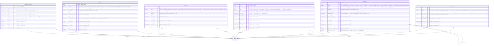

# Core Enums & Lookup Tables
**Domain:** Core
**Layer:** Foundation

```mermaid
erDiagram
  TAG {
    UUID id PK                        "NOT NULL; UNIQUE"
    ENUM name                         "NOT NULL; UNIQUE; CHECK (name IN ('EXPRESS', 'SKILL', 'DYNAMIC', 'HARD', 'BEGINNER', 'INTERMEDIATE', 'ADVANCED', 'EXPLOSIVE', 'STATIC', 'FUNCTIONAL'))"
    ENUM type                         "NOT NULL; CHECK (type IN ('SKILL_LEVEL', 'INTENSITY', 'MOVEMENT_TYPE', 'EXPERIENCE_LEVEL', 'TRAINING_STYLE'))"
    TEXT description                  "NULLABLE; CHECK (LENGTH(description) <= 500)"
    BOOLEAN is_system_tag             "NOT NULL; DEFAULT false"
    UUID created_by FK                "NOT NULL; references USER.id"
    UUID updated_by FK                "NULLABLE; references USER.id"
    TIMESTAMP created_at              "NOT NULL; DEFAULT now()"
    TIMESTAMP updated_at              "NOT NULL; DEFAULT now()"
    BOOLEAN is_active                 "NOT NULL; DEFAULT true"
  }
  
  CATEGORY {
    UUID id PK                        "NOT NULL; UNIQUE"
    ENUM name                         "NOT NULL; UNIQUE; CHECK (name IN ('STRENGTH', 'CARDIO', 'FLEXIBILITY', 'BALANCE', 'REHABILITATION', 'SPORTS_SPECIFIC', 'BODYWEIGHT', 'WEIGHTED', 'MACHINE', 'FREE_WEIGHT'))"
    ENUM type                         "NOT NULL; CHECK (type IN ('EXERCISE', 'PROGRAM', 'EQUIPMENT', 'WORKOUT', 'USER', 'INSTITUTION', 'TRAINING_STYLE', 'EQUIPMENT_TYPE'))"
    TEXT description                  "NULLABLE; CHECK (LENGTH(description) <= 500)"
    UUID parent_category_id FK        "NULLABLE; references CATEGORY.id; CHECK (parent_category_id != id)"
    SMALLINT hierarchy_level          "NOT NULL; DEFAULT 0; CHECK (hierarchy_level >= 0 AND hierarchy_level <= 5)"
    VARCHAR(500) hierarchy_path       "NOT NULL; materialized path; FORMAT: '/1/2/3/'"
    BOOLEAN is_system_category        "NOT NULL; DEFAULT false"
    UUID created_by FK                "NOT NULL; references USER.id"
    UUID updated_by FK                "NULLABLE; references USER.id"
    TIMESTAMP created_at              "NOT NULL; DEFAULT now()"
    TIMESTAMP updated_at              "NOT NULL; DEFAULT now()"
    BOOLEAN is_active                 "NOT NULL; DEFAULT true"
    INDEX idx_category_hierarchy_path "ON (hierarchy_path)"
    INDEX idx_category_parent         "ON (parent_category_id) WHERE parent_category_id IS NOT NULL"
  }
  
  STATUS {
    UUID id PK                        "NOT NULL; UNIQUE"
    ENUM name                         "NOT NULL; UNIQUE; CHECK (name IN ('DRAFT', 'PUBLISHED', 'ARCHIVED', 'PENDING', 'APPROVED', 'REJECTED', 'ACTIVE', 'INACTIVE', 'COMPLETED', 'IN_PROGRESS', 'STOPPED'))"
    ENUM type                         "NOT NULL; CHECK (type IN ('PUBLISHING', 'APPROVAL', 'COMPLETION', 'WORKFLOW', 'SYSTEM_STATE', 'SEVERITY'))"
    TEXT description                  "NULLABLE; CHECK (LENGTH(description) <= 500)"
    VARCHAR(7) color_code             "NULLABLE; CHECK (color_code ~ '^#[0-9A-Fa-f]{6}$')"
    BOOLEAN is_final_state            "NOT NULL; DEFAULT false"
    BOOLEAN is_system_status          "NOT NULL; DEFAULT false"
    SMALLINT sort_order               "NOT NULL; DEFAULT 0"
    UUID created_by FK                "NOT NULL; references USER.id"
    UUID updated_by FK                "NULLABLE; references USER.id"
    TIMESTAMP created_at              "NOT NULL; DEFAULT now()"
    TIMESTAMP updated_at              "NOT NULL; DEFAULT now()"
    BOOLEAN is_active                 "NOT NULL; DEFAULT true"
  }
  
  METRIC {
    UUID id PK                        "NOT NULL; UNIQUE"
    ENUM name                         "NOT NULL; UNIQUE; CHECK (name IN ('WEIGHT', 'REPETITIONS', 'DURATION', 'DISTANCE', 'HEART_RATE', 'CALORIES', 'POWER', 'SPEED', 'DIFFICULTY_SCORE', 'PROGRESSION_RATE'))"
    ENUM type                         "NOT NULL; CHECK (type IN ('MEASUREMENT', 'PROGRESSION', 'DIFFICULTY', 'PERFORMANCE', 'PHYSIOLOGICAL'))"
    TEXT description                  "NULLABLE; CHECK (LENGTH(description) <= 500)"
    BOOLEAN is_system_metric          "NOT NULL; DEFAULT false"
    BOOLEAN requires_unit             "NOT NULL; DEFAULT true"
    UUID created_by FK                "NOT NULL; references USER.id"
    UUID updated_by FK                "NULLABLE; references USER.id"
    TIMESTAMP created_at              "NOT NULL; DEFAULT now()"
    TIMESTAMP updated_at              "NOT NULL; DEFAULT now()"
    BOOLEAN is_active                 "NOT NULL; DEFAULT true"
  }
  
  VISIBILITY {
    UUID id PK                        "NOT NULL; UNIQUE"
    ENUM name                         "NOT NULL; UNIQUE; CHECK (name IN ('PRIVATE', 'SHARED', 'PUBLIC', 'INSTITUTION', 'DEPARTMENT', 'ROLE_BASED', 'INTERNAL', 'SYSTEM'))"
    ENUM resource_type                "NOT NULL; CHECK (resource_type IN ('EXERCISE', 'WORKOUT', 'PROGRAM', 'INSTITUTION', 'USER', 'ACTIVITY', 'MEDIA', 'EQUIPMENT', 'FAVORITE', 'RATING', 'ALL'))"
    TEXT description                  "NULLABLE; CHECK (LENGTH(description) <= 500)"
    BOOLEAN is_default                "NOT NULL; DEFAULT false"
    BOOLEAN requires_permission       "NOT NULL; DEFAULT false"
    BOOLEAN is_system_visibility      "NOT NULL; DEFAULT false"
    SMALLINT permission_level         "NOT NULL; DEFAULT 0; CHECK (permission_level >= 0 AND permission_level <= 10)"
    UUID created_by FK                "NOT NULL; references USER.id"
    UUID updated_by FK                "NULLABLE; references USER.id"
    TIMESTAMP created_at              "NOT NULL; DEFAULT now()"
    TIMESTAMP updated_at              "NOT NULL; DEFAULT now()"
    BOOLEAN is_active                 "NOT NULL; DEFAULT true"
    UNIQUE name_resource_type         "(name, resource_type)"
  }
  
  DIFFICULTY_LEVEL {
    UUID id PK                        "NOT NULL; UNIQUE"
    ENUM level_name                   "NOT NULL; CHECK (level_name IN ('BEGINNER', 'INTERMEDIATE', 'ADVANCED', 'EXPERT', 'PROFESSIONAL'))"
    SMALLINT level_value              "NOT NULL; CHECK (level_value >= 1 AND level_value <= 10)"
    TEXT level_description            "NULLABLE; CHECK (LENGTH(level_description) <= 500)"
    VARCHAR(7) color_code             "NULLABLE; CHECK (color_code ~ '^#[0-9A-Fa-f]{6}$')"
    DECIMAL skill_threshold           "NOT NULL; DEFAULT 0.0; CHECK (skill_threshold >= 0.0 AND skill_threshold <= 10.0)"
    UUID created_by FK                "NOT NULL; references USER.id"
    UUID updated_by FK                "NULLABLE; references USER.id"
    TIMESTAMP created_at              "NOT NULL; DEFAULT now()"
    TIMESTAMP updated_at              "NOT NULL; DEFAULT now()"
    BOOLEAN is_active                 "NOT NULL; DEFAULT true"
    UNIQUE level_value_unique         "(level_value)"
  }

  CATEGORY ||--o{ CATEGORY : "parent_category"
  TAG }|--|| USER : "created_by"
  TAG }o--|| USER : "updated_by"
  CATEGORY }|--|| USER : "created_by"
  CATEGORY }o--|| USER : "updated_by"
  STATUS }|--|| USER : "created_by"
  STATUS }o--|| USER : "updated_by"
  METRIC }|--|| USER : "created_by"
  METRIC }o--|| USER : "updated_by"
  VISIBILITY }|--|| USER : "created_by"
  VISIBILITY }o--|| USER : "updated_by"
  DIFFICULTY_LEVEL }|--|| USER : "created_by"
  DIFFICULTY_LEVEL }o--|| USER : "updated_by"
```

