# Enums
**Section:** Core
**Subsection:** Enums

## Diagram

```mermaid
erDiagram
  %%========================
  %% 1) Core Lookup Tables
  %%========================
  TAG {
    UUID id PK                        "NOT NULL; UNIQUE"
    ENUM name                         "NOT NULL; UNIQUE"
    ENUM type                         "NOT NULL; EXPRESS, SKILL, DYNAMIC, HARD, BEGINNER, ADVANCED"
    TEXT description                  "NULLABLE"
    BOOLEAN is_system_tag             "NOT NULL; DEFAULT false"
    UUID created_by FK                "NOT NULL; references USER.id"
    UUID updated_by FK                "NULLABLE; references USER.id"
    TIMESTAMP created_at              "NOT NULL; DEFAULT now()"
    TIMESTAMP updated_at              "NOT NULL; DEFAULT now()"
    BOOLEAN is_active                 "NOT NULL; DEFAULT true"
  }
  
  CATEGORY {
    UUID id PK                        "NOT NULL; UNIQUE"
    ENUM name                         "NOT NULL; UNIQUE"
    ENUM type                         "NOT NULL; EXERCISE, PROGRAM, EQUIPMENT, WORKOUT, USER, INSTITUTION"
    TEXT description                  "NULLABLE"
    UUID parent_category_id FK        "NULLABLE; references CATEGORY.id"
    BOOLEAN is_system_category        "NOT NULL; DEFAULT false"
    UUID created_by FK                "NOT NULL; references USER.id"
    UUID updated_by FK                "NULLABLE; references USER.id"
    TIMESTAMP created_at              "NOT NULL; DEFAULT now()"
    TIMESTAMP updated_at              "NOT NULL; DEFAULT now()"
    BOOLEAN is_active                 "NOT NULL; DEFAULT true"
  }
  
  STATUS {
    UUID id PK                        "NOT NULL; UNIQUE"
    VARCHAR(50) name                  "NOT NULL; UNIQUE"
    ENUM type                         "NOT NULL; PUBLISHING, SEVERITY, LOG_LEVEL, COMPLETION, WORKFLOW"
    TEXT description                  "NULLABLE"
    VARCHAR(7) color_code             "NULLABLE; hex color for UI"
    BOOLEAN is_final_state            "NOT NULL; DEFAULT false"
    BOOLEAN is_system_status          "NOT NULL; DEFAULT false"
  }
  
  METRIC {
    UUID id PK                        "NOT NULL; UNIQUE"
    ENUM name                         "NOT NULL; UNIQUE"
    ENUM type                         "NOT NULL; UNIT, PROGRESSION, DIFFICULTY, PERFORMANCE"
    TEXT description                  "NULLABLE"
    BOOLEAN is_system_metric          "NOT NULL; DEFAULT false"
  }
  
  VISIBILITY {
    UUID id PK                        "NOT NULL; UNIQUE"
    ENUM name                         "NOT NULL; UNIQUE; PRIVATE, SHARED, PUBLIC, INSTITUTION, DEPARTMENT, ROLE_BASED, INTERNAL, SYSTEM"
    ENUM resource_type                "NOT NULL; EXERCISE, WORKOUT, PROGRAM, INSTITUTION, USER, ACTIVITY, MEDIA, EQUIPMENT"
    TEXT description                  "NULLABLE; what this level of visibility means"
    BOOLEAN is_default                "NOT NULL; DEFAULT false"
    BOOLEAN requires_permission       "NOT NULL; DEFAULT false"
    BOOLEAN is_system_visibility      "NOT NULL; DEFAULT false"
  }
  
  %%====================================
  %% 2) STATUS Subclass: Log/Severity Pair
  %%====================================
  LOG_LEVEL_STATUS {
    UUID id PK                        "NOT NULL; UNIQUE"
    UUID log_level_id FK              "NOT NULL; references STATUS.id"
    UUID severity_id FK               "NOT NULL; references STATUS.id"
    UUID created_by FK                "NOT NULL; references USER.id"
    UUID updated_by FK                "NULLABLE; references USER.id"
    TIMESTAMP created_at              "NOT NULL; DEFAULT now()"
    TIMESTAMP updated_at              "NOT NULL; DEFAULT now()"
    BOOLEAN is_active                 "NOT NULL; DEFAULT true"
  }
  
  %%================================================================
  %% 3) METRIC Subtypes (each "points back" to METRIC.id as a child)
  %%================================================================
  MEASUREMENT_UNIT {
    UUID id PK                        "NOT NULL; UNIQUE"
    UUID metric_id FK                 "NOT NULL; references METRIC.id"
    VARCHAR(20) unit_name             "NOT NULL; kg, lbs, cm, inches, seconds, etc."
    VARCHAR(10) unit_symbol           "NOT NULL; kg, lb, cm, in, s, etc."
    ENUM unit_type                    "NOT NULL; WEIGHT, LENGTH, TIME, COUNT, PERCENTAGE"
    FLOAT conversion_factor           "NOT NULL; DEFAULT 1.0; to base unit"
    BOOLEAN is_base_unit              "NOT NULL; DEFAULT false"
    BOOLEAN is_metric_system          "NOT NULL; DEFAULT true"
  }
  
  PROGRESSION_METRIC {
    UUID id PK                        "NOT NULL; UNIQUE"
    UUID metric_id FK                 "NOT NULL; references METRIC.id"
    VARCHAR(50) progression_name      "NOT NULL"
    TEXT calculation_formula          "NULLABLE; how progression is calculated"
    ENUM progression_direction        "NOT NULL; INCREASE, DECREASE, MAINTAIN"
    FLOAT target_increment            "NULLABLE; suggested increment per session"
  }
  
  DIFFICULTY_LEVEL {
    UUID id PK                        "NOT NULL; UNIQUE"
    UUID metric_id FK                 "NOT NULL; references METRIC.id"
    VARCHAR(30) level_name            "NOT NULL; BEGINNER, INTERMEDIATE, ADVANCED, EXPERT"
    SMALLINT level_value              "NOT NULL; CHECK (level_value >= 1 AND level_value <= 10)"
    TEXT level_description            "NULLABLE"
    VARCHAR(7) color_code             "NULLABLE; hex color for UI"
  }
  
  %%============================
  %% 4) Relationships Declaration
  %%============================
  %%— METRIC → its subtypes
  METRIC ||--o{ MEASUREMENT_UNIT      : "has units"
  METRIC ||--o{ PROGRESSION_METRIC    : "tracks progression"
  METRIC ||--o{ DIFFICULTY_LEVEL      : "defines difficulty"
  
  %%— LOG_LEVEL_STATUS → STATUS (two roles)
  LOG_LEVEL_STATUS }|--|| STATUS      : "log_level"
  LOG_LEVEL_STATUS }|--|| STATUS      : "severity"
  
  %%— Category hierarchy
  CATEGORY ||--o{ CATEGORY            : "parent_of"
  
  %%— User audit trails
  TAG }|--|| USER                     : "created_by"
  TAG }o--|| USER                     : "updated_by"
  CATEGORY }|--|| USER                : "created_by"
  CATEGORY }o--|| USER                : "updated_by"
  LOG_LEVEL_STATUS }|--|| USER        : "created_by"
  LOG_LEVEL_STATUS }o--|| USER        : "updated_by"
```

## Notes
This diagram represents the enums structure and relationships with proper audit trails and hierarchical organization within the core domain.

---
*Generated from diagram extraction script*