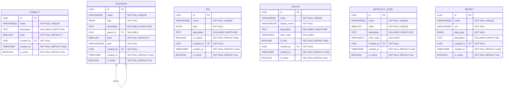

# Core Foundation

```mermaid
erDiagram
    VISIBILITY {
        UUID id PK
        VARCHAR(50) name "NOT NULL UNIQUE"
        TEXT description "NULLABLE LENGTH 500"
        SMALLINT level "NOT NULL DEFAULT 0"
        UUID created_by FK "NOT NULL"
        TIMESTAMP created_at "NOT NULL DEFAULT now()"
        BOOLEAN is_active "NOT NULL DEFAULT true"
    }
    CATEGORY {
        UUID id PK
        VARCHAR(50) name "NOT NULL UNIQUE"
        ENUM type "NOT NULL"
        TEXT description "NULLABLE LENGTH 500"
        UUID parent_id FK "NULLABLE"
        SMALLINT level "NOT NULL DEFAULT 0"
        VARCHAR(255) path "NOT NULL"
        UUID created_by FK "NOT NULL"
        TIMESTAMP created_at "NOT NULL DEFAULT now()"
        BOOLEAN is_active "NOT NULL DEFAULT true"
    }
    TAG {
        UUID id PK
        VARCHAR(50) name "NOT NULL UNIQUE"
        ENUM type "NOT NULL"
        TEXT description "NULLABLE LENGTH 500"
        BOOLEAN is_system "NOT NULL DEFAULT false"
        UUID created_by FK "NOT NULL"
        TIMESTAMP created_at "NOT NULL DEFAULT now()"
        BOOLEAN is_active "NOT NULL DEFAULT true"
    }
    STATUS {
        UUID id PK
        VARCHAR(50) name "NOT NULL UNIQUE"
        VARCHAR(100) display_name "NOT NULL"
        TEXT description "NULLABLE LENGTH 500"
        VARCHAR(7) color_code "NULLABLE"
        BOOLEAN is_final "NOT NULL DEFAULT false"
        UUID created_by FK "NOT NULL"
        TIMESTAMP created_at "NOT NULL DEFAULT now()"
        BOOLEAN is_active "NOT NULL DEFAULT true"
    }
    DIFFICULTY_LEVEL {
        UUID id PK
        VARCHAR(50) name "NOT NULL UNIQUE"
        SMALLINT value "NOT NULL UNIQUE"
        TEXT description "NULLABLE LENGTH 500"
        VARCHAR(7) color_code "NULLABLE"
        UUID created_by FK "NOT NULL"
        TIMESTAMP created_at "NOT NULL DEFAULT now()"
        BOOLEAN is_active "NOT NULL DEFAULT true"
    }
    METRIC {
        UUID id PK
        VARCHAR(50) name "NOT NULL UNIQUE"
        VARCHAR(20) unit "NOT NULL"
        ENUM data_type "NOT NULL"
        TEXT description "NULLABLE LENGTH 500"
        UUID created_by FK "NOT NULL"
        TIMESTAMP created_at "NOT NULL DEFAULT now()"
        BOOLEAN is_active "NOT NULL DEFAULT true"
    }
    CATEGORY ||--o{ CATEGORY : "parent"
```

