# Goals

**Section:** Program
**Subsection:** Goals

## Diagram

```mermaid
erDiagram

  %% ==============================
  %% 1) Goal and Subgoal — User-Level Planning
  %% ==============================

  GOAL {
    UUID id PK                       "NOT NULL; UNIQUE"
    UUID user_id PK                  "NOT NULL; references USER.id"
    UUID assigned_by FK              "NULLABLE; references USER.id"
    TIMESTAMP created_at             "NOT NULL"
    TIMESTAMP updated_at             "NOT NULL"
    UUID visibility_id FK               "NOT NULL; references VISIBILITY.id"
  }

  SUBGOAL {
    UUID id PK                       "NOT NULL; UNIQUE"
    UUID goal_id PK, FK              "NOT NULL; references GOAL.id"
    UUID exercise_id FK              "NULLABLE; references EXERCISE.id"
    TEXT notes                       "NULLABLE"
  }

  %% ==================================
  %% 2) Metric Definitions and Target Tracking
  %% ==================================

  METRIC_GOAL {
    UUID subgoal_id PK, FK           "NOT NULL; references SUBGOAL.id"
    UUID metric_id PK, FK            "NOT NULL; references METRIC.id"
    FLOAT target_value               "NOT NULL"
    FLOAT current_value              "NULLABLE"
    BOOLEAN is_required              "NOT NULL; DEFAULT FALSE"
  }

  %% ==============================
  %% 3) Internal Relationships
  %% ==============================

  GOAL        ||--o{ SUBGOAL       : "has_subgoals"
  SUBGOAL     ||--o{ METRIC_GOAL   : "has_metrics"

  %% ==============================
  %% 4) External Relationships
  %% ==============================

  GOAL        }|--|| USER          : "owner"
  GOAL        }o--|| USER          : "assigned_by"
  SUBGOAL     }|--|| EXERCISE      : "target_exercise"
  METRIC_GOAL }|--|| METRIC        : "typed_as"
```

## Notes

This diagram represents the goals structure and relationships within the program domain.

---
*Generated from diagram extraction script*
