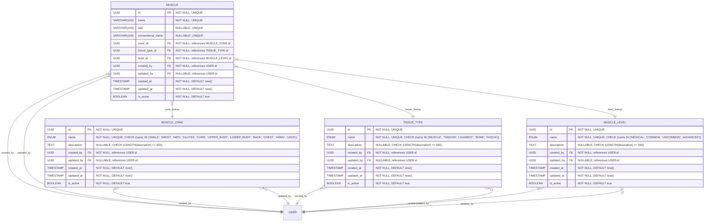

# Muscles & Anatomy
**Domain:** Core
**Layer:** Foundation

```mermaid
erDiagram
  MUSCLE {
    UUID id PK                        "NOT NULL; UNIQUE"
    VARCHAR(100) name                 "NOT NULL; UNIQUE"
    VARCHAR(100) latin                "NULLABLE; UNIQUE"
    VARCHAR(100) conventional_name    "NULLABLE; UNIQUE"
    UUID zone_id FK                   "NOT NULL; references MUSCLE_ZONE.id"
    UUID tissue_type_id FK            "NOT NULL; references TISSUE_TYPE.id"
    UUID level_id FK                  "NOT NULL; references MUSCLE_LEVEL.id"
    UUID created_by FK                "NOT NULL; references USER.id"
    UUID updated_by FK                "NULLABLE; references USER.id"
    TIMESTAMP created_at              "NOT NULL; DEFAULT now()"
    TIMESTAMP updated_at              "NOT NULL; DEFAULT now()"
    BOOLEAN is_active                 "NOT NULL; DEFAULT true"
  }
  
  MUSCLE_ZONE {
    UUID id PK                        "NOT NULL; UNIQUE"
    ENUM name                         "NOT NULL; UNIQUE; CHECK (name IN ('ANKLE', 'WRIST', 'HIPS', 'GLUTES', 'CORE', 'UPPER_BODY', 'LOWER_BODY', 'BACK', 'CHEST', 'ARMS', 'LEGS'))"
    TEXT description                  "NULLABLE; CHECK (LENGTH(description) <= 500)"
    UUID created_by FK                "NOT NULL; references USER.id"
    UUID updated_by FK                "NULLABLE; references USER.id"
    TIMESTAMP created_at              "NOT NULL; DEFAULT now()"
    TIMESTAMP updated_at              "NOT NULL; DEFAULT now()"
    BOOLEAN is_active                 "NOT NULL; DEFAULT true"
  }
  
  TISSUE_TYPE {
    UUID id PK                        "NOT NULL; UNIQUE"
    ENUM name                         "NOT NULL; UNIQUE; CHECK (name IN ('MUSCLE', 'TENDON', 'LIGAMENT', 'BONE', 'FASCIA'))"
    TEXT description                  "NULLABLE; CHECK (LENGTH(description) <= 500)"
    UUID created_by FK                "NOT NULL; references USER.id"
    UUID updated_by FK                "NULLABLE; references USER.id"
    TIMESTAMP created_at              "NOT NULL; DEFAULT now()"
    TIMESTAMP updated_at              "NOT NULL; DEFAULT now()"
    BOOLEAN is_active                 "NOT NULL; DEFAULT true"
  }
  
  MUSCLE_LEVEL {
    UUID id PK                        "NOT NULL; UNIQUE"
    ENUM name                         "NOT NULL; UNIQUE; CHECK (name IN ('MEDICAL', 'COMMON', 'UNCOMMON', 'ADVANCED'))"
    TEXT description                  "NULLABLE; CHECK (LENGTH(description) <= 500)"
    UUID created_by FK                "NOT NULL; references USER.id"
    UUID updated_by FK                "NULLABLE; references USER.id"
    TIMESTAMP created_at              "NOT NULL; DEFAULT now()"
    TIMESTAMP updated_at              "NOT NULL; DEFAULT now()"
    BOOLEAN is_active                 "NOT NULL; DEFAULT true"
  }

  MUSCLE }|--|| MUSCLE_ZONE : "zone_lookup"
  MUSCLE }|--|| TISSUE_TYPE : "tissue_lookup"
  MUSCLE }|--|| MUSCLE_LEVEL : "level_lookup"
  MUSCLE }|--|| USER : "created_by"
  MUSCLE }o--|| USER : "updated_by"
  MUSCLE_ZONE }|--|| USER : "created_by"
  MUSCLE_ZONE }o--|| USER : "updated_by"
  TISSUE_TYPE }|--|| USER : "created_by"
  TISSUE_TYPE }o--|| USER : "updated_by"
  MUSCLE_LEVEL }|--|| USER : "created_by"
  MUSCLE_LEVEL }o--|| USER : "updated_by"
```

