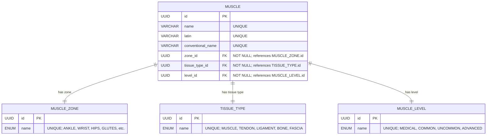

# Muscles

**Section:** Muscles

## Diagram

```mermaid
erDiagram
  %%===============================
  %% 1) Core “Muscle” and Attributes
  %%===============================

  MUSCLE {
    UUID id PK
    VARCHAR name                 "UNIQUE"
    VARCHAR latin                "UNIQUE"
    VARCHAR conventional_name    "UNIQUE"
    UUID zone_id FK              "NOT NULL; references MUSCLE_ZONE.id"
    UUID tissue_type_id FK       "NOT NULL; references TISSUE_TYPE.id"
    UUID level_id FK             "NOT NULL; references MUSCLE_LEVEL.id"
  }

  %%-------------------------------
  %% 2) Lookups: Zone, Tissue Type, Level
  %%-------------------------------

  MUSCLE_ZONE {
    UUID id PK
    ENUM name                   "UNIQUE; ANKLE, WRIST, HIPS, GLUTES, etc."
  }

  TISSUE_TYPE {
    UUID id PK
    ENUM name                   "UNIQUE; MUSCLE, TENDON, LIGAMENT, BONE, FASCIA"
  }

  MUSCLE_LEVEL {
    UUID id PK
    ENUM name                   "UNIQUE; MEDICAL, COMMON, UNCOMMON, ADVANCED"
  }

  %%=======================
  %% 3) Relationships
  %%=======================

  MUSCLE      ||--|| MUSCLE_ZONE    : "has zone"
  MUSCLE      ||--|| TISSUE_TYPE    : "has tissue type"
  MUSCLE      ||--|| MUSCLE_LEVEL   : "has level"

```

## Notes

This diagram represents the muscles structure and relationships within the program domain.

---
*Generated from diagram extraction script*
