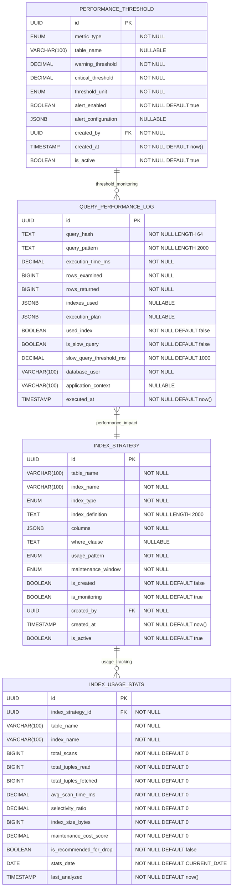

# Performance Monitoring & Index Management

```mermaid
erDiagram
    INDEX_STRATEGY {
        UUID id PK
        VARCHAR(100) table_name "NOT NULL"
        VARCHAR(100) index_name "NOT NULL"
        ENUM index_type "NOT NULL"
        TEXT index_definition "NOT NULL LENGTH 2000"
        JSONB columns "NOT NULL"
        TEXT where_clause "NULLABLE"
        ENUM usage_pattern "NOT NULL"
        ENUM maintenance_window "NOT NULL"
        BOOLEAN is_created "NOT NULL DEFAULT false"
        BOOLEAN is_monitoring "NOT NULL DEFAULT true"
        UUID created_by FK "NOT NULL"
        TIMESTAMP created_at "NOT NULL DEFAULT now()"
        BOOLEAN is_active "NOT NULL DEFAULT true"
    }
    QUERY_PERFORMANCE_LOG {
        UUID id PK
        TEXT query_hash "NOT NULL LENGTH 64"
        TEXT query_pattern "NOT NULL LENGTH 2000"
        DECIMAL execution_time_ms "NOT NULL"
        BIGINT rows_examined "NOT NULL"
        BIGINT rows_returned "NOT NULL"
        JSONB indexes_used "NULLABLE"
        JSONB execution_plan "NULLABLE"
        BOOLEAN used_index "NOT NULL DEFAULT false"
        BOOLEAN is_slow_query "NOT NULL DEFAULT false"
        DECIMAL slow_query_threshold_ms "NOT NULL DEFAULT 1000"
        VARCHAR(100) database_user "NOT NULL"
        VARCHAR(100) application_context "NULLABLE"
        TIMESTAMP executed_at "NOT NULL DEFAULT now()"
    }
    INDEX_USAGE_STATS {
        UUID id PK
        UUID index_strategy_id FK "NOT NULL"
        VARCHAR(100) table_name "NOT NULL"
        VARCHAR(100) index_name "NOT NULL"
        BIGINT total_scans "NOT NULL DEFAULT 0"
        BIGINT total_tuples_read "NOT NULL DEFAULT 0"
        BIGINT total_tuples_fetched "NOT NULL DEFAULT 0"
        DECIMAL avg_scan_time_ms "NOT NULL DEFAULT 0"
        DECIMAL selectivity_ratio "NOT NULL DEFAULT 0"
        BIGINT index_size_bytes "NOT NULL DEFAULT 0"
        DECIMAL maintenance_cost_score "NOT NULL DEFAULT 0"
        BOOLEAN is_recommended_for_drop "NOT NULL DEFAULT false"
        DATE stats_date "NOT NULL DEFAULT CURRENT_DATE"
        TIMESTAMP last_analyzed "NOT NULL DEFAULT now()"
    }
    PERFORMANCE_THRESHOLD {
        UUID id PK
        ENUM metric_type "NOT NULL"
        VARCHAR(100) table_name "NULLABLE"
        DECIMAL warning_threshold "NOT NULL"
        DECIMAL critical_threshold "NOT NULL"
        ENUM threshold_unit "NOT NULL"
        BOOLEAN alert_enabled "NOT NULL DEFAULT true"
        JSONB alert_configuration "NULLABLE"
        UUID created_by FK "NOT NULL"
        TIMESTAMP created_at "NOT NULL DEFAULT now()"
        BOOLEAN is_active "NOT NULL DEFAULT true"
    }
    INDEX_STRATEGY ||--o{ INDEX_USAGE_STATS : "usage_tracking"
    QUERY_PERFORMANCE_LOG }|--|| INDEX_STRATEGY : "performance_impact"
    PERFORMANCE_THRESHOLD ||--o{ QUERY_PERFORMANCE_LOG : "threshold_monitoring"
```

