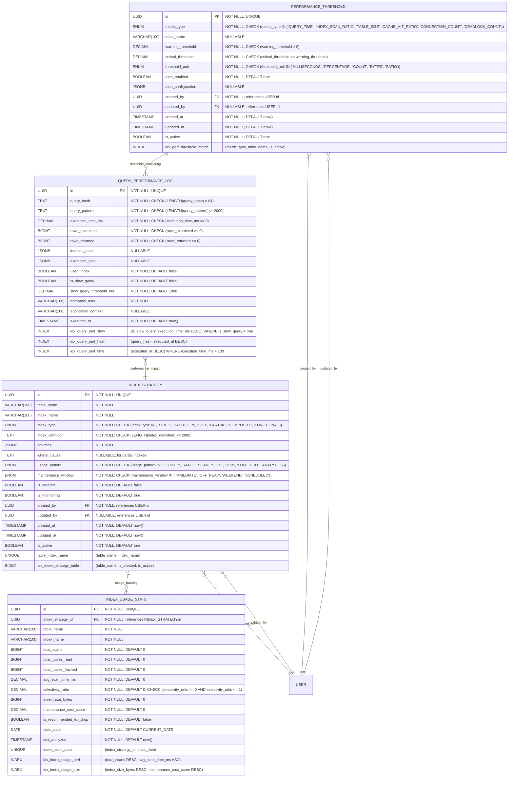

# Performance Monitoring & Index Management
**Domain:** Core
**Layer:** Performance

```mermaid
erDiagram
  INDEX_STRATEGY {
    UUID id PK                        "NOT NULL; UNIQUE"
    VARCHAR(100) table_name           "NOT NULL"
    VARCHAR(100) index_name           "NOT NULL"
    ENUM index_type                   "NOT NULL; CHECK (index_type IN ('BTREE', 'HASH', 'GIN', 'GIST', 'PARTIAL', 'COMPOSITE', 'FUNCTIONAL'))"
    TEXT index_definition             "NOT NULL; CHECK (LENGTH(index_definition) <= 2000)"
    JSONB columns                     "NOT NULL"
    TEXT where_clause                 "NULLABLE; for partial indexes"
    ENUM usage_pattern                "NOT NULL; CHECK (usage_pattern IN ('LOOKUP', 'RANGE_SCAN', 'SORT', 'JOIN', 'FULL_TEXT', 'ANALYTICS'))"
    ENUM maintenance_window           "NOT NULL; CHECK (maintenance_window IN ('IMMEDIATE', 'OFF_PEAK', 'WEEKEND', 'SCHEDULED'))"
    BOOLEAN is_created                "NOT NULL; DEFAULT false"
    BOOLEAN is_monitoring             "NOT NULL; DEFAULT true"
    UUID created_by FK                "NOT NULL; references USER.id"
    UUID updated_by FK                "NULLABLE; references USER.id"
    TIMESTAMP created_at              "NOT NULL; DEFAULT now()"
    TIMESTAMP updated_at              "NOT NULL; DEFAULT now()"
    BOOLEAN is_active                 "NOT NULL; DEFAULT true"
    UNIQUE table_index_name           "(table_name, index_name)"
    INDEX idx_index_strategy_table    "(table_name, is_created, is_active)"
  }
  
  QUERY_PERFORMANCE_LOG {
    UUID id PK                        "NOT NULL; UNIQUE"
    TEXT query_hash                   "NOT NULL; CHECK (LENGTH(query_hash) = 64)"
    TEXT query_pattern                "NOT NULL; CHECK (LENGTH(query_pattern) <= 2000)"
    DECIMAL execution_time_ms         "NOT NULL; CHECK (execution_time_ms >= 0)"
    BIGINT rows_examined              "NOT NULL; CHECK (rows_examined >= 0)"
    BIGINT rows_returned              "NOT NULL; CHECK (rows_returned >= 0)"
    JSONB indexes_used                "NULLABLE"
    JSONB execution_plan              "NULLABLE"
    BOOLEAN used_index                "NOT NULL; DEFAULT false"
    BOOLEAN is_slow_query             "NOT NULL; DEFAULT false"
    DECIMAL slow_query_threshold_ms   "NOT NULL; DEFAULT 1000"
    VARCHAR(100) database_user        "NOT NULL"
    VARCHAR(100) application_context  "NULLABLE"
    TIMESTAMP executed_at             "NOT NULL; DEFAULT now()"
    INDEX idx_query_perf_slow         "(is_slow_query, execution_time_ms DESC) WHERE is_slow_query = true"
    INDEX idx_query_perf_hash         "(query_hash, executed_at DESC)"
    INDEX idx_query_perf_time         "(executed_at DESC) WHERE execution_time_ms > 100"
  }
  
  INDEX_USAGE_STATS {
    UUID id PK                        "NOT NULL; UNIQUE"
    UUID index_strategy_id FK         "NOT NULL; references INDEX_STRATEGY.id"
    VARCHAR(100) table_name           "NOT NULL"
    VARCHAR(100) index_name           "NOT NULL"
    BIGINT total_scans                "NOT NULL; DEFAULT 0"
    BIGINT total_tuples_read          "NOT NULL; DEFAULT 0"
    BIGINT total_tuples_fetched       "NOT NULL; DEFAULT 0"
    DECIMAL avg_scan_time_ms          "NOT NULL; DEFAULT 0"
    DECIMAL selectivity_ratio         "NOT NULL; DEFAULT 0; CHECK (selectivity_ratio >= 0 AND selectivity_ratio <= 1)"
    BIGINT index_size_bytes           "NOT NULL; DEFAULT 0"
    DECIMAL maintenance_cost_score    "NOT NULL; DEFAULT 0"
    BOOLEAN is_recommended_for_drop   "NOT NULL; DEFAULT false"
    DATE stats_date                   "NOT NULL; DEFAULT CURRENT_DATE"
    TIMESTAMP last_analyzed           "NOT NULL; DEFAULT now()"
    UNIQUE index_stats_date           "(index_strategy_id, stats_date)"
    INDEX idx_index_usage_perf        "(total_scans DESC, avg_scan_time_ms ASC)"
    INDEX idx_index_usage_size        "(index_size_bytes DESC, maintenance_cost_score DESC)"
  }
  
  PERFORMANCE_THRESHOLD {
    UUID id PK                        "NOT NULL; UNIQUE"
    ENUM metric_type                  "NOT NULL; CHECK (metric_type IN ('QUERY_TIME', 'INDEX_SCAN_RATIO', 'TABLE_SIZE', 'CACHE_HIT_RATIO', 'CONNECTION_COUNT', 'DEADLOCK_COUNT'))"
    VARCHAR(100) table_name           "NULLABLE"
    DECIMAL warning_threshold         "NOT NULL; CHECK (warning_threshold > 0)"
    DECIMAL critical_threshold        "NOT NULL; CHECK (critical_threshold >= warning_threshold)"
    ENUM threshold_unit               "NOT NULL; CHECK (threshold_unit IN ('MILLISECONDS', 'PERCENTAGE', 'COUNT', 'BYTES', 'RATIO'))"
    BOOLEAN alert_enabled             "NOT NULL; DEFAULT true"
    JSONB alert_configuration         "NULLABLE"
    UUID created_by FK                "NOT NULL; references USER.id"
    UUID updated_by FK                "NULLABLE; references USER.id"
    TIMESTAMP created_at              "NOT NULL; DEFAULT now()"
    TIMESTAMP updated_at              "NOT NULL; DEFAULT now()"
    BOOLEAN is_active                 "NOT NULL; DEFAULT true"
    INDEX idx_perf_threshold_metric   "(metric_type, table_name, is_active)"
  }

  INDEX_STRATEGY ||--o{ INDEX_USAGE_STATS : "usage_tracking"
  QUERY_PERFORMANCE_LOG }o--|| INDEX_STRATEGY : "performance_impact"
  PERFORMANCE_THRESHOLD ||--o{ QUERY_PERFORMANCE_LOG : "threshold_monitoring"
  INDEX_STRATEGY }|--|| USER : "created_by"
  INDEX_STRATEGY }o--|| USER : "updated_by"
  PERFORMANCE_THRESHOLD }|--|| USER : "created_by"
  PERFORMANCE_THRESHOLD }o--|| USER : "updated_by"
```

