# Permission
**Section:** Permission

## Diagram

```mermaid
erDiagram
  %%========================================
  %% 1) CORE ENTITIES & HIERARCHIES
  %%========================================
  ROLE {
    UUID id PK                       "NOT NULL; UNIQUE"
    VARCHAR(100) name                "NOT NULL; UNIQUE"
    ENUM type                        "NOT NULL; ADMIN, GUEST, TRAINER, PHYSIOTHERAPIST, COACH, MEMBER, CUSTOMER"
    TEXT description                 "NULLABLE"
    UUID parent_role_id FK           "NULLABLE; references ROLE.id"
    BOOLEAN is_system_role           "NOT NULL; DEFAULT false"
    UUID created_by FK               "NOT NULL; references USER.id"
    UUID updated_by FK               "NULLABLE; references USER.id"
    TIMESTAMP created_at             "NOT NULL; DEFAULT now()"
    TIMESTAMP updated_at             "NOT NULL; DEFAULT now()"
    BOOLEAN is_active                "NOT NULL; DEFAULT true"
  }
  
  PERMISSION_GROUP {
    UUID id PK                       "NOT NULL; UNIQUE"
    VARCHAR(100) name                "NOT NULL; UNIQUE"
    TEXT description                 "NULLABLE"
    SMALLINT display_order                "NOT NULL; DEFAULT 0"
  }
  
  PERMISSION {
    UUID id PK                       "NOT NULL; UNIQUE"
    VARCHAR(100) name                "NOT NULL; UNIQUE; e.g., USER.WORKOUT.CREATE"
    TEXT description                 "NULLABLE"
    UUID permission_group_id FK      "NULLABLE; references PERMISSION_GROUP.id"
    VARCHAR(50) actor                "NOT NULL; e.g., USER, GUEST"
    VARCHAR(50) resource             "NOT NULL; e.g., WORKOUT, PROGRAM, MEDIA, EXERCISE, EQUIPMENT"
    VARCHAR(50) action               "NOT NULL; e.g., CREATE, READ, UPDATE, DELETE, SHARE, ARCHIVE"
    VARCHAR(50) scope                "NULLABLE; e.g., OWN, INSTITUTION, PUBLIC, RESOURCE_ID"
    BOOLEAN is_global                "NOT NULL; DEFAULT false"
    BOOLEAN is_system_permission     "NOT NULL; DEFAULT false"
  }
  
  %%========================================
  %% 2) UNIFIED PERMISSION GRANT SYSTEM
  %%========================================
  PERMISSION_GRANT {
    UUID id PK                       "NOT NULL; UNIQUE"
    UUID grantee_id                  "NOT NULL; references USER.id or ROLE.id"
    ENUM grantee_type                "NOT NULL; USER, ROLE"
    UUID permission_id FK            "NOT NULL; references PERMISSION.id"
    UUID scope_id                    "NULLABLE; context ID (institution_id, department_id)"
    ENUM scope_type                  "NULLABLE; INSTITUTION, DEPARTMENT, RESOURCE"
    UUID granted_by FK               "NOT NULL; references USER.id"
    UUID created_by FK               "NOT NULL; references USER.id"
    UUID updated_by FK               "NULLABLE; references USER.id"
    TIMESTAMP granted_at             "NOT NULL; DEFAULT now()"
    TIMESTAMP expires_at             "NULLABLE"
    TIMESTAMP created_at             "NOT NULL; DEFAULT now()"
    TIMESTAMP updated_at             "NOT NULL; DEFAULT now()"
    BOOLEAN is_active                "NOT NULL; DEFAULT true"
  }
  
  ROLE_PERMISSION {
    UUID role_id PK,FK               "NOT NULL; references ROLE.id"
    UUID permission_id PK,FK         "NOT NULL; references PERMISSION.id"
    UUID created_by FK               "NOT NULL; references USER.id"
    UUID updated_by FK               "NULLABLE; references USER.id"
    TIMESTAMP created_at            "NOT NULL; DEFAULT now()"
    TIMESTAMP created_at             "NOT NULL; DEFAULT now()"
    TIMESTAMP updated_at             "NOT NULL; DEFAULT now()"
    BOOLEAN is_active                "NOT NULL; DEFAULT true"
  }
  
  %%========================================
  %% 3) POLICY SYSTEM
  %%========================================
  POLICY {
    UUID id PK                       "NOT NULL; UNIQUE"
    VARCHAR(100) name                "NOT NULL; UNIQUE"
    TEXT description                 "NULLABLE"
    ENUM policy_type                 "NOT NULL; ROLE_BASED, RESOURCE_BASED, CONTEXT_BASED"
    JSONB policy_rules               "NOT NULL; policy definition"
    UUID created_by FK               "NOT NULL; references USER.id"
    UUID updated_by FK               "NULLABLE; references USER.id"
    TIMESTAMP created_at             "NOT NULL; DEFAULT now()"
    TIMESTAMP updated_at             "NOT NULL; DEFAULT now()"
    BOOLEAN is_active                "NOT NULL; DEFAULT true"
  }
  
  POLICY_ASSIGNMENT {
    UUID id PK                       "NOT NULL; UNIQUE"
    UUID policy_id FK                "NOT NULL; references POLICY.id"
    UUID target_id                   "NOT NULL; references ROLE.id or PERMISSION.id"
    ENUM target_type                 "NOT NULL; ROLE, PERMISSION"
    UUID scope_id                    "NULLABLE; institution_id, department_id"
    ENUM scope_type                  "NULLABLE; INSTITUTION, DEPARTMENT"
    UUID created_by FK               "NOT NULL; references USER.id"
    UUID updated_by FK               "NULLABLE; references USER.id"
    TIMESTAMP created_at            "NOT NULL; DEFAULT now()"
    TIMESTAMP created_at             "NOT NULL; DEFAULT now()"
    TIMESTAMP updated_at             "NOT NULL; DEFAULT now()"
    BOOLEAN is_active                "NOT NULL; DEFAULT true"
  }
  
  %%========================================
  %% 4) VISIBILITY SYSTEM
  %%========================================
  VISIBILITY {
    UUID id PK                       "NOT NULL; UNIQUE"
    ENUM name                        "NOT NULL; UNIQUE; PRIVATE, SHARED, PUBLIC, INSTITUTION, DEPARTMENT, ROLE_BASED"
    ENUM resource_type               "NOT NULL; WORKOUT, PROGRAM, EXERCISE, MEDIA, EQUIPMENT, USER, ACTIVITY"
    TEXT description                 "NULLABLE; explains the visibility level"
    BOOLEAN is_default               "NOT NULL; DEFAULT false"
  }
  
  VISIBILITY_POLICY {
    UUID id PK                       "NOT NULL; UNIQUE"
    UUID visibility_id FK            "NOT NULL; references VISIBILITY.id"
    UUID permission_id FK            "NOT NULL; references PERMISSION.id"
    UUID institution_id FK           "NULLABLE; references INSTITUTION.id"
    UUID role_id FK                  "NULLABLE; references ROLE.id"
    BOOLEAN allow_guest              "NOT NULL; DEFAULT false"
    BOOLEAN is_default               "NOT NULL; DEFAULT false"
    TEXT notes                       "NULLABLE"
    UUID created_by FK               "NOT NULL; references USER.id"
    UUID updated_by FK               "NULLABLE; references USER.id"
    TIMESTAMP created_at             "NOT NULL; DEFAULT now()"
    TIMESTAMP updated_at             "NOT NULL; DEFAULT now()"
    BOOLEAN is_active                "NOT NULL; DEFAULT true"
  }
  
  %%========================================
  %% 5) RELATIONSHIPS
  %%========================================
  %%— Role & Permission Core Relationships —
  ROLE ||--o{ ROLE                  : "parent_of"
  ROLE ||--o{ ROLE_PERMISSION       : "has_permissions"
  PERMISSION ||--o{ ROLE_PERMISSION : "assigned_to_roles"
  PERMISSION_GROUP ||--o{ PERMISSION : "contains"
  
  %%— Unified Permission Grant System —
  USER ||--o{ PERMISSION_GRANT      : "receives_grants"
  ROLE ||--o{ PERMISSION_GRANT      : "receives_grants"
  PERMISSION ||--o{ PERMISSION_GRANT : "granted_permissions"
  USER ||--o{ PERMISSION_GRANT      : "grants_permissions"
  
  %%— Policy System —
  POLICY ||--o{ POLICY_ASSIGNMENT   : "applies_to"
  ROLE ||--o{ POLICY_ASSIGNMENT     : "target_role"
  PERMISSION ||--o{ POLICY_ASSIGNMENT : "target_permission"
  USER ||--o{ POLICY_ASSIGNMENT     : "creates_assignments"
  
  %%— Visibility System —
  VISIBILITY ||--o{ VISIBILITY_POLICY : "controlled_by_policy"
  PERMISSION ||--o{ VISIBILITY_POLICY : "maps_to_permission"
  INSTITUTION ||--o{ VISIBILITY_POLICY : "institution_scoped_policy"
  ROLE ||--o{ VISIBILITY_POLICY     : "role_override"
  USER ||--o{ VISIBILITY_POLICY     : "creates_policies"
  
  %%— Resource Visibility References —
  WORKOUT ||--|| VISIBILITY         : "has_visibility"
  PROGRAM ||--|| VISIBILITY         : "has_visibility"
  EXERCISE ||--|| VISIBILITY        : "has_visibility"
  MEDIA ||--|| VISIBILITY           : "has_visibility"
  EQUIPMENT ||--|| VISIBILITY       : "has_visibility"
  USER ||--|| VISIBILITY            : "has_visibility"
  ACTIVITY ||--|| VISIBILITY        : "has_visibility"
```

## Notes
This diagram represents the unified permission structure and relationships providing role-based access control, policy management, and visibility controls across all resources.

---
*Generated from diagram extraction script*