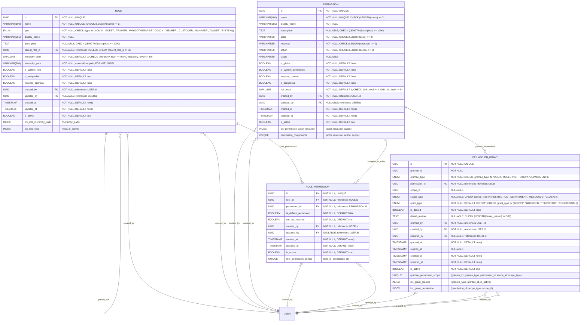

# Permission & Access Control
**Domain:** Core
**Layer:** Security

```mermaid
erDiagram
  ROLE {
    UUID id PK                        "NOT NULL; UNIQUE"
    VARCHAR(100) name                 "NOT NULL; UNIQUE; CHECK (LENGTH(name) >= 2)"
    ENUM type                         "NOT NULL; CHECK (type IN ('ADMIN', 'GUEST', 'TRAINER', 'PHYSIOTHERAPIST', 'COACH', 'MEMBER', 'CUSTOMER', 'MANAGER', 'OWNER', 'SYSTEM'))"
    VARCHAR(255) display_name         "NOT NULL"
    TEXT description                  "NULLABLE; CHECK (LENGTH(description) <= 1000)"
    UUID parent_role_id FK            "NULLABLE; references ROLE.id; CHECK (parent_role_id != id)"
    SMALLINT hierarchy_level          "NOT NULL; DEFAULT 0; CHECK (hierarchy_level >= 0 AND hierarchy_level <= 10)"
    VARCHAR(500) hierarchy_path       "NOT NULL; materialized path; FORMAT: '/1/2/3/'"
    BOOLEAN is_system_role            "NOT NULL; DEFAULT false"
    BOOLEAN is_assignable             "NOT NULL; DEFAULT true"
    BOOLEAN requires_approval         "NOT NULL; DEFAULT false"
    UUID created_by FK                "NOT NULL; references USER.id"
    UUID updated_by FK                "NULLABLE; references USER.id"
    TIMESTAMP created_at              "NOT NULL; DEFAULT now()"
    TIMESTAMP updated_at              "NOT NULL; DEFAULT now()"
    BOOLEAN is_active                 "NOT NULL; DEFAULT true"
    INDEX idx_role_hierarchy_path     "(hierarchy_path)"
    INDEX idx_role_type               "(type, is_active)"
  }
  
  PERMISSION {
    UUID id PK                        "NOT NULL; UNIQUE"
    VARCHAR(100) name                 "NOT NULL; UNIQUE; CHECK (LENGTH(name) >= 3)"
    VARCHAR(255) display_name         "NOT NULL"
    TEXT description                  "NULLABLE; CHECK (LENGTH(description) <= 1000)"
    VARCHAR(50) actor                 "NOT NULL; CHECK (LENGTH(actor) >= 2)"
    VARCHAR(50) resource              "NOT NULL; CHECK (LENGTH(resource) >= 2)"
    VARCHAR(50) action                "NOT NULL; CHECK (LENGTH(action) >= 2)"
    VARCHAR(50) scope                 "NULLABLE"
    BOOLEAN is_global                 "NOT NULL; DEFAULT false"
    BOOLEAN is_system_permission      "NOT NULL; DEFAULT false"
    BOOLEAN requires_context          "NOT NULL; DEFAULT false"
    BOOLEAN is_dangerous              "NOT NULL; DEFAULT false"
    SMALLINT risk_level               "NOT NULL; DEFAULT 1; CHECK (risk_level >= 1 AND risk_level <= 5)"
    UUID created_by FK                "NOT NULL; references USER.id"
    UUID updated_by FK                "NULLABLE; references USER.id"
    TIMESTAMP created_at              "NOT NULL; DEFAULT now()"
    TIMESTAMP updated_at              "NOT NULL; DEFAULT now()"
    BOOLEAN is_active                 "NOT NULL; DEFAULT true"
    INDEX idx_permission_actor_resource "(actor, resource, action)"
    UNIQUE permission_components      "(actor, resource, action, scope)"
  }
  
  ROLE_PERMISSION {
    UUID id PK                        "NOT NULL; UNIQUE"
    UUID role_id FK                   "NOT NULL; references ROLE.id"
    UUID permission_id FK             "NOT NULL; references PERMISSION.id"
    BOOLEAN is_default_permission     "NOT NULL; DEFAULT false"
    BOOLEAN can_be_revoked            "NOT NULL; DEFAULT true"
    UUID created_by FK                "NOT NULL; references USER.id"
    UUID updated_by FK                "NULLABLE; references USER.id"
    TIMESTAMP created_at              "NOT NULL; DEFAULT now()"
    TIMESTAMP updated_at              "NOT NULL; DEFAULT now()"
    BOOLEAN is_active                 "NOT NULL; DEFAULT true"
    UNIQUE role_permission_combo      "(role_id, permission_id)"
  }
  
  PERMISSION_GRANT {
    UUID id PK                        "NOT NULL; UNIQUE"
    UUID grantee_id                   "NOT NULL"
    ENUM grantee_type                 "NOT NULL; CHECK (grantee_type IN ('USER', 'ROLE', 'INSTITUTION', 'DEPARTMENT'))"
    UUID permission_id FK             "NOT NULL; references PERMISSION.id"
    UUID scope_id                     "NULLABLE"
    ENUM scope_type                   "NULLABLE; CHECK (scope_type IN ('INSTITUTION', 'DEPARTMENT', 'RESOURCE', 'GLOBAL'))"
    ENUM grant_type                   "NOT NULL; DEFAULT 'DIRECT'; CHECK (grant_type IN ('DIRECT', 'INHERITED', 'TEMPORARY', 'CONDITIONAL'))"
    BOOLEAN is_denied                 "NOT NULL; DEFAULT false"
    TEXT denial_reason                "NULLABLE; CHECK (LENGTH(denial_reason) <= 500)"
    UUID granted_by FK                "NOT NULL; references USER.id"
    UUID created_by FK                "NOT NULL; references USER.id"
    UUID updated_by FK                "NULLABLE; references USER.id"
    TIMESTAMP granted_at              "NOT NULL; DEFAULT now()"
    TIMESTAMP expires_at              "NULLABLE"
    TIMESTAMP created_at              "NOT NULL; DEFAULT now()"
    TIMESTAMP updated_at              "NOT NULL; DEFAULT now()"
    BOOLEAN is_active                 "NOT NULL; DEFAULT true"
    UNIQUE grantee_permission_scope   "(grantee_id, grantee_type, permission_id, scope_id, scope_type)"
    INDEX idx_grant_grantee           "(grantee_type, grantee_id, is_active)"
    INDEX idx_grant_permission        "(permission_id, scope_type, scope_id)"
  }

  ROLE ||--o{ ROLE : "parent_role"
  ROLE ||--o{ ROLE_PERMISSION : "has_permissions"
  PERMISSION ||--o{ ROLE_PERMISSION : "assigned_to_roles"
  PERMISSION ||--o{ PERMISSION_GRANT : "granted_permissions"
  ROLE }|--|| USER : "created_by"
  ROLE }o--|| USER : "updated_by"
  PERMISSION }|--|| USER : "created_by"
  PERMISSION }o--|| USER : "updated_by"
  ROLE_PERMISSION }|--|| USER : "created_by"
  ROLE_PERMISSION }o--|| USER : "updated_by"
  PERMISSION_GRANT }|--|| USER : "created_by"
  PERMISSION_GRANT }o--|| USER : "updated_by"
  PERMISSION_GRANT }|--|| USER : "granted_by"
```

