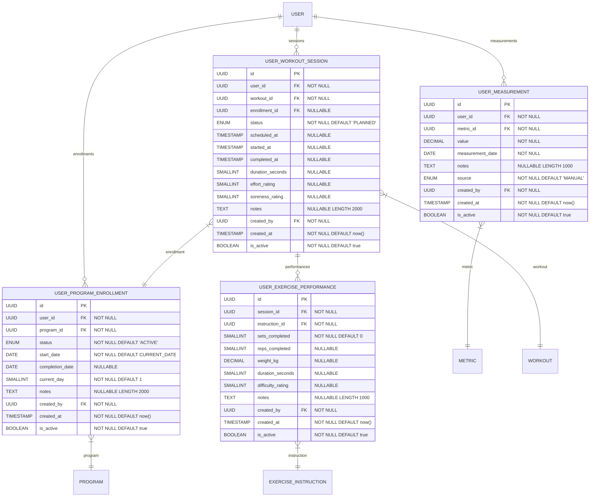

# User Progress Tracking

```mermaid
erDiagram
    USER_PROGRAM_ENROLLMENT {
        UUID id PK
        UUID user_id FK "NOT NULL"
        UUID program_id FK "NOT NULL"
        ENUM status "NOT NULL DEFAULT 'ACTIVE'"
        DATE start_date "NOT NULL DEFAULT CURRENT_DATE"
        DATE completion_date "NULLABLE"
        SMALLINT current_day "NOT NULL DEFAULT 1"
        TEXT notes "NULLABLE LENGTH 2000"
        UUID created_by FK "NOT NULL"
        TIMESTAMP created_at "NOT NULL DEFAULT now()"
        BOOLEAN is_active "NOT NULL DEFAULT true"
    }
    USER_WORKOUT_SESSION {
        UUID id PK
        UUID user_id FK "NOT NULL"
        UUID workout_id FK "NOT NULL"
        UUID enrollment_id FK "NULLABLE"
        ENUM status "NOT NULL DEFAULT 'PLANNED'"
        TIMESTAMP scheduled_at "NULLABLE"
        TIMESTAMP started_at "NULLABLE"
        TIMESTAMP completed_at "NULLABLE"
        SMALLINT duration_seconds "NULLABLE"
        SMALLINT effort_rating "NULLABLE"
        SMALLINT soreness_rating "NULLABLE"
        TEXT notes "NULLABLE LENGTH 2000"
        UUID created_by FK "NOT NULL"
        TIMESTAMP created_at "NOT NULL DEFAULT now()"
        BOOLEAN is_active "NOT NULL DEFAULT true"
    }
    USER_EXERCISE_PERFORMANCE {
        UUID id PK
        UUID session_id FK "NOT NULL"
        UUID instruction_id FK "NOT NULL"
        SMALLINT sets_completed "NOT NULL DEFAULT 0"
        SMALLINT reps_completed "NULLABLE"
        DECIMAL weight_kg "NULLABLE"
        SMALLINT duration_seconds "NULLABLE"
        SMALLINT difficulty_rating "NULLABLE"
        TEXT notes "NULLABLE LENGTH 1000"
        UUID created_by FK "NOT NULL"
        TIMESTAMP created_at "NOT NULL DEFAULT now()"
        BOOLEAN is_active "NOT NULL DEFAULT true"
    }
    USER_MEASUREMENT {
        UUID id PK
        UUID user_id FK "NOT NULL"
        UUID metric_id FK "NOT NULL"
        DECIMAL value "NOT NULL"
        DATE measurement_date "NOT NULL"
        TEXT notes "NULLABLE LENGTH 1000"
        ENUM source "NOT NULL DEFAULT 'MANUAL'"
        UUID created_by FK "NOT NULL"
        TIMESTAMP created_at "NOT NULL DEFAULT now()"
        BOOLEAN is_active "NOT NULL DEFAULT true"
    }
    USER ||--o{ USER_PROGRAM_ENROLLMENT : "enrollments"
    USER ||--o{ USER_WORKOUT_SESSION : "sessions"
    USER ||--o{ USER_MEASUREMENT : "measurements"
    USER_WORKOUT_SESSION ||--o{ USER_EXERCISE_PERFORMANCE : "performances"
    USER_WORKOUT_SESSION }|--|| USER_PROGRAM_ENROLLMENT : "enrollment"
    USER_MEASUREMENT }|--|| METRIC : "metric"
    USER_PROGRAM_ENROLLMENT }|--|| PROGRAM : "program"
    USER_WORKOUT_SESSION }|--|| WORKOUT : "workout"
    USER_EXERCISE_PERFORMANCE }|--|| EXERCISE_INSTRUCTION : "instruction"
```

