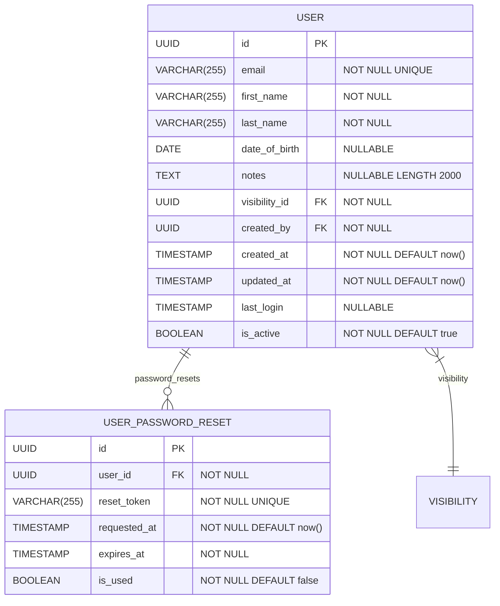

# User Management

```mermaid
erDiagram
    USER {
        UUID id PK
        VARCHAR(255) email "NOT NULL UNIQUE"
        VARCHAR(255) first_name "NOT NULL"
        VARCHAR(255) last_name "NOT NULL"
        DATE date_of_birth "NULLABLE"
        TEXT notes "NULLABLE LENGTH 2000"
        UUID visibility_id FK "NOT NULL"
        UUID created_by FK "NOT NULL"
        TIMESTAMP created_at "NOT NULL DEFAULT now()"
        TIMESTAMP updated_at "NOT NULL DEFAULT now()"
        TIMESTAMP last_login "NULLABLE"
        BOOLEAN is_active "NOT NULL DEFAULT true"
    }
    USER_PASSWORD_RESET {
        UUID id PK
        UUID user_id FK "NOT NULL"
        VARCHAR(255) reset_token "NOT NULL UNIQUE"
        TIMESTAMP requested_at "NOT NULL DEFAULT now()"
        TIMESTAMP expires_at "NOT NULL"
        BOOLEAN is_used "NOT NULL DEFAULT false"
    }
    USER ||--o{ USER_PASSWORD_RESET : "password_resets"
    USER }|--|| VISIBILITY : "visibility"
```

